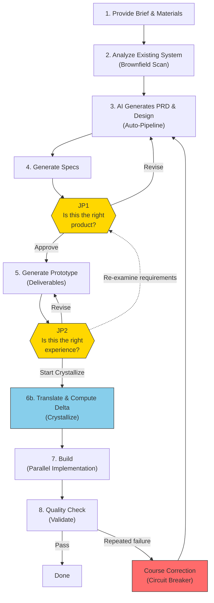

# JDD Sprint Kit

Enables product experts to turn customer knowledge into software outcomes. Users decide, judge, and redirect — AI handles everything else. Execution extension for Claude Code + BMad Method.

User inputs (meeting notes, references, existing system context) raise AI's first-generation quality, and human time is spent only at customer-lens judgment points (JP1, JP2).

> Design philosophy: [Judgment-Driven Development](docs/judgment-driven-development.md)
> Conceptual foundation: [Delta-Driven Design](docs/delta-driven-design.md)
> Full architecture and Sprint walkthrough: [Blueprint](docs/blueprint.md)

---

## Overall Flow



Human involvement happens at exactly **2 points** (JP1, JP2) — everything else runs autonomously. If JP2 reveals issues with the requirements themselves, it loops back to JP1 — this is not a failure, but a normal discovery prompted by concrete deliverables. After JP2 approval, selecting **[S] Start Crystallize** translates the prototype into development specs and computes the delta. After Crystallize completes, you choose whether to proceed to Build.

---

## What Gets Generated

A single Sprint run auto-generates the following artifacts:

- **3 spec documents** — requirements.md, design.md, tasks.md
- **OpenAPI 3.1 YAML** — API specification + MSW Mock + Specmatic contract tests
- **DBML schema** — Database design (viewable as ERD on dbdiagram.io)
- **BDD/Gherkin scenarios** — Given-When-Then acceptance tests
- **React + MSW prototype** — Clickable prototype via `npm run dev`

---

## Quick Start

### Prerequisites

- [Claude Code](https://docs.anthropic.com/en/docs/claude-code) CLI
- Node.js 18+
- Git, GitHub CLI (`gh`)
- [BMad Method](https://github.com/nicholasgriffintn/bmad-method) (`npx bmad-method install`)

### Installation

```bash
npx jdd-sprint-kit init
```

An interactive wizard detects your environment and installs Sprint Kit files.

### (Optional) Connect Existing Service Data

Sprint Kit can analyze your existing service code to avoid duplicate APIs and breaking changes. Three access methods exist, from simplest to most flexible:

**Method 1: GitHub URL in brief.md** (simplest — no setup needed)
Declare GitHub repo URLs in the `## Reference Sources` section of brief.md. Sprint auto-downloads a read-only snapshot via `gh api tarball/HEAD`.

**Method 2: `--add-dir`** (for local clones)
Add local repo directories when launching Claude Code:
```bash
claude --add-dir /path/to/backend-repo --add-dir /path/to/client-repo
```

**Method 3: Figma MCP** (for live design data)
```bash
claude mcp add --transport http figma https://mcp.figma.com/mcp
```

> Methods 1 and 2 were introduced in v0.4.0, replacing MCP filesystem servers which were restricted by Claude Code's MCP security to the project root directory only. Figma remains MCP because its data exists only on Figma's servers and cannot be downloaded as files.

### First Sprint Run

```bash
# In Claude Code — start a new feature (creates template if folder doesn't exist)
/sprint my-feature-name

# Or start immediately with an inline Brief
/sprint "Describe the feature you want to build"
```

### Tutorial

To experience the full Sprint Kit pipeline, use the included example project:

```bash
# In Claude Code
/sprint test-tutor-excl
```

This is a scenario for adding a "tutor exclusion" feature to a fictional EduTalk service. 4 meeting notes are prepared in `specs/test-tutor-excl/inputs/`, and `brownfield-context.md` is pre-written to substitute for external data source scan results. No external data setup required.

---

## Route Selection

3 routes are available based on your input readiness. All routes converge into the same pipeline.

```
[Input + Brownfield + BMad] → [Specs] → JP1 → [Deliverables] → JP2 → [Crystallize] → [Execute]

Sprint:   |←──────────────── Fully Auto ───────────────────────→|
Guided:   |←── BMad Dialog ──→|←────────── Auto ───────────────→|
Direct:                        |←── Auto ──────────────────────→|
```

| Route | Entry Point | Best When |
|-------|-------------|-----------|
| **Sprint** | `/sprint "Brief"` or `/sprint feature-name` | You have materials (meeting notes, references) — AI builds, you judge |
| **Guided** | BMad 12-step → `/specs` → `/preview` | Exploration needed — discover and define with AI |
| **Direct** | `/specs` → `/preview` | Planning is complete — execute immediately |

After JP2 approval, Crystallize translates the prototype into development specs and computes the delta. Also available standalone via `/crystallize feature-name`.

> For small tasks, use BMad Quick Flow: `/quick-spec` → `/dev-story` → `/code-review`

Routes are not fixed. If you have materials but need deep exploration, use Guided with materials as reference input. After completing BMad 12-step, `/specs` auto-detects the artifacts — same as Direct.

> Details: [Blueprint §4.3 Route Selection](docs/blueprint.md#43-route-selection)

---

## Brownfield — Existing System Integration

AI must understand the existing service structure to avoid creating duplicate APIs or breaking existing screen flows. Brownfield data is cumulatively collected from **4 sources**:

1. **document-project** — Structured docs generated by BMad `/document-project` workflow scanning the existing codebase
2. **External repos** — Existing service code accessed via `--add-dir` (local clones) or tarball snapshot (GitHub URLs)
3. **Figma** — Live design data accessed via MCP (OAuth)
4. **Local codebase** — Direct scan of source code in the current project

### Brownfield Context Generation

#### Auto-Generation (Sprint Route)

`/sprint` automatically generates brownfield-context.md:

1. **Phase 0** — Topology detection: detect document-project presence, external data sources (`--add-dir` paths, GitHub repo URLs, Figma MCP), build tools → determine project type (`standalone` / `co-located` / `msa` / `monorepo`)
2. **Pass 1 (Broad Scan)** — Collect domain concepts (L1) and behavior patterns (L2) based on Brief keywords
3. **Pass 2 (Targeted Scan)** — After Architecture/Epics, collect integration points (L3) and code-level details (L4)

Results are recorded in `specs/{feature}/planning-artifacts/brownfield-context.md` as L1~L4 layers.

#### Pre-Sprint Preparation: document-project (Recommended)

Running BMad `/document-project` before Sprint improves scan quality:

```bash
# In Claude Code
/document-project
```

This analyzes the existing codebase and generates structured docs under `_bmad-output/` (`project-overview.md`, `api-contracts.md`, `data-models.md`, etc.). Sprint's Brownfield Scanner uses these as seed data to narrow scan scope.

#### External Data Sources

External service data can be provided through 3 methods (see Quick Start for setup):

| Source Type | Access Method | When to Use |
|-------------|---------------|-------------|
| **External repos** (backend, client, service-map) | `--add-dir` (local clone) or tarball snapshot (GitHub URL in brief.md) | When existing service code needs analysis |
| **Figma** | MCP (OAuth) | When live design data needs analysis |

The 4 roles external data can fill:

| Role | Provided Information |
|------|---------------------|
| **backend-docs** | API specs, domain policies, business rules, data models |
| **client-docs** | Component structure, state management patterns, screen flows |
| **svc-map** | Customer journeys, screen screenshots, flow graphs |
| **figma** | Wireframes, design tokens, component specs |

#### Manual Preparation (Without External Sources)

You can manually write brownfield-context.md and provide it to Sprint without any external data:

```bash
# Place directly in the feature directory
specs/{feature}/brownfield-context.md
# or
specs/{feature}/planning-artifacts/brownfield-context.md
```

Sprint detects existing files and uses them instead of re-scanning those levels. See `_bmad/docs/brownfield-context-format.md` for the format. A manually written brownfield-context.md sample is included in the tutorial example (`specs/test-tutor-excl/`).

#### Greenfield Projects

For Greenfield projects with no existing system, Sprint works normally without Brownfield data. Auto-detected in Phase 0 — no configuration needed.

> Details: [Blueprint §4.1 System Components](docs/blueprint.md#41-system-components)

---

## Project Structure

```
{project-root}/
├── CLAUDE.md                        # Project-specific rules (user-maintained)
├── .mcp.json                        # MCP server config (.gitignored)
├── .claude/
│   ├── agents/                      # Sprint agents (8)
│   ├── commands/                    # Sprint commands + BMad agents/workflows
│   ├── rules/                       # Sprint rules (bmad-*.md)
│   ├── hooks/                       # Hook scripts (notification, protection, recovery)
│   └── settings.json                # Hook settings
├── _bmad/                           # BMad Method (runtime reference)
│   └── docs/                        # Format guides
├── preview-template/                # Prototype scaffold (Vite + React + MSW)
├── specs/                           # Per-feature Sprint artifacts
│   └── {feature}/
│       ├── inputs/                  # User Brief + reference materials
│       ├── planning-artifacts/      # BMad artifacts (PRD, Architecture, Epics)
│       ├── requirements.md          # Requirements
│       ├── design.md                # Design
│       ├── tasks.md                 # Tasks (Entropy + File Ownership)
│       ├── brownfield-context.md    # Existing system context
│       ├── api-spec.yaml            # OpenAPI 3.1
│       ├── schema.dbml              # DB schema
│       ├── bdd-scenarios/           # Gherkin acceptance tests
│       ├── preview/                 # React + MSW prototype
│       └── reconciled/              # Crystallize output (prototype-reconciled artifacts)
└── docs/                            # Framework documentation
```

> Sprint Kit files (`.claude/agents/`, `.claude/commands/`, `.claude/rules/bmad-*`, `_bmad/`) should not be modified directly. Update via `npx jdd-sprint-kit update`.

---

## Multi-IDE Support

Sprint Kit's canonical definition files live in `.claude/`. Other AI IDEs beyond Claude Code are also supported.

**Claude Code** — Default IDE. No additional setup required.

**Codex CLI** — Use the `--ide` option during installation to generate Codex files:

```bash
npx jdd-sprint-kit init --ide claude-code,codex
```

In Codex, run Sprint commands via `$sprint`, `$specs`, `$preview`, `$parallel`, `$validate`.

**Gemini Code Assist** — TOML wrappers are auto-generated in `.gemini/commands/`.

> When the canonical files (`.claude/`) are modified, `npx jdd-sprint-kit update` also refreshes the converted files.

---

## Documentation

| Document | Contents |
|----------|----------|
| [Blueprint](docs/blueprint.md) | Full product picture — 8-Section (Problem → Thesis → User Model → Value Chain → Judgment → Constraints → Risk → Current State) |
| [Judgment-Driven Development](docs/judgment-driven-development.md) | Design philosophy + definition and discussion of design judgments |
| [BMad Method](https://github.com/nicholasgriffintn/bmad-method) | AI role-play framework (external) |

---

## License

MIT
