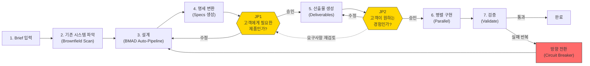

# BMAD Sprint Kit

**"한 줄의 기획서가 동작하는 프로토타입이 된다."**

BMad Method 기반 Judgment-Driven Development 실행 확장팩. AI가 만들고, 사람이 판단한다. 사용자의 입력(회의록, 참고자료, 기존 시스템 맥락)으로 AI의 첫 생성 품질을 높이고, 고객 관점의 판단 시점(JP1, JP2)에서만 사람의 시간을 사용한다.

> 설계 철학: [Judgment-Driven Development](docs/judgment-driven-development.md)
> 전체 아키텍처와 Sprint 상세 따라가기: [Blueprint](docs/blueprint.md)

---

## 전체 흐름



사람이 개입하는 지점은 딱 **2곳**(JP1, JP2)이며, 나머지는 AI가 자율적으로 진행한다. JP2에서 요구사항 자체의 문제를 발견하면 JP1으로 돌아간다 — 이것은 실패가 아니라 구체적 결과물이 촉진한 정상적인 발견이다.

---

## 무엇이 만들어지는가

Sprint 1회 실행으로 다음 산출물이 자동 생성된다:

- **설계 문서 3종** — 요구사항(requirements.md), 설계(design.md), 태스크(tasks.md)
- **OpenAPI 3.1 YAML** — API 명세 + MSW Mock + Specmatic 계약 테스트
- **DBML 스키마** — 데이터베이스 설계 (dbdiagram.io에서 ERD 확인 가능)
- **BDD/Gherkin 시나리오** — Given-When-Then 형식 수용 테스트
- **React + MSW 프로토타입** — `npm run dev`로 즉시 클릭해볼 수 있는 시제품

---

## 빠른 시작

### 사전 요구사항

- [Claude Code](https://docs.anthropic.com/en/docs/claude-code) CLI
- Node.js 18+
- Git, GitHub CLI (`gh`)
- [BMad Method](https://github.com/nicholasgriffintn/bmad-method) (`npx bmad-method install`)

### 설치

```bash
npx bmad-sprint-kit init
```

Interactive 마법사가 환경을 감지하고 Sprint Kit 파일을 설치한다.

### (선택) MCP 설정

기존 시스템 데이터를 연동하려면 MCP 서버를 구성한다:

```bash
cp .mcp.json.example .mcp.json
# .mcp.json 편집: 로컬 경로를 자신의 환경에 맞게 수정
```

### 첫 Sprint 실행

```bash
# Claude Code에서 실행
/sprint "만들고 싶은 기능 설명"
```

### 튜토리얼 — MCP 없이 바로 체험

Sprint Kit의 전체 파이프라인을 체험해보려면, 포함된 예제 프로젝트를 사용한다:

```bash
# Claude Code에서 실행
/sprint test-tutor-excl
```

가상의 EduTalk 서비스에 "튜터 차단" 기능을 추가하는 시나리오다. `specs/test-tutor-excl/inputs/`에 회의록 4건이 준비되어 있고, `brownfield-context.md`가 MCP 스캔 결과를 대체한다. MCP 설정 없이 바로 실행할 수 있다.

---

## 경로 선택

사용자의 입력 상태에 따라 3가지 경로를 제공한다. 모든 경로는 같은 파이프라인으로 합류한다.

```
[Input + Brownfield + BMad] → [Specs] → JP1 → [Deliverables] → JP2 → [Execute]

Sprint:   |←──────────────── 전체 자동 ────────────────────────→|
Guided:   |←── BMad 대화 ──→|←────────── 자동 ──────────────────→|
Direct:                      |←── 자동 ────────────────────────→|
```

| 경로 | 진입점 | 적합한 경우 |
|------|--------|-------------|
| **Sprint** | `/sprint "Brief"` 또는 `/sprint feature-name` | 자료(회의록, 참고자료)가 있을 때 — AI가 구성하고 내가 판단 |
| **Guided** | BMad 12단계 → `/specs` → `/preview` | 탐색이 필요할 때 — AI와 함께 발견하고 정의 |
| **Direct** | `/specs` → `/preview` | 기획이 끝났을 때 — 바로 실행 |

> 소규모 작업은 BMad Quick Flow를 사용: `/quick-spec` → `/dev-story` → `/code-review`

경로는 고정이 아니다. 자료가 있지만 깊은 탐색이 필요하면 Guided에서 자료를 참고 입력으로 활용하고, BMad 12단계 완료 후에는 Direct와 동일하게 `/specs`가 산출물을 자동 인식한다.

> 상세: [Blueprint §4.3 경로 선택](docs/blueprint.md#43-경로-선택)

---

## Brownfield — 기존 시스템 연동

AI가 기존 서비스의 구조를 알아야 중복 API를 만들거나 기존 화면 흐름을 깨뜨리지 않는다. Brownfield 데이터는 **3가지 소스**에서 누적 수집된다:

1. **document-project 산출물** — BMad `/document-project` 워크플로우가 기존 코드베이스를 스캔하여 생성한 구조화 문서
2. **MCP 서버** — AI가 필요할 때 접속해서 정보를 가져오는 외부 기억 저장소
3. **로컬 코드베이스** — 같은 저장소에 있는 소스 코드를 직접 스캔

| MCP 서버 | 제공 정보 |
|----------|-----------|
| `backend-docs` | API 스펙, 도메인 정책, 비즈니스 규칙, 데이터 모델 |
| `client-docs` | 컴포넌트 구조, 상태 관리 패턴, 코드 컨벤션, 화면 흐름 |
| `svc-map` | 고객 여정, 화면 스크린샷, 플로우 그래프, 서비스 맵 |
| `figma` | 최신 와이어프레임, 디자인 토큰, 컴포넌트 스펙 (실시간 OAuth) |

Greenfield(기존 시스템 없음) 프로젝트에서는 MCP 없이도 Sprint가 동작한다.

> 상세: [Blueprint §4.1 시스템 구성 요소](docs/blueprint.md#41-시스템-구성-요소)

---

## 프로젝트 구조

```
{project-root}/
├── CLAUDE.md                        # 프로젝트별 규칙 (사용자 직접 작성)
├── .mcp.json                        # MCP 서버 설정 (.gitignore 대상)
├── .claude/
│   ├── agents/                      # Sprint 에이전트 (8개)
│   ├── commands/                    # Sprint 커맨드 + BMAD 에이전트/워크플로우
│   ├── rules/                       # Sprint 규칙 (bmad-*.md)
│   ├── hooks/                       # Hook 스크립트 (알림, 보호, 복원)
│   └── settings.json                # Hook 설정
├── _bmad/                           # BMAD 방법론 (런타임 참조)
│   └── docs/                        # 포맷 가이드
├── preview-template/                # 프로토타입 기본 틀 (Vite + React + MSW)
├── specs/                           # 프로젝트별 산출물 (feature 단위)
│   └── {feature}/
│       ├── inputs/                  # 사용자 Brief + 참고 자료
│       ├── planning-artifacts/      # BMAD 산출물 (PRD, Architecture, Epics)
│       ├── requirements.md          # 요구사항
│       ├── design.md                # 설계
│       ├── tasks.md                 # 태스크 (Entropy + 파일 소유권)
│       ├── brownfield-context.md    # 기존 시스템 컨텍스트
│       ├── api-spec.yaml            # OpenAPI 3.1
│       ├── schema.dbml              # DB 스키마
│       ├── bdd-scenarios/           # Gherkin 수용 테스트
│       └── preview/                 # React + MSW 프로토타입
└── docs/                            # 프레임워크 문서
```

> Sprint Kit 파일(`.claude/agents/`, `.claude/commands/`, `.claude/rules/bmad-*`, `_bmad/`)은 직접 수정하지 않는다. `npx bmad-sprint-kit update`로 업데이트한다.

---

## Multi-IDE 지원

Sprint Kit의 원본 정의 파일은 `.claude/`에 있다. Claude Code 외 다른 AI IDE도 지원한다.

**Claude Code** — 기본 IDE. 추가 설정 불필요.

**Codex CLI** — 설치 시 `--ide` 옵션으로 Codex 파일을 함께 생성한다:

```bash
npx bmad-sprint-kit init --ide claude-code,codex
```

Codex에서는 `$sprint`, `$specs`, `$preview`, `$parallel`, `$validate`로 Sprint 커맨드를 실행한다.

**Gemini Code Assist** — `.gemini/commands/`에 TOML 래퍼가 자동 생성된다.

> 원본(`.claude/`)을 수정하면 `npx bmad-sprint-kit update` 시 변환 파일도 갱신된다.

---

## 문서

| 문서 | 내용 |
|------|------|
| [Blueprint](docs/blueprint.md) | 제품 전체 그림 — 8-Section (Problem → Thesis → User Model → Value Chain → Judgment → Constraints → Risk → Current State) |
| [Judgment-Driven Development](docs/judgment-driven-development.md) | 설계 철학 + 설계 판단의 정의와 논의 과정 |
| [BMad Method](https://github.com/nicholasgriffintn/bmad-method) | AI 역할극 프레임워크 (외부) |

---

## 라이선스

MIT
