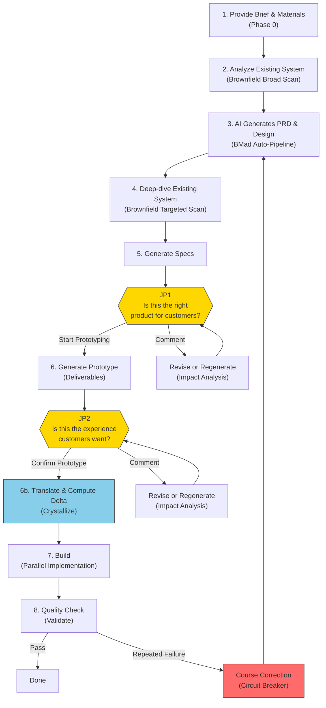

# JDD Sprint Kit Blueprint

> jdd-sprint-kit는 제품 전문가(product expert)가 — 개발자가 아닌 —
> 자신의 판단을 소프트웨어 결과물로 직접 전환할 수 있도록 하는 도구를 지향한다.
> 사용자는 코드를 모른다. 그러나 고객이 무엇을 원하는지는 안다.
> 사용자가 하는 일은 단 세 가지이다:
> 무엇을 만들지 결정하고, 결과가 맞는지 확인하고, 틀리면 왜 틀렸는지 말한다.
> 나머지는 모두 AI가 처리하며,
> 기존 서비스 개발 속도를 극적으로 가속하는 것을 목표로 한다.
>
> 핵심 원칙: **인간의 판단만이 유일한 영속 자산이다. 모든 AI 결과물은 재생성 가능한 소모품이다.**
>
> 품질 기준: **"비개발자가 이 문서만으로 AI를 사용하여 이 서비스를 재현할 수 있어야 한다."**

---

## 전체 흐름



---

## 이 문서를 읽는 방법

이 문서는 **따라가기(Follow-Along)** 방식으로 구성되어 있다. 시스템을 추상적으로 설명하는 대신, 각 단계에서 **사용자가 보는 것**과 **시스템 내부에서 일어나는 일**을 함께 제시한다.

> **예시 표기**: `tutor-exclusion`(튜터 차단 기능)은 `specs/test-tutor-excl/`에서 확인할 수 있는 실제 예시 프로젝트이다.

| 섹션 | 내용 |
|---------|---------|
| **S1 문제** | 이 제품이 존재하는 이유 |
| **S2 테제** | 핵심 원칙 + 설계 판단 + 전제 조건 |
| **S3 사용자 모델** | 누가 사용하며 어떤 역할을 하는가 |
| **S4 가치 사슬** | 시스템 구성요소 + 파이프라인 상세 + 루트 선택 + 비용 |
| **S5 판단과 피드백** | 2-JP 모델 + 판단 상세 + 피드백 처리 |
| **S6 제약과 트레이드오프** | 하지 않는 것 + 의식적 트레이드오프 |
| **S7 리스크 모델** | 가정 + 깨지는 조건 + 감지 신호 |
| **S8 현재 상태** | 현재 버전 + 미검증 가설 + 알려진 갭 |
| **Appendix** | 설치/운영, 파일 구조, 용어집 |

---

# 1. 문제

소프트웨어 개발에서 **"결정할 수 있는 사람 ≠ 만들 수 있는 사람"**이 가장 큰 병목이다. 고객이 무엇을 원하는지 가장 잘 아는 사람(제품 전문가)은 코드를 모르고, 코드를 작성할 수 있는 사람(개발자)은 고객을 직접 알지 못한다.

기존 방법론은 이 격차를 서로 다른 방식으로 해결한다:

```
Waterfall:  모든 것을 사전에 정의 → 한 번에 구현 (이상)
            격차 발견 → 되돌아가는 비용이 높다 (현실)

Agile:      반복을 통한 점진적 개선 (해법)
            그러나 반복마다 구현 비용 발생; 제품 전문가는 여전히 개발자에 의존

AI 시대:    AI가 빠르게 생성 → 인간이 판단 → 재생성 (새로운 가능성)
            재생성 비용 ≠ 0, 판단에도 시간 소요 (현실)
```

Sprint Kit은 이 병목을 두 방향에서 해결한다:
1. **사전 입력을 통해 첫 생성 품질을 높여** 반복 횟수를 줄인다
2. **인간의 시간은 고객 관점 판단 시점에만 사용한다**

AI는 빠르게 코딩할 수 있다. 그러나 인간의 시간은 요구사항 → 설계 → 검증 → 수정 루프에서 소비된다. Sprint Kit은 이 루프의 효율을 극대화하여, 제품 전문가가 개발자 없이 자신의 판단을 소프트웨어로 전환할 수 있도록 한다.

---

# 2. 테제

## 2.1 핵심 원칙

**인간의 판단만이 유일한 영속 자산이다. 모든 AI 결과물은 재생성 가능한 소모품이다.**

이것이 Sprint Kit의 유일한 원칙이다. 다른 모든 설계 판단은 이 원칙을 실현하기 위해 존재한다.

## 2.2 설계 판단

핵심 원칙을 실현하기 위해 Sprint Kit이 내린 설계 판단이다.

> 각 판단의 철학적 배경과 논의: [`docs/judgment-driven-development.md`](judgment-driven-development.md)
> Delta-Driven Design(개념적 기반): [`docs/delta-driven-design.md`](delta-driven-design.md)
> 기반 관점과 가설 체계: [`docs/translation-ontology.md`](translation-ontology.md)

### 산출물을 매개체로 (Artifacts as Medium)

> 가장 정확하고 빠른 입력은 추상적 질문이 아닌 구체적 산출물에 대한 반응에서 나온다.

사람들은 "검색 기능에서 뭐가 중요하세요?"라는 질문에는 부정확하게 답하지만, "이 검색 화면이 맞나요?"에는 정확하게 답한다.

**Sprint Kit 구현 — 2-JP 모델**: 프로세스에서 정확히 2개 지점에서 판단을 요청한다. JP1은 PRD(Product Requirements Document — 무엇을 만들지 정의하는 구조화된 문서) + 요구사항을 **고객 여정 내러티브**로 제시하여 판단을 요청한다. JP2는 **작동하는 프로토타입**을 제공하여 직접 체험하며 판단하게 한다. 두 지점 모두 구체적 산출물 위에서만 판단을 요청한다.

### 입력이 반복을 줄인다 (Input Reduces Cycles)

> 사전 입력(회의록, 참고 자료, 기존 시스템 맥락)이 첫 생성 품질을 높여 재생성 횟수를 줄인다.

```
총 비용 = (사전 입력 비용) + (생성 비용 × 생성 횟수) + (판단 비용 × 판단 횟수)

풍부한 사전 입력:    생성 횟수 ↓, 판단 횟수 ↓  → 총 비용 ↓
사전 입력 없음:      생성 횟수 ↑, 판단 횟수 ↑  → 총 비용 ↑
```

**Sprint Kit 구현 — inputs/ 디렉토리 + Brownfield Scanner**: 회의록과 참고 자료를 `specs/{feature}/inputs/`에 배치한다. Brownfield Scanner는 외부 소스(기존 서비스 레포지토리, Figma 디자인) + 로컬 코드베이스에서 기존 시스템 맥락을 자동으로 수집한다. 제품팀의 킥오프 회의록이 있다면, inputs/에 배치하는 것만으로 AI의 첫 PRD 생성 품질이 크게 향상된다.

### 수정보다 재생성 (Regeneration Over Modification)

> 모든 AI 결과물은 소모품이다. 수정이 아닌 재생성이 기본이다. 인간의 판단만이 영속 자산이며, 나머지는 모두 재생성 가능하다.

```
AI 시대의 재생성 접근:
문서 v1 → 피드백 → 피드백을 반영한 완전히 새로운 v2 → 피드백 → v3
장점: 매번 일관된 결과
전제: 인간의 판단(피드백)이 축적되어 다음 생성에 반영됨
```

**Sprint Kit 구현 — Comment 처리 흐름 + Circuit Breaker**: JP에서 Comment를 선택하면, 시스템은 **적용+전파(apply-fix+propagate)**(소규모) 또는 **재생성(regenerate)**(대규모)을 비용 추정과 함께 제시한다. 사용자가 비용을 기준으로 선택한다. 적용의 경우에도 Scope Gate(변경 사항이 모든 산출물에 걸쳐 내부적으로 일관성이 있는지 확인하는 3단계 검증 — 상세는 S4.2)로 일관성을 검증한다. Circuit Breaker(회로 차단기)는 반복 실패 시 재생성 범위를 전체 Sprint으로 확대하는 정상적인 메커니즘이다. (전체 흐름 상세: S5.4. 트레이드오프 비용: S6.2.)

### 고객 관점 판단 시점 (Customer-Lens Judgment Points)

> 인간 개입 시점은 "제품 전문가가 고객에게 제공될 제품을 판단할 수 있는 순간"에 배치한다.

**Sprint Kit 구현 — JP1 + JP2**:
- JP1 "이것이 고객에게 맞는 제품인가?" — 요구사항, 시나리오, 기능 범위를 고객 여정 내러티브로 제시
- JP2 "이것이 고객이 원하는 경험인가?" — 작동하는 프로토타입 + 주요 시나리오 가이드를 직접 체험
- 응답: **Confirm**(진행) / **Comment**(영향도 분석 → 적용 또는 재생성을 비용 추정과 함께 → 사용자 선택)
- 제시 형식과 흐름 상세: S5.2 (JP1), S5.3 (JP2). 2개 JP 한정의 트레이드오프: S6.2.

### 지식의 형태가 루트를 결정한다 (Knowledge Shape Determines Route)

> 루트는 사람이 가진 지식의 형태에 따라 결정된다.

| 지식의 형태 | 적합한 루트 | 진입점 |
|----------------|---------------|-------------|
| 풍부한 비정형 맥락 (회의록, 데이터) | **Sprint** — AI가 정리, 나는 판단 | `/sprint` |
| 미탐색 영역 (새로운 시장, 새로운 문제) | **Guided** — AI와 함께 발견하고 정의 | BMad 12-step |
| 이미 구조화된 산출물 (기존 PRD) | **Direct** — 즉시 실행 | `/specs` |

**Sprint Kit 구현 — 3개 루트**: 세 루트 모두 동일한 파이프라인(`[Specs] → JP1 → [Deliverables] → JP2 → [Execute]`)으로 수렴한다. 루트는 고정되지 않으며, 필요에 따라 전환할 수 있다(crossover).

### 자동 맥락, 인간 판단 (Auto-Context, Human-Judgment)

> 기술적 맥락 수집은 AI가 자동으로 수행한다. 인간에게는 고객 영향도 번역만 제시하여 판단을 요청한다.

```
AI가 수집:                                  인간에게 제시:
"기존 API /api/v1/tutors에                   "기존 '튜터 관리' 기능이
 GET, POST, DELETE 엔드포인트 존재.           영향을 받습니다. 현재 튜터 목록
 TutorService 클래스에 blockTutor             화면에 새로운 '차단' 버튼이 추가되어
 메서드 미구현.                               기존 사용자 경험이
 DB에 tutor_block_list 테이블 없음"           변경됩니다. 승인하시겠습니까?"
```

**Sprint Kit 구현 — Brownfield 자동 수집 + 고객 영향도 번역**: Brownfield Scanner는 document-project, 외부 소스(레포지토리, Figma), 로컬 코드베이스에서 자동 수집한다. 데이터는 brownfield-context.md에 4개 계층으로 정리되며, 각 계층은 기존 시스템을 더 깊이 파고든다:

- **L1 (Domain)**: 어떤 비즈니스 개념이 존재하는가 (예: "Tutor", "Lesson", "Matching")
- **L2 (Behavior)**: 해당 개념이 어떻게 동작하는가 (예: "POST /api/tutors가 튜터 레코드를 생성")
- **L3 (Component)**: 어떤 코드 모듈이 관련되는가 (예: "src/services/의 TutorService")
- **L4 (Code)**: 새 기능이 접촉할 구체적 코드 위치와 인터페이스

계층화된 접근 방식이 존재하는 이유는 초기 기획(PRD)에는 도메인/동작 맥락(L1+L2)만 필요하고, 이후 단계(아키텍처, 구현)에는 컴포넌트/코드 수준 상세(L3+L4)가 필요하기 때문이다. 기능 범위가 정의되기 전에 모든 것을 수집하면 낭비이며 부정확하다.

JP1/JP2에서 기술 데이터는 **고객 영향도로 번역**하여 제시한다.

## 2.3 전제 조건

핵심 원칙은 다음이 참인 경우에만 성립한다:

1. **AI 생성 품질이 "리뷰할 가치가 있는" 수준이다** — AI가 생성한 PRD, 설계, 프로토타입이 전문가가 의미 있게 판단할 수 있는 수준이어야 한다. "대충 맞는" 것이 아니라 "검토할 가치가 있는" 수준이어야 한다.
2. **제품 전문가가 고객 관점 판단을 내릴 수 있다** — 사용자가 고객을 충분히 이해하고 있어 결과물의 적합성을 판단할 수 있어야 한다.
3. **사전 입력이 실제로 AI 생성 품질을 향상시킨다** — 회의록, 참고 자료, 기존 시스템 맥락이 AI의 첫 생성에 의미 있는 차이를 만든다.

## 2.4 원칙이 실패하는 경우

- **인간의 판단이 축적되지 않는 경우**: 피드백이 다음 재생성에 반영되지 않고 같은 품질의 결과물이 계속 나오면, 시스템은 무한 재생성 루프에 빠진다.
- **AI 결과물 재생성 비용이 감당할 수 없는 수준이 되는 경우**: 한 사이클에 수 시간이 걸리면, "소모품으로 취급"이 불가능해지고 시스템은 패치 기반 수정으로 퇴행한다.
- **제품 전문가의 판단이 부정확한 경우**: 고객에 대한 이해가 부족한 사람이 판단하면, AI가 아무리 빠르게 재생성해도 올바른 방향으로의 수렴이 일어나지 않는다.

---

# 3. 사용자 모델

## 3.1 제품 전문가

Sprint Kit의 대상 사용자는 **제품 전문가(product expert)**이다. ~~개발자의 반대로서의 "비개발자"~~가 아니라, **고객에 대한 전문가이며 결과물이 어떤 모습이어야 하는지 가장 잘 판단할 수 있는 사람**이다.

실제 사용자 예시:
- PM이 킥오프 회의록으로 Sprint을 시작한다
- 창업자가 Guided 루트를 통해 새로운 제품 아이디어를 탐색한다
- 디자이너가 Figma 목업을 기반으로 Sprint을 실행한다
- 기존 PRD가 있는 사람이 Direct 루트로 바로 실행한다

## 3.2 인간이 하는 일 — 3가지 역할

| 역할 | 행동 | 시점 |
|------|--------|------|
| **결정** | 무엇을 만들지 결정 (Brief, 자료, 참고 문서 제공) | Sprint 시작 전 |
| **판단** | 결과물이 맞는지 판단 (Confirm / Comment) | JP1, JP2 |
| **피드백** | 왜 틀렸는지 이야기 (수정 방향을 자유 텍스트로 입력) | JP Comment 시 |

## 3.3 시스템이 하는 일 — 4가지 역할

| 역할 | 행동 | 설계 판단 근거 |
|------|--------|--------------------------|
| **수집** | 기존 시스템 맥락 자동 수집 + 고객 영향도 번역 | Auto-Context, Human-Judgment |
| **생성** | 기획 산출물, 설계, 프로토타입 자동 생성 | Input Reduces Cycles |
| **제시** | 구체적 산출물 위에서 판단 요청 | Artifacts as Medium |
| **재생성** | 피드백에 따라 적용 또는 재생성 | Regeneration Over Modification |

---

# 4. 가치 사슬

## 4.1 시스템 구성요소

### 도구 스택 (Tool Stack)

| 도구 | 역할 |
|------|------|
| **BMad Method** | 기반 플랫폼: 에이전트, 워크플로 엔진, 퍼실리테이션 (`_bmad/`) |
| **Sprint Kit** | BMad Method를 활용하는 실행 레이어: 자동 파이프라인, Specs, Deliverables, Prototype |
| **Claude Code** | AI IDE — 에이전트 실행 환경 |
| **Claude Code Native Teams** | 에이전트 협업, 태스크 의존성 추적 |
| **MCP (Figma)** | Figma 디자인 데이터 접근. MCP(Model Context Protocol)는 AI가 인증된 연결을 통해 외부 데이터 소스에 접근하게 하는 프로토콜이다. 현재는 Figma에만 사용하며, 다른 외부 데이터는 `--add-dir` 또는 tarball snapshot을 사용한다(아래 Brownfield 데이터 소스 참조) |
| **Git Worktree** | 충돌 없는 병렬 구현 환경 |
| **GitHub CLI (`gh`)** | Issue/PR 관리, 태스크 추적 |
| **Specmatic** | OpenAPI 계약 기반 자동 테스트 (Worker 자체 검증) |
| **MSW (Mock Service Worker)** | 프로토타입 상태 유지 API (브라우저 Service Worker를 통한 네트워크 인터셉션) |
| **@redocly/cli** | OpenAPI 스펙 검증 — 구문 오류, 구조 문제, 예시 데이터와 스키마 정의 사이의 불일치를 검사한다 |
| **npx jdd-sprint-kit** | Sprint Kit 설치/업데이트 CLI |

#### 도구 선택 근거

위 도구 대부분은 플랫폼 기본 구성(BMad, Claude Code)이거나 실질적 대안이 없는 경우(GitHub CLI, Figma용 MCP)이다. 다음은 의도적으로 선택한 도구이다:

**MSW (Mock Service Worker)** — 프로토타입 충실도를 위해 선택했다. 요구사항: JP2 판단에는 실제 서비스처럼 동작하는 프로토타입(플로우 전반에 걸친 상태 유지 CRUD)이 필요하다. MSW는 브라우저 Service Worker를 통해 네트워크 레벨에서 인터셉트하므로, React 앱이 프로덕션과 동일한 코드로 API를 호출하면서도 모킹되고 있다는 사실을 인식하지 못한다. 이전에는 Prism(OpenAPI 프록시 목)을 사용했으나, Prism은 요청 간 상태를 유지할 수 없어(예: "POST로 레코드 생성 → GET에서 해당 레코드 반환") 현실적인 사용자 여정이 불가능했다.

**Specmatic** — 계약 기반 검증을 위해 선택했다. 요구사항: 병렬로 구현하는 Worker가 실행 중인 백엔드 없이 API 적합성을 검증해야 한다. Specmatic은 `api-spec.yaml`에서 직접 계약 테스트를 생성하여 각 Worker가 격리 상태에서 자체 검증할 수 있다. 대안으로 Pact를 검토했는데, Pact는 소비자 측에서 계약을 테스트한다(프론트엔드가 기대를 선언하고 백엔드를 그에 대해 테스트). 그러나 Sprint Kit은 소비자 코드가 존재하기 전에 API 스펙을 정의하므로, API 스펙에 대해 직접 테스트하는 Specmatic의 접근이 자연스러운 적합이었다.

**@redocly/cli** — OpenAPI 검증 깊이를 위해 선택했다. 요구사항: MSW 핸들러 생성 전에 구조 오류와 예시 ↔ 스키마 불일치를 포착해야 한다. Redocly는 주요 대안인 Spectral이 기본적으로 다루지 않는 예시/스키마 적합성 문제를 감지한다.

**Git Worktree** — 병렬 Worker를 위해 피처 브랜치 대신 선택했다. Worktree는 같은 저장소 히스토리를 공유하는 독립 작업 디렉토리를 생성하므로, 여러 Worker가 동시에 파일을 수정할 수 있고 서로 차단하지 않는다. 일반 피처 브랜치에서는 디렉토리당 하나의 브랜치만 체크아웃할 수 있어, 계속 왔다 갔다 전환해야 한다.

### 에이전트 3계층 아키텍처

Sprint Kit은 3계층으로 에이전트를 사용한다.

**BMad 에이전트** — 기획 산출물 생성 (BMad Method 제공 — 각 에이전트는 정의된 전문성, 입력, 출력을 가진 특화 AI 프롬프트):

| 에이전트 | 역할 | 입력 → 출력 | Sprint 호출 시점 |
|-------|------|----------------|-------------------|
| **Mary** (Analyst) | 브레인스토밍, 리서치 | sprint-input.md → product-brief.md | Auto-Pipeline Step 1 |
| **John** (PM) | 요구사항 정의 | product-brief + sprint-input → prd.md | Auto-Pipeline Step 2 |
| **Winston** (Architect) | 기술 설계 | prd + brownfield-context → architecture.md | Auto-Pipeline Step 3 |
| **John** (PM) | Epics & Stories | prd + architecture → epics-and-stories.md | Auto-Pipeline Step 4 |
| **Sally** (UX Designer) | UX/UI 설계 | — | Guided 루트 |
| **Bob** (Scrum Master) | Sprint Planning | — | Guided 루트 |
| **Murat** (Test Architect) | 테스트 설계 | — | Guided 루트 |
| **Paige** (Tech Writer) | 문서화 | — | Guided 루트 |
| **Barry** (Quick Flow Solo Dev) | 소규모 작업 | — | Quick Flow |

**Sprint 에이전트** — 자동 파이프라인 오케스트레이션 (Sprint Kit 추가):

| 에이전트 | 역할 | 입력 → 출력 | 시점 |
|-------|------|----------------|------|
| **@auto-sprint** | Sprint 오케스트레이션 + Conductor 4역할 (Goal Tracking, Scope Gate, Budget, Redirect — 상세는 S4.2 BMad Auto-Pipeline) | sprint-input.md → 모든 planning-artifacts/ | 전체 Sprint |
| **@scope-gate** | 3단계 검증: Structured Probe + Checklist + Holistic Review | 이전 산출물 + 목표 → Pass/Fail + 갭 리포트 | 각 BMad 단계 후 + deliverables 후 |
| **@brownfield-scanner** | 외부 소스 + 로컬 코드베이스에서 Brownfield 데이터 수집 (L1~L4) | 외부 소스 + 로컬 코드 → brownfield-context.md | Pass 1 (광역) + Pass 2 (정밀) |
| **@deliverable-generator** | 풀스택 산출물 생성 | planning-artifacts/ → Specs + Deliverables + MSW Mocks + readiness.md + Prototype | Specs/Deliverables 단계 |

**실행 에이전트** — 구현 + 검증:

| 에이전트 | 역할 | 입력 → 출력 | 시점 |
|-------|------|----------------|------|
| **@worker** | 격리된 worktree에서 태스크 구현 + Specmatic 자체 검증 | Task + Specs + brownfield → 구현 코드 | Parallel |
| **@judge-quality** | 코드 구조, 패턴, 중복, 규칙 + Specmatic 검증 (API 구현이 스펙과 일치하는지) | 구현 코드 + Specs → Pass/Fail + 이슈 목록 | Validate Phase 1 |
| **@judge-security** | OWASP Top 10(주요 웹 보안 취약점 표준 목록), 인젝션, 인증 우회 검증 | 구현 코드 → Pass/Fail + 취약점 목록 | Validate Phase 2 |
| **@judge-business** | PRD 수용 기준 대비 구현 검증 | 구현 코드 + PRD → Pass/Fail + 미충족 FR 목록 | Validate Phase 3 |

### Brownfield 데이터 소스

기존 시스템 맥락을 수집하기 위한 4가지 소스가 있다. 각 소스는 접근 방법이 다르며, 해당 방법을 사용하는 이유가 있다.

| 소스 | 설명 | 접근 방법 | 이 방법을 사용하는 이유 |
|--------|-------------|---------------|-----------------|
| **document-project** | BMad `/document-project` 워크플로가 생성한 구조화된 문서 (프로젝트 개요, API 계약, 데이터 모델) | 직접 파일 읽기 | 이미 로컬 파일이므로 특별한 접근이 불필요 |
| **외부 레포** (`--add-dir` / tarball) | 기존 서비스 코드 저장소. 두 가지 접근 방법: (1) `--add-dir` — 로컬 디렉토리를 AI의 접근 가능한 파일 범위에 추가하는 Claude Code 실행 옵션. 로컬 클론이 있을 때 사용. (2) tarball snapshot — 시스템이 `gh api tarball/HEAD`를 통해 GitHub 레포의 현재 파일을 읽기 전용 사본으로 다운로드. 로컬 클론 없이 GitHub URL만 있을 때 사용. | Glob, Grep, Read (로컬 파일과 동일한 도구) | v0.3.x까지는 외부 레포를 MCP(파일시스템 MCP 서버)를 통해 접근했다. 그러나 Claude Code의 MCP 보안이 MCP 서버를 프로젝트 루트 디렉토리로 제한하여, 다른 곳에 저장된 레포 접근을 차단했다. `--add-dir`과 tarball은 외부 파일을 직접 읽을 수 있게 하여 이 제한을 우회한다. |
| **Figma** | 라이브 디자인 데이터 (와이어프레임, 컴포넌트, 디자인 토큰) | MCP 프로토콜 (OAuth 인증) | 코드 레포와 달리, Figma 데이터는 파일로 다운로드할 수 없다 — Figma 서버에 라이브 데이터로만 존재한다. MCP가 이를 쿼리하는 유일한 방법이다. |
| **로컬 코드베이스** | 현재 프로젝트의 소스 코드 | Glob, Grep, Read | 이미 프로젝트의 일부이므로 특별한 접근이 불필요 |

**토폴로지(Topology)** — Scanner가 프로젝트의 배포 구조를 자동 감지하고 서술적 메타데이터로 기록한다:

| 토폴로지 | 의미 | 외부 소스 | 로컬 코드 |
|----------|---------------|------------------|------------|
| **standalone** | 그린필드 또는 외부 전용 시스템 | 사용 가능 | N/A |
| **co-located** | 모놀리식 — 모든 코드가 이 저장소에 있음 | 사용 가능 | 전체 스캔 |
| **msa** | 마이크로서비스 — 일부 서비스만 로컬에 존재 | 사용 가능 | 전체 스캔 |
| **monorepo** | 하나의 저장소에 여러 패키지 | 사용 가능 | 전체 스캔 (관련 패키지) |

Scanner는 토폴로지와 관계없이 접근 가능한 모든 Brownfield 데이터를 수집한다. 토폴로지는 참고용 메타데이터로 기록될 뿐, 무엇을 스캔하거나 건너뛸지를 제어하지 않는다.

그린필드(Greenfield) 프로젝트는 Brownfield 소스 없이도 동작한다.

### Brownfield 맥락 생성

brownfield-context.md는 기존 시스템 맥락을 L1~L4 계층으로 정리한다. Sprint은 이 파일을 참조하여 기존 API와 중복되지 않는 API를 설계하고, 기존 화면 플로우를 깨뜨리지 않는 기능을 만든다.

**자동 생성 (Sprint 루트)**: `/sprint` 실행 시 @brownfield-scanner가 자동으로 생성한다.

1. Phase 0에서 토폴로지를 결정한다 — document-project 가용성, 외부 데이터 소스(`--add-dir` 경로, GitHub 레포 URL, Figma MCP), 빌드 도구를 감지하여 프로젝트 유형(`standalone` / `co-located` / `msa` / `monorepo`)을 결정한다.
2. Pass 1 (광역 스캔)에서 Brief 키워드 기반으로 도메인 개념(L1)과 동작 패턴(L2)을 수집한다.
3. Pass 2 (정밀 스캔)에서 Architecture/Epics 완료 후 통합 지점(L3), 코드 수준 상세(L4), **Constraint Profile**(CP.1-CP.7)을 수집한다.

Constraint Profile은 기존 코드베이스에서 구현 수준 규칙을 캡처한다: 엔티티 컬럼 제약(nullable, 타입), 네이밍 규칙, 트랜잭션 관리자, 락 패턴, API 패턴, enum DB 저장값, 도메인 경계. 이러한 규칙은 L3/L4와 동일한 파일 순회 중에 추출된다(추가 pass 불필요). Constraint Profile은 Crystallize에서 번역 규칙을 매개변수화하는 데 사용된다 — 번역된 스펙이 기존 코드 패턴과 충돌하지 않고 존중하도록 보장한다.

**Constraint Profile은** 접근 가능한 어떤 소스(로컬, --add-dir, tarball)에도 읽을 수 있는 백엔드 코드 파일이 없을 때 **건너뛴다**.

결과는 `specs/{feature}/planning-artifacts/brownfield-context.md`에 기록된다. Pass별 상세 동작은 아래 S4.2 Pipeline에서 설명한다.

**사전 준비 — document-project (권장)**: Sprint 전에 BMad `/document-project` 워크플로를 실행하면 Brownfield 스캔 품질이 향상된다. 이 워크플로는 기존 코드베이스를 분석하여 구조화된 문서(프로젝트 개요, API 계약, 데이터 모델 등)를 생성한다. Sprint의 Brownfield Scanner는 이를 시드 데이터로 사용하여 스캔 범위를 좁히고 갭을 줄인다.

**수동 준비 (외부 소스 없이)**: 외부 데이터 소스를 구성할 수 없는 경우, brownfield-context.md를 직접 작성하여 `specs/{feature}/brownfield-context.md` 또는 `specs/{feature}/planning-artifacts/brownfield-context.md`에 배치할 수 있다. Sprint은 기존 파일을 감지하고 커버된 레벨은 재스캔 없이 재사용한다. 형식은 `_bmad/docs/brownfield-context-format.md`에 정의되어 있다.

**그린필드**: 기존 시스템이 없는 새 프로젝트는 준비가 불필요하다. Phase 0에서 자동 감지되며, Brownfield 스캔은 건너뛴다.

---

## 4.2 파이프라인

> Sprint 루트(`/sprint` 명령)를 따라 전체 프로세스를 안내한다. Guided/Direct 루트 차이는 S4.3에서 다룬다.

### Phase 0: Sprint 온보딩 (Smart Launcher)

**근거**: Input Reduces Cycles — 입력 품질이 전체 하류 파이프라인의 재생성 횟수를 결정한다.

**사용자 관점**: 세 가지 시작 방법이 있다.

```bash
# 방법 1: 인라인 Brief — 한 줄 설명으로 즉시 시작
/sprint "수업 후 학생이 특정 튜터를 차단할 수 있는 기능"

# 방법 2: 기능 이름 — inputs/에 준비된 자료로 시작
/sprint tutor-exclusion

# 방법 3: 새 기능 — 폴더가 아직 존재하지 않음
/sprint tutor-exclusion
# → 시스템이 specs/tutor-exclusion/inputs/brief.md 템플릿 생성 → 종료
# → 사용자가 brief.md 작성 → /sprint tutor-exclusion 재실행
```

방법 2의 경우, `specs/tutor-exclusion/inputs/`에 자료를 배치한다. **brief.md는 필수가 아니다** — 회의록이나 참고 자료만 있어도 AI가 Brief를 자동 생성한다.

방법 3의 경우, 시스템이 `specs/{feature}/inputs/`와 **brief.md 템플릿**을 자동 생성한다. 템플릿에는 4개 하위 섹션이 있는 **Reference Sources**(`## Reference Sources`) 섹션이 포함된다:

- **GitHub**: 기존 서비스 레포 URL을 선언한다 (예: `https://github.com/org/backend-api`). 시스템이 tarball snapshot(git clone이 아닌, `gh api tarball/HEAD`를 통한 현재 파일의 읽기 전용 사본)을 다운로드하고 Brownfield Scanner가 해당 코드를 분석한다. 여기에 선언된 URL은 확인 없이 다운로드된다 — 선언 자체가 사용자의 명시적 의도이다.
- **Figma**: Figma 디자인 URL을 선언한다. 시스템이 Figma MCP를 통해 연결하여 라이브 디자인 데이터를 읽는다.
- **Policy Docs**: Scanner가 우선적으로 처리해야 할 문서명을 나열한다 (예: `matching-policy.md`).
- **Scan Notes**: Brownfield 스캔 방향에 대한 자유 텍스트 가이드 (예: "매칭 엔진과 예약 플로우에 집중").

brief.md 작성 후, `/sprint feature-name`을 다시 실행하면 Sprint이 시작된다.

**시스템 내부**:

진입점 분기:

| 입력 형태 | 동작 |
|-----------|----------|
| 인라인 Brief (`"..."`) | `specs/{slug}/inputs/brief.md` 자동 생성 → 분석 |
| feature-name (폴더 존재) | `specs/{name}/`을 **전체 스캔** → 입력 상태 평가 → 최적 루트 분기 |
| feature-name (폴더 미존재) | `specs/{name}/inputs/brief.md` 템플릿 **자동 생성** → 안내 표시 → 종료 |

전체 스캔 (feature-name 진입): `specs/{feature}/`를 한 번에 스캔하여 inputs/ 파일 목록, brownfield-context.md 존재 여부 + 레벨, planning-artifacts/ 완성도, BMad 출력물(`_bmad-output/`)을 감지한다.

| 입력 상태 | 루트 |
|------------|-------|
| brief.md + 참고 자료 | **일반 Sprint** |
| 참고 자료만 (brief.md 없음) | **AI가 Brief 자동 생성** → 일반 Sprint |
| 기획 산출물 완비 | **Direct 루트 제안** (`/specs` 안내) |
| 폴더 존재하나 inputs/ 비어 있음 | **오류** (자료 배치 안내) |

후속 시스템 처리:
- Brief 파싱 + 참고 자료 분석 (200줄 미만: 전문 포함 / 초과: 요약)
- Reference Sources 섹션 파싱: brief.md에서 GitHub 레포 URL, Figma URL, 정책 문서명, 스캔 노트 추출
- GitHub 레포 URL 자동 감지: 모든 inputs/ 파일에서 Reference Sources에 선언되지 않은 GitHub URL을 스캔 → 사용자에게 다운로드 여부 질문
- Brief Sentences 추출: 문장 단위 분해 + BRIEF-N ID 부여 → 각 PRD FR(Functional Requirement — 시스템이 제공해야 하는 특정 기능)에 출처 태깅으로 사용
- Causal Chain(인과 사슬) 추출 (선택적, opt-in): 관찰된 문제에서 근본 원인까지 역추적한다: 현상 → 근본 원인 → 해법 근거 → 기능 요청. 활성화 시, 각 PRD FR이 core(근본 원인을 직접 해결), enabling, supporting으로 분류되어 — 제품 전문가가 JP1에서 제안된 기능이 증상이 아닌 근본 문제를 실제로 해결하는지 검증할 수 있다. 비활성화 시, FR은 이 분류 없이 생성되며 Sprint은 정상적으로 진행된다.
- Brownfield 상태 감지: 기존 brownfield-context.md 확인 → document-project 검색 → 외부 데이터 소스 감지(`--add-dir` 디렉토리, Reference Sources의 GitHub 레포, Figma MCP) → 로컬 코드베이스 빌드 도구 감지 → 토폴로지 결정

Brief 등급 평가:

| 등급 | 조건 | 동작 |
|-------|-----------|----------|
| **A** (충분) | 3개 이상 기능, 1개 이상 시나리오, 또는 참고 자료가 보완 | 정상 진행 |
| **B** (보통) | 1-2개 기능, 시나리오 없음 | 확인 화면에서 경고 표시 |
| **C** (불충분) | 0개 기능, 키워드만 존재 | Sprint 비추천 + `force_jp1_review: true` (Brief 품질이 낮아 JP1에서 필수 수동 리뷰 강제) |

**사용자 관점 — 확인 화면**: 스캔 결과 요약(inputs/ 파일 목록, brownfield 상태, planning-artifacts 상태) + Sprint 시작 확인(추출된 목표, 예상 시간, 모순 경고)을 제시한다.

**산출물**: `specs/{feature}/inputs/sprint-input.md` — Phase 0의 SSOT(Single Source of Truth — 모든 하류 에이전트가 원본 입력을 다시 읽는 대신 참조하는 단일 진실 소스). 모든 하류 에이전트가 원본 inputs를 다시 읽는 대신 이 파일을 참조한다.

**실패 시**: Fallback 1 (전체 분석 성공) → Fallback 2 (brief.md만 분석 가능) → Fallback 3 (인라인 Brief만) → Fallback 4 (입력 없음, Sprint 중단).

---

### Pass 1: Brownfield 광역 스캔

**근거**: Auto-Context, Human-Judgment — AI가 기존 시스템 맥락을 자동 수집하고, 인간에게는 판단만 요청한다.

**사용자 관점**: 자동. 사용자 개입 없음.

**시스템 내부**: 기존 brownfield-context.md가 발견되면 L1+L2 레벨을 확인하고 재사용하며, 부족한 레벨만 보충한다. 없으면 @brownfield-scanner가 광역 모드로 실행된다.

- Stage 0: document-project 출력물 소비 (가용한 경우, 초기 맥락 구축)
- Stage 1-4: 외부 소스 + 로컬 스캔을 통해 L1 (Domain) + L2 (Behavior) 수집

**산출물**: `specs/{feature}/planning-artifacts/brownfield-context.md` (L1 + L2)

**실패 시**: 외부 소스 접근 실패 → `brownfield_status: partial-failure` 기록 + 사용 가능한 소스로만 진행. 그린필드 → 건너뜀.

---

### BMad Auto-Pipeline

**근거**: Input Reduces Cycles — 풍부한 입력 + Brownfield 맥락이 BMad 에이전트의 첫 생성 품질을 높인다.

**사용자 관점**: 자동. @auto-sprint Conductor가 BMad 에이전트를 순차적으로 호출한다.

**시스템 내부**:

Conductor (@auto-sprint) 4가지 역할:
1. **Goal Tracking** — sprint-input.md 목표 대비 진행 상황 추적
2. **Scope Gate** — 각 단계 후 @scope-gate 호출, 범위 이탈 감지
3. **Budget** — 소프트 게이트, 과도한 재생성 방지
4. **Redirect** — 이탈 감지 시 범위 축소/방향 전환

Context Passing(맥락 전달): 에이전트는 내용을 서로 복사하는 대신 파일 경로로 참조한다. 이를 통해 동일한 정보의 오래된 버전이나 충돌하는 버전이 유통되는 것을 방지한다.

| 단계 | 에이전트 | 입력 | 출력 | 검증 |
|------|-------|-------|--------|------------|
| 1 | Mary → Product Brief (AUTO) | sprint-input.md | product-brief.md | — |
| 2 | John → PRD (AUTO) | product-brief + sprint-input | prd.md | @scope-gate |
| 3 | Winston → Architecture (AUTO) | prd + brownfield-context | architecture.md | @scope-gate |
| 4 | John → Epics & Stories (AUTO) | prd + architecture | epics-and-stories.md | @scope-gate final |

각 PRD FR에는 출처가 태깅된다: `BRIEF-N` (특정 Brief 문장까지 추적), `DISC-N` (참고 자료에서 발견되었으나 Brief에는 없음), `AI-inferred` (AI가 도메인 지식에 기반하여 추가). 이 태깅을 통해 JP1 매핑 테이블(S5.2)에서 각 요구사항의 출처를 정확히 보여줄 수 있다.

**산출물**:
```
specs/{feature}/planning-artifacts/
├── product-brief.md
├── prd.md
├── architecture.md
└── epics-and-stories.md
```

**실패 시**: Budget Control (동일 산출물 재생성이 소프트 한도 초과 시 경고), Redirect (심각한 Scope Gate 이탈 시 범위 축소 또는 Sprint 중단).

---

### Pass 2: Brownfield 정밀 스캔

**근거**: Auto-Context, Human-Judgment — Architecture + Epics 기반으로 특정 영향 영역의 정밀 스캔.

**사용자 관점**: 자동. 사용자 개입 없음.

**시스템 내부**: @brownfield-scanner가 정밀 모드로 실행된다. L3 (Component): 영향받는 컴포넌트, 서비스, 모듈. L4 (Code): 구체적 코드 위치, 인터페이스, 의존성. **Constraint Profile** (CP.1-CP.7): 엔티티 제약, 네이밍 규칙, 트랜잭션/락 패턴, API 패턴, enum DB 값, 도메인 경계 — L3/L4와 동일한 Stage 3 순회에서 추출 (추가 파일 읽기 불필요). 읽을 수 있는 백엔드 코드 파일이 없으면 건너뛴다.

**산출물**: `specs/{feature}/planning-artifacts/brownfield-context.md` (L1 + L2 + L3 + L4 + Constraint Profile 추가)

---

### Specs 생성

**근거**: Regeneration Over Modification — Specs는 실행 단계의 SSOT(Single Source of Truth — 모든 다른 구성요소가 참조하는 단일 권위적 파일; 정보 충돌 시 SSOT가 우선)이자 재생성 가능한 소모품이다.

**사용자 관점**: 자동. 사용자 개입 없음.

**시스템 내부**: @deliverable-generator가 specs-only 모드로 실행된다.

- **Stage 1: Entity Dictionary 생성** — PRD + Architecture에서 핵심 엔티티를 추출하고, 용어, 관계, 제약을 정의
- **Stage 2: Specs 4-파일 생성**:
  - `requirements.md` — PRD → 구조화된 요구사항 (각 항목에 출처 태깅)
  - `design.md` — Architecture → 구조화된 설계 (컴포넌트, 인터페이스)
  - `tasks.md` — Epics → 병렬화 가능한 태스크 목록 (각 태스크에 Entropy — 예상치 못한 문제 발생 확률을 나타내는 불확실성 수준 [Low/Medium/High] — 와 파일 소유권 할당 태깅)
  - `brownfield-context.md` (고정) — planning-artifacts/에서 복사한 고정 스냅샷 (Worker가 참조)

SSOT 참조 우선순위 (높은 순위가 낮은 순위를 재정의): `api-spec.yaml`이 `design.md` API 섹션을 재정의; `schema.dbml`이 `design.md` 데이터 모델 섹션을 재정의. 동일한 정보가 여러 파일에 나타나면, 더 높은 우선순위 파일이 우선한다.

@scope-gate deliverables: API Data Sufficiency(API 데이터 충분성) 검증 — 사용자 플로우에서 각 API 호출이 선행 API 응답에서 필요한 모든 데이터를 확보하는지 확인한다. 예를 들어, "튜터 상세 조회"에 튜터 ID가 필요하면, 해당 ID를 반환하는 선행 API 호출이 있어야 한다. 이 검사 없이는 프로토타입이나 구현 중에 플로우 도중 데이터 누락 오류가 발생한다.

**산출물**:
```
specs/{feature}/
├── entity-dictionary.md
├── requirements.md
├── design.md
├── tasks.md
└── brownfield-context.md  (고정 스냅샷)
```

---

### JP1: "이것이 고객에게 맞는 제품인가?"

**근거**: Customer-Lens Judgment Points + Artifacts as Medium — 구체적 산출물(고객 여정 내러티브) 위에서의 고객 관점 판단.

**사용자 관점**: 시스템이 Visual Summary를 제시한다. 사용자가 Confirm / Comment로 응답한다.

JP1 제시 형식과 Comment 처리 흐름 상세는 S5.2에서 다룬다.

---

### Deliverables 생성

**근거**: Artifacts as Medium — JP2 판단을 위한 구체적 산출물(작동하는 프로토타입)을 생성한다.

**사용자 관점**: 자동. JP1 승인 후 시스템이 모든 deliverables를 생성한다.

**시스템 내부**: @deliverable-generator가 full 모드로 실행된다.

| Deliverable | 파일 | 설명 및 존재 이유 |
|-------------|------|------------------------------|
| OpenAPI 3.1 YAML | `api-spec.yaml` | API 계약 — 모든 API 엔드포인트(URL, 요청/응답 형식, 데이터 타입)의 기계 판독 가능한 명세. 이 단일 파일이 3가지를 구동한다: MSW 목 생성, Specmatic 계약 테스트, 구현 검증. 없으면 목과 테스트를 수동으로 작성해야 하고 실제 API 설계와 괴리가 생긴다. |
| API Sequences | `api-sequences.md` | 주요 사용자 플로우에서 API 호출 순서를 보여주는 Mermaid 시퀀스 다이어그램. 아직 가져오지 않은 데이터를 요구하는 플로우가 없는지 검증하는 데 사용된다. |
| DBML Schema | `schema.dbml` | DBML(Database Markup Language — 테이블, 컬럼, 관계를 정의하는 사람이 읽을 수 있는 형식)로 작성된 데이터베이스 설계. dbdiagram.io에서 ERD(Entity-Relationship Diagram)로 시각화할 수 있다. |
| BDD/Gherkin | `bdd-scenarios/` | Given-When-Then 형식의 수용 테스트. BDD(Behavior-Driven Development)는 기대 동작을 자연어로 기술한다. Gherkin은 그 구체적 구문(Given/When/Then)이다. 이 시나리오는 구현 중 자동화된 테스트가 된다. |
| State Machines | `state-machines/` | XState(상태 머신 라이브러리) 정의. 기능에 복잡한 상태 전이가 포함될 때만 생성된다 (예: 주문 상태: 대기 → 확인 → 배송 → 완료). |
| Decision Log | `decision-log.md` | ADR(Architecture Decision Record) — 각 설계 결정, 검토된 대안, 선택 근거를 문서화한다. AI의 추론 흔적도 포함한다. |
| Traceability Matrix | `traceability-matrix.md` | 종단 간 매핑: FR → Design → Task → BDD → API. 모든 요구사항에 대응하는 설계, 태스크, 테스트, API 엔드포인트가 있는지 보장한다. 이 매핑의 갭은 커버리지 누락을 나타낸다. |
| Key Flows | `key-flows.md` | 주요 사용자 플로우 단계별 안내 (JP2 검증 가이드로 사용) |
| MSW Mocks | `preview/src/mocks/` | 프로토타입이 실제 서비스처럼 동작하게 하는 MSW 핸들러 (S5.3에서 MSW 작동 방식 설명) |
| Prototype | `preview/` | React + MSW 상태 유지 프로토타입 — 제품 전문가가 JP2에서 판단하는 클릭 가능한 애플리케이션 |

---

### JP2: "이것이 고객이 원하는 경험인가?"

**근거**: Customer-Lens Judgment Points + Artifacts as Medium — **작동하는 프로토타입의 직접 체험**을 통한 판단.

**사용자 관점**: 프로토타입 서버를 실행하고 (`cd specs/{feature}/preview && npm run dev`), 주요 시나리오 가이드를 따라 클릭하며 판단한다.

JP2 제시 형식과 Comment 처리 흐름 상세는 S5.3에서 다룬다.

---

### Crystallize (조건부 번역 단계)

**근거**: Delta-Driven 모델에서, Crystallize는 JP2에서 승인된 프로토타입을 개발 문법으로 번역하고, 목표 상태와 Brownfield 베이스라인 사이의 델타를 계산한다. 이 번역 없이는 Worker가 승인된 프로토타입의 델타 대신 JP2 이전 스펙을 구현하게 된다.

**사용자 관점**: JP2에서 **[S] Confirm Prototype**을 선택하면, 시스템이 다음 단계를 자동으로 결정한다:
- 변경이 없고 기존 시스템 제약 검증이 불필요한 경우: 빌드로 직접 진행한다.
- 기존 시스템 제약(Constraint Profile)이 존재하는 경우: 잠재적 충돌을 포착하기 위해 검증 패스를 실행한다 (~10분).
- 리뷰 중 변경이 있었던 경우: 전체 Crystallize를 실행하여 변경을 번역한다 (~20-25분).

원본 문서는 변경 없이 보존되며, 번역된 버전은 별도의 `reconciled/` 디렉토리에 델타 매니페스트와 함께 기록된다.

**조건부**: Sprint 루트에서 Crystallize 실행은 JP2 결과에 따라 달라진다 (수정 0건 + 제약 없음 = 건너뜀, 제약 존재 = 검증만, 수정 발생 = 전체 파이프라인). Guided/Direct 루트에서는 JP2 승인 후 항상 전체로 실행된다. Crystallize에서 해결 불가능한 문제가 발생하면, JP2로 돌아가거나, Crystallize를 건너뛰거나(원본 스펙으로 진행), 종료할 수 있다.

**시스템 내부**:

| 단계 | 작업 | 출력 |
|------|--------|--------|
| S0 | JP2 의사결정 기록 분석 (의도와 맥락) | `reconciled/decision-context.md` |
| S1 | 프로토타입 코드 분석 (페이지, 컴포넌트, API 핸들러, 데이터 모델) | `reconciled/prototype-analysis.md` |
| S2 | Incremental Constraint Profile — CP에 아직 포함되지 않은 프로토타입 개념 스캔 | brownfield-context.md CP 갱신 |
| S3 | 제약 대비 프로토타입 검증 + 구조적 완전성 검증 (2개 병렬 에이전트) | `validation-constraint.md`, `validation-structural.md` |
| S3-R | Resolution Phase: 자동 해결, 사용자 결정, 프로토타입 수정 옵션 → Party Mode 검증 | `validation-resolutions.md` |
| S3.5 | Carry-Forward Registry: 모든 carry-forward 후보 수집, 라이프사이클 상태 부여 (INJECT/CONFLICT/DROP/DEFER) | `reconciled/carry-forward-registry.md` |
| S4 | Constraint-aware 번역: CP를 매개변수로 하여 PRD + Architecture + Epics 조정. S4는 registry를 먼저 읽음 — INJECT 항목만 reconciled 산출물에 진입 (임의 carry-forward 불허) | `reconciled/planning-artifacts/` |
| S5 | Reconciled 기획 산출물에서 Specs 생성 | `reconciled/requirements.md`, `design.md`, `tasks.md` |
| S6 | Deliverables 검증/재생성 (API spec, BDD, key flows) | `reconciled/api-spec.yaml`, `bdd-scenarios/` 등 |
| S7 | 산출물 간 일관성 검사 (gap=0 필수) | PASS/FAIL |
| S8 | 제약 참조와 마이그레이션 평가를 포함한 정밀 델타 계산 | `reconciled/delta-manifest.md` |
| S9 | CP + 델타 매니페스트에서 태스크별 제약 부착 | `reconciled/constraint-report.md`, tasks.md 갱신 |
| S10 | 요약 + reconciled 산출물로 Parallel 진행 | — |

S2는 brownfield-context.md에 Constraint Profile 섹션이 없거나, 모든 프로토타입 개념이 이미 커버된 경우(delta=0) 건너뛴다. PCP(Policy Constraint Profile) 검사는 S3 에이전트 이전에 Conductor 인라인 검사로 실행되며, Agent A의 CP 기반 건너뜀 조건과 독립적이다 — 이를 통해 Agent A가 건너뛰어져도 정책 충돌이 포착된다. S3 Agent A는 HIGH 신뢰도 CP 항목이 없으면 건너뛴다; Agent B는 항상 실행된다. S3-R (Resolution Phase)은 S3 또는 PCP 검사에서 발견 사항이 있을 때 실행된다. S3 발견 사항은 HARD_CONFLICT(런타임 실패를 야기하는 DB 강제 제약 — 자동 해결, 개별 표시), DECISION_REQUIRED(소프트 제약 및 정책 충돌 — 사용자 결정), PROTOTYPE_GAP(구조적 갭 — carry-forward 분류 체계를 사용한 스펙 수준 우회 옵션)으로 분류된다. S3 발견 사항은 처리 방식을 결정하는 세 가지 해결 유형으로 분류된다:
- **HARD_CONFLICT**: 위반 시 런타임 실패를 야기하는 DB 강제 제약 (NOT NULL 위반, FK 무결성 오류, 타입 캐스트 데이터 손실, 캐스케이딩 제약 위반). 자동 해결된다 — 유효한 해결이 하나뿐이다. 전체 맥락과 함께 개별 표시.
- **DECISION_REQUIRED**: 다른 모든 제약 발견 사항과 정책 충돌(PCP). 고객 관점 언어로 옵션과 함께 제품 전문가에게 제시된다.
- **PROTOTYPE_GAP**: 스펙 수준 우회가 존재하는 프로토타입의 구조적 갭. carry-forward 분류 체계 옵션(새 요구사항으로 추가, 연기, 알려진 갭으로 인지)과 함께 제시된다.

모든 CP 패턴은 **소프트 제약**(관찰된 패턴이지 절대적 규칙이 아님)으로 취급된다 — DB 강제 규칙만 하드 충돌로 인정된다. 제품 전문가에게 질문할 때는 고객 관점 언어(화면, 버튼, 동작)를 사용하며, 데이터베이스/API 용어는 접을 수 있는 기술 상세("UX-Language Questions" 원칙) 안에만 나타난다.

Agent B가 프로토타입에 없는 PRD 요구사항을 발견하면, 4가지 범주로 분류한다: INVISIBLE(보안/모니터링처럼 본질적으로 보이지 않는 것), ACCESS_GATED(역할별 한정), OUT_OF_SCOPE(JP2 결정으로 제거됨), MISSING(보여야 하나 부재). MISSING 항목은 DECISION_REQUIRED가 되며, 나머지는 carry-forward registry를 통해 자동 전달된다.

S3-R은 4개 페이즈로 발견 사항을 처리한다: Phase A (Hard Conflicts — 자동 해결, 개별 표시), Phase B (Decision Required — 사용자 결정), Phase C (Prototype Gaps — carry-forward 옵션), Phase D (전체 해결 세트의 Party Mode 검증). 조치 가능한 발견 사항이 없으면 S3-R은 완전히 건너뛴다. S9는 Constraint Profile이 없으면 건너뛴다.

S3가 발견 사항을 검증하고 제시하는 데 적용되는 세 가지 원칙:
1. **Soft Constraint Principle**: 모든 Constraint Profile 항목은 소프트 제약이다 — 기존 코드에서 관찰된 패턴이지 절대적 규칙이 아니다. DB 강제 규칙(NOT NULL, FK 무결성, 타입 캐스트 데이터 손실)만 하드 제약이다. 이를 통해 기존 코드 규칙에 기반하여 프로토타입 설계 선택이 자동 거부되는 것을 방지한다.
2. **All Findings Shown**: 모든 S3 발견 사항은 전체 상세와 함께 기록된다. 어떤 발견 사항도 자동 요약되거나 숨겨지지 않는다. INFO 발견 사항은 요약 건수로 표시되지만, 다른 모든 발견 사항은 개별 표시된다. 이를 통해 제품 전문가가 결정 전에 전체 그림을 볼 수 있다.
3. **UX-Language Questions**: 제품 전문가에게 발견 사항을 제시할 때, 질문은 고객 관점 언어(화면, 버튼, 상태, 동작)를 사용한다. 데이터베이스/API/코드 용어는 접을 수 있는 상세 블록 안에만 나타난다. 이를 통해 제품 전문가가 데이터베이스 구조나 API 설계를 이해하지 않고도 정보에 입각한 결정을 내릴 수 있다.

**조정 원칙**: 프로토타입은 제품이 **무엇을 하는지**(화면, 기능, API 엔드포인트, 데이터 모델, 사용자 플로우)를 제공한다. 프로토타입이 제공할 수 없는 항목 — NFR(Non-Functional Requirements, 비기능 요구사항), 보안 아키텍처, 배포 전략, 스케일링 — 은 라이프사이클 상태(INJECT/CONFLICT/DROP/DEFER)를 부여하는 carry-forward registry(S3.5)를 통해 관리된다. S4는 registry를 먼저 읽고 INJECT 항목만 포함한다 — 임의 carry-forward는 허용되지 않는다. 이를 통해 자동 누락과 환각 추가를 모두 방지한다. Product Brief는 문제 공간을 정의하지 해결책을 정의하지 않으므로 조정 대상에서 제외된다.

**출처 속성**: reconciled PRD의 각 요구사항에는 출처 체인이 태깅된다. 이 표기에서 `source`는 요구사항이 확인된 곳(프로토타입 또는 원본에서 전달)을, `origin`은 처음 제안된 곳을 나타낸다:
- `(source: PROTO, origin: BRIEF-3)` — 프로토타입에서 확인, 원래 brief 문장 3에서 유래
- `(source: PROTO, origin: DD-2)` — 프로토타입에서 확인, decision-diary 항목 2에서 유래
- `(source: carry-forward, origin: BRIEF-3)` — 프로토타입에 없음, 원본 문서에서 전달, 원래 brief 문장 3에서 유래
- `(source: carry-forward)` — 프로토타입에 없음, 원본 문서에서 전달 (NFR, 보안 등)

이를 통해 원본 Brief에서 JP2 반복을 거쳐 최종 reconciled 산출물까지의 추적성이 보존된다.

**예산**: 0 turns (건너뜀), ~25-41 turns (검증만, S1 포함), ~108-211 turns (전체) — JP2 반복 예산과 별도. 5라운드 JP2 반복 제한에 포함되지 않는다. 예산은 Crystallize 모드, Constraint Profile 가용성, S2/S3 건너뜀 여부에 따라 달라진다.

**데이터 조건별 예상 동작** — 어떤 데이터가 있느냐에 따라 어떤 단계가 실행되는지:

| 기존 시스템 상태 | CP 추출 | S2 | PCP Check | S3 | S9 | DA |
|----------------------|---------------|----|-----------|----|----|----|
| 백엔드 코드 접근 가능 + HIGH CP 항목 | 추출됨 | JP2 Comment별 | PCP 존재 시 | Agent A+B | 실행 | 실행 |
| 백엔드 코드 접근 가능 + LOW/MEDIUM CP만 | 추출됨 (LOW/MED만) | JP2 Comment별 | PCP 존재 시 | Agent B만 | 실행 | 실행 |
| 코드 접근 불가 | 없음 | 건너뜀 | PCP 존재 시 | Agent B만 | 건너뜀 | 실행 |
| Brownfield 데이터 없음 (그린필드) | 없음 | 건너뜀 | PCP 존재 시 | Agent B만 (delta=모두 신규) | 건너뜀 | 실행 |

단계 정의:
- **CP 추출**: Constraint Profile — 기존 코드에서 추출한 구현 수준 규칙(엔티티 제약, 네이밍 패턴, enum DB 값 등). Brownfield 정밀 스캔(Pass 2) 중 추출.
- **S2 (Incremental CP)**: 기존 Constraint Profile에 아직 포함되지 않은 프로토타입 개념을 스캔한다. JP2 수정에서 새로운 도메인 개념이 도입된 경우에만 실행.
- **PCP Check**: Policy Constraint Profile 검사 — 기존 서비스 약관, 규정, 정책 규칙에 대해 프로토타입 동작을 검증한다. 코드 기반 Constraint Profile과 독립적.
- **S3 (Validation)**: 2개 병렬 검증기. **Agent A** (Constraint Validator)는 코드 수준 제약(enum 값, nullable 규칙, API 패턴)에 대해 프로토타입을 검사한다. HIGH 신뢰도 CP 항목을 필요로 한다. **Agent B** (Structural Validator)는 프로토타입 로직 완전성과 FR 커버리지를 검사한다. 항상 실행.
- **S9 (Constraint Attachment)**: delta-manifest.md와 Constraint Profile에서 각 태스크에 제약 참조를 부착하여, Worker가 어떤 기존 코드 규칙을 존중해야 하는지 알게 한다.
- **DA (Devil's Advocate)**: 적대적 엣지 케이스 탐지. 데이터 조건과 관계없이 항상 실행.

**산출물**: `specs/{feature}/reconciled/` — 기존 `specs/{feature}/` 구조를 미러링하되, 제외 항목(Product Brief, sprint-log, readiness, inputs/, preview/) 빼고.

**가용성**: 모든 루트. JP2에서 [S] Confirm Prototype 선택으로 트리거 (Sprint 루트: 조건부 3단계 로직) 또는 `/preview` Step 3에서 (Guided/Direct 루트: 항상 전체 파이프라인). `/crystallize feature-name`으로 독립 실행도 가능. 의사결정 기록(decision-diary.md, sprint-log.md JP Interactions)은 선택적 — 있으면 번역을 풍부하게 한다.

---

### 병렬 구현

**사용자 관점**: 자동. 진행 상황을 모니터링할 수 있다.

**시스템 내부**:

1. **Interface Contract 생성** — 공유 타입/인터페이스 파일(여러 태스크가 참조하는 데이터 구조)을 병렬 작업 시작 전에 생성한다. 이것 없이는 Worker가 동일한 데이터 타입의 충돌하는 버전을 정의하게 된다.
2. **GitHub Issues 생성** — 각 태스크가 `gh issue create`를 통해 GitHub Issue로 등록되며, 의존성, 파일 소유권, Entropy가 기록된다. 이를 통해 각 Worker가 무엇을 하고 있는지 추적 가능한 기록이 제공된다.
3. **Git Worktree 설정** — Git Worktree는 동일한 저장소 히스토리를 공유하는 독립 작업 디렉토리를 생성한다. 각 Worker가 자신의 worktree를 받으므로, 여러 Worker가 파일 시스템 충돌 없이 동시에 파일을 수정할 수 있다.
4. **Native Teams @worker 생성** — Claude Code Native Teams(내장 에이전트 협업 시스템)가 태스크당 하나씩 여러 @worker 에이전트를 병렬로 생성한다.
5. **병렬 실행** — 각 Worker가 태스크를 독립적으로 구현하고, Specmatic으로 API 적합성을 자체 검증하며(구현된 API 엔드포인트가 `api-spec.yaml`에 정의된 명세와 일치하는지 — 올바른 URL, 요청/응답 형식, 데이터 타입 — 자동 확인), 완료 시 GitHub Issue를 닫고 의존적 Worker에게 알린다.
6. **Merge & Integration** — 의존성 순서대로 worktree 병합 + 통합 테스트

파일 소유권: `tasks.md`에 태스크별 소유 파일이 명시된다. Worker는 할당된 파일만 수정한다. 공유 파일 수정이 필요하면 팀 리더를 통해 요청한다.

**실패 시**: Worker Failure Protocol — 첫 실패 시 자동 재시도 (최대 2회) → 재시도 실패 시 팀 리더에게 보고 → 부분 병합 옵션.

---

### Validate

**사용자 관점**: 자동. 3-Phase 검증 결과가 보고된다.

**시스템 내부**:
- **Phase 1: @judge-quality** — 코드 구조, 패턴, 중복, 규칙 + Specmatic 검증 (API 구현이 스펙과 일치하는지)
- **Phase 2: @judge-security** — OWASP Top 10(주요 웹 보안 취약점 표준 목록), 인젝션, 인증 우회
- **Phase 3: @judge-business** — PRD 수용 기준 대비 구현 검증; (causal_chain 제공 시) core FR이 실제로 root_cause를 해결하는지 확인

**실패 시**: 동일 카테고리에서 3회 연속 실패 또는 누적 5회 실패 → Circuit Breaker 자동 트리거.

---

### 궤도 수정 (Circuit Breaker)

**근거**: Regeneration Over Modification — 반복 실패는 재생성 범위를 확대하는 정상적인 트리거이다.

**사용자 관점**: 시스템이 궤도 수정을 제안한다. `/circuit-breaker`로 수동 트리거도 가능하다.

**트리거**: 동일 카테고리에서 3회 연속 VALIDATE 실패 / 누적 5회 실패 / Comment 재생성 범위가 전체 Sprint으로 확대.

| 심각도 | 대응 |
|----------|----------|
| **Minor** | Specs 수정 → Execute 재실행 |
| **Major** | BMad Auto-Pipeline에서 재생성 (@auto-sprint Phase 1 재실행) |
| **Guided/Direct 루트** | BMad `correct-course` 워크플로 연동 |

---

## 4.3 루트 선택

**근거**: Knowledge Shape Determines Route — 진입점은 사용자의 지식 형태에 따라 달라진다.

모든 루트는 동일한 파이프라인으로 수렴한다:

```
[Input + Brownfield + BMad] → [Specs] → JP1 → [Deliverables] → JP2 → [Execute]
```

### Sprint 루트 — 자료가 있을 때

> **"AI가 정리하고, 나는 판단한다."**

**진입점**: `/sprint "Brief"` 또는 `/sprint feature-name`

회의록, 참고 자료, 간단한 Brief, 기타 비정형 맥락이 있을 때 사용한다. AI가 모든 기획 산출물을 자동 생성하며, 제품 전문가는 JP1/JP2에서 판단한다.

```
specs/{feature}/inputs/에 자료 배치 → /sprint {feature-name}
  Phase 0: Smart Launcher → sprint-input.md 생성
  → @auto-sprint (자동)
  Pass 1 → BMad Auto-Pipeline → Pass 2 → Specs
  → JP1 → Deliverables → JP2
  → Crystallize (자동): 프로토타입 번역 → 델타 계산 → reconciled/
  → /parallel → /validate
```

특성: 완전 자동 (인간 개입은 JP1/JP2에서만), `tracking_source: brief` (각 요구사항이 BRIEF-N ID를 통해 특정 Brief 문장까지 추적됨).

### Guided 루트 — 탐색이 필요할 때

> **"AI와 함께 발견하고 정의한다."**

**진입점**: BMad 12-step 대화

새로운 제품, 새로운 시장, 체계적 발견이 필요한 아이디어 단계 탐색에 사용한다.

```
/create-product-brief → /create-prd → /create-architecture → /create-epics
→ /specs → JP1 → /preview → JP2
→ Crystallize (자동): 프로토타입 번역 → 델타 계산 → reconciled/
→ /parallel → /validate
```

특성: BMad 대화 중 매 단계에서 인간 참여, `/specs`가 `_bmad-output/planning-artifacts/`를 자동 감지, `tracking_source: success-criteria` (Brief 문장 대신 PRD Success Criteria까지 요구사항 추적).

### Direct 루트 — 기획이 완료되었을 때

> **"즉시 실행한다."**

**진입점**: `/specs feature-name` (완성된 planning-artifacts와 함께)

```
/specs → JP1 → /preview → JP2
→ Crystallize (자동): 프로토타입 번역 → 델타 계산 → reconciled/
→ /parallel → /validate
```

특성: Phase 0 우회, `/specs`가 planning-artifacts 경로를 자동 감지.

### Quick Flow (소규모 작업)

기존 BMad 워크플로. 버그 수정 및 소규모 변경에 적합. Sprint 파이프라인을 거치지 않는 별도의 경량 경로.

```
/quick-spec → /dev-story → /code-review
```

### Crossover

루트는 고정되지 않는다. 상황에 따른 전환이 가능하다:

| 상황 | 전환 |
|-----------|--------|
| 자료가 있지만 깊은 탐색이 필요 | **Guided** 루트에서 자료를 참조 입력으로 사용 |
| 자료 없이 빠른 프로토타입만 원함 | 한 줄 Brief로 **Sprint** 시작 |
| BMad 12-step 완료, 실행 준비 완료 | **Direct**와 동일 (`/specs`가 BMad 산출물 자동 인식) |

모든 루트 산출물은 동일한 BMad 형식(YAML frontmatter + 워크플로 섹션)을 사용한다. Sprint Kit 산출물은 BMad 워크플로에서 직접 인식되며, 그 역도 마찬가지이다.

---

## 4.4 비용 구조

### 비용 공식

```
총 비용 = (사전 입력 비용) + (생성 비용 × 생성 횟수) + (판단 비용 × 판단 횟수)
```

사전 입력이 풍부할수록, 생성 횟수와 판단 횟수가 낮아진다. 사전 입력이 투자 대비 가장 높은 수익률을 가진다.

내부 시스템 최적화를 위해, carry-forward와 Brownfield 수집 비용을 포함하는 5항 공식이 사용된다:

```
C_total = C_input + C_gen × N_gen + C_judge × N_judge + C_carry + C_brownfield
```

여기서 C_carry는 비가시 요구사항(NFR, 보안, 마이그레이션)의 등록/검증 비용이고, C_brownfield는 기존 시스템 맥락의 수집/파싱 비용이다. 위의 3항 공식이 사용자 대면 설명에는 충분하다.

### 실제 제품팀 워크플로와의 비교

```
실제 제품팀                               Sprint Kit 사용 시
──────────────────────────────────────────────────────────
1. 킥오프 미팅 (2시간)                    → 회의록을 inputs/에 저장 (~0분)
2. 누군가 PRD 초안 작성 (1일)             → AI가 PRD 생성 (~5분)
3. PRD 리뷰 미팅 (1시간)                  → JP1: PRD 판단 (~10분)
4. PRD 수정 (반나절)                      → 필요시 재생성 (~3분)
5. 디자인 → 프로토타입 (1주)              → AI가 프로토타입 생성 (~10분)
6. 프로토타입 리뷰 (1시간)                → JP2: 프로토타입 판단 (~15분)
7. 수정 → 최종 승인 (수일)               → 필요시 재생성 (~10분)

인간 시간: ~25분 (기존: 4.5시간 + 수일의 대기)
```

AI가 대체하는 것: 구조화, 작성, 구현 (인간이 상대적으로 느린 작업)
인간이 유지하는 것: 맥락 제공, 판단, 방향 결정 (인간이 훨씬 더 정확한 작업)

---

# 5. 판단과 피드백

## 5.1 2-JP 모델

이상적으로는, Brief 입력 후 사용자가 곧바로 프로토타입(JP2)으로 가서 최종 결과물만 판단하는 것이 좋다. 그러나 JP1에는 JP2가 대체할 수 없는 고유한 **방향 검증** 기능이 있다: 프로토타입에 없는 누락 시나리오 탐지, 요구사항 수준에서의 우선순위 판단, 고객 여정과의 정합 확인은 JP2에서 수행할 수 없다. 또한 현재 AI 속도에서는 JP2까지 한 번에 도달하는 데 수십 분이 소요되므로, JP1은 고유한 방향 검증 역할과 함께 실질적인 보완 역할도 동시에 수행한다.

AI가 충분히 빨라지더라도, JP1의 형태는 변할 수 있지만(예: 프로토타입과 함께 요구사항 체크리스트 제시), 방향 검증 기능 자체는 남을 수 있다.

## 5.2 JP1: "이것이 고객에게 맞는 제품인가?"

### 판단 대상

요구사항, 사용자 시나리오, 기능 범위, 우선순위.

### 제시 형식 — 4-Section Visual Summary

**Section 1: 고객 여정 내러티브**
- "고객이 상황 A에서 B를 하려고 할 때, 시스템이 C를 제공한다"
- 주요 시나리오를 비기술적 언어로 기술

**Section 2: 원본 의도 ↔ FR(Functional Requirement) 매핑 테이블**
- tracking_source가 `brief`인 경우 (Sprint 루트 — Brief가 입력): Brief 문장(BRIEF-N) ↔ FR 매핑
- tracking_source가 `success-criteria`인 경우 (Guided/Direct 루트 — PRD가 이미 존재): PRD Success Criteria ↔ FR 매핑
- 매핑되지 않은 항목은 경고로 표시
- Brief 범위를 넘는 항목은 "참고 자료에서 발견"과 "AI 추론"으로 구분

**Section 3: 구조적 체크리스트**
- BMad 12-step이 발견하고자 하는 것의 압축 체크리스트:
  - 모든 주요 사용자 유형이 포함되었는가?
  - 엣지 케이스 시나리오가 고려되었는가?
  - 기존 기능과의 관계가 명확한가?
  - 성공 지표가 측정 가능한가?

**Section 4: 기존 시스템 영향**
- Brownfield 부작용을 **고객 영향도로 번역**
- "기존 튜터 목록 화면에 '차단' 버튼이 추가됩니다" (기술 용어 없이)

**[Advanced] Layer 3 상세** (접을 수 있음):
- Causal Chain Alignment + FR Linkage (causal_chain 제공 시)
- Brownfield 기술 데이터
- Scope Gate 상세 결과

### 응답

| 응답 | 작업 |
|----------|--------|
| **Confirm** | Deliverables 생성(JP2)으로 진행 |
| **Comment** | Comment 처리 흐름 실행 (S5.4) |

## 5.3 JP2: "이것이 고객이 원하는 경험인가?"

### 판단 대상

프로토타입, 화면 플로우, 인터랙션.

### 제시 형식

JP2가 시작되면 프로토타입 서버가 자동으로 시작된다. 표시된 URL을 브라우저에서 연다.

1. 주요 시나리오 가이드(key-flows.md 기반)를 따라 클릭하며 진행
3. DevPanel로 디버그/상태 초기화 — DevPanel은 프로토타입 내장 제어판으로, MSW의 인메모리 데이터 저장소를 확인하고 초기화할 수 있다 (시나리오를 처음부터 다시 시작할 때 유용)

프로토타입이 실제 백엔드 없이 작동하는 방식: MSW(Mock Service Worker)는 브라우저에 Service Worker를 설치하여 모든 API 요청이 네트워크에 도달하기 전에 인터셉트한다. React 애플리케이션(싱글 페이지 웹 애플리케이션)이 API 엔드포인트를 호출하면, MSW가 요청을 잡아서 `api-spec.yaml`에서 생성된 목 응답을 반환한다. 이 응답은 상태를 유지한다 — POST로 레코드를 생성하면 이후 GET에서 해당 레코드가 반환된다. 애플리케이션 코드는 실제 백엔드를 대상으로 실행될 때와 동일하며, MSW의 존재를 알지 못한다. 이것이 프로토타입이 서버 없이도 현실적인 사용자 플로우(예: "튜터 차단 생성 → 차단 목록에 나타나는지 확인")를 시연할 수 있는 이유이다.

JP1 승인 후 발생한 변경 사항(예: Deliverables 생성 과정에서)은 readiness.md의 `jp1_to_jp2_changes` 필드(JP1과 JP2 사이에 발생한 모든 수정 목록)에 기록되며, JP2 프레젠테이션 시작 시 자동으로 표시되어 제품 전문가가 두 판단 시점 사이에 무엇이 변화했는지 볼 수 있다.

### 응답

| 응답 | 작업 |
|----------|--------|
| **Confirm Prototype** | JP2 결과에 따라 시스템이 다음 단계를 자동 결정 (아래 참조) |
| **Comment** | 프로토타입 반복 — 피드백 제공, 변경 확인 (S5.4) |

## 5.4 Comment 처리 흐름

> 설계 근거: S2.2 Regeneration Over Modification. 이 접근의 트레이드오프 비용: S6.2.

JP에서 Comment를 선택하면, 처리 방식은 피드백 범위에 따라 동적으로 결정된다. 이 흐름은 Party Mode 발견, Advanced Elicitation 결과, 직접 피드백에 동일하게 적용된다.

1. **피드백 입력**: 사용자가 수정 방향을 자유 텍스트로 입력
2. **영향도 분석**: 시스템이 피드백 영향 범위를 분석하여 산출:
   - 적용하는 경우: 대상 파일 목록 (상류 + 하류) + 예상 시간
   - 재생성하는 경우: 재시작 Phase + 예상 시간
3. **옵션 제시**: 비용 추정과 함께 두 가지 옵션:
   - **[M] 적용+전파**: 기존 산출물 내 직접 수정 + 의존 파일에 양방향 전파 (N개 파일, ~M분) + Scope Gate 검증
   - **[R] 재생성**: 관련 Phase부터 파이프라인 재실행 (~M분)
4. **사용자 선택**: 비용을 기준으로 사용자가 선택
5. **실행 + 검증**:
   - 적용 선택: 모든 파일 수정 → Scope Gate 검증 → PASS 시 JP로 복귀
   - 재생성 선택: 관련 Phase부터 파이프라인 재실행 → Scope Gate 포함 → JP로 복귀
6. **피드백 기록**: 전체 교환을 sprint-log.md **JP Interactions** 섹션에 기록 + `decision-diary.md` Decisions 테이블에 구조화된 행 추가

재생성 범위 참고 테이블:

| 피드백 규모 | JP1 재생성 범위 | JP2 재생성 범위 |
|---------------|----------------------|----------------------|
| 방향 변경 (완전히 다른 것을 만듦) | Sprint 중단 → brief.md 편집 → 재시작 | Phase 1부터 (PRD부터, JP1 재통과) |
| 범위/UX 변경 | PRD부터 | PRD부터 (JP1 재통과) |
| 기술/설계 변경 | Architecture부터 | 관련 BMad 단계부터 (JP1 재통과) |
| 태스크 구조 변경 | Specs 재생성 | Deliverables만 재생성 |
| 스펙/프로토타입 조정 | N/A | Deliverables만 재생성 |

## 5.5 역방향 루프

JP2에서 "요구사항 자체가 잘못되었다"는 것이 드러나면, Comment의 **재생성 옵션** 범위는 자연스럽게 JP1 이전 Phase까지 확장된다. 이것은 실패가 아니라 **구체적 산출물이 촉매가 된 정상적 발견 과정**이다.

```
JP1 ──→ JP2 ──→ Done
 ↑        │
 └────────┘  "프로토타입을 보니, 요구사항이 잘못되었다"
             → Comment → 재생성 범위가 PRD까지 확장
```

이것이 Artifacts as Medium의 실현이다 — 프로토타입이라는 구체적 산출물 없이는 요구사항 오류를 발견하지 못했을 것이다.

---

# 6. 제약과 트레이드오프

## 6.1 경계 — 하지 않는 것

- **Sprint Kit은 별도의 시스템이 아니다** — BMad Method를 활용하며 현재 이에 의존하고 있다. "두 시스템 사이의 브릿지" 개념이 필요 없다. 연결 지점은 파일 형식 계약(planning-artifacts/ 디렉토리)이다.
- **사용자에게 기술적 결정을 묻지 않는다** — API 설계, DB 스키마, 컴포넌트 구조는 시스템이 결정한다. 사용자에게는 고객 영향도 번역만 제시하여 판단을 요청한다.
- **개발 프로세스를 관리하지 않는다** — Sprint Kit은 코드 리뷰, 배포 파이프라인, 모니터링을 처리하지 않는다. 책임은 구현 완료에서 끝난다.

## 6.2 트레이드오프

아래 각 트레이드오프는 설계 판단(S2.2)과 구현(S4/S5)에 연결된다.

| 선택 | 비용 | 근거 | 구현 |
|--------|------|-----------|----------------|
| 재생성 기본, 수정은 보완 | 작은 변경에도 재생성을 제안 (잠재적 비효율) | Regeneration Over Modification (S2.2) | Comment 처리 흐름 (S5.4) |
| JP를 2개로 제한 | 중간 단계 이슈가 JP에서야 발견됨 | Customer-Lens Judgment Points (S2.2) | JP1 (S5.2), JP2 (S5.3) |
| 완전 자동 파이프라인 | 중간 과정 개입 불가 (Sprint 루트) | Input Reduces Cycles (S2.2) | Pipeline (S4.2) |
| BMad 산출물 형식 의존 | BMad 버전 변경 시 호환성 문제 | BMad 의존 — 분리 로드맵: [`reviews/translation-ontology-roadmap.md`](reviews/translation-ontology-roadmap.md) | Tool Stack (S4.1) |

## 6.3 열어 둔 것

- **Persistent Memory**: 환경 사실은 이미 brownfield-context.md가 다룬다. 판단 교정(이전 Sprint의 결정을 다음 Sprint에 영향을 미치도록 전달)은 보류 — 잘못된 판단이 전달되면 후속 모든 생성에 편향을 줘서, 새로운 시작 대신 오류가 복합되기 때문이다.
- **Teams Debate**: 3-Judge 검증을 넘어 에이전트 간 토론을 통한 품질 향상 → 현재 `/validate` 3-Judge 검증 이후 평가.
- **Sprint Kit → BMad Phase 4 자동 전환**: planning-artifacts는 호환되지만, tasks.md 고유 정보(DAG — Directed Acyclic Graph, 어떤 태스크가 완료되어야 다음 태스크를 시작할 수 있는지를 결정하는 태스크 의존성 순서 — Entropy, File Ownership)는 수동 이전이 필요하다.

---

# 7. 리스크 모델

| 가정 | 깨지면 | 감지 신호 |
|-----------|-----------|-----------------|
| AI 생성 품질이 "리뷰할 가치가 있는" 수준 | 매 JP에서 대규모 수정 필요 → 재생성 루프 | JP1/JP2 Comment 비율 > 70% |
| 재생성 비용이 감당 가능 (5-15분/사이클) | "소모품 취급" 불가능 → 패치 기반 수정으로 퇴행 | 단일 사이클 소요 시간 > 30분 |
| 사전 입력이 첫 생성 품질을 향상 | 입력과 관계없이 동일 품질 → inputs/가 무의미해짐 | Grade A vs Grade C Brief 사이 JP1 Comment 비율 차이 없음 |
| 제품 전문가가 고객을 잘 안다 | 판단이 고객 현실과 괴리 → 올바른 제품이 나오지 않음 | 출시 후 낮은 사용률 |
| 외부 데이터 소스 접근 가능 (레포는 `--add-dir`/tarball, Figma는 MCP) | Brownfield 스캔 갭 → 기획에서 기존 시스템 맥락 누락. 로컬 코드가 있으면 폴백으로 작용. | `brownfield_status: partial-failure` 빈도 |
| 프로토타입 충실도가 판단에 충분 | JP2 판단 불가능 → "실제로는 다르겠지" | JP2 Comment "프로토타입으로 판단 불가" |

---

# 8. 현재 상태

## 8.1 현재 버전

**v0.7.4** (2026-03-04)

v0.7.2 이후 주요 변경:
- **brief-template.md YAML frontmatter** (v0.7.3): 구조화된 Brownfield 소스 선언 형식. 각 소스 항목에 `url`/`path`, `role` (code/backend/client/ontology/design-system), `notes`가 포함된다. `/sprint`이 각 기능의 brief.md 생성 시 이 frontmatter를 복사한다. `specs/brief-template.md`는 gitignore 대상(프로젝트별 데이터)이며, 샘플 파일이 제공된다.
- **Interactive Brownfield Source Setup** (v0.7.4): `npx jdd-sprint-kit init`에 Step 8이 포함됨 — 소스 URL/경로, 용도, 정책 문서를 질문하여 `specs/brief-template.md`를 생성하는 가이드 위자드. 초기 설정 시 수동 YAML 편집을 제거한다.
- **`code` 역할** (v0.7.4): `backend` + `client` 결합 스캔의 편의 별칭. Brownfield Scanner가 코드베이스에서 백엔드/클라이언트 구조를 자동 감지한다. 백엔드와 클라이언트를 구분할 필요가 없는 사용자를 위해 소스 구성을 단순화한다.
- **Date Handling 규칙** (v0.7.3): preview 프로토타입에서 UTC/로컬 시간대 버그 방지.
- **Preview server 관리 규칙** (v0.7.3): 새 dev 서버 시작 전 기존 Vite 프로세스 종료.

v0.6.0 이후 주요 변경 (v0.7.0~v0.7.2):
- **Resolution type 재분류**: AUTO/USER_DECISION/PROTOTYPE_FIX → HARD_CONFLICT/DECISION_REQUIRED/PROTOTYPE_GAP. Soft Constraint Principle: 모든 CP 패턴은 소프트 제약 — DB 강제 규칙만 하드.
- **UX-Language Questions**: S3-R이 고객 관점 언어로 발견 사항을 제시. 데이터베이스/API 용어는 접을 수 있는 상세 블록에만.
- **4-way 요구사항 커버리지 분류**: Agent B가 누락된 FR을 INVISIBLE/ACCESS_GATED/OUT_OF_SCOPE/MISSING으로 분류. MISSING → DECISION_REQUIRED (자동 carry-forward 불가).
- **Carry-Forward Registry (S3.5)**: S3-R과 S4 사이의 새 단계. 모든 carry-forward 후보를 라이프사이클 상태(INJECT/CONFLICT/DROP/DEFER)로 수집. S4가 registry를 먼저 읽음 — 임의 carry-forward 불허.
- **S7 검증 강화**: Registry compliance, delta-relative structure signature, requirements coverage compliance — 3개 새 검사.
- **PCP inline check**: Agent A의 CP 기반 건너뜀 조건과 독립적인 Policy Constraint Profile 검사.
- **Mode B에 S1 포함**: 검증 전용 모드에서 이제 S1(Prototype Analysis) 실행. S3 에이전트가 prototype-analysis.md를 필요로 하기 때문. 발견 사항은 참고용(S4 미적용).
- **BDD @skip 태그**: Deferred 및 KNOWN-GAP FR에 대해 커버리지 완전성을 위한 @skip 태그 포함 BDD 시나리오 생성.

v0.6.0 주요 변경 (v0.4.1 이후):
- **`/crystallize` 명령**: JP2 프로토타입 반복 후, 모든 상류 산출물을 확정된 프로토타입과 조정. `reconciled/` 디렉토리에 최종 산출물 세트 생성 — 원본 산출물은 변경 없이 보존. Product Brief 제외(문제 공간 정의, UI 코드에서 도출 불가). 모든 루트에서 사용 가능.
- **Crystallize 조건부**: Sprint 루트에서 JP2 결과에 따라 조건부 실행(건너뜀 / 검증만 / 전체). Guided/Direct 루트에서는 항상 전체 파이프라인. 프로토타입을 개발 문법으로 번역하고 델타를 계산.
- **decision-diary.md**: feedback-log.md를 대체하는 구조화된 JP 결정 요약 테이블. 각 결정을 JP, Type, Content, Processing method, Result와 함께 기록.
- **sprint-log.md JP Interactions**: 각 JP 교환의 전체 텍스트(Visual Summary, 사용자 입력, 영향도 분석, 처리 선택, 결과)를 실시간 기록.
- **출처 속성 태그**: `(source: PROTO, origin: BRIEF-N)`, `(source: PROTO, origin: DD-N)`, `(source: carry-forward)` — 원본 Brief에서 JP2 반복을 거쳐 reconciled 산출물까지의 추적성 보존.
- **`specs_root` 매개변수**: `/parallel`과 `/validate`에 추가되어 Worker와 Judge가 Crystallize 이후 `reconciled/`에서 읽도록 함.

v0.4.0 주요 변경:
- **Brownfield Scanner 개선**: 다중 소스 스캔 (토폴로지는 이제 서술적 메타데이터로만 사용)
- **외부 데이터 접근 확장**: 로컬 클론용 `--add-dir`, GitHub 레포용 tarball snapshot, Figma용 MCP
- **brief.md Reference Sources 섹션**: GitHub 레포, Figma URL, 정책 문서, 스캔 노트 선언
- **언어 지원**: config.yaml을 통한 `communication_language` + `document_output_language`
- **English Pack**: 모든 에이전트, 명령, 형식 가이드를 영어 우선으로 재작성

> 전체 변경 이력: `CHANGELOG.md`

## 8.2 파이프라인 검증 상태

| 구간 | 상태 | 비고 |
|---------|--------|-------|
| Phase 0 → JP1 (기획) | 구현됨, 부분 검증 | 개발자 시뮬레이션 확인 |
| JP1 → JP2 (Deliverables + 프로토타입) | 구현됨, 부분 검증 | 개발자 시뮬레이션 확인 |
| JP2 → Crystallize | **구현됨, 검증됨** | `duplicate-ticket-purchase`에서 테스트 (14회 JP2 수정, 39개 FR 조정, 21개 파일 생성, S7에서 8개 갭 발견 및 수정) |
| Post-JP2 (Parallel + Validate + Circuit Breaker) | **구현됨, 미검증** | 실제 실행 테스트 미수행 |

## 8.3 미검증 가설

- **Sprint이 실제 제품팀과 실행된 적이 없다** — 모든 테스트가 개발자 시뮬레이션
- **Brownfield 스캔이 실제 Brownfield 프로젝트에서 실행된 적이 없다** — 실제 외부 소스(레포 `--add-dir`/tarball, Figma MCP)에서 Scanner L3/L4 품질 미검증
- **프로토타입 충실도가 판단에 충분한지** — 부분 검증: `duplicate-ticket-purchase` Sprint에서 MSW 상태 유지 프로토타입이 제품 전문가의 14라운드 JP2 수정(제품 네이밍, UX 카피, 비즈니스 로직 변경, 새 기능 추가)에 충분한 것을 확인. 더 다양한 기능 유형으로의 완전 검증 필요
- **비용 공식 계수가 보정되지 않았다** — 사전 입력 비용, 생성 비용, 판단 비용의 상대적 크기 미측정
- **Post-JP2 파이프라인 (Parallel, Validate, Circuit Breaker)이 실전에서 미검증** — 에이전트 정의는 완료되었으나 종단 간 실행 테스트 없음
- **대규모 Crystallize 품질이 미검증** — 1개 기능(14회 JP2 수정)에서 테스트. 대규모 기능(50+ FR)이나 최소 JP2 수정(1-2건)에서의 동작 미테스트
- **Constraint Profile 추출 정확도가 부분 검증** — podo-backend tarball에서 테스트 (47개 파일, 10개 엔티티, 25개 enum, CP.1-CP.7 전 카테고리 커버). `--add-dir` 실제 경로와 co-located 토폴로지의 라이브 코드베이스에서 미테스트
- **S3 포착률이 부분 검증** — 테스트 실행에서 CRITICAL 3건 + HIGH 8건 발견. 70-80% 설계 목표는 미확인이나 메커니즘은 실증됨

## 8.4 알려진 갭

- **Sprint Kit → BMad Phase 4 자동 전환 미지원**: tasks.md 고유 정보(DAG, Entropy, File Ownership)의 수동 이전 필요
- **다중 사용자 미지원**: 현재 단일 제품 전문가가 전체 Sprint을 실행하는 것을 가정
- **Persistent Memory 미구현**: 교차 Sprint 판단 축적 메커니즘 없음

---

# Appendix A: 설치와 운영

## 설치

Sprint Kit은 `npx jdd-sprint-kit` CLI로 설치/업데이트한다.

| 명령 | 동작 |
|---------|--------|
| `npx jdd-sprint-kit init` | 대화형 위자드: BMad 감지 → 파일 설치 → Hook 설정 → Brownfield 소스 설정 |
| `npx jdd-sprint-kit update` | 기존 파일 업데이트 (버전 비교 + diff 표시) |
| `npx jdd-sprint-kit compat-check` | BMad 버전 호환성 확인 |

설치 중 BMad Method가 감지되지 않으면, 안내 메시지와 함께 오류가 표시된다.

**설치 파일**:
- `.claude/agents/` — 8개 Sprint 에이전트
- `.claude/commands/` — 7개 Sprint 명령
- `.claude/rules/` — 3개 Sprint 규칙 (bmad-*.md)
- `.claude/hooks/` — 4개 Hook 스크립트
- `.claude/settings.json` — Hook 설정
- `_bmad/docs/` — 5개 형식 가이드
- `preview-template/` — React + Vite + MSW 프로토타입 템플릿

## Hook 시스템

Hook은 특정 이벤트 발생 시 Claude Code가 자동 실행하는 셸 스크립트이다. 사용자 개입 없이 실행되며, 런타임 보호와 알림을 제공한다.

Sprint Kit은 4개 Hook 스크립트를 제공한다:

| Hook | 트리거 | 역할 |
|------|---------|------|
| **desktop-notify.sh** | JP1/JP2 도달, Sprint 완료, 오류 | 데스크톱 알림 (macOS/Linux) — 인간 판단이 필요할 때 사용자에게 알림 |
| **protect-readonly-paths.sh** | 파일 수정 시도 | 읽기 전용 경로의 우발적 수정 방지: `_bmad/`, `specs/*/inputs/` 등 |
| **sprint-pre-compact.sh** | 컨텍스트 윈도우 압축 전 (AI의 대화 히스토리가 메모리 한도를 초과하여 이전 메시지가 압축될 때) | Sprint 상태를 sprint-log.md에 저장하여 진행 상황이 손실되지 않도록 함 |
| **sprint-session-recovery.sh** | 세션 시작 | 세션이 중단된 경우 sprint-log.md에서 이전 Sprint 상태 복원 |

## Multi-IDE 호환성

Sprint Kit의 소스 정의는 `.claude/`에 있다. 다른 AI IDE도 지원된다.

| IDE | 지원 방법 |
|-----|---------------|
| **Claude Code** | 기본. 추가 설정 불필요 |
| **Codex CLI** | `--ide codex` 옵션이 `codex-agents/`, `$sprint` 등을 생성 |
| **Gemini Code Assist** | `.gemini/commands/`에 TOML 래퍼 자동 생성 |

---

# Appendix B: 파일 구조

```
specs/{feature}/
├── inputs/                          # Phase 0 (사용자 원본 + Sprint Input SSOT, 읽기 전용)
│   ├── brief.md                     # 사용자 Brief (참고 자료만 있으면 AI 자동 생성)
│   ├── *.md / *.pdf / ...           # 참고 자료 (선택적)
│   └── sprint-input.md              # Phase 0 자동 생성 SSOT
│
├── planning-artifacts/              # BMad Phase 1-3 산출물 (프로젝트별 보관)
│   ├── product-brief.md             # Product Brief
│   ├── prd.md                       # PRD
│   ├── architecture.md              # Architecture + ADR
│   ├── epics-and-stories.md         # Epics & Stories
│   └── brownfield-context.md        # L1~L4 수집 원본 (작업 중 추가)
│
├── sprint-log.md                    # Sprint 실행 로그 (타임라인 + 결정 + 이슈 + JP Interactions)
├── decision-diary.md                # JP 결정 요약 테이블 (구조화된 빠른 참조)
├── brownfield-context.md            # 고정 스냅샷 (L1~L4, Worker 참조용)
├── entity-dictionary.md             # Entity Dictionary
├── requirements.md                  # PRD → 요구사항
├── design.md                        # Architecture → 설계
├── tasks.md                         # Epics → 병렬 태스크 + Entropy + File Ownership
│
├── api-spec.yaml                    # OpenAPI 3.1 (API 계약 — MSW Mock + Specmatic 공유)
├── api-sequences.md                 # Mermaid 시퀀스 다이어그램
├── schema.dbml                      # 데이터베이스 스키마 (DBML)
├── bdd-scenarios/                   # Gherkin 수용 테스트
├── state-machines/                  # XState 정의 (해당 시에만)
├── decision-log.md                  # ADR + AI 추론 흔적
├── traceability-matrix.md           # FR → Design → Task → BDD → API 매핑
├── key-flows.md                     # 주요 사용자 플로우 단계별 (JP2 검증용)
├── readiness.md                     # JP1/JP2 Readiness 데이터 (jp1_to_jp2_changes 포함)
├── preview/                         # React + MSW 프로토타입 (npm run dev)
│   └── src/mocks/                   # MSW 핸들러 (browser.ts, handlers.ts, store.ts, seed.ts)
│
└── reconciled/                      # Crystallize 출력 (프로토타입 조정 산출물 세트)
    ├── decision-context.md          # S0: JP2 결정 맥락 (결정 기록이 있을 때)
    ├── prototype-analysis.md        # 프로토타입 구조 분석
    ├── validation-constraint.md     # S3: 제약 검증 보고서 (실행 시)
    ├── validation-structural.md     # S3: 구조적 검증 보고서 (실행 시)
    ├── validation-resolutions.md    # S3-R: 해결된 발견 사항 + S4 번역 지시
    ├── carry-forward-registry.md   # S3.5: Carry-forward 후보 + 라이프사이클 상태
    ├── planning-artifacts/          # 조정된 PRD, Architecture, Epics, brownfield-context (CP 포함)
    ├── entity-dictionary.md         # 조정된 entity dictionary
    ├── requirements.md              # 조정된 요구사항
    ├── design.md                    # 조정된 설계
    ├── tasks.md                     # 조정된 태스크 (Entropy + File Ownership + Constraints 포함)
    ├── api-spec.yaml                # 검증/재생성된 API 계약
    ├── api-sequences.md             # 검증/재생성된 시퀀스 다이어그램
    ├── schema.dbml                  # 검증/재생성된 DB 스키마
    ├── bdd-scenarios/               # 재생성된 수용 테스트
    ├── adversarial-scenarios.md     # 적대적 분석 (기본에서 복사, 존재 시)
    ├── key-flows.md                 # 재생성된 주요 플로우
    ├── traceability-matrix.md       # 재구축된 추적성
    ├── delta-manifest.md            # S8: 정밀 델타 (제약 참조 + 마이그레이션)
    ├── constraint-report.md         # S9: 통합 제약 보고서
    ├── decision-log.md              # 병합된 결정 이력 (원본 ADR + JP + Crystallize)
    └── decision-diary.md            # JP 결정 요약 사본 (존재 시)
```

---

# Appendix C: 용어집

| 용어 | 설명 |
|------|-------------|
| **JP (Judgment Point)** | 제품 전문가가 고객 관점 판단을 내리는 시점. JP1 (요구사항), JP2 (경험) |
| **tracking_source** | Brief 추적 소스. `brief` (BRIEF-N 기반) 또는 `success-criteria` (PRD Success Criteria 기반) |
| **Brownfield** | 기존 운영 중인 서비스/시스템. 새 기능이 영향을 미치는 기존 맥락 |
| **Greenfield** | 기존 시스템 없이 처음부터 시작하는 프로젝트 |
| **Entropy** | 태스크 불확실성 수준 (Low/Medium/High). 구현 중 예상치 못한 문제 발생 확률 |
| **BRIEF-N** | Brief 문장 분해 ID (BRIEF-1, BRIEF-2, ...). FR 출처 추적에 사용 |
| **DISC-N** | 발견된 요구사항 ID. 참고 자료에서 발견되었으나 Brief에 없는 요구사항 |
| **고정 스냅샷 (Frozen snapshot)** | brownfield-context.md의 특정 시점 사본. Worker가 참조하는 고정 버전 |
| **Conductor** | @auto-sprint의 오케스트레이션 역할. 4가지 역할: Goal Tracking, Scope Gate, Budget, Redirect |
| **Circuit Breaker** | 반복 실패 또는 확대된 재생성 범위에서의 궤도 수정 메커니즘. Minor (Specs 수정) / Major (재생성) |
| **Causal Chain** | 기능 요청을 그 추론 과정까지 역추적하는 선택적 분석: 현상(관찰된 문제) → 근본 원인 → 해법 근거 → 기능 요청. 활성화 시, PRD FR이 근본 원인과의 관계에 따라 core/enabling/supporting으로 분류 |
| **OpenAPI** | REST API 엔드포인트 — URL, 요청/응답 형식, 데이터 타입 — 를 기술하는 표준 기계 판독 명세 형식. Sprint Kit은 OpenAPI 3.1(`api-spec.yaml`)을 목 생성, 계약 테스트, 구현 검증의 단일 소스로 사용 |
| **planning-artifacts** | BMad 에이전트가 생성한 기획 산출물 (Product Brief, PRD, Architecture, Epics) |
| **Sprint 루트** | 자료(회의록, 참고 문서)가 있을 때. `/sprint` 명령으로 진입 |
| **Guided 루트** | 탐색이 필요할 때. BMad 12-step 대화로 진입 |
| **Direct 루트** | 기획이 완료되었을 때. `/specs` 명령으로 직접 진입 |
| **Quick Flow** | 소규모 작업용 경량 파이프라인. `/quick-spec` → `/dev-story` → `/code-review` |
| **Specmatic** | OpenAPI 계약 기반 자동 테스트 도구. Worker 자체 검증에 사용 |
| **MSW (Mock Service Worker)** | 브라우저 Service Worker 기반 상태 유지 목 API. 프로토타입에서 CRUD 플로우 간 상태를 유지 |
| **SSOT Reference Priority** | 동일 개념이 여러 파일에 나타날 때의 참조 우선순위. api-spec.yaml > design.md API 섹션, schema.dbml > design.md 데이터 모델 |
| **API Data Sufficiency** | 플로우 내에서 후속 API 요청 필드가 선행 API 응답에서 획득 가능한지 검증하는 Scope Gate deliverables 검사 |
| **적용+전파 (Apply fix + propagate)** | Comment 처리 접근. 영향받는 파일의 양방향 수정(상류 + 하류) + Scope Gate 검증. 소규모 피드백에 적합 |
| **Comment 처리 흐름** | JP에서 Comment 선택 시 실행되는 통합 메커니즘. 영향도 분석 → 비용 기반 [적용+전파] / [재생성] 선택 → 실행 → JP로 복귀 |
| **decision-diary.md** | 구조화된 JP 결정 요약 테이블. 각 결정을 JP, Type, Content, Processing method, Result와 함께 기록. feedback-log.md를 대체. 소비자: 제품 전문가 빠른 참조 |
| **document-project** | BMad 워크플로. 기존 코드베이스를 스캔하여 구조화된 문서를 생성 |
| **MCP** | Model Context Protocol. AI가 인증된 연결을 통해 외부 데이터 소스에 접근하는 프로토콜. 현재 Figma 디자인 데이터에 사용. 다른 외부 데이터(코드 레포)는 `--add-dir` 또는 tarball snapshot 사용 |
| **`--add-dir`** | 외부 디렉토리를 AI의 접근 가능한 파일 범위에 추가하는 Claude Code 실행 옵션. 외부 서비스 레포의 로컬 클론 접근에 사용. 예: `claude --add-dir /path/to/backend-repo` |
| **tarball snapshot** | `gh api tarball/HEAD`를 통해 다운로드한 GitHub 저장소 현재 파일의 읽기 전용 사본. git clone이 아님 — git 히스토리 없음. GitHub URL은 있지만 로컬 클론이 없을 때 사용 |
| **topology** | Brownfield Scanner가 자동 감지하는 프로젝트 배포 구조: `standalone` (로컬 코드 없음), `co-located` (모든 코드가 한 레포에), `msa` (여러 레포에 걸친 마이크로서비스), `monorepo` (한 레포에 여러 패키지). 서술적 메타데이터로만 사용 — 파이프라인 결정 드라이버가 아님 |
| **Reference Sources 섹션** | brief.md의 구조화된 섹션(`## Reference Sources`)으로, 사용자가 GitHub 레포, Figma URL, 정책 문서, 스캔 노트를 선언한다. 선언된 레포는 자동으로 다운로드되어 분석됨 |
| **PRD** | Product Requirements Document. 무엇을 만들지 정의하는 구조화된 문서 — 기능, 시나리오, 제약, 성공 기준 |
| **FR** | Functional Requirement. 시스템이 제공해야 하는 특정 기능 또는 능력 (예: "사용자가 튜터를 차단할 수 있다") |
| **SSOT** | Single Source of Truth. 모든 다른 구성요소가 참조하는 단일 권위적 파일. 파일 간 정보 충돌 시 SSOT가 우선 |
| **readiness.md** | JP1/JP2 Readiness 데이터. YAML frontmatter에 post-JP1 변경 추적을 위한 jp1_to_jp2_changes 필드 포함 |
| **/summarize-prd** | PRD 요약/분석 + 피드백 적용 명령. 기존 PRD를 빠르게 이해하는 데 사용 |
| **Scope Gate** | @scope-gate 에이전트가 수행하는 3단계 검증: Structured Probe + Checklist + Holistic Review. 각 BMad 단계 후와 Deliverables 후 실행 |
| **Crystallize** | 조건부 번역 단계. JP2 [S] Confirm Prototype 후, 프로토타입을 개발 문법으로 번역하고 brownfield 베이스라인 대비 델타를 계산한다. 델타 매니페스트와 함께 `reconciled/` 디렉토리 생성. Sprint 루트: 3단계 조건부(건너뜀 / 검증만 / 전체). Guided/Direct 루트: 항상 전체. `/crystallize` 명령으로 독립 실행 시 항상 전체 |
| **reconciled/** | Crystallize가 생성하는 디렉토리. 확정된 프로토타입과 조정된 최종 산출물 세트를 포함한다. 제외 항목을 뺀 `specs/{feature}/` 구조를 미러링. 원본 산출물은 변경 없이 보존 |
| **carry-forward** | 프로토타입에서 도출할 수 없는 reconciled 산출물의 항목(NFR, 보안, 배포, 스케일링)으로, 원본 문서에서 전달된다. 라이프사이클 상태(INJECT/CONFLICT/DROP/DEFER)를 가진 carry-forward registry(S3.5)를 통해 관리. `[carry-forward]` 태그와 `(cf: CF-{N})` registry 참조로 표시 |
| **carry-forward-registry.md** | S3.5 산출물. 모든 carry-forward 후보를 라이프사이클 상태와 함께 나열. S4가 이를 먼저 읽음 — INJECT 항목만 reconciled 산출물에 진입. S7이 준수 여부 검증 |
| **Requirements Coverage Classification** | S3 Agent B의 프로토타입에서 발견되지 않은 PRD FR에 대한 4-way 분류: INVISIBLE (본질적으로 비가시), ACCESS_GATED (역할별 한정), OUT_OF_SCOPE (JP2에서 제외), MISSING (보여야 하나 부재). MISSING → DECISION_REQUIRED; 나머지는 자동 carry-forward |
| **Constraint Profile** (CP) | Brownfield 정밀 스캔(Pass 2) 중 기존 코드베이스에서 추출한 구현 수준 제약: 엔티티 컬럼 제약(CP.1), 네이밍 규칙(CP.2), 트랜잭션 패턴(CP.3), 락 패턴(CP.4), API 패턴(CP.5), enum DB 값(CP.6), 도메인 경계(CP.7). Crystallize S4에서 번역 매개변수로 사용. 접근 가능한 어떤 소스에도 읽을 수 있는 백엔드 코드 파일이 없으면 건너뜀 |
| **DD-N** | Decision Diary 항목 ID (DD-1, DD-2, ...). Crystallize 출처 속성에서 프로토타입 기능을 특정 JP2 결정까지 역추적하는 데 사용 |
| **specs_root** | 스펙 파일의 기본 디렉토리를 지정하기 위해 `/parallel`과 `/validate`에 추가된 매개변수. 기본값: `specs/{feature}/`. Crystallize 이후: `specs/{feature}/reconciled/` |
| **HARD_CONFLICT** | S3 해결 유형. 위반 시 런타임 실패를 야기하는 DB 강제 제약 (NOT NULL, FK 무결성, 타입 캐스트 데이터 손실, 캐스케이딩). 자동 해결 — 유효한 답이 하나뿐 |
| **DECISION_REQUIRED** | S3 해결 유형. HARD_CONFLICT 또는 PROTOTYPE_GAP이 아닌 모든 제약 발견 사항과 PCP 정책 충돌. 제품 전문가에게 옵션과 함께 제시 |
| **PROTOTYPE_GAP** | S3 해결 유형. 스펙 수준 우회가 존재하는 프로토타입의 구조적 갭. carry-forward 분류 체계 옵션과 함께 제시 |
| **Soft Constraint Principle** | 모든 Constraint Profile 항목은 소프트 제약이다 (관찰된 패턴이지 절대적 규칙이 아님). DB 강제 규칙만 하드 제약. S3 발견 사항 분류를 지배 |
| **UX Question Template** | S3-R 제시 형식. 본문에 고객 관점 언어; 데이터베이스/API 용어는 접을 수 있는 `<details>` 블록에만. 제품 전문가가 기술적 구현을 이해하지 않고도 결정 가능하도록 보장 |
| **Amelia** (Dev) | BMad 에이전트. Story 구현 담당. Guided 루트에서 사용 |

---

# Appendix D: Blueprint 동기화 기준

YAML frontmatter의 `synced_to` 필드는 Blueprint 외 소스 파일 변경이 이 문서에 반영된 마지막 커밋을 추적한다. Blueprint 자체 커밋은 추적하지 않는다.

다음 기준을 사용하여 코드 변경에 Blueprint 업데이트가 필요한지 판단한다:

| 변경 유형 | Blueprint 업데이트 대상 | 예시 |
|-------------|------------------------|---------|
| 고객 경험 변경 | S4 Pipeline, S5 JP 모델 | JP 응답 옵션 변경, 프로세스 흐름 변경 |
| 도구/기술 교체 | S4.1 Tool Stack | Prism → MSW 교체 |
| 설계 판단 변경 | S2 설계 판단 | JP 수 변경, 재생성 정책 변경 |
| 새 루트 또는 진입점 | S2.2 Knowledge Shape, S4.3 루트 선택 | 새 crossover 경로 추가 |
| 리팩토링 / 버그 수정 | **업데이트 불필요** | 내부 구현 변경, 성능 개선 |
| 미검증 가설 검증됨 | S8.3 미검증 가설 | 실제 팀과 Sprint 실행 |
| 알려진 갭 해결됨 | S8.4 알려진 갭 | 다중 사용자 지원 구현 |

**기준 원칙**: 비개발자 제품 전문가가 변경을 알아차릴 수 있다면(다른 화면, 다른 흐름, 다른 판단 시점), Blueprint를 업데이트한다. 개발자만 알아차릴 수 있다면(코드 구조, 성능, 내부 리팩토링), 건너뛴다.
