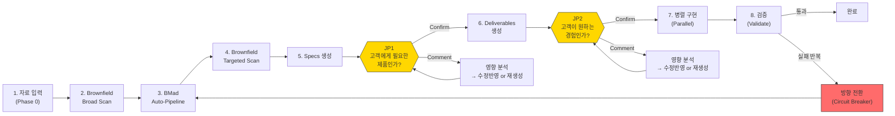

# BMAD Sprint Kit Blueprint

> bmad-sprint-kit은 개발자가 아닌 제품 전문가가, AI를 활용하여,
> 자신의 판단을 소프트웨어 결과물로 직접 실현할 수 있는 도구를 지향한다.
> 사용자는 코드는 모르지만 고객이 뭘 원하는지 안다.
> 이 사용자가 하는 일은 세 가지뿐이다:
> 무엇을 할지 정하고, 결과가 맞는지 보고, 아니면 왜 아닌지 말하는 것.
> 그 외의 작업은 AI가 진행하며,
> 이를 통해 기존의 서비스 개발속도를 비약적으로 끌어올리는 것을 목표로 한다.
>
> 유일한 원칙: **사람의 판단만이 축적되는 영속 자산이다. AI 산출물은 전부 재생성 가능한 소모품이다.**
>
> 품질 기준: **"비개발자가 이 문서 하나만으로 AI와 함께 이 서비스를 다시 만들어낼 수 있다."**

---

## 전체 흐름



---

## 이 문서 읽는 법

이 문서는 **따라가기(Follow-Along)** 방식으로 구성되어 있다. 시스템을 추상적으로 설명하는 대신, 각 단계에서 **사용자가 보는 것**과 **시스템 내부에서 벌어지는 일**을 함께 서술한다.

> **예시 표기법**: `tutor-exclusion`(튜터 차단 기능)은 `specs/test-tutor-excl/`에서 확인할 수 있는 실제 예시 프로젝트이다.

| 섹션 | 내용 |
|------|------|
| **§1 Problem** | 이 제품이 존재하는 이유 |
| **§2 Thesis** | 핵심 원칙 + 설계 판단 + 전제 조건 |
| **§3 User Model** | 누가 사용하고, 무슨 역할을 하는가 |
| **§4 Value Chain** | 시스템 구성 + 파이프라인 워크스루 + 경로 선택 + 비용 |
| **§5 Judgment & Feedback** | 2-JP 모델 + 판단 상세 + 피드백 반영 |
| **§6 Constraints & Trade-offs** | 하지 않는 것 + 의식적 트레이드오프 |
| **§7 Risk Model** | 가정 + 깨지면 + 감지 신호 |
| **§8 Current State** | 현재 상태 + 미검증 가설 + 알려진 갭 |
| **Appendix** | 설치/운영, 파일 구조, 용어집 |

---

# 1. Problem

소프트웨어 개발에서 **"결정할 수 있는 사람 ≠ 만들 수 있는 사람"**이 가장 큰 병목이다. 고객이 뭘 원하는지 가장 잘 아는 사람(제품 전문가)은 코드를 모르고, 코드를 쓸 수 있는 사람(개발자)은 고객을 직접 모른다.

기존 방법론은 이 간극을 다르게 풀었다:

```
Waterfall:  빈틈 없이 사전 정의 → 한 번에 구현 (이상)
            빈틈 발견 → 되돌아가기 비용 큼 (현실)

Agile:      반복(iteration)을 통해 점진적 개선 (해법)
            하지만 매 반복에 구현 비용 발생, 제품 전문가는 여전히 개발자에게 의존

AI 시대:    AI가 빠르게 생성 → 사람이 판단 → 재생성 (새로운 가능성)
            재생성 비용 ≠ 0, 판단도 시간 소모 (현실)
```

Sprint Kit은 이 병목을 두 가지 방향에서 해소한다:
1. **사전 입력으로 첫 생성 품질을 높여** 반복 횟수를 줄인다
2. **고객 관점의 판단 시점에서만** 사람의 시간을 사용한다

코딩 자체는 AI가 빠르게 수행할 수 있다. 그러나 요구사항 정의 → 설계 → 검증 → 수정의 반복 루프에서 사람의 시간이 소모된다. Sprint Kit은 이 루프의 효율을 극대화하여, 제품 전문가가 개발자 없이도 자신의 판단을 소프트웨어로 실현할 수 있게 한다.

---

# 2. Thesis

## 2.1 핵심 원칙

**사람의 판단만이 축적되는 영속 자산이다. AI 산출물은 전부 재생성 가능한 소모품이다.**

이것이 Sprint Kit의 유일한 원칙이다. 나머지 모든 설계 판단은 이 원칙을 실현하기 위한 것이다.

## 2.2 설계 판단

핵심 원칙을 실현하기 위해 Sprint Kit이 내린 설계 판단들이다.

> 각 판단의 철학적 배경과 논의 과정: [`docs/judgment-driven-development.md`](judgment-driven-development.md)

### Artifacts as Medium — 결과물이 대화의 매체다

> 추상적 질문이 아니라, 구체적 결과물에 대한 반응이 가장 정확하고 빠른 입력이다.

사람은 "검색 기능에서 뭐가 중요해요?"라는 질문에는 부정확하게 답하지만, "이 검색 화면이 맞나요?"라는 결과물에는 정확하게 반응한다.

**Sprint Kit 구현 — 2-JP 모델**: 전체 프로세스에서 판단을 요청하는 시점을 2곳에 배치한다. JP1은 PRD + 요구사항을 **고객 여정 서사**로 제시하여 판단 요청. JP2는 **동작하는 프로토타입**을 직접 체험하게 하여 판단 요청. 두 시점 모두 구체적 결과물 위에서만 판단을 요청한다.

### Input Reduces Cycles — 입력이 반복을 줄인다

> 사전 입력(회의록, 참고자료, 기존 시스템 맥락)은 첫 생성의 품질을 높여서 재생성 횟수를 줄인다.

```
총 비용 = (사전 입력 비용) + (생성 비용 × 생성 횟수) + (판단 비용 × 판단 횟수)

사전 입력이 풍부하면:  생성 횟수 ↓, 판단 횟수 ↓  → 총 비용 ↓
사전 입력이 없으면:    생성 횟수 ↑, 판단 횟수 ↑  → 총 비용 ↑
```

**Sprint Kit 구현 — inputs/ 디렉토리 + Brownfield Scanner**: `specs/{feature}/inputs/`에 회의록, 참고자료를 넣는다. Brownfield Scanner가 기존 시스템 맥락을 MCP + 로컬 코드베이스에서 자동 수집한다. 프로덕트 팀의 킥오프 미팅 회의록이 있다면, 이것을 inputs/에 넣는 것만으로 AI의 PRD 첫 생성 품질이 크게 높아진다.

### Regeneration Over Modification — 수정보다 재생성

> 모든 AI 산출물은 소모품이다. 수정이 아니라 재생성이 기본이다. 사람의 판단만이 축적되는 영속 자산이며, 나머지는 전부 재생성 가능하다.

```
AI 시대의 재생성 방식:
문서 v1 → 피드백 → 피드백을 반영한 완전히 새로운 v2 생성 → 피드백 → v3 생성
장점: 매번 일관성 있는 결과물
전제: 사람의 판단(피드백)이 축적되어 다음 생성에 반영됨
```

**Sprint Kit 구현 — Comment 처리 플로우 + Circuit Breaker**: JP에서 Comment 시, 피드백 규모에 따라 **수정반영+전파**(소규모) 또는 **재생성**(대규모)을 cost와 함께 제시한다. 사용자가 cost를 보고 선택한다. 수정반영도 Scope Gate 검증으로 일관성을 보장한다. Circuit Breaker는 반복 실패 시 재생성 범위를 Sprint 전체로 확장하는 정상적인 메커니즘이다.

### Customer-Lens Judgment Points — 고객 관점의 판단 시점

> 사람이 개입하는 시점은 "고객에게 어떤 제품이 서빙될지 판단할 수 있는 순간"에 배치된다.

**Sprint Kit 구현 — JP1 + JP2**:
- JP1 "고객에게 필요한 제품인가?" — 요구사항, 시나리오, 기능 범위를 고객 여정 서사로 제시
- JP2 "고객이 원하는 경험인가?" — 동작하는 프로토타입 + 핵심 시나리오 가이드로 직접 체험
- 응답: **Confirm**(진행) / **Comment**(영향 분석 → 수정반영 or 재생성을 cost와 함께 제시 → 사용자 선택)

### Knowledge Shape Determines Route — 지식의 형태가 경로를 결정한다

> 사람의 지식이 어떤 형태로 존재하느냐에 따라 경로가 달라진다.

| 지식 형태 | 적합 경로 | 진입점 |
|----------|----------|--------|
| 풍부한 비정형 맥락 (회의록, 데이터) | **Sprint** — AI가 구성하고 내가 판단 | `/sprint` |
| 미탐색 영역 (새 시장, 새 문제) | **Guided** — AI와 함께 발견하고 정의 | BMad 12단계 |
| 이미 구조화된 산출물 (기존 PRD) | **Direct** — 바로 실행 | `/specs` |

**Sprint Kit 구현 — 3경로**: 세 경로 모두 같은 파이프라인(`[Specs] → JP1 → [Deliverables] → JP2 → [Execute]`)으로 합류한다. 경로는 고정이 아니며, 상황에 따라 전환 가능하다(크로스오버).

### Auto-Context, Human-Judgment — 맥락은 자동으로 수집하고, 판단만 사람에게 요청한다

> 기술적 맥락 수집은 AI가 자동으로 수행한다. 사람에게는 고객 영향으로 번역하여 판단만 요청한다.

```
AI가 수집:                             사람에게 제시:
"기존 API /api/v1/tutors에              "기존 '튜터 관리' 기능에 영향이
 GET, POST, DELETE 엔드포인트            있습니다. 현재 튜터 목록 화면에서
 존재. TutorService 클래스에서            새로운 '차단' 기능이 추가되면,
 blockTutor 메서드 미구현.                기존 사용자 경험이 변경됩니다.
 DB에 tutor_block_list 테이블 없음"       허용하시겠어요?"
```

**Sprint Kit 구현 — Brownfield 자동 수집 + 고객 영향 번역**: Brownfield Scanner가 MCP, document-project, 로컬 코드베이스에서 자동 수집한다. brownfield-context.md에 L1(도메인) → L2(행위) → L3(컴포넌트) → L4(코드) 계층으로 정리한다. JP1/JP2에서 기술적 데이터를 **고객 영향으로 번역**하여 제시한다.

## 2.3 전제 조건

핵심 원칙이 성립하려면 다음이 참이어야 한다:

1. **AI 생성 품질이 "검토할 만한" 수준이다** — AI가 생성한 PRD, 설계, 프로토타입이 전문가가 판단할 수 있는 수준이어야 한다. "대충 맞는" 수준이 아니라 "검토할 만한" 수준.
2. **제품 전문가가 고객 관점의 판단을 내릴 수 있다** — 사용자가 고객을 충분히 이해하고 있어서, 결과물의 적합성을 판단할 수 있다.
3. **사전 입력이 AI 생성 품질을 실제로 높인다** — 회의록, 참고자료, 기존 시스템 맥락이 AI의 첫 생성에 유의미한 차이를 만든다.

## 2.4 원칙이 틀렸을 때

- **사람의 판단이 축적되지 않는다면**: 피드백이 다음 재생성에 반영되지 않고 매번 같은 품질의 산출물이 나온다면, 이 시스템은 무한 재생성 루프에 빠진다.
- **AI 산출물의 재생성 비용이 감당 불가하다면**: 한 사이클에 수 시간이 걸린다면, "소모품 취급"이 불가능해지고 수정 패치 방식으로 회귀한다.
- **제품 전문가의 판단이 부정확하다면**: 고객에 대한 이해가 부족한 사람이 판단하면, AI가 아무리 빠르게 재생성해도 올바른 방향으로 수렴하지 않는다.

---

# 3. User Model

## 3.1 제품 전문가

Sprint Kit의 대상 사용자는 **제품 전문가**다. ~~개발자의 반대로서의 "비개발자"~~가 아니라, **고객에 대한 전문가이자, 어떤 결과물이 나와야 하는지 가장 잘 판단할 수 있는 사람**이다.

실제 사용자 예시:
- PM이 킥오프 미팅 후 회의록을 가지고 Sprint를 시작한다
- 창업자가 새 제품 아이디어로 Guided 경로를 탐색한다
- 디자이너가 Figma 시안 기반으로 Sprint를 실행한다
- 기존 PRD를 가진 담당자가 Direct 경로로 바로 실행한다

## 3.2 사람이 하는 일 — 3역할

| 역할 | 행동 | 시점 |
|------|------|------|
| **정하다** | 무엇을 만들지 결정한다 (Brief, 자료, 참고자료 제공) | Sprint 시작 전 |
| **판단하다** | 결과물이 맞는지 판단한다 (Confirm / Comment) | JP1, JP2 |
| **피드백하다** | 왜 아닌지 말한다 (수정 방향을 자유 텍스트로 입력) | JP Comment 시 |

## 3.3 시스템이 하는 일 — 4역할

| 역할 | 행동 | 설계 판단 근거 |
|------|------|---------------|
| **수집한다** | 기존 시스템 맥락을 자동 수집 + 고객 영향으로 번역 | Auto-Context, Human-Judgment |
| **생성한다** | 기획 산출물, 설계, 프로토타입을 자동 생성 | Input Reduces Cycles |
| **제시한다** | 구체적 결과물 위에서 판단을 요청 | Artifacts as Medium |
| **재생성한다** | 피드백을 반영하여 수정 또는 재생성 | Regeneration Over Modification |

---

# 4. Value Chain

## 4.1 시스템 구성 요소

### 도구 스택

| 도구 | 역할 |
|------|------|
| **BMad Method** | 기반 플랫폼: 에이전트, 워크플로우 엔진, 퍼실리테이션 (`_bmad/`) |
| **Sprint Kit** | BMad 실행 확장팩: 자동 파이프라인, Specs, Deliverables, Prototype |
| **Claude Code** | AI IDE — 에이전트 실행 환경 |
| **Claude Code Native Teams** | 에이전트 조율, 태스크 의존성 추적 |
| **MCP 서버** | 외부 데이터 접근 (backend-docs, client-docs, svc-map, figma) |
| **Git Worktree** | 파일 충돌 없는 병렬 구현 환경 |
| **GitHub CLI (`gh`)** | Issue/PR 관리, 태스크 추적 |
| **Specmatic** | OpenAPI 계약 기반 자동 테스트 (Worker 자체 검증) |
| **MSW (Mock Service Worker)** | 프로토타입 stateful API (브라우저 Service Worker에서 네트워크 인터셉트) |
| **@redocly/cli** | OpenAPI 스펙 lint (스펙 구문/구조 + example ↔ schema 일치 검증) |
| **npx bmad-sprint-kit** | Sprint Kit 설치/업데이트 CLI |

### 에이전트 3계층

Sprint Kit은 세 계층의 에이전트를 사용한다.

**BMad 에이전트** — 기획 산출물 생성 (BMad Method 제공, AI 역할극):

| 에이전트 | 역할 | 입력 → 출력 | Sprint 호출 시점 |
|---------|------|------------|-----------------|
| **Mary** (Analyst) | 브레인스토밍, 리서치 | sprint-input.md → product-brief.md | Auto-Pipeline Step 1 |
| **John** (PM) | 요구사항 정의 | product-brief + sprint-input → prd.md | Auto-Pipeline Step 2 |
| **Winston** (Architect) | 기술 설계 | prd + brownfield-context → architecture.md | Auto-Pipeline Step 3 |
| **John** (PM) | Epics & Stories | prd + architecture → epics-and-stories.md | Auto-Pipeline Step 4 |
| **Sally** (UX Designer) | UX/UI 설계 | — | Guided 경로 |
| **Bob** (Scrum Master) | Sprint Planning | — | Guided 경로 |
| **Murat** (Test Architect) | 테스트 설계 | — | Guided 경로 |
| **Paige** (Tech Writer) | 문서화 | — | Guided 경로 |
| **Barry** (Quick Flow Solo Dev) | 소규모 작업 | — | Quick Flow |

**Sprint 에이전트** — 자동 파이프라인 오케스트레이션 (Sprint Kit 추가):

| 에이전트 | 역할 | 입력 → 출력 | 동작 시점 |
|---------|------|------------|----------|
| **@auto-sprint** | Sprint 오케스트레이션 + Conductor 4역할 (Goal Tracking, Scope Gate, Budget, Redirect) | sprint-input.md → planning-artifacts/ 전체 | Sprint 전체 |
| **@scope-gate** | 3단계 검증: Structured Probe + Checklist + Holistic Review | 직전 산출물 + goals → Pass/Fail + gap 보고 | BMad 각 단계 후 + deliverables 후 |
| **@brownfield-scanner** | MCP + 로컬 코드베이스에서 Brownfield 데이터 수집 (L1~L4) | MCP + 로컬 코드 → brownfield-context.md | Pass 1 (broad) + Pass 2 (targeted) |
| **@deliverable-generator** | Full-stack 산출물 생성 | planning-artifacts/ → Specs + Deliverables + MSW Mocks + readiness.md + Prototype | Specs/Deliverables 단계 |

**Execute 에이전트** — 구현 + 검증:

| 에이전트 | 역할 | 입력 → 출력 | 동작 시점 |
|---------|------|------------|----------|
| **@worker** | 독립 워크트리에서 태스크 구현 + Specmatic 자체 검증 | 태스크 + Specs + brownfield → 구현 코드 | Parallel (병렬) |
| **@judge-quality** | 코드 구조, 패턴, 중복, 컨벤션 + Specmatic 계약 준수 | 구현 코드 + Specs → Pass/Fail + 이슈 리스트 | Validate Phase 1 |
| **@judge-security** | OWASP Top 10, 인젝션, 인증 우회 검증 | 구현 코드 → Pass/Fail + 취약점 리스트 | Validate Phase 2 |
| **@judge-business** | PRD 수용 기준 대비 구현 검증 | 구현 코드 + PRD → Pass/Fail + 미충족 FR 리스트 | Validate Phase 3 |

### Brownfield 데이터 소스

기존 시스템의 맥락을 수집하는 3가지 소스와 토폴로지별 가용성.

| 소스 | 설명 | 수집 방법 |
|------|------|----------|
| **document-project** | BMad `/document-project` 워크플로우가 생성한 구조화 문서 | 파일 직접 읽기 |
| **MCP 서버** (4종) | backend-docs, client-docs, svc-map, figma | MCP 프로토콜 |
| **로컬 코드베이스** | 같은 저장소의 소스 코드 | Glob, Grep, Read |

**토폴로지별 가용 소스 매트릭스**:

| 토폴로지 | document-project | MCP | 로컬 코드 | 비고 |
|---------|-----------------|-----|----------|------|
| **standalone** | 해당 없음 | 가능 | 해당 없음 | Greenfield 또는 외부 시스템 |
| **co-located** | 가능 | 가능 | 가능 | 모놀리식, 로컬에 코드 있음 |
| **msa** | 가능 | 가능 | 부분 | 마이크로서비스, 일부만 로컬 |
| **monorepo** | 가능 | 가능 | 가능 | 모노레포, 전체 코드 로컬 |

Greenfield 프로젝트에서는 Brownfield 소스가 없어도 Sprint가 동작한다.

### Brownfield Context 생성

brownfield-context.md는 기존 시스템의 맥락을 L1~L4 계층으로 정리한 파일이다. Sprint가 이 파일을 참조하여 기존 API와 중복되지 않는 설계를 하고, 기존 화면 흐름을 깨뜨리지 않는 기능을 만든다.

**자동 생성 (Sprint 경로)**: `/sprint` 실행 시 @brownfield-scanner가 자동으로 생성한다.

1. Phase 0에서 토폴로지를 판정한다 — document-project 유무, MCP 연결 상태, 빌드 도구를 감지하여 프로젝트 유형(`standalone` / `co-located` / `msa` / `monorepo`)을 결정한다.
2. Pass 1(Broad Scan)에서 Brief 키워드 기반으로 도메인 개념(L1)과 행동 패턴(L2)을 수집한다.
3. Pass 2(Targeted Scan)에서 Architecture/Epics 완료 후 통합 지점(L3)과 코드 수준(L4)을 추가 수집한다.

수집 결과는 `specs/{feature}/planning-artifacts/brownfield-context.md`에 기록된다. 각 Pass의 상세 동작은 아래 §4.2 파이프라인에서 설명한다.

**사전 준비 — document-project (권장)**: Sprint 전에 BMad `/document-project` 워크플로우를 실행하면 Brownfield 스캔 품질이 높아진다. 이 워크플로우는 기존 코드베이스를 분석하여 구조화 문서(프로젝트 개요, API 계약, 데이터 모델 등)를 생성한다. Sprint의 Brownfield Scanner가 이 문서를 시드 데이터로 활용하여, MCP/로컬 스캔의 검색 범위를 좁히고 누락을 줄인다.

**수동 준비 (MCP 없이)**: MCP 서버를 구성할 수 없는 환경에서는 brownfield-context.md를 직접 작성하여 `specs/{feature}/brownfield-context.md` 또는 `specs/{feature}/planning-artifacts/brownfield-context.md`에 배치할 수 있다. Sprint가 기존 파일을 감지하면 해당 레벨을 재스캔하지 않고 활용한다. 작성 포맷은 `_bmad/docs/brownfield-context-format.md`에 정의되어 있다.

**Greenfield**: 기존 시스템이 없는 신규 프로젝트에서는 별도 준비가 필요 없다. Phase 0에서 자동 감지되며, Brownfield 스캔을 건너뛴다.

---

## 4.2 파이프라인

> Sprint 경로(`/sprint` 커맨드)를 기준으로 전체 프로세스를 따라간다. Guided/Direct 경로 차이는 §4.3에서 설명.

### Phase 0: Sprint Onboarding (Smart Launcher)

**근거**: Input Reduces Cycles — 입력 품질이 이후 전체 파이프라인의 재생성 횟수를 결정한다.

**사용자 시점**: 두 가지 방법으로 시작한다.

```bash
# 방법 1: 인라인 Brief
/sprint "수업 후 학생이 특정 튜터를 차단할 수 있는 기능"

# 방법 2: feature-name (inputs/ 디렉토리에 자료 배치 후)
/sprint tutor-exclusion
```

방법 2의 경우, `specs/tutor-exclusion/inputs/`에 자료를 배치한다. **brief.md는 필수가 아니다** — 회의록이나 참고자료만 넣어도 AI가 Brief를 자동 생성한다.

**시스템 내부**:

진입점 분기:

| 입력 형태 | 동작 |
|----------|------|
| 인라인 Brief (`"..."`) | `specs/{slug}/inputs/brief.md` 자동 생성 → 분석 |
| feature-name | `specs/{name}/` **전체 스캔** → 입력 상태 판정 → 최적 경로 분기 |

전체 스캔 (feature-name 진입 시): `specs/{feature}/` 내부를 한 번에 스캔하여 inputs/ 파일 목록, brownfield-context.md 존재 여부 + 레벨, planning-artifacts/ 완성도, BMad 산출물(`_bmad-output/`)을 감지한다.

| 입력 상태 | 경로 |
|----------|------|
| brief.md + 참고자료 | **정상 Sprint** |
| 참고자료만 (brief.md 없음) | **AI가 Brief 자동 생성** → 정상 Sprint |
| 기획 산출물 완비 | **Direct 경로 제안** (`/specs` 안내) |
| 입력 없음 | **에러** (자료 배치 안내) |

이후 시스템이 수행하는 처리:
- Brief 파싱 + Reference Materials 분석 (200줄 이하: 전문 포함 / 초과: 요약)
- Brief Sentences 추출: 문장 단위 분해 + BRIEF-N ID 부여 → PRD의 각 FR에 source 태깅에 사용
- 인과 사슬(Causal Chain) 추출 (선택, opt-in): Phenomenon → Root Cause → Solution Rationale → Feature Request
- Brownfield 상태 감지: 기존 brownfield-context.md 확인 → document-project 탐색 → MCP 접속 테스트 → 로컬 코드베이스 빌드 도구 감지 → 토폴로지 판정

Brief 등급 판정:

| 등급 | 조건 | 행동 |
|------|------|------|
| **A** (충분) | 기능 3+, 시나리오 1+, 또는 참고 자료가 보완 | 정상 진행 |
| **B** (보통) | 기능 1~2, 시나리오 없음 | 확인 시 경고 표시 |
| **C** (불충분) | 기능 0, 단순 키워드만 | Sprint 비권장 + `force_jp1_review: true` |

**사용자 시점 — 확인 화면**: 스캔 결과 요약(inputs/ 파일 목록, brownfield 상태, planning-artifacts 상태) + Sprint 시작 확인(추출 목표, 복잡도, 예상 소요 시간, 모순 감지 경고)을 제시한다.

**산출물**: `specs/{feature}/inputs/sprint-input.md` — Phase 0의 SSOT. 이후 모든 에이전트가 이 파일을 참조한다.

**실패 시**: Fallback 1(전체 분석 성공) → Fallback 2(brief.md만 가능) → Fallback 3(inline Brief만) → Fallback 4(입력 없음, Sprint 중단).

---

### Pass 1: Brownfield Broad Scan

**근거**: Auto-Context, Human-Judgment — 기존 시스템 맥락을 AI가 자동 수집하여, 사람에게는 판단만 요청.

**사용자 시점**: 자동 실행. 사용자 개입 없음.

**시스템 내부**: 기존 brownfield-context.md가 있으면 L1+L2 레벨 확인 후 재사용, 누락 레벨만 보충. 없으면 @brownfield-scanner가 broad 모드로 실행.

- Stage 0: document-project 산출물 소비 (있으면 초기 컨텍스트 구성)
- Stage 1~4: MCP + 로컬 스캔으로 L1(Domain) + L2(Behavior) 수집

**산출물**: `specs/{feature}/planning-artifacts/brownfield-context.md` (L1 + L2)

**실패 시**: MCP 접속 실패 → `brownfield_status: partial-failure` 기록 + 가용 소스만으로 진행. Greenfield → 스킵.

---

### BMad Auto-Pipeline

**근거**: Input Reduces Cycles — 풍부한 입력 + Brownfield 맥락이 BMad 에이전트의 첫 생성 품질을 높인다.

**사용자 시점**: 자동 실행. @auto-sprint Conductor가 BMad 에이전트를 순차 호출한다.

**시스템 내부**:

Conductor(@auto-sprint) 4역할:
1. **Goal Tracking** — sprint-input.md의 goals 대비 진행 추적
2. **Scope Gate** — 각 단계 후 @scope-gate 호출, 범위 이탈 감지
3. **Budget** — 소프트 게이트, 과도한 재생성 방지
4. **Redirect** — 범위 이탈 시 축소/전환

Context Passing 원칙: 에이전트 간에는 **파일 경로만 전달**한다. 산출물 내용을 메시지로 전달하지 않는다.

| Step | 에이전트 | 입력 | 출력 | 검증 |
|------|---------|------|------|------|
| 1 | Mary → Product Brief (AUTO) | sprint-input.md | product-brief.md | — |
| 2 | John → PRD (AUTO) | product-brief + sprint-input | prd.md | @scope-gate |
| 3 | Winston → Architecture (AUTO) | prd + brownfield-context | architecture.md | @scope-gate |
| 4 | John → Epics & Stories (AUTO) | prd + architecture | epics-and-stories.md | @scope-gate 최종 |

PRD 작성 시 각 FR에 `(source: BRIEF-N / DISC-N / AI-inferred)` 태깅. `_bmad/docs/prd-format-guide.md` 포맷 준수.

**산출물**:
```
specs/{feature}/planning-artifacts/
├── product-brief.md
├── prd.md
├── architecture.md
└── epics-and-stories.md
```

**실패 시**: Budget Control(동일 산출물 재생성 소프트 한도 초과 시 경고), Redirect(Scope Gate 심각 이탈 감지 시 범위 축소 또는 Sprint 중단).

---

### Pass 2: Brownfield Targeted Scan

**근거**: Auto-Context, Human-Judgment — Architecture + Epics 기반으로 구체적인 영향 범위를 정밀 스캔.

**사용자 시점**: 자동 실행. 사용자 개입 없음.

**시스템 내부**: @brownfield-scanner가 targeted 모드로 실행. L3(Component): 영향받는 컴포넌트, 서비스, 모듈. L4(Code): 구체적 코드 위치, 인터페이스, 의존성.

**산출물**: `specs/{feature}/planning-artifacts/brownfield-context.md` (L1 + L2 + L3 + L4 append)

---

### Specs 생성

**근거**: Regeneration Over Modification — Specs는 실행 단계의 SSOT이며, 재생성 가능한 소모품이다.

**사용자 시점**: 자동 실행. 사용자 개입 없음.

**시스템 내부**: @deliverable-generator가 specs-only 모드로 실행.

- **Stage 1: Entity Dictionary 생성** — PRD + Architecture에서 핵심 엔티티 추출, 용어 정의, 관계, 제약 조건 정리
- **Stage 2: Specs 4-file 생성**:
  - `requirements.md` — PRD → 구조화된 요구사항 (각 항목에 source 태깅)
  - `design.md` — Architecture → 구조화된 설계 (컴포넌트, 인터페이스)
  - `tasks.md` — Epics → 병렬 실행 가능한 태스크 목록 (Entropy Tolerance + 파일 소유권 배정)
  - `brownfield-context.md` (frozen) — planning-artifacts/에서 복사한 Frozen snapshot (이후 Workers 참조)

SSOT 참조 우선순위: `api-spec.yaml` > `design.md`의 API 섹션 / `schema.dbml` > `design.md`의 데이터 모델 섹션.

@scope-gate deliverables: API Data Sufficiency 검증 — key-flows.md의 API 호출 순서 대비, 후행 API의 요청 필드가 선행 API 응답에서 획득 가능한지 확인.

**산출물**:
```
specs/{feature}/
├── entity-dictionary.md
├── requirements.md
├── design.md
├── tasks.md
└── brownfield-context.md  (frozen snapshot)
```

---

### JP1: "고객에게 필요한 제품인가?"

**근거**: Customer-Lens Judgment Points + Artifacts as Medium — 구체적 결과물(고객 여정 서사) 위에서 고객 관점의 판단.

**사용자 시점**: 시스템이 Visual Summary를 정리하여 제시한다. 사용자가 Confirm / Comment로 응답한다.

JP1 제시 형식과 Comment 처리 플로우 상세는 §5.2 참조.

---

### Deliverables 생성

**근거**: Artifacts as Medium — JP2에서 판단할 구체적 결과물(동작하는 프로토타입)을 생성한다.

**사용자 시점**: 자동 실행. JP1 승인 후 시스템이 전체 산출물을 생성한다.

**시스템 내부**: @deliverable-generator가 full 모드로 실행.

| 산출물 | 파일 | 역할 |
|--------|------|------|
| OpenAPI 3.1 YAML | `api-spec.yaml` | API 계약 — MSW Mock + Specmatic 계약 테스트 공용 |
| API Sequences | `api-sequences.md` | Mermaid sequence diagrams |
| DBML Schema | `schema.dbml` | 데이터베이스 설계 |
| BDD/Gherkin | `bdd-scenarios/` | Given-When-Then 수용 테스트 |
| State Machines | `state-machines/` | XState 정의 (해당 시에만) |
| Decision Log | `decision-log.md` | ADR + AI reasoning trace |
| Traceability Matrix | `traceability-matrix.md` | FR → Design → Task → BDD → API 매핑 |
| Key Flows | `key-flows.md` | 핵심 사용자 플로우 Step-by-Step (JP2 검증용) |
| MSW Mocks | `preview/src/mocks/` | MSW handler (browser.ts, handlers.ts, store.ts, seed.ts) |
| Prototype | `preview/` | React + MSW stateful 프로토타입 |

---

### JP2: "고객이 원하는 경험인가?"

**근거**: Customer-Lens Judgment Points + Artifacts as Medium — **동작하는 프로토타입**을 직접 체험하며 판단.

**사용자 시점**: 프로토타입을 실행(`cd specs/{feature}/preview && npm run dev`)하고, 핵심 시나리오 가이드를 따라 직접 클릭하며 판단한다.

JP2 제시 형식과 Comment 처리 플로우 상세는 §5.3 참조.

---

### 병렬 구현 (Parallel)

**사용자 시점**: 자동 실행. 진행 상황을 모니터링할 수 있다.

**시스템 내부**:

1. **Interface Contract 생성** — 공유 타입/인터페이스 파일을 PARALLEL 시작 전에 생성
2. **GitHub Issues 생성** — `gh issue create`로 각 태스크를 Issue로 생성 (의존성, 파일 소유권, Entropy 표시)
3. **Git Worktree 설정** — 각 Worker에게 독립 워크트리 할당, 파일 충돌 원천 차단
4. **Native Teams @worker 생성** — Claude Code Task tool로 Worker 병렬 생성
5. **병렬 실행** — 각 Worker가 독립적으로 태스크 구현, Specmatic으로 API 계약 자체 검증, 완료 시 TaskUpdate + `gh issue close` + SendMessage
6. **Merge & Integration** — 의존성 순서에 따라 워크트리 merge + Integration test

파일 소유권: `tasks.md`에 각 태스크의 소유 파일을 명시. Worker는 배정된 파일만 수정. 공유 파일 수정 필요 시 팀 리더에게 요청.

**실패 시**: Worker Failure Protocol — 첫 실패 시 자동 재시도(최대 2회) → 재시도 실패 시 팀 리더 보고 → 부분 merge 옵션.

---

### 검증 (Validate)

**사용자 시점**: 자동 실행. 3-Phase 검증 결과가 보고된다.

**시스템 내부**:
- **Phase 1: @judge-quality** — 코드 구조, 패턴, 중복, 컨벤션 + Specmatic 계약 준수
- **Phase 2: @judge-security** — OWASP Top 10, 인젝션, 인증 우회
- **Phase 3: @judge-business** — PRD 수용 기준 대비 구현 검증, (causal_chain 제공 시) core FR이 root_cause를 실제로 해결하는가 확인

**실패 시**: 동일 카테고리 3회 연속 또는 5회 누적 실패 → Circuit Breaker 자동 발동.

---

### 방향 전환 (Circuit Breaker)

**근거**: Regeneration Over Modification — 반복 실패는 재생성 범위를 확장하는 정상적인 트리거다.

**사용자 시점**: 시스템이 방향 전환을 제안한다. 수동으로 `/circuit-breaker`를 실행할 수도 있다.

**트리거**: 동일 카테고리 3회 연속 VALIDATE 실패 / 5회 누적 실패 / Comment 재생성 범위가 Sprint 전체로 확장될 때.

| 심각도 | 대응 |
|--------|------|
| **경미** | Spec 수정 → Execute 재실행 |
| **중대** | BMad Auto-Pipeline부터 재생성 (@auto-sprint Phase 1 재실행) |
| **Guided/Direct 경로** | BMad `correct-course` 워크플로우 연동 |

---

## 4.3 경로 선택

**근거**: Knowledge Shape Determines Route — 사용자의 지식 형태에 따라 진입점이 달라진다.

모든 경로는 같은 파이프라인으로 합류한다:

```
[Input + Brownfield + BMad] → [Specs] → JP1 → [Deliverables] → JP2 → [Execute]
```

### Sprint 경로 — 자료가 있을 때

> **"AI가 구성하고 내가 판단한다."**

**진입점**: `/sprint "Brief"` 또는 `/sprint feature-name`

회의록, 참고자료, 간단한 Brief 등 비정형 맥락이 있을 때. AI가 전체 기획 산출물을 자동 생성하고, 프로덕트 전문가가 JP1/JP2에서 판단한다.

```
specs/{feature}/inputs/에 자료 배치 → /sprint {feature-name}
  Phase 0: Smart Launcher → sprint-input.md 생성
  → @auto-sprint (자동 실행)
  Pass 1 → BMad Auto-Pipeline → Pass 2 → Specs
  → JP1 → Deliverables → JP2
  → /parallel → /validate
```

특징: 전체 자동 (JP1/JP2에서만 사람 개입), `tracking_source: brief` (BRIEF-N 기반 추적).

### Guided 경로 — 탐색이 필요할 때

> **"AI와 함께 발견하고 정의한다."**

**진입점**: BMad 12단계 대화

새로운 제품, 새로운 시장, 아이디어 단계 등 체계적 탐색이 필요할 때.

```
/create-product-brief → /create-prd → /create-architecture → /create-epics
→ /specs → JP1 → /preview → JP2
→ /parallel → /validate
```

특징: BMad 대화 구간은 사람이 매 단계 참여, `/specs` 실행 시 `_bmad-output/planning-artifacts/` 자동 탐색, `tracking_source: success-criteria`.

### Direct 경로 — 기획이 끝났을 때

> **"바로 실행한다."**

**진입점**: `/specs feature-name` (완성된 planning-artifacts 존재)

```
/specs → JP1 → /preview → JP2
→ /parallel → /validate
```

특징: Phase 0 미경유, `/specs`가 planning-artifacts 경로를 자동 탐색.

### Quick Flow (소규모)

BMad 기존 워크플로우. 버그 수정, 소규모 변경에 적합. Sprint 파이프라인을 경유하지 않는 별도 경량 경로.

```
/quick-spec → /dev-story → /code-review
```

### 크로스오버

경로는 고정이 아니다. 상황에 따라 전환 가능:

| 상황 | 전환 |
|------|------|
| 자료가 있지만 깊은 탐색이 필요 | **Guided** 경로에서 자료를 참고 입력으로 활용 |
| 아무 자료 없이 빠른 프로토타입만 | **Sprint**에 한 줄 Brief로 시작 |
| BMad 12단계 완료 후 실행 | **Direct**와 동일 (`/specs`가 BMad 산출물 자동 인식) |

모든 경로의 산출물은 동일한 BMad 포맷(YAML frontmatter + 워크플로우 섹션)을 사용한다. Sprint Kit이 생성한 산출물은 BMad 워크플로우에서 직접 인식되며, 그 역도 성립한다.

---

## 4.4 비용 구조

### 비용 공식

```
총 비용 = (사전 입력 비용) + (생성 비용 × 생성 횟수) + (판단 비용 × 판단 횟수)
```

사전 입력이 풍부할수록 생성 횟수와 판단 횟수가 줄어든다. 사전 입력의 투자 대비 효과가 가장 크다.

### 현실 프로덕트 팀 워크플로우와의 비교

```
현실의 프로덕트 팀                       Sprint Kit 적용
──────────────────────────────────────────────────────────
1. 킥오프 미팅 (2시간)                  → inputs/에 회의록 저장 (~0분)
2. 누군가 PRD 초안 작성 (하루)           → AI가 PRD 생성 (~5분)
3. PRD 리뷰 미팅 (1시간)               → JP1: PRD 판단 (~10분)
4. PRD 수정 (반나절)                    → 필요 시 AI 재생성 (~3분)
5. 디자인 → 프로토타입 (일주일)          → AI가 프로토타입 생성 (~10분)
6. 프로토타입 리뷰 (1시간)              → JP2: 프로토타입 판단 (~15분)
7. 수정 → 최종 확정 (며칠)              → 필요 시 AI 재생성 (~10분)

사람 시간: ~25분 (기존: 4시간 30분 + 수 일의 대기)
```

AI가 대체하는 것: 구조화, 작성, 구현 (사람이 상대적으로 느린 작업)
사람이 유지하는 것: 맥락 제공, 판단, 방향 결정 (사람이 훨씬 정확한 작업)

---

# 5. Judgment & Feedback

## 5.1 2-JP 모델

이상적으로는 Brief 입력 후 프로토타입(JP2)까지 직행하여, 사용자가 결과물만 보고 판단하는 것이 최선이다. 그러나 현재 AI 속도로는 JP2까지 한 번에 수십 분이 소요되므로, 중간에 JP1을 두어 요구사항 방향을 먼저 확인한다.

**JP2가 본질적 판단 시점이며, JP1은 현재 기술 한계에 대한 실용적 보완이다.** AI가 충분히 빨라지면 JP1 없이 Brief → JP2 직행이 가능해진다. 원칙이 있기 때문에 구조를 바꾸지는 않는다 — 보완할 뿐이다.

## 5.2 JP1: "고객에게 필요한 제품인가?"

### 판단 대상

요구사항, 사용자 시나리오, 기능 범위, 우선순위.

### 제시 형식 — 4-Section Visual Summary

**Section 1: 고객 여정 서사**
- "고객이 A 상황에서 B를 하려 할 때, 시스템이 C를 제공합니다"
- 핵심 시나리오를 비기술적 언어로 서술

**Section 2: 원래 의도 ↔ FR 매핑 테이블**
- tracking_source가 `brief`이면: Brief 문장(BRIEF-N) ↔ FR 매핑
- tracking_source가 `success-criteria`이면: PRD Success Criteria ↔ FR 매핑
- 매핑되지 않은 항목은 경고로 표시
- Brief 외 추가 항목은 "참고 자료 발견" vs "AI 추론"으로 분리

**Section 3: 구조적 확인 사항**
- BMad 12단계가 발견하려는 것들을 체크리스트로 압축:
  - 모든 핵심 사용자 유형이 포함되었는가?
  - 엣지 케이스 시나리오가 고려되었는가?
  - 기존 기능과의 관계가 명확한가?
  - 성공 지표가 측정 가능한가?

**Section 4: 기존 시스템 영향**
- brownfield side-effect를 **고객 영향으로 번역**하여 제시
- "기존 튜터 목록 화면에 '차단' 버튼이 추가됩니다" (기술 용어 배제)

**[Advanced] Layer 3 상세** (접었다 펼 수 있는 형태):
- Causal Chain Alignment + FR Linkage (causal_chain 제공 시)
- Brownfield 기술 데이터
- Scope Gate 상세 결과

### 응답

| 응답 | 동작 |
|------|------|
| **Confirm** | Deliverables 생성(JP2)으로 진행 |
| **Comment** | Comment 처리 플로우 실행 (§5.4) |

## 5.3 JP2: "고객이 원하는 경험인가?"

### 판단 대상

프로토타입, 화면 흐름, 인터랙션.

### 제시 형식

1. 프로토타입 실행: `cd specs/{feature}/preview && npm run dev`
2. 핵심 시나리오 가이드(key-flows.md 기반)를 따라 직접 클릭
3. DevPanel로 상태 리셋/디버깅 (MSW in-memory store 기반)

MSW Service Worker가 `api-spec.yaml` 기반으로 네트워크 레벨에서 API 요청을 인터셉트하여 stateful 응답을 제공한다. React SPA는 실제 서비스와 동일한 코드로 API를 호출한다 (MSW의 존재를 알지 못함).

JP1 이후 변경/보완된 사항은 readiness.md의 `jp1_to_jp2_changes` 필드에 기록되어 JP2 Section 0에 자동 표시된다.

### 응답

| 응답 | 동작 |
|------|------|
| **Confirm** | Parallel(병렬 구현)로 진행 |
| **Comment** | Comment 처리 플로우 실행 (§5.4) |

## 5.4 Comment 처리 플로우

JP에서 Comment를 선택하면, 피드백 규모에 따라 처리 방식을 동적으로 결정한다. 이 플로우는 Party Mode 발견, Advanced Elicitation 결과, 직접 피드백 모두에 동일하게 적용된다.

1. **피드백 입력**: 사용자가 수정할 내용을 자유 텍스트로 입력한다
2. **영향 분석**: 시스템이 피드백의 영향 범위를 분석하여 다음을 산출한다
   - 수정반영 시: 수정 대상 파일 목록 (upstream + downstream) + 예상 소요 시간
   - 재생성 시: 재실행 시작 Phase + 예상 소요 시간
3. **처리 옵션 제시**: cost와 함께 두 가지 옵션을 제시한다
   - **[M] 수정반영+전파**: 기존 산출물 내 직접 수정 + 의존 파일 양방향 전파 (N개 파일, ~M분) + Scope Gate 검증
   - **[R] 재생성**: 해당 Phase부터 재실행 (~M분)
4. **사용자 선택**: cost를 보고 사용자가 선택한다
5. **실행 + 검증**:
   - 수정반영 선택 시: 전체 파일 수정 → Scope Gate 검증 → PASS 시 JP 복귀
   - 재생성 선택 시: 해당 Phase부터 파이프라인 재실행 → Scope Gate 포함 → JP 복귀
6. **피드백 기록**: `planning-artifacts/feedback-log.md`에 피드백 내용 + 처리 방식 + 결과를 기록한다

재생성 범위 참조 테이블:

| 피드백 규모 | JP1 재생성 범위 | JP2 재생성 범위 |
|------------|----------------|----------------|
| 방향 전환 (만들려는 것 자체 변경) | Sprint 중단 → brief.md 수정 후 재시작 | Phase 1 처음 (PRD부터, JP1 재통과) |
| 스코프/UX 변경 | PRD부터 | PRD부터 (JP1 재통과) |
| 기술/설계 변경 | Architecture부터 | 해당 BMad 단계부터 (JP1 재통과) |
| 태스크 구조 변경 | Specs 재생성 | Deliverables만 재생성 |
| 명세/프로토타입 조정 | N/A | Deliverables만 재생성 |

## 5.5 역방향 루프

JP2에서 "요구사항 자체가 잘못됐다"고 판단되면, Comment의 **재생성 옵션** 범위가 JP1 이전 Phase로 자연 확장된다. 이것은 실패가 아니라, **구체적 결과물이 촉진한 정상적인 발견 프로세스**다.

```
JP1 ──→ JP2 ──→ Done
 ↑        │
 └────────┘  "프로토타입을 보니 요구사항이 잘못됐네"
             → Comment → 재생성 범위가 PRD까지 확장
```

이것이 Artifacts as Medium의 실현이다 — 프로토타입이라는 구체적 결과물이 없었다면 요구사항 오류를 발견하지 못했을 것이다.

---

# 6. Constraints & Trade-offs

## 6.1 경계 — 하지 않는 것

- **Sprint Kit은 별도 시스템이 아니다** — BMad Method의 확장팩이다. "두 시스템 사이의 번역기(Bridge)" 같은 개념은 필요 없다. 연결점은 파일 포맷 계약(planning-artifacts/ 디렉토리)이다.
- **기술적 의사결정을 사용자에게 묻지 않는다** — API 설계, DB 스키마, 컴포넌트 구조는 시스템이 결정한다. 사용자에게는 고객 영향으로 번역하여 판단만 요청한다.
- **개발 프로세스 관리를 하지 않는다** — Sprint Kit은 코드 리뷰, 배포 파이프라인, 모니터링을 다루지 않는다. 구현 완료까지만 책임진다.

## 6.2 트레이드오프

| 선택 | 대가 | 근거 |
|------|------|------|
| 재생성 기본, 수정 보조 | 소규모 변경에도 재생성 제안 (비효율 가능) | Regeneration Over Modification — 수정반영은 Scope Gate 검증으로 보완 |
| JP를 2개로 제한 | 중간 단계의 문제를 JP에서야 발견 | Customer-Lens Judgment Points — AI 속도 향상 시 JP1 제거 가능 |
| 전체 자동 파이프라인 | 중간 개입 불가 (Sprint 경로) | Input Reduces Cycles — 사전 입력 품질로 보완 |
| BMad 산출물 포맷 의존 | BMad 버전 변경 시 호환성 문제 | 확장팩 모델 — BMad가 기반 플랫폼 |

## 6.3 열어둔 것

- **Persistent Memory**: 환경 팩트는 brownfield-context.md로 이미 커버. 판단 보정(이전 Sprint 결과를 다음에 반영)은 self-reinforcing error 리스크 → 보류.
- **Teams Debate**: 3-Judge 검증 외에 에이전트 간 토론으로 품질 향상 → 현재 `/validate` 3-Judge 먼저 검증 후 판단.
- **Sprint Kit → BMad Phase 4 자동 전환**: planning-artifacts는 호환되나, tasks.md 고유 정보(DAG, Entropy, File Ownership)는 수동 전달 필요.

---

# 7. Risk Model

| 가정 | 깨지면 | 감지 신호 |
|------|--------|----------|
| AI 생성 품질이 "검토할 만한" 수준 | JP에서 매번 대폭 수정 필요 → 재생성 루프 | JP1/JP2 Comment 비율 > 70% |
| 재생성 비용이 감당 가능 (5~15분/사이클) | "소모품 취급"이 불가능 → 수정 패치 회귀 | 단일 사이클 소요 시간 > 30분 |
| 사전 입력이 첫 생성 품질을 높인다 | 입력 유무와 무관하게 동일 품질 → inputs/ 무의미 | Brief A등급 vs C등급 JP1 Comment 비율 차이 없음 |
| 제품 전문가가 고객을 잘 안다 | 판단이 고객 현실과 괴리 → 올바른 제품이 안 나옴 | 출시 후 사용률 저조 |
| MCP 서버가 안정적으로 동작 | Brownfield 스캔 실패 → 기존 시스템 맥락 누락 | `brownfield_status: partial-failure` 빈도 |
| 프로토타입이 판단에 충분한 피델리티 | JP2에서 판단 불가 → "실제로는 다를 것 같은데" | JP2 Comment "프로토타입으로는 판단 어려움" |

---

# 8. Current State

## 8.1 현재 버전

**v0.3.1** (2026-02-18)

주요 변경:
- Blueprint 범용 8-Section 구조 재작성 + Blueprint Format Guide 신규
- MSW Mock Layer로 Prism 완전 대체 (stateful 프로토타입)
- Comment 처리 플로우 도입 (영향 분석 → cost 기반 수정/재생성 선택)
- API Data Sufficiency 검증 (Scope Gate deliverables 단계)
- SSOT Reference Priority 규칙 명시
- JP 피드백 모델 간소화 (3택 → 2택: Confirm/Comment)

> 전체 변경 이력: `CHANGELOG.md`

## 8.2 파이프라인 검증 상태

| 구간 | 상태 | 비고 |
|------|------|------|
| Phase 0 → JP1 (기획) | 구현 완료, 부분 검증 | 개발자 시뮬레이션으로 동작 확인 |
| JP1 → JP2 (Deliverables + 프로토타입) | 구현 완료, 부분 검증 | 개발자 시뮬레이션으로 동작 확인 |
| JP2 이후 (Parallel + Validate + Circuit Breaker) | **구현 완료, 미검증** | 실제 실행 테스트 미수행 |

## 8.3 미검증 가설

- **실제 프로덕트 팀으로 Sprint를 실행한 적이 없다** — 모든 테스트는 개발자에 의한 시뮬레이션
- **실제 Brownfield 프로젝트에서 MCP 기반 스캔을 실행한 적이 없다** — Brownfield Scanner의 L3/L4 품질 미검증
- **프로토타입의 판단 피델리티가 충분한지 미검증** — MSW stateful mock이 실제 판단에 충분한지
- **비용 공식의 계수가 미보정** — 사전 입력 비용, 생성 비용, 판단 비용의 상대적 크기 미측정
- **JP2 이후 파이프라인(Parallel, Validate, Circuit Breaker)의 실제 동작 미검증** — 에이전트 정의는 완성되었으나 end-to-end 실행 테스트 없음

## 8.4 알려진 갭

- **Sprint Kit → BMad Phase 4 자동 전환 미지원**: tasks.md 고유 정보(DAG, Entropy, File Ownership) 수동 전달 필요
- **멀티 사용자 미지원**: 현재 한 명의 제품 전문가가 전체 Sprint를 진행하는 것을 전제
- **Persistent Memory 미구현**: Sprint 간 판단 축적 메커니즘이 없음

---

# Appendix A: 설치와 운영

## 설치

Sprint Kit은 `npx bmad-sprint-kit` CLI로 설치/업데이트한다.

| 커맨드 | 동작 |
|--------|------|
| `npx bmad-sprint-kit init` | Interactive 마법사: BMad 감지 → 파일 설치 → Hook 설정 |
| `npx bmad-sprint-kit update` | 기존 파일 업데이트 (버전 비교 + diff 표시) |
| `npx bmad-sprint-kit compat-check` | BMad 버전 호환성 확인 |

설치 시 BMad Method가 감지되지 않으면 에러와 함께 안내 메시지를 표시한다.

**설치되는 파일**:
- `.claude/agents/` — Sprint 에이전트 8개
- `.claude/commands/` — Sprint 커맨드 7개
- `.claude/rules/` — Sprint 규칙 3개 (bmad-*.md)
- `.claude/hooks/` — Hook 스크립트 4개
- `.claude/settings.json` — Hook 설정
- `_bmad/docs/` — 포맷 가이드 5개
- `preview-template/` — React + Vite + MSW 프로토타입 템플릿

## Hook 시스템

Sprint Kit은 4개의 Hook 스크립트로 런타임 보호와 사용자 경험을 제공한다.

| Hook | 트리거 | 역할 |
|------|--------|------|
| **desktop-notify.sh** | JP1/JP2 도달, Sprint 완료, 에러 | 데스크톱 알림 (macOS/Linux) |
| **protect-readonly-paths.sh** | 파일 수정 시도 | `_bmad/`, `specs/*/inputs/` 등 읽기 전용 경로 보호 |
| **sprint-pre-compact.sh** | Context window 압축 전 | Sprint 상태를 sprint-log.md에 저장 |
| **sprint-session-recovery.sh** | 세션 시작 시 | sprint-log.md에서 이전 상태 복원 |

## Multi-IDE 호환

Sprint Kit의 원본 정의는 `.claude/`에 있다. 다른 AI IDE도 지원한다.

| IDE | 지원 방식 |
|-----|----------|
| **Claude Code** | 기본. 추가 설정 불필요 |
| **Codex CLI** | `--ide codex` 옵션으로 `codex-agents/`, `$sprint` 등 변환 파일 생성 |
| **Gemini Code Assist** | `.gemini/commands/`에 TOML 래퍼 자동 생성 |

---

# Appendix B: 파일 구조

```
specs/{feature}/
├── inputs/                          # Phase 0 (사용자 원본 + Sprint Input SSOT, 읽기 전용)
│   ├── brief.md                     # 사용자 Brief (참고자료만 있으면 AI 자동 생성)
│   ├── *.md / *.pdf / ...           # 참고 자료 (선택)
│   └── sprint-input.md              # Phase 0 자동 생성 SSOT
│
├── planning-artifacts/              # BMad Phase 1-3 산출물 (프로젝트별 보관)
│   ├── product-brief.md             # Product Brief
│   ├── prd.md                       # PRD
│   ├── architecture.md              # Architecture + ADR
│   ├── epics-and-stories.md         # Epics & Stories
│   ├── brownfield-context.md        # L1~L4 수집 원본 (작업 중 append)
│   └── feedback-log.md              # Comment 처리 기록 (피드백 + 선택 + 결과)
│
├── sprint-log.md                    # Sprint 실행 로그 (timeline + decisions + issues)
├── brownfield-context.md            # Frozen snapshot (L1~L4, Workers 참조용)
├── entity-dictionary.md             # Entity Dictionary
├── requirements.md                  # PRD → 요구사항
├── design.md                        # Architecture → 설계
├── tasks.md                         # Epics → 병렬 태스크 + Entropy + File Ownership
│
├── api-spec.yaml                    # OpenAPI 3.1 (API 계약 — MSW Mock + Specmatic 공용)
├── api-sequences.md                 # Mermaid sequence diagrams
├── schema.dbml                      # Database schema (DBML)
├── bdd-scenarios/                   # Gherkin acceptance tests
├── state-machines/                  # XState definitions (해당 시에만)
├── decision-log.md                  # ADRs + AI reasoning trace
├── traceability-matrix.md           # FR → Design → Task → BDD → API 매핑
├── key-flows.md                     # 핵심 사용자 플로우 Step-by-Step (JP2 검증용)
├── readiness.md                     # JP1/JP2 Readiness 데이터 (jp1_to_jp2_changes 포함)
└── preview/                         # React + MSW 프로토타입 (npm run dev)
    └── src/mocks/                   # MSW handler (browser.ts, handlers.ts, store.ts, seed.ts)
```

---

# Appendix C: 용어집

| 용어 | 설명 |
|------|------|
| **JP (Judgment Point)** | 프로덕트 전문가가 고객 관점에서 판단하는 시점. JP1(요구사항), JP2(경험) |
| **tracking_source** | Brief 추적 소스. `brief`(BRIEF-N 기반) 또는 `success-criteria`(PRD Success Criteria 기반) |
| **Brownfield** | 기존에 운영 중인 서비스/시스템. 새 기능이 영향을 주는 기존 맥락 |
| **Greenfield** | 기존 시스템 없이 새로 시작하는 프로젝트 |
| **Entropy** | 태스크의 불확실성 수준 (Low/Medium/High). 구현 시 예상치 못한 문제 가능성 |
| **BRIEF-N** | Brief 문장 분해 ID (BRIEF-1, BRIEF-2, ...). FR의 source 추적에 사용 |
| **DISC-N** | Discovered Requirement ID. Brief에 없지만 참고 자료에서 발견된 요구사항 |
| **Frozen snapshot** | 특정 시점의 brownfield-context.md 복사본. Workers가 참조하는 고정 버전 |
| **Conductor** | @auto-sprint의 오케스트레이션 역할. Goal Tracking, Scope Gate, Budget, Redirect 4역할 |
| **Circuit Breaker** | 반복 실패 또는 재생성 범위 확장 시 방향 전환 메커니즘. 경미(Spec 수정) / 중대(재생성) |
| **planning-artifacts** | BMad 에이전트가 생성하는 기획 산출물 (Product Brief, PRD, Architecture, Epics) |
| **Sprint 경로** | 자료(회의록, 참고자료)가 있을 때. `/sprint` 커맨드로 진입 |
| **Guided 경로** | 탐색이 필요할 때. BMad 12단계 대화로 진입 |
| **Direct 경로** | 기획이 끝났을 때. `/specs` 커맨드로 직접 진입 |
| **Quick Flow** | 소규모 작업용 경량 파이프라인. `/quick-spec` → `/dev-story` → `/code-review` |
| **Specmatic** | OpenAPI 계약 기반 자동 테스트 도구. Worker가 자체 검증에 사용 |
| **MSW (Mock Service Worker)** | 브라우저 Service Worker 기반 stateful mock API. 프로토타입에서 CRUD 플로우 간 상태 유지 |
| **SSOT Reference Priority** | 동일 개념이 여러 파일에 기술된 경우의 참조 우선순위. api-spec.yaml > design.md API 섹션, schema.dbml > design.md 데이터 모델 |
| **API Data Sufficiency** | Flow 내 후행 API의 요청 필드가 선행 API 응답에서 획득 가능한지 검증하는 Scope Gate deliverables 체크 |
| **수정반영+전파** | Comment 처리 방식. 영향 받는 파일을 양방향(upstream + downstream) 수정 후 Scope Gate 검증. 소규모 피드백에 적합 |
| **Comment 처리 플로우** | JP에서 Comment 시 실행되는 통합 메커니즘. 영향 분석 → cost 기반 [수정반영+전파] / [재생성] 선택 → 실행 → JP 복귀 |
| **feedback-log.md** | Comment 처리 기록. planning-artifacts/ 하위에 위치하며, 피드백 내용 + 선택한 처리 방식 + 결과를 기록 |
| **document-project** | BMad 워크플로우. 기존 코드베이스를 스캔하여 구조화 문서 생성 |
| **MCP** | Model Context Protocol. AI가 외부 데이터 소스에 접근하는 프로토콜 |
| **readiness.md** | JP1/JP2 Readiness 데이터. YAML frontmatter에 jp1_to_jp2_changes 필드를 포함하여 JP1 이후 변경 사항 추적 |
| **/summarize-prd** | PRD 요약/분석 + 피드백 반영 커맨드. 기존 PRD를 빠르게 파악할 때 사용 |
| **Scope Gate** | @scope-gate 에이전트가 수행하는 3단계 검증: Structured Probe + Checklist + Holistic Review. BMad 각 단계와 Deliverables 후 실행 |
| **Amelia** (Dev) | BMad 에이전트. Story 구현 담당. Guided 경로에서 사용 |
