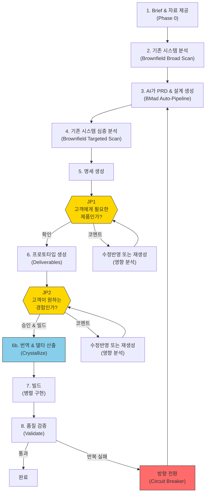

# JDD Sprint Kit Blueprint

> jdd-sprint-kit은 프로덕트 전문가 — 개발자가 아닌 —가
> AI의 힘을 빌려 자신의 판단을 소프트웨어 결과물로 직접 전환할 수 있게 하는 도구를 지향합니다.
> 사용자는 코드를 모르지만, 고객이 무엇을 원하는지는 압니다.
> 사용자가 하는 일은 딱 세 가지입니다:
> 무엇을 만들지 결정하고, 결과물이 맞는지 확인하고, 틀리면 왜 틀린지 말하는 것.
> 나머지는 전부 AI가 처리하며,
> 기존 서비스 개발 속도를 극적으로 가속하는 것을 목표로 합니다.
>
> 핵심 원칙: **사람의 판단만이 영속 자산이다. AI 산출물은 전부 재생성 가능한 소모품이다.**
>
> 품질 기준: **"비개발자가 이 문서만으로 AI와 함께 이 서비스를 재현할 수 있는가."**

---

## 전체 흐름



---

## 이 문서를 읽는 방법

이 문서는 **따라가기(Follow-Along)** 형식으로 구성되어 있습니다. 시스템을 추상적으로 설명하는 대신, 각 단계에서 **사용자가 보는 것**과 **시스템 내부에서 일어나는 것**을 함께 제시합니다.

> **예시 표기**: `tutor-exclusion`(튜터 차단 기능)은 `specs/test-tutor-excl/`에서 확인할 수 있는 실제 예시 프로젝트입니다.

| 섹션 | 내용 |
|------|------|
| **S1 문제** | 이 제품이 존재하는 이유 |
| **S2 테제** | 핵심 원칙 + 설계 판단 + 전제 조건 |
| **S3 사용자 모델** | 누가 사용하고 어떤 역할을 하는가 |
| **S4 가치 사슬** | 시스템 구성 요소 + 파이프라인 워크스루 + 경로 선택 + 비용 |
| **S5 판단 & 피드백** | 2-JP 모델 + 판단 상세 + 피드백 처리 |
| **S6 제약 & 트레이드오프** | 하지 않는 것 + 의식적 트레이드오프 |
| **S7 리스크 모델** | 전제 가정 + 깨지는 조건 + 감지 신호 |
| **S8 현재 상태** | 현황 + 미검증 가설 + 알려진 공백 |
| **부록** | 설치/운영, 파일 구조, 용어집 |

---

# 1. 문제

소프트웨어 개발에서 **"결정할 수 있는 사람 ≠ 만들 수 있는 사람"**이 가장 큰 병목입니다. 고객이 무엇을 원하는지 가장 잘 아는 사람(프로덕트 전문가)은 코드를 모르고, 코드를 작성할 수 있는 사람(개발자)은 고객을 직접 알지 못합니다.

기존 방법론은 이 격차를 각기 다른 방식으로 해소합니다:

```
Waterfall:  사전에 전부 정의 → 한번에 구현 (이상)
            격차 발견 → 되돌아가는 비용이 높음 (현실)

Agile:      반복을 통한 점진적 개선 (해결책)
            그러나 매 반복마다 구현 비용 발생; 프로덕트 전문가는 여전히 개발자에게 의존

AI 시대:    AI가 빠르게 생성 → 사람이 판단 → 재생성 (새로운 가능성)
            재생성 비용 ≠ 0, 판단에도 시간 소요 (현실)
```

Sprint Kit은 이 병목을 두 방향에서 해소합니다:
1. **사전 입력을 통해 1세대 품질을 높여** 반복 횟수를 줄인다
2. **고객 관점 판단 시점에서만 사람의 시간을 사용한다**

AI는 빠르게 코드를 작성할 수 있습니다. 그러나 사람의 시간은 요구사항 → 설계 → 검증 → 수정의 루프에서 소모됩니다. Sprint Kit은 이 루프의 효율을 극대화하여, 프로덕트 전문가가 개발자 없이도 자신의 판단을 소프트웨어로 전환할 수 있게 합니다.

---

# 2. 테제

## 2.1 핵심 원칙

**사람의 판단만이 영속 자산이다. AI 산출물은 전부 재생성 가능한 소모품이다.**

이것이 Sprint Kit의 유일한 원칙입니다. 다른 모든 설계 판단은 이 원칙을 실현하기 위해 존재합니다.

## 2.2 설계 판단

핵심 원칙을 실현하기 위해 Sprint Kit이 내린 설계 판단들입니다.

> 각 판단의 철학적 배경과 논의: [`docs/judgment-driven-development.md`](judgment-driven-development.md)
> Delta-Driven Design (개념적 기반): [`docs/delta-driven-design.md`](delta-driven-design.md)

### 매체로서의 산출물

> 가장 정확하고 빠른 입력은 추상적 질문이 아닌, 구체적 산출물에 대한 반응에서 나온다.

"검색 기능에서 중요한 게 뭐예요?"라고 물으면 사람은 부정확하게 답하지만, "이 검색 화면이 맞나요?"라고 물으면 정확하게 답합니다.

**Sprint Kit 구현 — 2-JP 모델**: 프로세스에서 정확히 2개 지점에서 판단을 요청합니다. JP1은 PRD(Product Requirements Document — 무엇을 만들지 정의하는 구조화된 문서) + 요구사항을 **고객 여정 서사**로 제시하여 판단을 구합니다. JP2는 **동작하는 프로토타입**을 제공하여 직접 체험하며 판단하게 합니다. 두 지점 모두 구체적 산출물 위에서만 판단을 요청합니다.

### 입력이 반복을 줄인다

> 사전 입력(회의록, 참고자료, 기존 시스템 맥락)이 1세대 품질을 높여 재생성 횟수를 줄인다.

```
총 비용 = (사전 입력 비용) + (생성 비용 × 생성 횟수) + (판단 비용 × 판단 횟수)

풍부한 사전 입력:    생성 횟수 ↓, 판단 횟수 ↓  → 총 비용 ↓
사전 입력 없음:      생성 횟수 ↑, 판단 횟수 ↑  → 총 비용 ↑
```

**Sprint Kit 구현 — inputs/ 디렉토리 + Brownfield Scanner**: 회의록과 참고자료를 `specs/{feature}/inputs/`에 배치합니다. Brownfield Scanner는 외부 소스(기존 서비스 저장소, Figma 디자인) + 로컬 코드베이스에서 기존 시스템 맥락을 자동 수집합니다. 제품팀의 킥오프 회의록만 inputs/에 넣어도 AI의 첫 PRD 생성 품질이 크게 향상됩니다.

### 수정보다 재생성

> 모든 AI 산출물은 소모품이다. 수정이 아닌 재생성이 기본이다. 사람의 판단만이 영속 자산이며, 나머지는 모두 재생성 가능하다.

```
AI 시대의 재생성 접근법:
문서 v1 → 피드백 → 피드백을 반영한 완전히 새로운 v2 → 피드백 → v3
장점: 매번 일관된 결과
전제: 사람의 판단(피드백)이 축적되어 다음 생성에 투입됨
```

**Sprint Kit 구현 — Comment 처리 플로우 + Circuit Breaker**: JP에서 Comment가 주어지면, 시스템은 **수정반영+전파**(소규모) 또는 **재생성**(대규모)을 비용 추정치와 함께 제시합니다. 사용자가 비용을 보고 선택합니다. 수정반영도 Scope Gate(산출물 간 내부 일관성을 검사하는 3단계 검증 — S4.2 상세)로 일관성을 검증합니다. Circuit Breaker는 반복 실패 시 재생성 범위를 Sprint 전체로 확대하는 정상적 메커니즘입니다. (전체 플로우 상세: S5.4. 트레이드오프 비용: S6.2.)

### Customer-Lens 판단 시점

> 사람의 개입 지점은 "프로덕트 전문가가 고객에게 어떤 제품이 제공될지 판단할 수 있는 순간"에 배치한다.

**Sprint Kit 구현 — JP1 + JP2**:
- JP1 "고객에게 필요한 제품인가?" — 요구사항, 시나리오, 기능 범위를 고객 여정 서사로 제시
- JP2 "고객이 원하는 경험인가?" — 동작하는 프로토타입 + 핵심 시나리오 가이드로 직접 체험
- 응답: **Confirm**(진행) / **Comment**(영향 분석 → 비용 추정치와 함께 수정반영 또는 재생성 → 사용자 선택)
- 제시 형식 및 플로우 상세: S5.2 (JP1), S5.3 (JP2). 2개 JP로 제한하는 트레이드오프: S6.2.

### 지식의 형태가 경로를 결정한다

> 경로는 사람이 가진 지식의 형태에 따라 달라진다.

| 지식의 형태 | 적합한 경로 | 진입점 |
|------------|-----------|--------|
| 풍부한 비정형 맥락 (회의록, 데이터) | **Sprint** — AI가 구성하고 내가 판단한다 | `/sprint` |
| 미탐색 영역 (새 시장, 새 문제) | **Guided** — AI와 함께 발견하고 정의한다 | BMad 12단계 |
| 이미 구조화된 산출물 (기존 PRD) | **Direct** — 바로 실행한다 | `/specs` |

**Sprint Kit 구현 — 3가지 경로**: 세 경로 모두 동일한 파이프라인(`[Specs] → JP1 → [Deliverables] → JP2 → [Execute]`)으로 합류합니다. 경로는 고정이 아니며, 필요에 따라 전환(크로스오버)할 수 있습니다.

### Auto-Context, Human-Judgment

> 기술적 맥락 수집은 AI가 자동으로 수행한다. 사람에게는 고객 영향으로 번역된 내용만 제시하여 판단을 구한다.

```
AI가 수집하는 것:                           사람에게 제시되는 것:
"기존 API /api/v1/tutors에                  "기존 '튜터 관리' 기능이
 GET, POST, DELETE 엔드포인트 있음.          영향을 받습니다. 현재 튜터 목록
 TutorService 클래스에 blockTutor            화면에 새로운 '차단' 버튼이
 메서드 미구현.                              추가되어 기존 사용자 경험이
 DB에 tutor_block_list 테이블 없음"          변경됩니다. 승인하시겠습니까?"
```

**Sprint Kit 구현 — Brownfield 자동 수집 + 고객 영향 번역**: Brownfield Scanner는 document-project, 외부 소스(저장소, Figma), 로컬 코드베이스에서 자동 수집합니다. 데이터는 brownfield-context.md에 4개 레이어로 정리되며, 각 레이어는 기존 시스템을 더 깊이 들여다봅니다:

- **L1 (Domain)**: 어떤 비즈니스 개념이 존재하는가 (예: "Tutor", "Lesson", "Matching")
- **L2 (Behavior)**: 그 개념들이 어떻게 동작하는가 (예: "POST /api/tutors로 튜터 레코드 생성")
- **L3 (Component)**: 어떤 코드 모듈이 관련되는가 (예: "src/services/의 TutorService")
- **L4 (Code)**: 새 기능이 접촉할 구체적 코드 위치와 인터페이스

레이어 접근법이 존재하는 이유는 초기 기획(PRD)에는 도메인/동작 맥락(L1+L2)만 필요하고, 후기 단계(Architecture, 구현)에는 컴포넌트/코드 수준 상세(L3+L4)가 필요하기 때문입니다. 기능 범위가 정의되기 전에 모든 것을 수집하면 낭비이며 부정확합니다.

JP1/JP2에서 기술 데이터는 **고객 영향으로 번역**되어 제시됩니다.

## 2.3 전제 조건

핵심 원칙은 다음이 참일 때만 성립합니다:

1. **AI 생성 품질이 "리뷰할 만한 수준"이어야 한다** — AI가 생성한 PRD, 설계, 프로토타입이 전문가가 의미 있게 판단할 수 있는 수준이어야 합니다. "대충 맞는" 수준이 아니라 "리뷰할 가치가 있는" 수준입니다.
2. **프로덕트 전문가가 고객 관점 판단을 내릴 수 있어야 한다** — 사용자가 산출물의 적합성을 판단할 수 있을 만큼 고객을 잘 이해해야 합니다.
3. **사전 입력이 실제로 AI 생성 품질을 향상시켜야 한다** — 회의록, 참고자료, 기존 시스템 맥락이 AI의 첫 생성에 의미 있는 차이를 만들어야 합니다.

## 2.4 원칙이 실패하는 경우

- **사람의 판단이 축적되지 않을 때**: 피드백이 다음 재생성에 반영되지 않고 동일한 품질의 산출물이 계속 나오면, 시스템은 무한 재생성 루프에 빠집니다.
- **AI 산출물 재생성 비용이 감당할 수 없게 될 때**: 한 사이클에 수 시간이 걸리면 "소모품 취급"이 불가능해지고, 시스템은 패치 기반 수정으로 퇴행합니다.
- **프로덕트 전문가의 판단이 부정확할 때**: 고객을 잘 모르는 사람이 판단하면, AI가 아무리 빠르게 재생성해도 올바른 방향으로의 수렴은 일어나지 않습니다.

---

# 3. 사용자 모델

## 3.1 프로덕트 전문가

Sprint Kit의 대상 사용자는 **프로덕트 전문가**입니다. ~~개발자의 반대말로서의 "비개발자"~~가 아니라, **고객의 전문가이며 어떤 결과물이 나와야 하는지 가장 잘 판단할 수 있는 사람**입니다.

실제 사용자 예시:
- PM이 킥오프 회의록으로 Sprint를 시작한다
- 창업자가 Guided 경로를 통해 새 제품 아이디어를 탐색한다
- 디자이너가 Figma 목업 기반으로 Sprint를 실행한다
- 기존 PRD가 있는 사람이 Direct 경로로 바로 실행한다

## 3.2 사람이 하는 일 — 3가지 역할

| 역할 | 행동 | 시점 |
|------|------|------|
| **결정** | 무엇을 만들지 결정한다 (Brief, 자료, 참고자료 제공) | Sprint 시작 전 |
| **판단** | 산출물이 맞는지 판단한다 (Confirm / Comment) | JP1, JP2 |
| **피드백** | 왜 틀린지 말한다 (수정 방향을 자유 텍스트로 입력) | JP Comment 시 |

## 3.3 시스템이 하는 일 — 4가지 역할

| 역할 | 행동 | 설계 판단 근거 |
|------|------|--------------|
| **수집** | 기존 시스템 맥락 자동 수집 + 고객 영향으로 번역 | Auto-Context, Human-Judgment |
| **생성** | 기획 산출물, 설계, 프로토타입 자동 생성 | 입력이 반복을 줄인다 |
| **제시** | 구체적 산출물 위에서 판단 요청 | 매체로서의 산출물 |
| **재생성** | 피드백 기반으로 수정반영 또는 재생성 | 수정보다 재생성 |

---

# 4. 가치 사슬

## 4.1 시스템 구성 요소

### 도구 스택

| 도구 | 역할 |
|------|------|
| **BMad Method** | 기반 플랫폼: 에이전트, 워크플로우 엔진, 퍼실리테이션 (`_bmad/`) |
| **Sprint Kit** | BMad 실행 확장팩: 자동 파이프라인, Specs, Deliverables, 프로토타입 |
| **Claude Code** | AI IDE — 에이전트 실행 환경 |
| **Claude Code Native Teams** | 에이전트 조율, 태스크 의존성 추적 |
| **MCP (Figma)** | Figma 디자인 데이터 접근. MCP(Model Context Protocol)는 AI가 인증된 연결을 통해 외부 데이터 소스에 접근할 수 있게 하는 프로토콜입니다. 현재는 Figma에만 사용 — 다른 외부 데이터는 `--add-dir` 또는 tarball snapshot 사용 (아래 Brownfield 데이터 소스 참조) |
| **Git Worktree** | 충돌 없는 병렬 구현 환경 |
| **GitHub CLI (`gh`)** | Issue/PR 관리, 태스크 추적 |
| **Specmatic** | OpenAPI 계약 기반 자동 테스트 (Worker 자체 검증) |
| **MSW (Mock Service Worker)** | 프로토타입 상태 유지 API (브라우저 Service Worker를 통한 네트워크 인터셉션) |
| **@redocly/cli** | OpenAPI 스펙 검증 — 구문 오류, 구조적 문제, 예제 데이터와 스키마 정의 간 불일치를 검사 |
| **npx jdd-sprint-kit** | Sprint Kit 설치/업데이트 CLI |

#### 도구 선택 근거

위 도구 대부분은 플랫폼 기본 제공(BMad, Claude Code)이거나 실질적 대안이 없습니다(GitHub CLI, Figma용 MCP). 다음은 의도적으로 선택한 것들입니다:

**MSW (Mock Service Worker)** — 프로토타입 충실도를 위해 선택. 요구사항: JP2 판단에는 실제 서비스처럼 동작하는(플로우 전반에 걸쳐 상태 유지 CRUD) 프로토타입이 필요합니다. MSW는 브라우저 Service Worker를 통해 네트워크 수준에서 인터셉트하므로, React 앱은 프로덕션과 동일한 코드로 API를 호출합니다 — 모킹되고 있다는 사실을 모릅니다. 이전에는 Prism(OpenAPI 프록시 목)을 사용했으나, Prism은 요청 간 상태를 유지할 수 없어 (예: "POST로 레코드 생성 → GET으로 반환") 현실적 사용자 여정이 불가능했습니다.

**Specmatic** — 계약 기반 검증을 위해 선택. 요구사항: 병렬로 구현하는 Worker들이 실행 중인 백엔드 없이 API 적합성을 검증해야 합니다. Specmatic은 `api-spec.yaml`에서 직접 계약 테스트를 생성하여 각 Worker가 독립적으로 자체 검증할 수 있게 합니다. 대안으로 고려한 것: Pact — 소비자 측에서 계약을 테스트합니다(프론트엔드가 기대 사항을 선언하고 백엔드를 그에 맞춰 테스트). 그러나 Sprint Kit은 소비자 코드가 존재하기 전에 API 스펙을 정의하므로, API 스펙에 직접 대조 테스트하는 Specmatic의 접근법이 자연스럽게 맞습니다.

**@redocly/cli** — OpenAPI 검증 깊이를 위해 선택. 요구사항: MSW 핸들러 생성 전에 구조적 오류와 예제 ↔ 스키마 불일치를 잡아야 합니다. Redocly는 주요 대안인 Spectral이 기본적으로 커버하지 않는 예제/스키마 적합성 문제를 감지합니다.

**Git Worktree** — 병렬 Worker용으로 기능 브랜치 대신 선택. Worktree는 같은 저장소에서 별도의 작업 디렉토리를 생성하여 여러 Worker가 동시에 파일을 편집할 수 있고 서로 차단하지 않습니다. 일반 기능 브랜치에서는 디렉토리당 한 번에 하나의 브랜치만 체크아웃할 수 있어 전환을 반복해야 합니다.

### 에이전트 3-Tier 아키텍처

Sprint Kit은 3개 계층에서 에이전트를 사용합니다.

**BMad 에이전트** — 기획 산출물 생성 (BMad Method 제공 — 각 에이전트는 정의된 전문성, 입력, 출력을 가진 특화된 AI 프롬프트):

| 에이전트 | 역할 | 입력 → 출력 | Sprint 호출 |
|---------|------|------------|------------|
| **Mary** (Analyst) | 브레인스토밍, 리서치 | sprint-input.md → product-brief.md | Auto-Pipeline Step 1 |
| **John** (PM) | 요구사항 정의 | product-brief + sprint-input → prd.md | Auto-Pipeline Step 2 |
| **Winston** (Architect) | 기술 설계 | prd + brownfield-context → architecture.md | Auto-Pipeline Step 3 |
| **John** (PM) | Epics & Stories | prd + architecture → epics-and-stories.md | Auto-Pipeline Step 4 |
| **Sally** (UX Designer) | UX/UI 디자인 | — | Guided 경로 |
| **Bob** (Scrum Master) | Sprint Planning | — | Guided 경로 |
| **Murat** (Test Architect) | 테스트 설계 | — | Guided 경로 |
| **Paige** (Tech Writer) | 문서화 | — | Guided 경로 |
| **Barry** (Quick Flow Solo Dev) | 소규모 작업 | — | Quick Flow |

**Sprint 에이전트** — 자동 파이프라인 오케스트레이션 (Sprint Kit 추가):

| 에이전트 | 역할 | 입력 → 출력 | 시점 |
|---------|------|------------|------|
| **@auto-sprint** | Sprint 오케스트레이션 + Conductor 4역할 (Goal Tracking, Scope Gate, Budget, Redirect — S4.2 BMad Auto-Pipeline 상세) | sprint-input.md → 전체 planning-artifacts/ | Sprint 전체 |
| **@scope-gate** | 3단계 검증: Structured Probe + Checklist + Holistic Review | 이전 산출물 + goals → Pass/Fail + 갭 리포트 | 각 BMad 단계 후 + Deliverables 후 |
| **@brownfield-scanner** | 외부 소스 + 로컬 코드베이스에서 Brownfield 데이터 수집 (L1~L4) | 외부 소스 + 로컬 코드 → brownfield-context.md | Pass 1 (broad) + Pass 2 (targeted) |
| **@deliverable-generator** | Full-stack 산출물 생성 | planning-artifacts/ → Specs + Deliverables + MSW Mocks + readiness.md + 프로토타입 | Specs/Deliverables 단계 |

**Execute 에이전트** — 구현 + 검증:

| 에이전트 | 역할 | 입력 → 출력 | 시점 |
|---------|------|------------|------|
| **@worker** | 격리된 Worktree에서 태스크 구현 + Specmatic 자체 검증 | 태스크 + Specs + brownfield → 구현 코드 | Parallel |
| **@judge-quality** | 코드 구조, 패턴, 중복, 컨벤션 + Specmatic 검증 (API 구현이 스펙과 일치하는지) | 구현 코드 + Specs → Pass/Fail + 이슈 목록 | Validate Phase 1 |
| **@judge-security** | OWASP Top 10 (주요 웹 보안 취약점 표준 목록), 인젝션, 인증 우회 검증 | 구현 코드 → Pass/Fail + 취약점 목록 | Validate Phase 2 |
| **@judge-business** | PRD 수용 기준 대비 구현 검증 | 구현 코드 + PRD → Pass/Fail + 미충족 FR 목록 | Validate Phase 3 |

### Brownfield 데이터 소스

기존 시스템 맥락을 수집하는 4가지 소스입니다. 각 소스는 접근 방법이 다르며 해당 방법을 사용하는 이유가 있습니다.

| 소스 | 설명 | 접근 방법 | 이 방법을 사용하는 이유 |
|------|------|----------|---------------------|
| **document-project** | BMad `/document-project` 워크플로우로 생성한 구조화된 문서 (프로젝트 개요, API 계약, 데이터 모델) | 파일 직접 읽기 | 이미 로컬 파일이므로 특별한 접근 불필요 |
| **외부 저장소** (`--add-dir` / tarball) | 기존 서비스 코드 저장소. 2가지 접근 방법: (1) `--add-dir` — 로컬 디렉토리를 AI 접근 가능 파일 범위에 추가하는 Claude Code 실행 옵션. 로컬 클론이 있을 때 사용. (2) tarball snapshot — GitHub 저장소의 현재 파일을 `gh api tarball/HEAD`로 읽기 전용 사본 다운로드. 로컬 클론 없이 GitHub URL만 있을 때 사용. | Glob, Grep, Read (로컬 파일과 동일한 도구) | v0.3.x까지 외부 저장소는 MCP(파일시스템 MCP 서버)로 접근했습니다. 그러나 Claude Code의 MCP 보안이 MCP 서버를 프로젝트 루트 디렉토리로 제한하여, 다른 곳에 저장된 저장소 접근을 차단합니다. `--add-dir`과 tarball은 이 제한을 우회하여 외부 파일을 직접 읽을 수 있게 합니다. |
| **Figma** | 실시간 디자인 데이터 (와이어프레임, 컴포넌트, 디자인 토큰) | MCP 프로토콜 (OAuth 인증) | 코드 저장소와 달리 Figma 데이터는 파일로 다운로드할 수 없습니다 — Figma 서버의 실시간 데이터로만 존재합니다. MCP가 유일한 쿼리 방법입니다. |
| **로컬 코드베이스** | 현재 프로젝트의 소스 코드 | Glob, Grep, Read | 이미 프로젝트의 일부이므로 특별한 접근 불필요 |

**Topology** — Scanner가 프로젝트의 배포 구조를 자동 감지하고 스캔 전략을 조정합니다:

| Topology | 의미 | 외부 소스 | 로컬 코드 | 스캔 전략 |
|----------|------|----------|----------|----------|
| **standalone** | Greenfield 또는 외부 전용 시스템 | 사용 가능 | 해당 없음 | 외부 소스가 유일한 데이터 소스 |
| **co-located** | 모놀리식 — 모든 코드가 이 저장소에 있음 | 사용 가능 | 전체 스캔 | 로컬 코드가 주; 외부 소스가 보충 |
| **msa** | 마이크로서비스 — 일부 서비스만 로컬에 있음 | 사용 가능 | 부분적 | 외부 소스가 주(서비스 간 가시성); 로컬 스캔은 L1-L2로 제한 |
| **monorepo** | 하나의 저장소에 여러 패키지 | 사용 가능 | 전체 스캔 (관련 패키지) | 로컬 코드가 주; 관련 패키지로만 범위 한정 |

Greenfield 프로젝트는 Brownfield 소스 없이도 작동합니다.

### Brownfield Context 생성

brownfield-context.md는 기존 시스템 맥락을 L1~L4 레이어로 정리합니다. Sprint는 이 파일을 참조하여 기존 API와 중복되지 않는 API를 설계하고 기존 화면 흐름을 깨뜨리지 않는 기능을 구축합니다.

**자동 생성 (Sprint 경로)**: `/sprint` 실행 시 @brownfield-scanner가 자동 생성합니다.

1. Phase 0에서 topology 판정 — document-project 가용성, 외부 데이터 소스(`--add-dir` 경로, Reference Sources의 GitHub 저장소 URL, Figma MCP), 빌드 도구를 감지하여 프로젝트 유형(`standalone` / `co-located` / `msa` / `monorepo`) 결정.
2. Pass 1 (Broad Scan)에서 Brief 키워드 기반으로 도메인 개념(L1)과 동작 패턴(L2) 수집.
3. Pass 2 (Targeted Scan)에서 Architecture/Epics 완료 후 통합 지점(L3)과 코드 수준 상세(L4) 수집.

결과는 `specs/{feature}/planning-artifacts/brownfield-context.md`에 기록됩니다. Pass별 상세 동작은 S4.2 파이프라인에서 설명합니다.

**사전 준비 — document-project (권장)**: Sprint 전에 BMad `/document-project` 워크플로우를 실행하면 Brownfield 스캔 품질이 향상됩니다. 이 워크플로우는 기존 코드베이스를 분석하여 구조화된 문서(프로젝트 개요, API 계약, 데이터 모델 등)를 생성합니다. Sprint의 Brownfield Scanner가 이를 시드 데이터로 사용하여 스캔 범위를 좁히고 갭을 줄입니다.

**수동 준비 (외부 소스 없이)**: 외부 데이터 소스를 구성할 수 없을 때, brownfield-context.md를 수동으로 작성하여 `specs/{feature}/brownfield-context.md` 또는 `specs/{feature}/planning-artifacts/brownfield-context.md`에 배치할 수 있습니다. Sprint는 기존 파일을 감지하고 커버된 레벨은 재스캔하지 않고 재사용합니다. 포맷은 `_bmad/docs/brownfield-context-format.md`에 정의되어 있습니다.

**Greenfield**: 기존 시스템이 없는 새 프로젝트는 준비가 필요 없습니다. Phase 0에서 자동 감지되며 Brownfield 스캔은 건너뜁니다.

---

## 4.2 파이프라인

> Sprint 경로(`/sprint` 커맨드) 기준으로 전체 프로세스를 워크스루합니다. Guided/Direct 경로 차이는 S4.3에서 다룹니다.

### Phase 0: Sprint 온보딩 (Smart Launcher)

**근거**: 입력이 반복을 줄인다 — 입력 품질이 전체 다운스트림 파이프라인의 재생성 횟수를 결정합니다.

**사용자 관점**: 세 가지 시작 방법.

```bash
# 방법 1: 인라인 Brief — 한 줄 설명으로 즉시 시작
/sprint "수업 후 학생이 특정 튜터를 차단할 수 있는 기능"

# 방법 2: 기능 이름 — inputs/에 자료를 준비한 상태로 시작
/sprint tutor-exclusion

# 방법 3: 새 기능 — 폴더가 아직 없음
/sprint tutor-exclusion
# → 시스템이 specs/tutor-exclusion/inputs/brief.md 템플릿 생성 → 종료
# → 사용자가 brief.md 작성 → /sprint tutor-exclusion 재실행
```

방법 2의 경우, `specs/tutor-exclusion/inputs/`에 자료를 배치합니다. **brief.md는 필수가 아닙니다** — 회의록이나 참고자료만 있어도 AI가 Brief를 자동 생성합니다.

방법 3의 경우, 시스템이 `specs/{feature}/inputs/`와 **brief.md 템플릿**을 자동 생성합니다. 템플릿에는 4개 하위 섹션을 포함한 **Reference Sources** (`## Reference Sources`) 섹션이 있습니다:

- **GitHub**: 기존 서비스 저장소 URL 선언 (예: `https://github.com/org/backend-api`). 시스템이 tarball snapshot(git clone이 아닌 `gh api tarball/HEAD`를 통한 현재 파일의 읽기 전용 사본)을 다운로드하고 Brownfield Scanner가 해당 코드를 분석합니다. 여기에 선언된 URL은 확인 없이 다운로드됩니다 — 선언 자체가 사용자의 명시적 의도입니다.
- **Figma**: Figma 디자인 URL 선언. 시스템이 Figma MCP를 통해 실시간 디자인 데이터를 읽습니다.
- **Policy Docs**: Scanner가 우선 탐색할 문서 이름 나열 (예: `matching-policy.md`).
- **Scan Notes**: Brownfield 스캔 방향에 대한 자유 텍스트 안내 (예: "매칭 엔진과 예약 플로우에 집중").

brief.md 작성 후 `/sprint feature-name`을 다시 실행하면 Sprint가 시작됩니다.

**시스템 내부**:

진입점 분기:

| 입력 형태 | 동작 |
|----------|------|
| 인라인 Brief (`"..."`) | `specs/{slug}/inputs/brief.md` 자동 생성 → 분석 |
| feature-name (폴더 존재) | `specs/{name}/` **전체 스캔** → 입력 상태 평가 → 최적 경로 분기 |
| feature-name (폴더 미존재) | `specs/{name}/inputs/brief.md` 템플릿 **자동 생성** → 안내 표시 → 종료 |

전체 스캔 (feature-name 진입): `specs/{feature}/`를 한번에 스캔하여 inputs/ 파일 목록, brownfield-context.md 존재 여부 + 레벨, planning-artifacts/ 완성도, BMad 산출물(`_bmad-output/`)을 감지합니다.

| 입력 상태 | 경로 |
|----------|------|
| brief.md + 참고자료 | **일반 Sprint** |
| 참고자료만 (brief.md 없음) | **AI Brief 자동 생성** → 일반 Sprint |
| 기획 산출물 완성 | **Direct 경로 제안** (`/specs` 안내) |
| 폴더 존재하나 inputs/ 비어 있음 | **오류** (자료 배치 안내) |

후속 시스템 처리:
- Brief 파싱 + 참고자료 분석 (200줄 미만: 전문 포함 / 초과: 요약)
- Reference Sources 섹션 파싱: brief.md에서 GitHub 저장소 URL, Figma URL, 정책 문서 이름, 스캔 노트 추출
- GitHub 저장소 URL 자동 감지: 모든 inputs/ 파일에서 Reference Sources에 선언되지 않은 GitHub URL 스캔 → 사용자에게 다운로드 여부 확인
- Brief Sentences 추출: 문장 단위 분해 + BRIEF-N ID 부여 → 각 PRD FR(Functional Requirement — 시스템이 제공해야 하는 특정 기능)에 소스 태깅에 사용
- Causal Chain 추출 (선택, opt-in): 관측된 문제에서 근본 원인까지 역추적: 현상 → 근본 원인 → 해결 근거 → 기능 요청. 활성화 시 각 PRD FR은 core(근본 원인을 직접 해결), enabling, supporting으로 분류되며 — JP1에서 프로덕트 전문가가 제안된 기능들이 증상이 아닌 근본적 문제를 실제로 해결하는지 검증할 수 있게 합니다. 비활성화 시 FR은 이 분류 없이 생성되며 Sprint는 정상 진행됩니다.
- Brownfield 상태 감지: 기존 brownfield-context.md 확인 → document-project 탐색 → 외부 데이터 소스 감지(`--add-dir` 디렉토리, Reference Sources의 GitHub 저장소, Figma MCP) → 로컬 코드베이스 빌드 도구 감지 → topology 판정

Brief 등급 평가:

| 등급 | 조건 | 동작 |
|------|------|------|
| **A** (충분) | 3개 이상 기능, 1개 이상 시나리오, 또는 참고자료가 보충 | 정상 진행 |
| **B** (보통) | 1-2개 기능, 시나리오 없음 | 확인 시 경고 표시 |
| **C** (불충분) | 0개 기능, 키워드만 | Sprint 비추천 + `force_jp1_review: true` (Brief 품질이 낮아 JP1에서 필수 수동 리뷰 강제) |

**사용자 관점 — 확인 화면**: 스캔 결과 요약(inputs/ 파일 목록, brownfield 상태, planning-artifacts 상태) + Sprint 시작 확인(추출된 목표, 복잡도, 예상 소요 시간, 모순 경고)을 제시합니다.

**산출물**: `specs/{feature}/inputs/sprint-input.md` — Phase 0의 SSOT. 모든 다운스트림 에이전트는 원본 입력을 다시 읽는 대신 이 파일을 참조합니다.

**실패 시**: Fallback 1 (전체 분석 성공) → Fallback 2 (brief.md만 분석 가능) → Fallback 3 (인라인 Brief만) → Fallback 4 (입력 없음, Sprint 중단).

---

### Pass 1: Brownfield Broad Scan

**근거**: Auto-Context, Human-Judgment — AI가 기존 시스템 맥락을 자동 수집하고, 사람에게는 판단만 요청합니다.

**사용자 관점**: 자동. 사용자 개입 없음.

**시스템 내부**: 기존 brownfield-context.md가 발견되면 L1+L2 레벨을 확인하고 재사용; 누락된 레벨만 보충합니다. 없으면 @brownfield-scanner가 broad 모드로 실행됩니다.

- Stage 0: document-project 산출물 소비 (가용 시, 초기 맥락 구성)
- Stage 1-4: 외부 소스 + 로컬 스캔으로 L1 (Domain) + L2 (Behavior) 수집

**산출물**: `specs/{feature}/planning-artifacts/brownfield-context.md` (L1 + L2)

**실패 시**: 외부 소스 접근 실패 → `brownfield_status: partial-failure` 기록 + 가용한 소스만으로 진행. Greenfield → 건너뜀.

---

### BMad Auto-Pipeline

**근거**: 입력이 반복을 줄인다 — 풍부한 입력 + Brownfield 맥락이 BMad 에이전트의 1세대 품질을 높입니다.

**사용자 관점**: 자동. @auto-sprint Conductor가 BMad 에이전트를 순차 호출합니다.

**시스템 내부**:

Conductor (@auto-sprint) 4역할:
1. **Goal Tracking** — sprint-input.md 목표 대비 진행 추적
2. **Scope Gate** — 각 단계 후 @scope-gate 호출, 스코프 드리프트 감지
3. **Budget** — 소프트 게이트, 과도한 재생성 방지
4. **Redirect** — 드리프트 감지 시 스코프 축소/방향 전환

Context Passing: 에이전트는 콘텐츠를 상호 복사하지 않고 파일 경로로 참조합니다. 이렇게 하면 동일한 정보의 낡거나 충돌하는 버전이 유통되는 것을 방지합니다.

| 단계 | 에이전트 | 입력 | 출력 | 검증 |
|------|---------|------|------|------|
| 1 | Mary → Product Brief (AUTO) | sprint-input.md | product-brief.md | — |
| 2 | John → PRD (AUTO) | product-brief + sprint-input | prd.md | @scope-gate |
| 3 | Winston → Architecture (AUTO) | prd + brownfield-context | architecture.md | @scope-gate |
| 4 | John → Epics & Stories (AUTO) | prd + architecture | epics-and-stories.md | @scope-gate final |

각 PRD FR에는 출처가 태깅됩니다: `BRIEF-N` (특정 Brief 문장까지 추적), `DISC-N` (참고자료에서 발견되었으나 Brief에는 없음), 또는 `AI-inferred` (도메인 지식에 기반하여 AI가 추가). 이 태깅을 통해 JP1 매핑 테이블(S5.2)에서 각 요구사항의 출처를 정확히 보여줄 수 있습니다.

**산출물**:
```
specs/{feature}/planning-artifacts/
├── product-brief.md
├── prd.md
├── architecture.md
└── epics-and-stories.md
```

**실패 시**: Budget Control (동일 산출물 재생성이 소프트 한도를 초과하면 경고), Redirect (심각한 Scope Gate 드리프트 시 스코프 축소 또는 Sprint 중단).

---

### Pass 2: Brownfield Targeted Scan

**근거**: Auto-Context, Human-Judgment — Architecture + Epics 기반 특정 영향 영역의 정밀 스캔.

**사용자 관점**: 자동. 사용자 개입 없음.

**시스템 내부**: @brownfield-scanner가 targeted 모드로 실행. L3 (Component): 영향받는 컴포넌트, 서비스, 모듈. L4 (Code): 구체적 코드 위치, 인터페이스, 의존성.

**산출물**: `specs/{feature}/planning-artifacts/brownfield-context.md` (L1 + L2 + L3 + L4 추가)

---

### 명세 생성

**근거**: 수정보다 재생성 — 명세는 실행 단계의 SSOT(Single Source of Truth — 모든 다른 구성 요소가 참조하는 하나의 권위 있는 파일; 정보가 충돌하면 SSOT가 우선)이자 재생성 가능한 소모품입니다.

**사용자 관점**: 자동. 사용자 개입 없음.

**시스템 내부**: @deliverable-generator가 specs-only 모드로 실행.

- **Stage 1: Entity Dictionary 생성** — PRD + Architecture에서 핵심 엔터티 추출, 용어 정의, 관계, 제약 조건
- **Stage 2: Specs 4-file 생성**:
  - `requirements.md` — PRD → 구조화된 요구사항 (각 항목에 소스 태깅)
  - `design.md` — Architecture → 구조화된 설계 (컴포넌트, 인터페이스)
  - `tasks.md` — Epics → 병렬화 가능한 태스크 목록 (각 태스크에 Entropy — 불확실성 수준[Low/Medium/High], 구현 중 예상치 못한 문제 발생 확률 — 태깅 및 File Ownership 배정)
  - `brownfield-context.md` (frozen) — planning-artifacts/에서 복사한 Frozen snapshot (Worker 참조용)

SSOT 참조 우선순위 (높은 우선순위가 낮은 것을 재정의): `api-spec.yaml`이 `design.md` API 섹션보다 우선; `schema.dbml`이 `design.md` 데이터 모델 섹션보다 우선. 동일 정보가 여러 파일에 나타날 때 우선순위가 높은 파일이 승리합니다.

@scope-gate deliverables: API Data Sufficiency 검증 — 사용자 플로우 내 각 API 호출이 선행 API 응답에서 필요한 모든 데이터를 가지고 있는지 확인합니다. 예를 들어, "튜터 상세 조회"에 튜터 ID가 필요하면, 해당 ID를 반환하는 선행 API 호출이 있어야 합니다. 이 검사가 없으면 프로토타입이나 구현에서 플로우 중간에 데이터 누락 오류가 발생합니다.

**산출물**:
```
specs/{feature}/
├── entity-dictionary.md
├── requirements.md
├── design.md
├── tasks.md
└── brownfield-context.md  (frozen snapshot)
```

---

### JP1: "고객에게 필요한 제품인가?"

**근거**: Customer-Lens 판단 시점 + 매체로서의 산출물 — 구체적 산출물(고객 여정 서사) 위에서의 고객 관점 판단.

**사용자 관점**: 시스템이 Visual Summary를 제시합니다. 사용자가 Confirm / Comment로 응답합니다.

JP1 제시 형식 및 Comment 처리 플로우 상세는 S5.2에 있습니다.

---

### Deliverables 생성

**근거**: 매체로서의 산출물 — JP2에서 판단할 구체적 산출물(동작하는 프로토타입) 생성.

**사용자 관점**: 자동. JP1 승인 후 시스템이 모든 산출물을 생성합니다.

**시스템 내부**: @deliverable-generator가 full 모드로 실행.

| 산출물 | 파일 | 설명 및 존재 이유 |
|--------|------|-------------------|
| OpenAPI 3.1 YAML | `api-spec.yaml` | API 계약 — 모든 API 엔드포인트(URL, 요청/응답 형식, 데이터 타입)를 기계가 읽을 수 있는 형식으로 명세. 이 단일 파일이 3가지를 구동: MSW 목 생성, Specmatic 계약 테스트, 구현 검증. 없으면 목과 테스트를 수동으로 작성해야 하며 실제 API 설계와 괴리가 발생합니다. |
| API Sequences | `api-sequences.md` | 핵심 사용자 플로우에서 API 호출 순서를 보여주는 Mermaid 시퀀스 다이어그램. 아직 가져오지 않은 데이터를 요구하는 플로우가 없는지 검증에 사용. |
| DBML 스키마 | `schema.dbml` | DBML(Database Markup Language — 테이블, 컬럼, 관계를 정의하는 사람이 읽기 쉬운 형식)로 작성된 데이터베이스 설계. dbdiagram.io에서 ERD(Entity-Relationship Diagram)로 시각화 가능. |
| BDD/Gherkin | `bdd-scenarios/` | Given-When-Then 형식의 수용 테스트. BDD(Behavior-Driven Development)는 예상 동작을 자연어로 기술합니다. Gherkin은 그 구체적 구문(Given/When/Then)입니다. 이 시나리오들은 구현 중 자동화 테스트가 됩니다. |
| State Machines | `state-machines/` | XState(상태 머신 라이브러리) 정의. 기능이 복잡한 상태 전이(예: 주문 상태: pending → confirmed → shipped → delivered)를 포함할 때만 생성. |
| Decision Log | `decision-log.md` | ADR(Architecture Decision Record) — 각 설계 결정, 고려한 대안, 선택 근거를 기록. AI의 추론 과정도 포함. |
| Traceability Matrix | `traceability-matrix.md` | 엔드투엔드 매핑: FR → Design → Task → BDD → API. 모든 요구사항에 대응하는 설계, 태스크, 테스트, API 엔드포인트가 있는지 확인. 이 매핑의 갭은 누락된 커버리지를 나타냅니다. |
| Key Flows | `key-flows.md` | 핵심 사용자 플로우 단계별 워크스루 (JP2 검증 가이드로 사용) |
| MSW Mocks | `preview/src/mocks/` | 프로토타입이 실제 서비스처럼 동작하게 하는 MSW 핸들러 (S5.3에서 MSW 작동 방식 설명) |
| 프로토타입 | `preview/` | React + MSW 상태 유지 프로토타입 — 프로덕트 전문가가 JP2에서 판단하는 클릭 가능한 애플리케이션 |

---

### JP2: "고객이 원하는 경험인가?"

**근거**: Customer-Lens 판단 시점 + 매체로서의 산출물 — **동작하는 프로토타입을 직접 체험하며** 판단.

**사용자 관점**: 프로토타입을 실행(`cd specs/{feature}/preview && npm run dev`)하고, 핵심 시나리오 가이드를 따라 클릭하며 판단합니다.

JP2 제시 형식 및 Comment 처리 플로우 상세는 S5.3에 있습니다.

---
### Crystallize (필수 번역 단계)

**근거**: 델타 기반 모델에서 Crystallize는 JP2에서 승인된 프로토타입을 Development Grammar로 번역하고 목표 상태와 Brownfield 기준선 사이의 델타를 계산한다. 이 번역 없이는 Worker가 승인된 프로토타입의 델타가 아닌 JP2 이전 명세를 구현하게 된다.

**사용자 관점**: JP2에서 **[A] Approve & Build**를 선택하면, 시스템이 자동으로 Crystallize를 실행한다(약 15-20분). 프로토타입 코드를 분석하고, 개발 명세로 번역하며, 현재 시스템에서 정확히 무엇을 변경해야 하는지 계산한다. 원본 문서는 그대로 보존되며, 번역된 버전은 별도의 `reconciled/` 디렉토리에 Delta Manifest와 함께 기록된다.

**필수**: Crystallize는 JP2 승인 후 모든 경로에서 자동으로 실행된다. Crystallize가 해결 불가능한 문제를 만나면, JP2로 돌아가거나, Crystallize를 건너뛰거나(원본 명세로 진행), 종료할 수 있다.

**시스템 내부**:

| 단계 | 동작 | 출력 |
|------|------|------|
| S0 | JP2 의사결정 기록 분석 (의도와 맥락) | `reconciled/decision-context.md` |
| S1 | 프로토타입 코드 분석 (페이지, 컴포넌트, API 핸들러, 데이터 모델) | `reconciled/prototype-analysis.md` |
| S2 | PRD + Architecture + Epics를 프로토타입과 정합 | `reconciled/planning-artifacts/` |
| S3 | 정합된 기획 산출물로부터 Specs 생성 | `reconciled/requirements.md`, `design.md`, `tasks.md` |
| S4 | 산출물 검증/재생성 (API 스펙, BDD, 핵심 흐름) | `reconciled/api-spec.yaml`, `bdd-scenarios/` 등 |
| S5 | 교차 산출물 일관성 검사 (gap=0 필수) | PASS/FAIL |
| S6 | 요약 + 정합된 산출물로 Parallel 진행 | — |

**정합 원칙**: 프로토타입은 제품이 **무엇을 하는지**(화면, 기능, API 엔드포인트, 데이터 모델, 사용자 흐름)를 제공한다. 프로토타입이 제공할 수 없는 항목들 — NFR(비기능 요구사항), 보안 아키텍처, 배포 전략, 스케일링 — 은 원본 문서에서 Carry-Forward되며 `[carry-forward]`로 표시된다. Product Brief는 문제 공간을 정의하는 것이지 솔루션이 아니므로 정합 대상에서 제외된다.

**소스 귀속(Source Attribution)**: 정합된 PRD의 각 요구사항에는 원본 경로 체인이 태깅된다. 이 표기법에서 `source`는 요구사항이 확인된 곳(프로토타입 또는 원본에서 Carry-Forward)을, `origin`은 최초 제안된 곳을 나타낸다:
- `(source: PROTO, origin: BRIEF-3)` — 프로토타입에서 확인됨, 원래 Brief 문장 3에서 유래
- `(source: PROTO, origin: DD-2)` — 프로토타입에서 확인됨, decision-diary 항목 2에서 유래
- `(source: carry-forward, origin: BRIEF-3)` — 프로토타입에 없음, 원본 문서에서 Carry-Forward됨, 원래 Brief 문장 3에서 유래
- `(source: carry-forward)` — 프로토타입에 없음, 원본 문서에서 Carry-Forward됨 (NFR, 보안 등)

이를 통해 원본 Brief에서 JP2 반복을 거쳐 최종 정합 산출물까지의 추적성이 보존된다.

**예산**: 약 85-125 턴 (JP2 반복 예산과 별도). JP2 5회 반복 제한에 포함되지 않는다.

**산출물**: `specs/{feature}/reconciled/` — 기존 `specs/{feature}/` 구조를 미러링하되, 제외 항목(Product Brief, sprint-log, readiness, inputs/, preview/)은 포함하지 않는다.

**가용성**: 모든 경로. JP2에서 [A] Approve & Build 선택 시 자동 트리거(Sprint 경로) 또는 `/preview` Step 3에서 자동 트리거(Guided/Direct 경로). `/crystallize feature-name`으로 독립 실행도 가능하다. 의사결정 기록(decision-diary.md, sprint-log.md JP Interactions)은 선택 사항 — 존재할 경우 번역을 풍부하게 한다.

---

### Parallel 구현

**사용자 관점**: 자동 실행. 진행 상황을 모니터링할 수 있다.

**시스템 내부**:

1. **Interface Contract 생성** — 공유 타입/인터페이스 파일(여러 태스크가 참조하는 데이터 구조)을 병렬 작업 시작 전에 생성한다. 이것 없이는 Worker들이 동일한 데이터 타입의 충돌하는 버전을 정의하게 된다.
2. **GitHub Issues 생성** — 각 태스크를 `gh issue create`로 GitHub Issue에 등록하여, 의존성, File Ownership, Entropy를 기록한다. 각 Worker가 무엇을 하고 있는지 추적 가능한 기록을 제공한다.
3. **Git Worktree 설정** — Git Worktree는 동일한 저장소 이력을 공유하는 독립적인 작업 디렉토리를 생성한다. 각 Worker는 자체 worktree를 갖기 때문에, 여러 Worker가 파일 시스템 충돌 없이 동시에 파일을 수정할 수 있다.
4. **Native Teams @worker 생성** — Claude Code Native Teams(내장 에이전트 조율 시스템)이 태스크당 하나씩 여러 @worker 에이전트를 병렬로 생성한다.
5. **병렬 실행** — 각 Worker가 독립적으로 태스크를 구현하고, Specmatic을 통해 API 적합성을 자체 검증하며(구현된 API 엔드포인트가 `api-spec.yaml`에 정의된 명세 — 올바른 URL, 요청/응답 형식, 데이터 타입 — 와 일치하는지 자동으로 확인), 완료 시 GitHub Issue를 닫고 의존 Worker에게 알린다.
6. **병합 및 통합** — 의존성 순서대로 worktree 병합 + 통합 테스트

File Ownership: `tasks.md`에 태스크별 소유 파일을 명시한다. Worker는 배정된 파일만 수정한다. 공유 파일 수정이 필요하면 팀 리더에게 요청한다.

**실패 시**: Worker 실패 프로토콜 — 첫 실패 시 자동 재시도(최대 2회) → 재시도 실패 시 팀 리더에게 보고 → 부분 병합 옵션.

---

### Validate

**사용자 관점**: 자동 실행. 3단계 검증 결과가 보고된다.

**시스템 내부**:
- **Phase 1: @judge-quality** — 코드 구조, 패턴, 중복, 컨벤션 + Specmatic 검증 (API 구현이 명세와 일치하는지)
- **Phase 2: @judge-security** — OWASP Top 10 (주요 웹 보안 취약점 표준 목록), 인젝션, 인증 우회
- **Phase 3: @judge-business** — PRD 수용 기준 대비 구현 검증; (causal_chain 제공 시) core FR이 실제로 root_cause를 해결하는지 확인

**실패 시**: 동일 카테고리 3회 연속 실패 또는 5회 누적 실패 → Circuit Breaker 자동 발동.

---

### 방향 전환 (Circuit Breaker)

**근거**: Regeneration Over Modification — 반복된 실패는 재생성 범위를 확장하는 정상적인 트리거이다.

**사용자 관점**: 시스템이 방향 전환을 제안한다. `/circuit-breaker`로 수동 발동도 가능하다.

**트리거**: 동일 카테고리 VALIDATE 3회 연속 실패 / 5회 누적 실패 / Comment 재생성 범위가 전체 Sprint로 확대.

| 심각도 | 대응 |
|--------|------|
| **경미** | Specs 수정 → Execute 재실행 |
| **중대** | BMad Auto-Pipeline부터 재생성 (@auto-sprint Phase 1 재실행) |
| **Guided/Direct 경로** | BMad `correct-course` 워크플로우 연동 |

---

## 4.3 경로 선택

**근거**: Knowledge Shape Determines Route — 사용자의 지식 형태에 따라 진입점이 달라진다.

모든 경로는 동일한 파이프라인으로 합류한다:

```
[Input + Brownfield + BMad] → [Specs] → JP1 → [Deliverables] → JP2 → [Execute]
```

### Sprint 경로 — 자료가 있을 때

> **"AI가 구성하고, 내가 판단한다."**

**진입점**: `/sprint "Brief"` 또는 `/sprint feature-name`

회의록, 참고자료, 간단한 Brief, 또는 기타 비정형 맥락이 있을 때. AI가 모든 기획 산출물을 자동 생성하고, 프로덕트 전문가가 JP1/JP2에서 판단한다.

```
specs/{feature}/inputs/에 자료 배치 → /sprint {feature-name}
  Phase 0: Smart Launcher → sprint-input.md 생성
  → @auto-sprint (자동)
  Pass 1 → BMad Auto-Pipeline → Pass 2 → Specs
  → JP1 → Deliverables → JP2
  → Crystallize (자동): 프로토타입 번역 → 델타 계산 → reconciled/
  → /parallel → /validate
```

특징: 완전 자동(JP1/JP2에서만 사람 개입), `tracking_source: brief` (각 요구사항이 BRIEF-N ID를 통해 특정 Brief 문장으로 추적됨).

### Guided 경로 — 탐색이 필요할 때

> **"AI와 함께 발견하고 정의한다."**

**진입점**: BMad 12단계 대화

새로운 제품, 새로운 시장, 아이디어 단계 등 체계적 탐색이 필요할 때.

```
/create-product-brief → /create-prd → /create-architecture → /create-epics
→ /specs → JP1 → /preview → JP2
→ Crystallize (자동): 프로토타입 번역 → 델타 계산 → reconciled/
→ /parallel → /validate
```

특징: BMad 대화 중 매 단계에서 사람이 참여, `/specs`가 `_bmad-output/planning-artifacts/`를 자동 감지, `tracking_source: success-criteria` (요구사항이 Brief 문장 대신 PRD Success Criteria로 추적됨).

### Direct 경로 — 기획이 끝났을 때

> **"바로 실행한다."**

**진입점**: `/specs feature-name` (완성된 planning-artifacts와 함께)

```
/specs → JP1 → /preview → JP2
→ Crystallize (자동): 프로토타입 번역 → 델타 계산 → reconciled/
→ /parallel → /validate
```

특징: Phase 0 생략, `/specs`가 planning-artifacts 경로를 자동 감지.

### Quick Flow (소규모 작업)

기존 BMad 워크플로우. 버그 수정 및 소규모 변경에 적합하다. Sprint 파이프라인을 거치지 않는 별도의 경량 경로이다.

```
/quick-spec → /dev-story → /code-review
```

### 크로스오버

경로는 고정이 아니다. 상황에 따라 전환이 가능하다:

| 상황 | 전환 |
|------|------|
| 자료가 있지만 깊은 탐색이 필요할 때 | **Guided** 경로에서 자료를 참고 입력으로 활용 |
| 자료 없이 빠른 프로토타입만 원할 때 | 한 줄 Brief로 **Sprint** 시작 |
| BMad 12단계 완료 후 실행 준비 완료 | **Direct**와 동일 (`/specs`가 BMad 산출물을 자동 인식) |

모든 경로의 산출물은 동일한 BMad 포맷(YAML frontmatter + 워크플로우 섹션)을 사용한다. Sprint Kit 산출물은 BMad 워크플로우에서 직접 인식되며, 그 역도 성립한다.

---

## 4.4 비용 구조

### 비용 공식

```
총 비용 = (사전 입력 비용) + (생성 비용 × 생성 횟수) + (판단 비용 × 판단 횟수)
```

사전 입력이 풍부할수록 생성 및 판단 횟수가 줄어든다. 사전 입력이 가장 높은 투자 대비 효과를 갖는다.

### 실제 제품 팀 워크플로우와의 비교

```
실제 제품 팀                               Sprint Kit 사용 시
──────────────────────────────────────────────────────────
1. 킥오프 미팅 (2시간)                    → 회의록을 inputs/에 저장 (~0분)
2. 누군가 PRD 초안 작성 (1일)             → AI가 PRD 생성 (~5분)
3. PRD 리뷰 미팅 (1시간)                  → JP1: PRD 판단 (~10분)
4. PRD 수정 (반나절)                      → 필요 시 재생성 (~3분)
5. 디자인 → 프로토타입 (1주)              → AI가 프로토타입 생성 (~10분)
6. 프로토타입 리뷰 (1시간)                → JP2: 프로토타입 판단 (~15분)
7. 수정 → 최종 승인 (며칠)               → 필요 시 재생성 (~10분)

사람의 시간: ~25분 (이전: 4.5시간 + 며칠의 대기)
```

AI가 대체하는 것: 구조화, 작성, 구현 (사람이 상대적으로 느린 업무)
사람이 유지하는 것: 맥락 제공, 판단, 방향 결정 (사람이 훨씬 더 정확한 업무)

---

# 5. 판단과 피드백

## 5.1 2-JP 모델

이상적으로는 Brief 입력 후 사용자가 바로 프로토타입(JP2)으로 가서 최종 산출물만 판단하면 된다. 그러나 현재 AI 속도에서는 한 번에 JP2에 도달하는 데 수십 분이 걸리므로, JP1을 중간에 배치하여 먼저 요구사항 방향을 확인한다.

**JP2가 본질적인 판단 시점이고, JP1은 현재 기술 한계에 대한 실용적 보완이다.** AI가 충분히 빨라지면 Brief → JP2 직행 경로가 가능해진다. 원칙이 바뀌는 것이 아니라 보완될 뿐이다.

## 5.2 JP1: "고객에게 필요한 제품인가?"

### 판단 대상

요구사항, 사용자 시나리오, 기능 범위, 우선순위.

### 제시 형식 — 4개 섹션 시각적 요약

**섹션 1: 고객 여정 서사**
- "고객이 상황 A에서 B를 하려 할 때, 시스템이 C를 제공한다"
- 핵심 시나리오를 비기술적 언어로 서술

**섹션 2: 원래 의도 ↔ FR (기능 요구사항) 매핑 테이블**
- tracking_source가 `brief`인 경우 (Sprint 경로 — Brief가 입력): Brief 문장(BRIEF-N) ↔ FR 매핑
- tracking_source가 `success-criteria`인 경우 (Guided/Direct 경로 — PRD가 이미 존재): PRD Success Criteria ↔ FR 매핑
- 매핑되지 않은 항목은 경고로 표시
- Brief 외 항목은 "참고 자료에서 발견"과 "AI 추론"으로 분리

**섹션 3: 구조적 체크리스트**
- BMad 12단계가 발견하려는 것의 압축 체크리스트:
  - 모든 핵심 사용자 유형이 포함되었는가?
  - 엣지 케이스 시나리오가 고려되었는가?
  - 기존 기능과의 관계가 명확한가?
  - 성공 지표가 측정 가능한가?

**섹션 4: 기존 시스템 영향**
- Brownfield 부수 효과를 **고객 영향으로 번역**하여 표시
- "기존 튜터 목록 화면에 '차단' 버튼이 추가됩니다" (기술 용어 없음)

**[Advanced] Layer 3 상세** (접을 수 있음):
- Causal Chain Alignment + FR Linkage (causal_chain 제공 시)
- Brownfield 기술 데이터
- Scope Gate 상세 결과

### 응답

| 응답 | 동작 |
|------|------|
| **Confirm** | Deliverables 생성(JP2)으로 진행 |
| **Comment** | Comment 처리 플로우(S5.4) 실행 |

## 5.3 JP2: "고객이 원하는 경험인가?"

### 판단 대상

프로토타입, 화면 흐름, 인터랙션.

### 제시 형식

1. 프로토타입 실행: `cd specs/{feature}/preview && npm run dev`
2. 핵심 시나리오 가이드(key-flows.md 기반)를 따라 클릭하며 탐색
3. DevPanel로 디버그/상태 초기화 — 프로토타입에 내장된 제어 패널로, MSW의 인메모리 데이터 스토어를 조회하고 초기화할 수 있다 (시나리오를 처음부터 다시 시작할 때 유용)

프로토타입이 실제 백엔드 없이 동작하는 원리: MSW (Mock Service Worker)가 브라우저에 Service Worker를 설치하여 모든 API 요청을 네트워크에 도달하기 전에 가로챈다. React 애플리케이션(싱글 페이지 웹 애플리케이션)이 API 엔드포인트를 호출하면, MSW가 요청을 캐치하고 `api-spec.yaml`에서 생성된 모의 응답을 반환한다. 이 응답은 상태를 유지한다 — POST로 레코드를 생성하면 이후 GET에서 해당 레코드가 반환된다. 애플리케이션 코드는 실제 백엔드에서 실행되는 것과 동일하며, MSW의 존재를 알지 못한다. 이것이 프로토타입이 서버 없이도 현실적인 사용자 흐름(예: "튜터 차단 생성 → 차단 목록에 나타나는지 확인")을 시연할 수 있는 이유이다.

JP1 승인 후 발생한 모든 변경 사항(예: Deliverables 생성 과정에서의 변경)은 readiness.md의 `jp1_to_jp2_changes` 필드(JP1과 JP2 사이에 발생한 모든 수정 사항 목록)에 기록되며, JP2 제시 시작 시 자동으로 표시된다. 이를 통해 프로덕트 전문가가 두 판단 시점 사이에 무엇이 변화했는지 확인할 수 있다.

### 응답

| 응답 | 동작 |
|------|------|
| **Approve & Build** | Crystallize (프로토타입 번역 → 델타 계산) → reconciled/ 문서로 Parallel (구현) |
| **Comment** | Comment 처리 플로우(S5.4) 실행 |

## 5.4 Comment 처리 플로우

> 설계 근거: S2.2 Regeneration Over Modification. 이 접근법의 트레이드오프 비용: S6.2.

JP에서 Comment를 선택하면, 피드백 범위에 따라 처리 방식이 동적으로 결정된다. 이 플로우는 Party Mode 발견, Advanced Elicitation 결과, 직접 피드백에 동일하게 적용된다.

1. **피드백 입력**: 사용자가 수정 방향을 자유 텍스트로 입력한다
2. **영향 분석**: 시스템이 피드백의 영향 범위를 분석하여 산출한다:
   - 수정반영 시: 대상 파일 목록 (upstream + downstream) + 예상 소요 시간
   - 재생성 시: 재실행 시작 Phase + 예상 소요 시간
3. **옵션 제시**: 비용 추정과 함께 두 가지 옵션 제시:
   - **[M] 수정반영 + 전파**: 기존 산출물 내 직접 수정 + 의존 파일 양방향 전파 (N개 파일, ~M분) + Scope Gate 검증
   - **[R] 재생성**: 해당 Phase부터 파이프라인 재실행 (~M분)
4. **사용자 선택**: 비용을 보고 사용자가 선택
5. **실행 + 검증**:
   - 수정반영 선택: 전체 파일 수정 → Scope Gate 검증 → PASS 시 JP 복귀
   - 재생성 선택: 해당 Phase부터 파이프라인 재실행 → Scope Gate 포함 → JP 복귀
6. **피드백 기록**: 전체 교환을 sprint-log.md **JP Interactions** 섹션에 기록 + `decision-diary.md` Decisions 테이블에 구조화된 행 추가

재생성 범위 참조 테이블:

| 피드백 규모 | JP1 재생성 범위 | JP2 재생성 범위 |
|------------|----------------|----------------|
| 방향 전환 (만들려는 것 자체 변경) | Sprint 중단 → brief.md 수정 → 재시작 | Phase 1 처음 (PRD부터, JP1 재통과) |
| 스코프/UX 변경 | PRD부터 | PRD부터 (JP1 재통과) |
| 기술/설계 변경 | Architecture부터 | 해당 BMad 단계부터 (JP1 재통과) |
| 태스크 구조 변경 | Specs 재생성 | Deliverables만 재생성 |
| 명세/프로토타입 조정 | N/A | Deliverables만 재생성 |

## 5.5 역방향 루프

JP2에서 "요구사항 자체가 틀렸다"는 것이 드러나면, Comment **재생성 옵션**의 범위가 자연스럽게 JP1 이전 Phase로 확대된다. 이것은 실패가 아니라 **구체적 산출물이 촉발한 정상적인 발견 과정**이다.

```
JP1 ──→ JP2 ──→ 완료
 ↑        │
 └────────┘  "프로토타입을 보니 요구사항이 틀렸다"
             → Comment → 재생성 범위가 PRD로 확대
```

이것은 Artifacts as Medium의 실현이다 — 프로토타입이라는 구체적 산출물 없이는 요구사항 오류를 발견하지 못했을 것이다.

---

# 6. 제약과 트레이드오프

## 6.1 경계 — 하지 않는 것

- **Sprint Kit은 별도의 시스템이 아니다** — BMad Method의 확장팩이다. "두 시스템 간의 브릿지" 개념은 필요 없다. 연결점은 파일 포맷 계약(planning-artifacts/ 디렉토리)이다.
- **사용자에게 기술적 결정을 묻지 않는다** — API 설계, DB 스키마, 컴포넌트 구조는 시스템이 결정한다. 사용자에게는 고객 영향으로 번역된 내용만 판단용으로 제시된다.
- **개발 프로세스를 관리하지 않는다** — Sprint Kit은 코드 리뷰, 배포 파이프라인, 모니터링을 다루지 않는다. 책임 범위는 구현 완료 시 끝난다.

## 6.2 트레이드오프

아래 각 트레이드오프는 설계 판단(S2.2) 및 구현(S4/S5)과 연결된다.

| 선택 | 비용 | 근거 | 구현 |
|------|------|------|------|
| 재생성 기본, 수정반영은 보완 | 작은 변경에도 재생성 제안 (잠재적 비효율) | Regeneration Over Modification (S2.2) | Comment 처리 플로우 (S5.4) |
| JP를 2개로 제한 | 중간 단계 문제는 JP에서만 발견 | Customer-Lens Judgment Points (S2.2) | JP1 (S5.2), JP2 (S5.3) |
| 완전 자동 파이프라인 | 중간 개입 불가 (Sprint 경로) | Input Reduces Cycles (S2.2) | 파이프라인 (S4.2) |
| BMad 산출물 포맷 의존 | BMad 버전 변경 시 호환성 문제 | 확장 모델 — BMad가 기반 플랫폼 | 도구 스택 (S4.1) |

## 6.3 미결 사항

- **영속 기억(Persistent Memory)**: 환경 사실은 이미 brownfield-context.md로 커버된다. 판단 보정(이전 Sprint의 결정을 다음 Sprint에 이월하여 영향을 미치는 것)은 보류 — 잘못된 판단이 이월되면 모든 후속 생성에 편향을 주어, 새로운 시작을 허용하는 대신 오류를 복합적으로 확대시킬 수 있기 때문이다.
- **Teams Debate**: 3-Judge 검증을 넘어 에이전트 간 토론을 통한 품질 향상 → 현재 `/validate` 3-Judge 검증 평가 후 검토.
- **Sprint Kit → BMad Phase 4 자동 전환**: planning-artifacts는 호환되지만, tasks.md 고유 정보(DAG — Directed Acyclic Graph, 어떤 태스크가 완료되어야 다른 태스크가 시작될 수 있는지 결정하는 태스크 의존성 순서 — Entropy, File Ownership)는 수동 전달이 필요하다.

---

# 7. 리스크 모델

| 가정 | 깨질 경우 | 감지 신호 |
|------|----------|----------|
| AI 생성 품질이 "리뷰할 만한" 수준이다 | 매 JP에서 대규모 수정 필요 → 재생성 루프 | JP1/JP2 Comment 비율 > 70% |
| 재생성 비용이 감당 가능하다 (5-15분/사이클) | "소모품 취급" 불가능 → 패치 기반 수정으로 퇴행 | 단일 사이클 소요 시간 > 30분 |
| 사전 입력이 초회 생성 품질을 높인다 | 입력과 무관하게 같은 품질 → inputs/가 무의미해짐 | Grade A vs Grade C Brief 간 JP1 Comment 비율 차이 없음 |
| 프로덕트 전문가가 고객을 잘 안다 | 판단이 고객 현실과 괴리 → 올바른 제품이 나오지 않음 | 출시 후 낮은 사용률 |
| 외부 데이터 소스에 접근 가능하다 (repos는 `--add-dir`/tarball, Figma는 MCP) | Brownfield 스캔 결손 → 기존 시스템 맥락이 기획에서 누락. co-located 프로젝트의 경우 로컬 코드베이스 스캔이 대안 제공. | `brownfield_status: partial-failure` 빈도 |
| 프로토타입 충실도가 판단에 충분하다 | JP2 판단 불가 → "실제로는 다를 것 같다" | JP2 Comment "프로토타입으로는 판단할 수 없다" |

---

# 8. 현재 상태

## 8.1 현재 버전

**v0.5.3** (2026-02-20)

v0.4.1 이후 주요 변경사항:
- **`/crystallize` 커맨드**: JP2 프로토타입 반복 후, 확정된 프로토타입에 맞춰 모든 상류 산출물을 정합한다. 확정적 산출물 세트가 담긴 `reconciled/` 디렉토리를 생성 — 원본 산출물은 그대로 보존. Product Brief는 제외(문제 공간을 정의하며, UI 코드에서 도출 불가). 모든 경로에서 사용 가능.
- **Crystallize 필수화**: Crystallize가 이제 JP2에서 [A] Approve & Build 시 자동 실행(모든 경로). 프로토타입을 Development Grammar로 번역하고 델타를 계산. 예산(약 90-133 턴)이 Approve & Build에 포함.
- **decision-diary.md**: feedback-log.md를 대체하는 구조화된 JP 의사결정 요약 테이블. 각 의사결정을 JP, 유형, 내용, 처리 방법, 결과로 기록.
- **sprint-log.md JP Interactions**: 각 JP 교환의 전체 텍스트(시각적 요약, 사용자 입력, 영향 분석, 처리 선택, 결과)를 실시간으로 기록.
- **소스 귀속 태그**: `(source: PROTO, origin: BRIEF-N)`, `(source: PROTO, origin: DD-N)`, `(source: carry-forward)` — 원본 Brief에서 JP2 반복을 거쳐 정합 산출물까지의 추적성 보존.
- **`specs_root` 파라미터**: `/parallel`과 `/validate`에 추가되어, Crystallize 후 Worker와 Judge가 `reconciled/`에서 읽도록 함.

v0.4.0 주요 변경사항:
- **Brownfield Scanner 개선**: topology-aware 스캐닝
- **외부 데이터 접근 확장**: 로컬 클론용 `--add-dir`, GitHub 저장소용 tarball snapshot, Figma용 MCP
- **brief.md Reference Sources 섹션**: GitHub 저장소, Figma URL, 정책 문서, 스캔 참고사항 선언
- **언어 지원**: config.yaml을 통한 `communication_language` + `document_output_language`
- **영어 팩**: 모든 에이전트, 커맨드, 포맷 가이드를 영어 우선으로 재작성

> 전체 변경 이력: `CHANGELOG.md`

## 8.2 파이프라인 검증 현황

| 구간 | 상태 | 비고 |
|------|------|------|
| Phase 0 → JP1 (기획) | 구현 완료, 부분 검증 | 개발자 시뮬레이션 확인 |
| JP1 → JP2 (Deliverables + 프로토타입) | 구현 완료, 부분 검증 | 개발자 시뮬레이션 확인 |
| JP2 → Crystallize | **구현 완료, 검증 완료** | `duplicate-ticket-purchase`에서 테스트 (JP2 14회 수정, FR 39개 정합, 21개 파일 생성, S5에서 8개 갭 발견 및 수정) |
| Post-JP2 (Parallel + Validate + Circuit Breaker) | **구현 완료, 미검증** | 실제 실행 테스트 미수행 |

## 8.3 미검증 가설

- **Sprint이 실제 제품 팀에서 실행된 적이 없다** — 모든 테스트가 개발자 시뮬레이션
- **Brownfield 스캔이 실제 Brownfield 프로젝트에서 실행된 적이 없다** — 실제 외부 소스(repos는 `--add-dir`/tarball, Figma는 MCP)에서의 Scanner L3/L4 품질 미검증
- **프로토타입 충실도가 판단에 충분한지** — 부분 검증: `duplicate-ticket-purchase` Sprint에서 MSW 상태 유지 프로토타입이 프로덕트 전문가의 14회 JP2 수정(제품 이름, UX 카피, 비즈니스 로직 변경, 신규 기능 추가)에 충분함을 확인. 더 다양한 기능 유형에서의 완전 검증 필요
- **비용 공식 계수가 미보정** — 사전 입력 비용, 생성 비용, 판단 비용의 상대적 크기 미측정
- **Post-JP2 파이프라인 (Parallel, Validate, Circuit Breaker)이 실전 미검증** — 에이전트 정의는 완료되었으나 전구간 실행 테스트 미수행
- **Crystallize 대규모 품질 미검증** — 1개 기능(JP2 14회 수정)에서 테스트. 더 큰 기능(FR 50개 이상)이나 최소 JP2 수정(1-2회 변경)에서의 동작 미테스트

## 8.4 알려진 갭

- **Sprint Kit → BMad Phase 4 자동 전환 미지원**: tasks.md 고유 정보(DAG, Entropy, File Ownership)는 수동 전달 필요
- **다중 사용자 미지원**: 현재 단일 프로덕트 전문가가 전체 Sprint을 실행하는 것을 가정
- **영속 기억 미구현**: 교차 Sprint 판단 축적 메커니즘 없음

---

# Appendix A: 설정 및 운영

## 설치

Sprint Kit은 `npx jdd-sprint-kit` CLI를 통해 설치/업데이트된다.

| 커맨드 | 동작 |
|--------|------|
| `npx jdd-sprint-kit init` | 대화형 위저드: BMad 감지 → 파일 설치 → Hook 설정 |
| `npx jdd-sprint-kit update` | 기존 파일 업데이트 (버전 비교 + 차이점 표시) |
| `npx jdd-sprint-kit compat-check` | BMad 버전 호환성 검사 |

설치 중 BMad Method가 감지되지 않으면 안내 메시지와 함께 오류가 표시된다.

**설치되는 파일**:
- `.claude/agents/` — 8개 Sprint 에이전트
- `.claude/commands/` — 7개 Sprint 커맨드
- `.claude/rules/` — 3개 Sprint 규칙 (bmad-*.md)
- `.claude/hooks/` — 4개 Hook 스크립트
- `.claude/settings.json` — Hook 설정
- `_bmad/docs/` — 5개 포맷 가이드
- `preview-template/` — React + Vite + MSW 프로토타입 템플릿

## Hook 시스템

Hook은 특정 이벤트가 발생할 때 Claude Code가 자동으로 실행하는 셸 스크립트이다. 사용자 개입 없이 실행되며 런타임 보호와 알림을 제공한다.

Sprint Kit은 4개의 Hook 스크립트를 제공한다:

| Hook | 트리거 | 역할 |
|------|--------|------|
| **desktop-notify.sh** | JP1/JP2 도달, Sprint 완료, 오류 | 데스크톱 알림 (macOS/Linux) — 사람의 판단이 필요할 때 사용자에게 알림 |
| **protect-readonly-paths.sh** | 파일 수정 시도 | 읽기 전용 경로의 우발적 수정 방지: `_bmad/`, `specs/*/inputs/` 등 |
| **sprint-pre-compact.sh** | 컨텍스트 윈도우 압축 전 (AI의 대화 이력이 메모리 한도를 초과하여 이전 메시지가 압축될 때) | Sprint 상태를 sprint-log.md에 저장하여 진행 상황 손실 방지 |
| **sprint-session-recovery.sh** | 세션 시작 | 세션이 중단된 경우 sprint-log.md에서 이전 Sprint 상태를 복원 |

## 멀티 IDE 호환성

Sprint Kit의 소스 정의는 `.claude/`에 위치한다. 다른 AI IDE도 지원된다.

| IDE | 지원 방법 |
|-----|----------|
| **Claude Code** | 기본. 추가 설정 불필요 |
| **Codex CLI** | `--ide codex` 옵션으로 `codex-agents/`, `$sprint` 등 생성 |
| **Gemini Code Assist** | `.gemini/commands/`에 TOML 래퍼 자동 생성 |

---

# Appendix B: 파일 구조

```
specs/{feature}/
├── inputs/                          # Phase 0 (사용자 원본 + Sprint Input SSOT, 읽기 전용)
│   ├── brief.md                     # 사용자 Brief (참고자료만 있으면 AI 자동 생성)
│   ├── *.md / *.pdf / ...           # 참고 자료 (선택)
│   └── sprint-input.md              # Phase 0 자동 생성 SSOT
│
├── planning-artifacts/              # BMad Phase 1-3 산출물 (프로젝트별 보관)
│   ├── product-brief.md             # Product Brief
│   ├── prd.md                       # PRD
│   ├── architecture.md              # Architecture + ADR
│   ├── epics-and-stories.md         # Epics & Stories
│   └── brownfield-context.md        # L1~L4 수집 원본 (작업 중 append)
│
├── sprint-log.md                    # Sprint 실행 로그 (타임라인 + 의사결정 + 이슈 + JP Interactions)
├── decision-diary.md                # JP 의사결정 요약 테이블 (구조화된 빠른 참조)
├── brownfield-context.md            # Frozen snapshot (L1~L4, Worker 참조용)
├── entity-dictionary.md             # Entity Dictionary
├── requirements.md                  # PRD → 요구사항
├── design.md                        # Architecture → 설계
├── tasks.md                         # Epics → 병렬 태스크 + Entropy + File Ownership
│
├── api-spec.yaml                    # OpenAPI 3.1 (API 계약 — MSW Mock + Specmatic 공용)
├── api-sequences.md                 # Mermaid 시퀀스 다이어그램
├── schema.dbml                      # 데이터베이스 스키마 (DBML)
├── bdd-scenarios/                   # Gherkin 인수 테스트
├── state-machines/                  # XState 정의 (해당 시에만)
├── decision-log.md                  # ADR + AI 추론 흔적
├── traceability-matrix.md           # FR → 설계 → 태스크 → BDD → API 매핑
├── key-flows.md                     # 핵심 사용자 흐름 Step-by-Step (JP2 검증용)
├── readiness.md                     # JP1/JP2 Readiness 데이터 (jp1_to_jp2_changes 포함)
├── preview/                         # React + MSW 프로토타입 (npm run dev)
│   └── src/mocks/                   # MSW 핸들러 (browser.ts, handlers.ts, store.ts, seed.ts)
│
└── reconciled/                      # Crystallize 출력 (프로토타입 정합 산출물 세트)
    ├── prototype-analysis.md        # 프로토타입 구조 분석
    ├── planning-artifacts/          # 정합된 PRD, Architecture, Epics, brownfield-context
    ├── entity-dictionary.md         # 정합된 Entity Dictionary
    ├── requirements.md              # 정합된 요구사항
    ├── design.md                    # 정합된 설계
    ├── tasks.md                     # 정합된 태스크 (Entropy + File Ownership 포함)
    ├── api-spec.yaml                # 검증/재생성된 API 계약
    ├── api-sequences.md             # 검증/재생성된 시퀀스 다이어그램
    ├── schema.dbml                  # 검증/재생성된 DB 스키마
    ├── bdd-scenarios/               # 재생성된 인수 테스트
    ├── key-flows.md                 # 재생성된 핵심 흐름
    ├── traceability-matrix.md       # 재구축된 추적성
    └── decision-log.md              # 병합된 의사결정 이력 (원본 ADR + JP + Crystallize)
```

---

# Appendix C: 용어집

| 용어 | 설명 |
|------|------|
| **JP (Judgment Point)** | 프로덕트 전문가가 고객 관점에서 판단하는 시점. JP1 (요구사항), JP2 (경험) |
| **tracking_source** | Brief 추적 소스. `brief` (BRIEF-N 기반) 또는 `success-criteria` (PRD Success Criteria 기반) |
| **Brownfield** | 기존에 운영 중인 서비스/시스템. 새 기능이 영향을 미치는 기존 맥락 |
| **Greenfield** | 기존 시스템 없이 처음부터 시작하는 프로젝트 |
| **Entropy** | 태스크 불확실성 수준 (Low/Medium/High). 구현 중 예상치 못한 문제가 발생할 확률 |
| **BRIEF-N** | Brief 문장 분해 ID (BRIEF-1, BRIEF-2, ...). FR 소스 추적에 사용 |
| **DISC-N** | 발견된 요구사항 ID. 참고 자료에서 발견되었으나 Brief에는 없는 요구사항 |
| **Frozen snapshot** | brownfield-context.md의 특정 시점 사본. Worker가 참조하는 고정 버전 |
| **Conductor** | @auto-sprint의 오케스트레이션 역할. 4가지 역할: Goal Tracking, Scope Gate, Budget, Redirect |
| **Circuit Breaker** | 반복된 실패 또는 재생성 범위 확대 시의 방향 전환 메커니즘. 경미 (Specs 수정) / 중대 (재생성) |
| **Causal Chain** | 기능 요청을 그 추론 과정까지 역추적하는 선택적 분석: 현상 (관찰된 문제) → 근본 원인 → 솔루션 근거 → 기능 요청. 활성화 시 PRD의 FR이 근본 원인과의 관계에 따라 core/enabling/supporting으로 분류됨 |
| **OpenAPI** | REST API 엔드포인트 — URL, 요청/응답 형식, 데이터 타입 — 를 기술하는 표준 기계 판독 가능 명세 포맷. Sprint Kit은 OpenAPI 3.1 (`api-spec.yaml`)을 모의 생성, 계약 테스트, 구현 검증의 단일 소스로 사용 |
| **planning-artifacts** | BMad 에이전트가 생성한 기획 산출물 (Product Brief, PRD, Architecture, Epics) |
| **Sprint 경로** | 자료(회의록, 참고자료)가 있을 때. `/sprint` 커맨드로 진입 |
| **Guided 경로** | 탐색이 필요할 때. BMad 12단계 대화로 진입 |
| **Direct 경로** | 기획이 완료되었을 때. `/specs` 커맨드로 직접 진입 |
| **Quick Flow** | 소규모 작업을 위한 경량 파이프라인. `/quick-spec` → `/dev-story` → `/code-review` |
| **Specmatic** | OpenAPI 계약 기반 자동화 테스트 도구. Worker의 자체 검증에 사용 |
| **MSW (Mock Service Worker)** | 브라우저 Service Worker 기반 상태 유지 모의 API. 프로토타입에서 CRUD 흐름 전반에 걸쳐 상태를 유지 |
| **SSOT Reference Priority** | 동일한 개념이 여러 파일에 나타날 때의 참조 우선순위. api-spec.yaml > design.md API 섹션, schema.dbml > design.md 데이터 모델 |
| **API Data Sufficiency** | 흐름 내에서 후속 API 요청 필드를 선행 API 응답에서 얻을 수 있는지 확인하는 Scope Gate deliverables 검사 |
| **수정반영 + 전파** | Comment 처리 방식. 영향받는 파일의 양방향 수정 (upstream + downstream) + Scope Gate 검증. 소규모 피드백에 적합 |
| **Comment 처리 플로우** | JP에서 Comment 응답 시 실행되는 통합 메커니즘. 영향 분석 → 비용 기반 [수정반영 + 전파] / [재생성] 선택 → 실행 → JP 복귀 |
| **decision-diary.md** | 구조화된 JP 의사결정 요약 테이블. 각 의사결정을 JP, 유형, 내용, 처리 방법, 결과로 기록. feedback-log.md를 대체. 소비자: 프로덕트 전문가 빠른 참조 |
| **document-project** | BMad 워크플로우. 기존 코드베이스를 스캔하여 구조화된 문서를 생성 |
| **MCP** | Model Context Protocol. AI가 인증된 연결을 통해 외부 데이터 소스에 접근하는 프로토콜. 현재 Figma 디자인 데이터에 사용. 기타 외부 데이터(코드 저장소)는 `--add-dir` 또는 tarball snapshot 사용 |
| **`--add-dir`** | 외부 디렉토리를 AI의 접근 가능 파일 범위에 추가하는 Claude Code 실행 옵션. 외부 서비스 저장소의 로컬 클론에 접근할 때 사용. 예: `claude --add-dir /path/to/backend-repo` |
| **tarball snapshot** | `gh api tarball/HEAD`를 통해 다운로드한 GitHub 저장소 현재 파일의 읽기 전용 사본. git 클론이 아님 — git 이력을 포함하지 않음. GitHub URL은 있지만 로컬 클론이 없을 때 사용 |
| **topology** | Brownfield Scanner가 자동 감지하는 프로젝트의 배포 구조: `standalone` (로컬 코드 없음), `co-located` (모든 코드가 하나의 저장소), `msa` (여러 저장소에 걸친 마이크로서비스), `monorepo` (하나의 저장소에 여러 패키지). 스캔 전략을 결정 |
| **Reference Sources 섹션** | 사용자가 GitHub 저장소, Figma URL, 정책 문서, 스캔 참고사항을 선언하는 brief.md의 구조화된 섹션 (`## Reference Sources`). 선언된 저장소는 자동으로 다운로드되어 분석됨 |
| **PRD** | Product Requirements Document. 무엇을 만들 것인지 — 기능, 시나리오, 제약조건, 성공 기준 — 를 정의하는 구조화된 문서 |
| **FR** | Functional Requirement (기능 요구사항). 시스템이 제공해야 하는 특정 기능 또는 능력 (예: "사용자가 튜터를 차단할 수 있다") |
| **SSOT** | Single Source of Truth (단일 진실 소스). 다른 모든 구성 요소가 참조하는 하나의 권위 있는 파일. 파일 간 정보가 충돌하면 SSOT가 우선 |
| **readiness.md** | JP1/JP2 Readiness 데이터. YAML frontmatter에 JP1 이후 변경 사항 추적을 위한 jp1_to_jp2_changes 필드 포함 |
| **/summarize-prd** | PRD 요약/분석 + 피드백 반영 커맨드. 기존 PRD를 빠르게 이해하는 데 사용 |
| **Scope Gate** | @scope-gate 에이전트가 수행하는 3단계 검증: Structured Probe + Checklist + Holistic Review. 각 BMad 단계 후 및 Deliverables 후 실행 |
| **Crystallize** | 필수 번역 단계. JP2 승인 후 프로토타입을 Development Grammar로 번역하고 Brownfield 기준선 대비 델타를 계산. Delta Manifest가 포함된 `reconciled/` 디렉토리 생성. [A] Approve & Build로 자동 트리거(모든 경로) 또는 `/crystallize` 커맨드로 독립 실행 |
| **reconciled/** | Crystallize가 생성하는 디렉토리. 확정된 프로토타입과 정합된 확정 산출물 세트를 포함. `specs/{feature}/` 구조를 미러링하되 제외 항목은 포함하지 않음. 원본 산출물은 그대로 보존 |
| **carry-forward** | 정합 산출물에서 프로토타입으로부터 도출할 수 없는 항목(NFR, 보안, 배포, 스케일링)으로 원본 문서에서 이월됨. `[carry-forward]` 태그로 표시 |
| **DD-N** | Decision Diary 항목 ID (DD-1, DD-2, ...). Crystallize 소스 귀속에서 프로토타입 기능을 특정 JP2 결정까지 역추적하는 데 사용 |
| **specs_root** | 명세 파일의 기본 디렉토리를 지정하는 `/parallel` 및 `/validate` 파라미터. 기본값: `specs/{feature}/`. Crystallize 후: `specs/{feature}/reconciled/` |
| **Amelia** (Dev) | BMad 에이전트. Story 구현을 담당. Guided 경로에서 사용 |

---

# Appendix D: Blueprint 동기화 기준

YAML frontmatter의 `synced_to` 필드는 Blueprint 외 소스 파일 변경 사항이 이 문서에 반영된 마지막 커밋을 추적한다. Blueprint 자체의 커밋은 추적하지 않는다.

다음 기준을 사용하여 코드 변경이 Blueprint 업데이트를 필요로 하는지 판단한다:

| 변경 유형 | Blueprint 업데이트 대상 | 예시 |
|----------|----------------------|------|
| 고객 경험 변경 | S4 파이프라인, S5 JP 모델 | JP 응답 옵션 변경, 프로세스 흐름 변경 |
| 도구/기술 교체 | S4.1 도구 스택 | Prism → MSW 교체 |
| 설계 판단 변경 | S2 설계 판단 | JP 수 변경, 재생성 정책 변경 |
| 새 경로 또는 진입점 | S2.2 Knowledge Shape, S4.3 경로 선택 | 새 크로스오버 경로 추가 |
| 리팩토링 / 버그 수정 | **업데이트 불필요** | 내부 구현 변경, 성능 개선 |
| 미검증 가설 검증 | S8.3 미검증 가설 | 실제 팀과 Sprint 실행 |
| 알려진 갭 해결 | S8.4 알려진 갭 | 다중 사용자 지원 구현 |

**기본 원칙**: 비개발자 프로덕트 전문가가 변경을 인지할 수 있다면(다른 화면, 다른 흐름, 다른 판단 시점) Blueprint를 업데이트한다. 개발자만 인지할 수 있다면(코드 구조, 성능, 내부 리팩토링) 건너뛴다.
