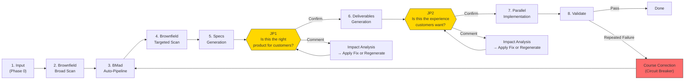

# BMAD Sprint Kit Blueprint

> bmad-sprint-kit aspires to be a tool that enables product experts — not developers —
> to turn their judgments into software outcomes directly, powered by AI.
> Users don't know code, but they know what customers want.
> They do only three things:
> decide what to build, check if the result is right, and say why it's not if it isn't.
> Everything else is handled by AI,
> with the goal of dramatically accelerating existing service development velocity.
>
> Core principle: **Human judgment is the only lasting asset. All AI outputs are regenerable consumables.**
>
> Quality bar: **"A non-developer can recreate this service with AI using only this document."**

---

## Overall Flow



---

## How to Read This Document

This document is organized as a **Follow-Along** walkthrough. Instead of describing the system abstractly, each step presents both **what the user sees** and **what happens inside the system**.

> **Example notation**: `tutor-exclusion` (tutor exclusion feature) is a real example project available at `specs/test-tutor-excl/`.

| Section | Content |
|---------|---------|
| **S1 Problem** | Why this product exists |
| **S2 Thesis** | Core principle + design judgments + preconditions |
| **S3 User Model** | Who uses it and what role they play |
| **S4 Value Chain** | System components + pipeline walkthrough + route selection + cost |
| **S5 Judgment & Feedback** | 2-JP model + judgment details + feedback handling |
| **S6 Constraints & Trade-offs** | What it doesn't do + conscious trade-offs |
| **S7 Risk Model** | Assumptions + what breaks + detection signals |
| **S8 Current State** | Current status + unvalidated hypotheses + known gaps |
| **Appendix** | Setup/operations, file structure, glossary |

---

# 1. Problem

In software development, **"the person who can decide ≠ the person who can build"** is the biggest bottleneck. The person who best knows what customers want (product expert) doesn't know code, and the person who can write code (developer) doesn't directly know the customer.

Existing methodologies address this gap differently:

```
Waterfall:  Define everything upfront → implement at once (ideal)
            Gaps found → high cost to go back (reality)

Agile:      Incremental improvement through iterations (solution)
            But each iteration incurs implementation cost; product experts still depend on developers

AI era:     AI generates quickly → human judges → regenerate (new possibility)
            Regeneration cost ≠ 0, judgment also takes time (reality)
```

Sprint Kit addresses this bottleneck from two directions:
1. **Raise first-generation quality through upfront input** to reduce iteration count
2. **Only use human time at customer-perspective judgment points**

AI can code quickly. But human time is consumed in the loop of requirements → design → verification → revision. Sprint Kit maximizes this loop's efficiency, enabling product experts to turn their judgments into software without developers.

---

# 2. Thesis

## 2.1 Core Principle

**Human judgment is the only lasting asset. All AI outputs are regenerable consumables.**

This is Sprint Kit's sole principle. Every other design judgment exists to realize it.

## 2.2 Design Judgments

Design judgments Sprint Kit has made to realize the core principle.

> Philosophical background and discussion for each judgment: [`docs/judgment-driven-development.md`](judgment-driven-development.md)

### Artifacts as Medium

> The most accurate and fastest input comes from reactions to concrete artifacts, not from abstract questions.

People answer imprecisely to "what matters in the search feature?" but respond accurately to "is this search screen right?"

**Sprint Kit implementation — 2-JP model**: Judgment is requested at exactly 2 points in the process. JP1 presents the PRD + requirements as a **customer journey narrative** for judgment. JP2 provides a **working prototype** for hands-on judgment. Both points request judgment only on top of concrete artifacts.

### Input Reduces Cycles

> Upfront input (meeting notes, references, existing system context) raises first-generation quality, reducing regeneration count.

```
Total cost = (upfront input cost) + (generation cost × generation count) + (judgment cost × judgment count)

Rich upfront input:    generation count ↓, judgment count ↓  → total cost ↓
No upfront input:      generation count ↑, judgment count ↑  → total cost ↑
```

**Sprint Kit implementation — inputs/ directory + Brownfield Scanner**: Place meeting notes and references in `specs/{feature}/inputs/`. Brownfield Scanner automatically collects existing system context from MCP + local codebase. If you have the product team's kickoff meeting notes, simply placing them in inputs/ significantly improves the AI's first PRD generation quality.

### Regeneration Over Modification

> All AI outputs are consumables. Regeneration, not modification, is the default. Human judgment alone is the lasting asset; everything else is regenerable.

```
AI-era regeneration approach:
Document v1 → feedback → entirely new v2 reflecting feedback → feedback → v3
Advantage: consistent results each time
Prerequisite: human judgment (feedback) accumulates and feeds into the next generation
```

**Sprint Kit implementation — Comment handling flow + Circuit Breaker**: When Comment is given at a JP, the system presents **apply-fix+propagate** (small-scale) or **regenerate** (large-scale) with cost estimates. The user chooses based on cost. Apply-fix is also validated by Scope Gate for consistency. Circuit Breaker is a normal mechanism that expands regeneration scope to the entire Sprint on repeated failures.

### Customer-Lens Judgment Points

> Human intervention points are placed at "moments when the product expert can judge what product will be served to customers."

**Sprint Kit implementation — JP1 + JP2**:
- JP1 "Is this the right product for customers?" — presents requirements, scenarios, feature scope as customer journey narrative
- JP2 "Is this the experience customers want?" — hands-on experience with working prototype + key scenario guide
- Response: **Confirm** (proceed) / **Comment** (impact analysis → apply-fix or regenerate with cost estimates → user chooses)

### Knowledge Shape Determines Route

> The route depends on the shape of the person's knowledge.

| Knowledge Shape | Suitable Route | Entry Point |
|----------------|---------------|-------------|
| Rich unstructured context (meeting notes, data) | **Sprint** — AI organizes, I judge | `/sprint` |
| Unexplored territory (new market, new problem) | **Guided** — discover and define with AI | BMad 12-step |
| Already-structured artifacts (existing PRD) | **Direct** — execute immediately | `/specs` |

**Sprint Kit implementation — 3 routes**: All three routes converge into the same pipeline (`[Specs] → JP1 → [Deliverables] → JP2 → [Execute]`). Routes are not fixed; they can be switched as needed (crossover).

### Auto-Context, Human-Judgment

> Technical context collection is performed automatically by AI. Humans are presented with customer-impact translations for judgment only.

```
AI collects:                                Presented to human:
"Existing API /api/v1/tutors has            "The existing 'Tutor Management' feature
 GET, POST, DELETE endpoints.                will be affected. A new 'Block' button
 blockTutor method not implemented           will be added to the current tutor list
 in TutorService class.                      screen, changing the existing user
 tutor_block_list table missing in DB"       experience. Do you approve?"
```

**Sprint Kit implementation — Brownfield auto-collection + customer-impact translation**: Brownfield Scanner auto-collects from MCP, document-project, and local codebase. Data is organized in brownfield-context.md in layers: L1 (Domain) → L2 (Behavior) → L3 (Component) → L4 (Code). At JP1/JP2, technical data is **translated into customer impact** for presentation.

## 2.3 Preconditions

The core principle holds only if the following are true:

1. **AI generation quality is "review-worthy"** — AI-generated PRDs, designs, and prototypes must be at a level where experts can meaningfully judge them. Not "roughly correct" but "worth reviewing."
2. **Product experts can make customer-perspective judgments** — Users understand customers well enough to judge the fitness of outputs.
3. **Upfront input actually improves AI generation quality** — Meeting notes, references, and existing system context make a meaningful difference in AI's first generation.

## 2.4 When the Principle Fails

- **If human judgments don't accumulate**: If feedback isn't reflected in the next regeneration and the same quality output keeps appearing, the system enters an infinite regeneration loop.
- **If AI output regeneration cost becomes prohibitive**: If a single cycle takes hours, "treating as consumables" becomes impossible and the system regresses to patch-based modification.
- **If product expert's judgments are inaccurate**: If someone with poor customer understanding makes judgments, no matter how fast AI regenerates, convergence toward the right direction won't happen.

---

# 3. User Model

## 3.1 Product Expert

Sprint Kit's target user is the **product expert**. ~~Not "non-developer" as the opposite of developer~~, but **someone who is an expert on customers and can best judge what outcomes should look like**.

Real user examples:
- A PM starts a Sprint with kickoff meeting notes
- A founder explores a new product idea through the Guided route
- A designer runs a Sprint based on Figma mockups
- A person with an existing PRD executes directly via the Direct route

## 3.2 What Humans Do — 3 Roles

| Role | Action | When |
|------|--------|------|
| **Decide** | Determine what to build (provide Brief, materials, references) | Before Sprint start |
| **Judge** | Judge whether the output is right (Confirm / Comment) | JP1, JP2 |
| **Feedback** | Say why it's not right (enter correction direction as free text) | On JP Comment |

## 3.3 What the System Does — 4 Roles

| Role | Action | Design Judgment Rationale |
|------|--------|--------------------------|
| **Collect** | Auto-collect existing system context + translate to customer impact | Auto-Context, Human-Judgment |
| **Generate** | Auto-generate planning artifacts, design, prototype | Input Reduces Cycles |
| **Present** | Request judgment on top of concrete artifacts | Artifacts as Medium |
| **Regenerate** | Apply fix or regenerate based on feedback | Regeneration Over Modification |

---

# 4. Value Chain

## 4.1 System Components

### Tool Stack

| Tool | Role |
|------|------|
| **BMad Method** | Base platform: agents, workflow engine, facilitation (`_bmad/`) |
| **Sprint Kit** | BMad execution extension: auto-pipeline, Specs, Deliverables, Prototype |
| **Claude Code** | AI IDE — agent execution environment |
| **Claude Code Native Teams** | Agent coordination, task dependency tracking |
| **MCP Servers** | External data access (backend-docs, client-docs, svc-map, figma) |
| **Git Worktree** | Conflict-free parallel implementation environment |
| **GitHub CLI (`gh`)** | Issue/PR management, task tracking |
| **Specmatic** | OpenAPI contract-based automated testing (Worker self-verification) |
| **MSW (Mock Service Worker)** | Prototype stateful API (network interception via browser Service Worker) |
| **@redocly/cli** | OpenAPI spec lint (syntax/structure + example ↔ schema conformance) |
| **npx bmad-sprint-kit** | Sprint Kit install/update CLI |

### Agent 3-Tier Architecture

Sprint Kit uses agents in three tiers.

**BMad Agents** — Planning artifact generation (provided by BMad Method, AI role-play):

| Agent | Role | Input → Output | Sprint Invocation |
|-------|------|----------------|-------------------|
| **Mary** (Analyst) | Brainstorming, research | sprint-input.md → product-brief.md | Auto-Pipeline Step 1 |
| **John** (PM) | Requirements definition | product-brief + sprint-input → prd.md | Auto-Pipeline Step 2 |
| **Winston** (Architect) | Technical design | prd + brownfield-context → architecture.md | Auto-Pipeline Step 3 |
| **John** (PM) | Epics & Stories | prd + architecture → epics-and-stories.md | Auto-Pipeline Step 4 |
| **Sally** (UX Designer) | UX/UI design | — | Guided route |
| **Bob** (Scrum Master) | Sprint Planning | — | Guided route |
| **Murat** (Test Architect) | Test design | — | Guided route |
| **Paige** (Tech Writer) | Documentation | — | Guided route |
| **Barry** (Quick Flow Solo Dev) | Small tasks | — | Quick Flow |

**Sprint Agents** — Auto-pipeline orchestration (added by Sprint Kit):

| Agent | Role | Input → Output | When |
|-------|------|----------------|------|
| **@auto-sprint** | Sprint orchestration + Conductor 4 roles (Goal Tracking, Scope Gate, Budget, Redirect) | sprint-input.md → all planning-artifacts/ | Entire Sprint |
| **@scope-gate** | 3-stage validation: Structured Probe + Checklist + Holistic Review | Previous artifact + goals → Pass/Fail + gap report | After each BMad step + after deliverables |
| **@brownfield-scanner** | Brownfield data collection from MCP + local codebase (L1~L4) | MCP + local code → brownfield-context.md | Pass 1 (broad) + Pass 2 (targeted) |
| **@deliverable-generator** | Full-stack deliverable generation | planning-artifacts/ → Specs + Deliverables + MSW Mocks + readiness.md + Prototype | Specs/Deliverables stage |

**Execute Agents** — Implementation + verification:

| Agent | Role | Input → Output | When |
|-------|------|----------------|------|
| **@worker** | Task implementation in isolated worktree + Specmatic self-verification | Task + Specs + brownfield → implementation code | Parallel |
| **@judge-quality** | Code structure, patterns, duplication, conventions + Specmatic contract compliance | Implementation code + Specs → Pass/Fail + issue list | Validate Phase 1 |
| **@judge-security** | OWASP Top 10, injection, auth bypass verification | Implementation code → Pass/Fail + vulnerability list | Validate Phase 2 |
| **@judge-business** | Implementation verification against PRD acceptance criteria | Implementation code + PRD → Pass/Fail + unmet FR list | Validate Phase 3 |

### Brownfield Data Sources

Three sources for collecting existing system context and their availability by topology.

| Source | Description | Collection Method |
|--------|-------------|-------------------|
| **document-project** | Structured docs generated by BMad `/document-project` workflow | Direct file read |
| **MCP Servers** (4 types) | backend-docs, client-docs, svc-map, figma | MCP protocol |
| **Local codebase** | Source code in the same repository | Glob, Grep, Read |

**Topology-Source Availability Matrix**:

| Topology | document-project | MCP | Local code | Notes |
|----------|-----------------|-----|------------|-------|
| **standalone** | N/A | Available | N/A | Greenfield or external system |
| **co-located** | Available | Available | Available | Monolithic, code is local |
| **msa** | Available | Available | Partial | Microservices, only some local |
| **monorepo** | Available | Available | Available | Monorepo, all code local |

Greenfield projects work without any Brownfield sources.

### Brownfield Context Generation

brownfield-context.md organizes existing system context in L1~L4 layers. Sprint references this file to design APIs that don't duplicate existing ones and build features that don't break existing screen flows.

**Auto-generation (Sprint route)**: @brownfield-scanner generates it automatically when `/sprint` is run.

1. Phase 0 determines topology — detects document-project availability, MCP connection status, build tools to determine project type (`standalone` / `co-located` / `msa` / `monorepo`).
2. Pass 1 (Broad Scan) collects domain concepts (L1) and behavior patterns (L2) based on Brief keywords.
3. Pass 2 (Targeted Scan) collects integration points (L3) and code-level details (L4) after Architecture/Epics completion.

Results are written to `specs/{feature}/planning-artifacts/brownfield-context.md`. Detailed per-pass behavior is described in S4.2 Pipeline below.

**Pre-preparation — document-project (recommended)**: Running the BMad `/document-project` workflow before Sprint improves Brownfield scan quality. This workflow analyzes the existing codebase and generates structured documents (project overview, API contracts, data models, etc.). Sprint's Brownfield Scanner uses these as seed data, narrowing MCP/local scan scope and reducing gaps.

**Manual preparation (without MCP)**: When MCP servers cannot be configured, you can write brownfield-context.md manually and place it at `specs/{feature}/brownfield-context.md` or `specs/{feature}/planning-artifacts/brownfield-context.md`. Sprint detects existing files and reuses covered levels without re-scanning. The format is defined in `_bmad/docs/brownfield-context-format.md`.

**Greenfield**: No preparation needed for new projects without existing systems. Auto-detected in Phase 0; Brownfield scan is skipped.

---

## 4.2 Pipeline

> Follows the Sprint route (`/sprint` command) for the full process walkthrough. Guided/Direct route differences are covered in S4.3.

### Phase 0: Sprint Onboarding (Smart Launcher)

**Rationale**: Input Reduces Cycles — input quality determines the regeneration count of the entire downstream pipeline.

**User perspective**: Two ways to start.

```bash
# Method 1: Inline Brief
/sprint "A feature that lets students block specific tutors after lessons"

# Method 2: feature-name (after placing materials in inputs/ directory)
/sprint tutor-exclusion
```

For Method 2, place materials in `specs/tutor-exclusion/inputs/`. **brief.md is not required** — even with just meeting notes or references, AI auto-generates the Brief.

**System internals**:

Entry point branching:

| Input Form | Behavior |
|-----------|----------|
| Inline Brief (`"..."`) | Auto-creates `specs/{slug}/inputs/brief.md` → analysis |
| feature-name | **Full scan** of `specs/{name}/` → input state assessment → optimal route branching |

Full scan (feature-name entry): Scans `specs/{feature}/` at once to detect inputs/ file list, brownfield-context.md existence + levels, planning-artifacts/ completeness, and BMad outputs (`_bmad-output/`).

| Input State | Route |
|------------|-------|
| brief.md + references | **Normal Sprint** |
| References only (no brief.md) | **AI auto-generates Brief** → Normal Sprint |
| Planning artifacts complete | **Direct route suggested** (`/specs` guidance) |
| No input | **Error** (material placement guidance) |

Subsequent system processing:
- Brief parsing + Reference Materials analysis (under 200 lines: full inclusion / over: summarized)
- Brief Sentences extraction: sentence-level decomposition + BRIEF-N ID assignment → used for source tagging on each PRD FR
- Causal Chain extraction (optional, opt-in): Phenomenon → Root Cause → Solution Rationale → Feature Request
- Brownfield status detection: check existing brownfield-context.md → search for document-project → MCP connection test → local codebase build tool detection → topology determination

Brief grade assessment:

| Grade | Condition | Behavior |
|-------|-----------|----------|
| **A** (sufficient) | 3+ features, 1+ scenarios, or references compensate | Normal proceed |
| **B** (moderate) | 1-2 features, no scenarios | Show warning at confirmation |
| **C** (insufficient) | 0 features, keywords only | Sprint not recommended + `force_jp1_review: true` |

**User perspective — Confirmation screen**: Presents scan result summary (inputs/ file list, brownfield status, planning-artifacts status) + Sprint start confirmation (extracted goals, complexity, estimated time, contradiction warnings).

**Artifact**: `specs/{feature}/inputs/sprint-input.md` — Phase 0's SSOT. All downstream agents reference this file.

**On failure**: Fallback 1 (full analysis success) → Fallback 2 (only brief.md analyzable) → Fallback 3 (inline Brief only) → Fallback 4 (no input, Sprint aborted).

---

### Pass 1: Brownfield Broad Scan

**Rationale**: Auto-Context, Human-Judgment — AI auto-collects existing system context; humans are asked for judgment only.

**User perspective**: Automatic. No user intervention.

**System internals**: If existing brownfield-context.md found, check L1+L2 levels and reuse; supplement missing levels only. If absent, @brownfield-scanner runs in broad mode.

- Stage 0: Consume document-project outputs (if available, build initial context)
- Stage 1-4: Collect L1 (Domain) + L2 (Behavior) via MCP + local scan

**Artifact**: `specs/{feature}/planning-artifacts/brownfield-context.md` (L1 + L2)

**On failure**: MCP connection failure → record `brownfield_status: partial-failure` + proceed with available sources only. Greenfield → skip.

---

### BMad Auto-Pipeline

**Rationale**: Input Reduces Cycles — rich input + Brownfield context raises BMad agents' first-generation quality.

**User perspective**: Automatic. @auto-sprint Conductor calls BMad agents sequentially.

**System internals**:

Conductor (@auto-sprint) 4 roles:
1. **Goal Tracking** — progress tracking against sprint-input.md goals
2. **Scope Gate** — invoke @scope-gate after each step, detect scope drift
3. **Budget** — soft gate, prevent excessive regeneration
4. **Redirect** — scope reduction/redirection on drift detection

Context Passing principle: **Only file paths are passed** between agents. Artifact contents are never sent via messages.

| Step | Agent | Input | Output | Validation |
|------|-------|-------|--------|------------|
| 1 | Mary → Product Brief (AUTO) | sprint-input.md | product-brief.md | — |
| 2 | John → PRD (AUTO) | product-brief + sprint-input | prd.md | @scope-gate |
| 3 | Winston → Architecture (AUTO) | prd + brownfield-context | architecture.md | @scope-gate |
| 4 | John → Epics & Stories (AUTO) | prd + architecture | epics-and-stories.md | @scope-gate final |

Each PRD FR is tagged with `(source: BRIEF-N / DISC-N / AI-inferred)`. Follows `_bmad/docs/prd-format-guide.md` format.

**Artifacts**:
```
specs/{feature}/planning-artifacts/
├── product-brief.md
├── prd.md
├── architecture.md
└── epics-and-stories.md
```

**On failure**: Budget Control (warn when same artifact regeneration exceeds soft limit), Redirect (scope reduction or Sprint abort on severe Scope Gate drift).

---

### Pass 2: Brownfield Targeted Scan

**Rationale**: Auto-Context, Human-Judgment — precision scan of specific impact areas based on Architecture + Epics.

**User perspective**: Automatic. No user intervention.

**System internals**: @brownfield-scanner runs in targeted mode. L3 (Component): affected components, services, modules. L4 (Code): specific code locations, interfaces, dependencies.

**Artifact**: `specs/{feature}/planning-artifacts/brownfield-context.md` (L1 + L2 + L3 + L4 append)

---

### Specs Generation

**Rationale**: Regeneration Over Modification — Specs are the execution stage's SSOT and regenerable consumables.

**User perspective**: Automatic. No user intervention.

**System internals**: @deliverable-generator runs in specs-only mode.

- **Stage 1: Entity Dictionary generation** — extract core entities from PRD + Architecture, define terms, relationships, constraints
- **Stage 2: Specs 4-file generation**:
  - `requirements.md` — PRD → structured requirements (each item with source tagging)
  - `design.md` — Architecture → structured design (components, interfaces)
  - `tasks.md` — Epics → parallelizable task list (Entropy Tolerance + file ownership assignment)
  - `brownfield-context.md` (frozen) — frozen snapshot copied from planning-artifacts/ (referenced by Workers)

SSOT reference priority: `api-spec.yaml` > `design.md` API section / `schema.dbml` > `design.md` data model section.

@scope-gate deliverables: API Data Sufficiency verification — checks whether subsequent API request fields are obtainable from preceding API responses in key-flows.md call sequences.

**Artifacts**:
```
specs/{feature}/
├── entity-dictionary.md
├── requirements.md
├── design.md
├── tasks.md
└── brownfield-context.md  (frozen snapshot)
```

---

### JP1: "Is this the right product for customers?"

**Rationale**: Customer-Lens Judgment Points + Artifacts as Medium — customer-perspective judgment on top of concrete artifacts (customer journey narrative).

**User perspective**: System presents a Visual Summary. User responds with Confirm / Comment.

JP1 presentation format and Comment handling flow details in S5.2.

---

### Deliverables Generation

**Rationale**: Artifacts as Medium — generate concrete artifacts (working prototype) for judgment at JP2.

**User perspective**: Automatic. System generates all deliverables after JP1 approval.

**System internals**: @deliverable-generator runs in full mode.

| Deliverable | File | Role |
|-------------|------|------|
| OpenAPI 3.1 YAML | `api-spec.yaml` | API contract — shared by MSW Mock + Specmatic contract tests |
| API Sequences | `api-sequences.md` | Mermaid sequence diagrams |
| DBML Schema | `schema.dbml` | Database design |
| BDD/Gherkin | `bdd-scenarios/` | Given-When-Then acceptance tests |
| State Machines | `state-machines/` | XState definitions (only when applicable) |
| Decision Log | `decision-log.md` | ADR + AI reasoning trace |
| Traceability Matrix | `traceability-matrix.md` | FR → Design → Task → BDD → API mapping |
| Key Flows | `key-flows.md` | Key user flow Step-by-Step (for JP2 verification) |
| MSW Mocks | `preview/src/mocks/` | MSW handlers (browser.ts, handlers.ts, store.ts, seed.ts) |
| Prototype | `preview/` | React + MSW stateful prototype |

---

### JP2: "Is this the experience customers want?"

**Rationale**: Customer-Lens Judgment Points + Artifacts as Medium — judgment through **hands-on experience with a working prototype**.

**User perspective**: Run the prototype (`cd specs/{feature}/preview && npm run dev`), follow the key scenario guide, and click through to judge.

JP2 presentation format and Comment handling flow details in S5.3.

---

### Parallel Implementation

**User perspective**: Automatic. Progress can be monitored.

**System internals**:

1. **Interface Contract creation** — shared types/interface files created before PARALLEL starts
2. **GitHub Issues creation** — `gh issue create` for each task as an Issue (dependencies, file ownership, Entropy)
3. **Git Worktree setup** — independent worktree per Worker, file conflicts eliminated at the source
4. **Native Teams @worker creation** — Workers created in parallel via Claude Code Task tool
5. **Parallel execution** — each Worker implements tasks independently, self-verifies API contracts via Specmatic, on completion: TaskUpdate + `gh issue close` + SendMessage
6. **Merge & Integration** — merge worktrees in dependency order + integration test

File ownership: `tasks.md` specifies owned files per task. Workers modify only assigned files. When shared file modification is needed, request through team leader.

**On failure**: Worker Failure Protocol — auto-retry on first failure (max 2 times) → report to team leader on retry failure → partial merge option.

---

### Validate

**User perspective**: Automatic. 3-Phase verification results are reported.

**System internals**:
- **Phase 1: @judge-quality** — code structure, patterns, duplication, conventions + Specmatic contract compliance
- **Phase 2: @judge-security** — OWASP Top 10, injection, auth bypass
- **Phase 3: @judge-business** — implementation verification against PRD acceptance criteria; (when causal_chain provided) confirms core FRs actually resolve root_cause

**On failure**: 3 consecutive failures in same category or 5 cumulative failures → Circuit Breaker auto-triggers.

---

### Course Correction (Circuit Breaker)

**Rationale**: Regeneration Over Modification — repeated failure is a normal trigger to expand regeneration scope.

**User perspective**: System suggests course correction. Can also be triggered manually via `/circuit-breaker`.

**Trigger**: 3 consecutive VALIDATE failures in same category / 5 cumulative failures / Comment regeneration scope expands to entire Sprint.

| Severity | Response |
|----------|----------|
| **Minor** | Fix Specs → re-run Execute |
| **Major** | Regenerate from BMad Auto-Pipeline (@auto-sprint Phase 1 re-run) |
| **Guided/Direct route** | BMad `correct-course` workflow integration |

---

## 4.3 Route Selection

**Rationale**: Knowledge Shape Determines Route — the entry point varies based on the user's knowledge shape.

All routes converge into the same pipeline:

```
[Input + Brownfield + BMad] → [Specs] → JP1 → [Deliverables] → JP2 → [Execute]
```

### Sprint Route — When You Have Materials

> **"AI organizes, I judge."**

**Entry point**: `/sprint "Brief"` or `/sprint feature-name`

For when you have meeting notes, references, a quick Brief, or other unstructured context. AI auto-generates all planning artifacts; the product expert judges at JP1/JP2.

```
Place materials in specs/{feature}/inputs/ → /sprint {feature-name}
  Phase 0: Smart Launcher → sprint-input.md generation
  → @auto-sprint (automatic)
  Pass 1 → BMad Auto-Pipeline → Pass 2 → Specs
  → JP1 → Deliverables → JP2
  → /parallel → /validate
```

Characteristics: Fully automatic (human intervention only at JP1/JP2), `tracking_source: brief` (BRIEF-N based tracking).

### Guided Route — When Exploration is Needed

> **"Discover and define together with AI."**

**Entry point**: BMad 12-step conversation

For new products, new markets, or idea-stage exploration requiring systematic discovery.

```
/create-product-brief → /create-prd → /create-architecture → /create-epics
→ /specs → JP1 → /preview → JP2
→ /parallel → /validate
```

Characteristics: Human participates at every step during BMad conversation, `/specs` auto-detects `_bmad-output/planning-artifacts/`, `tracking_source: success-criteria`.

### Direct Route — When Planning is Complete

> **"Execute immediately."**

**Entry point**: `/specs feature-name` (with complete planning-artifacts)

```
/specs → JP1 → /preview → JP2
→ /parallel → /validate
```

Characteristics: Phase 0 bypassed, `/specs` auto-detects planning-artifacts path.

### Quick Flow (Small Tasks)

Existing BMad workflow. Suitable for bug fixes and small changes. A separate lightweight path that does not go through the Sprint pipeline.

```
/quick-spec → /dev-story → /code-review
```

### Crossover

Routes are not fixed. Context-dependent switching is possible:

| Situation | Switch |
|-----------|--------|
| Have materials but need deep exploration | Use materials as reference input in **Guided** route |
| No materials, just want a quick prototype | Start **Sprint** with a one-line Brief |
| BMad 12-step complete, ready to execute | Same as **Direct** (`/specs` auto-recognizes BMad artifacts) |

All route artifacts use the same BMad format (YAML frontmatter + workflow sections). Sprint Kit artifacts are directly recognized by BMad workflows, and vice versa.

---

## 4.4 Cost Structure

### Cost Formula

```
Total cost = (upfront input cost) + (generation cost × generation count) + (judgment cost × judgment count)
```

The richer the upfront input, the lower the generation and judgment counts. Upfront input has the highest return on investment.

### Comparison with Real Product Team Workflow

```
Real product team                           With Sprint Kit
──────────────────────────────────────────────────────────
1. Kickoff meeting (2 hours)               → Save meeting notes to inputs/ (~0 min)
2. Someone writes PRD draft (1 day)        → AI generates PRD (~5 min)
3. PRD review meeting (1 hour)             → JP1: Judge PRD (~10 min)
4. PRD revision (half day)                 → Regenerate if needed (~3 min)
5. Design → prototype (1 week)            → AI generates prototype (~10 min)
6. Prototype review (1 hour)               → JP2: Judge prototype (~15 min)
7. Revision → final approval (days)        → Regenerate if needed (~10 min)

Human time: ~25 min (previously: 4.5 hours + days of waiting)
```

What AI replaces: structuring, writing, implementation (tasks humans are relatively slow at)
What humans retain: providing context, judgment, direction decisions (tasks humans are far more accurate at)

---

# 5. Judgment & Feedback

## 5.1 2-JP Model

Ideally, after Brief input, the user would go straight to the prototype (JP2) and judge only the final output. However, at current AI speeds, reaching JP2 in one go takes tens of minutes, so JP1 is placed in between to confirm requirements direction first.

**JP2 is the essential judgment point; JP1 is a practical supplement for current technology limitations.** When AI becomes fast enough, Brief → JP2 direct path becomes possible. The principle isn't changed — only supplemented.

## 5.2 JP1: "Is this the right product for customers?"

### What is Judged

Requirements, user scenarios, feature scope, priorities.

### Presentation Format — 4-Section Visual Summary

**Section 1: Customer Journey Narrative**
- "When a customer is in situation A and tries to do B, the system provides C"
- Key scenarios described in non-technical language

**Section 2: Original Intent ↔ FR Mapping Table**
- If tracking_source is `brief`: Brief sentences (BRIEF-N) ↔ FR mapping
- If tracking_source is `success-criteria`: PRD Success Criteria ↔ FR mapping
- Unmapped items shown as warnings
- Items beyond Brief separated as "found in references" vs "AI-inferred"

**Section 3: Structural Checklist**
- Compressed checklist of what the BMad 12-step aims to discover:
  - Are all key user types included?
  - Have edge case scenarios been considered?
  - Is the relationship with existing features clear?
  - Are success metrics measurable?

**Section 4: Existing System Impact**
- Brownfield side-effects **translated into customer impact**
- "A 'Block' button will be added to the existing tutor list screen" (no technical jargon)

**[Advanced] Layer 3 Details** (collapsible):
- Causal Chain Alignment + FR Linkage (when causal_chain provided)
- Brownfield technical data
- Scope Gate detailed results

### Response

| Response | Action |
|----------|--------|
| **Confirm** | Proceed to Deliverables generation (JP2) |
| **Comment** | Execute Comment handling flow (S5.4) |

## 5.3 JP2: "Is this the experience customers want?"

### What is Judged

Prototype, screen flows, interactions.

### Presentation Format

1. Run prototype: `cd specs/{feature}/preview && npm run dev`
2. Follow key scenario guide (based on key-flows.md) and click through
3. Debug/reset state with DevPanel (MSW in-memory store based)

MSW Service Worker intercepts API requests at network level based on `api-spec.yaml`, providing stateful responses. The React SPA calls APIs with the same code as the real service (unaware of MSW's existence).

Changes/supplements after JP1 are recorded in readiness.md's `jp1_to_jp2_changes` field and auto-displayed in JP2 Section 0.

### Response

| Response | Action |
|----------|--------|
| **Confirm** | Proceed to Parallel (implementation) |
| **Comment** | Execute Comment handling flow (S5.4) |

## 5.4 Comment Handling Flow

When Comment is selected at a JP, the handling approach is dynamically determined based on feedback scope. This flow applies equally to Party Mode discoveries, Advanced Elicitation results, and direct feedback.

1. **Feedback input**: User enters correction direction as free text
2. **Impact analysis**: System analyzes feedback impact scope and produces:
   - If applying fix: target file list (upstream + downstream) + estimated time
   - If regenerating: restart Phase + estimated time
3. **Options presented**: Two options with cost estimates:
   - **[M] Apply fix + propagate**: Direct modification within existing artifacts + bidirectional propagation to dependent files (N files, ~M min) + Scope Gate verification
   - **[R] Regenerate**: Re-run pipeline from the relevant Phase (~M min)
4. **User chooses**: User selects based on cost
5. **Execute + verify**:
   - Apply fix selected: modify all files → Scope Gate verification → return to JP on PASS
   - Regenerate selected: re-run pipeline from the relevant Phase → includes Scope Gate → return to JP
6. **Feedback record**: Log feedback content + chosen approach + result in `planning-artifacts/feedback-log.md`

Regeneration scope reference table:

| Feedback Scale | JP1 Regeneration Scope | JP2 Regeneration Scope |
|---------------|----------------------|----------------------|
| Direction change (building something different entirely) | Abort Sprint → edit brief.md → restart | Phase 1 from start (from PRD, re-pass JP1) |
| Scope/UX change | From PRD | From PRD (re-pass JP1) |
| Technical/design change | From Architecture | From relevant BMad step (re-pass JP1) |
| Task structure change | Regenerate Specs | Regenerate Deliverables only |
| Spec/prototype adjustment | N/A | Regenerate Deliverables only |

## 5.5 Reverse Loop

When JP2 reveals "the requirements themselves were wrong," the Comment **regeneration option** scope naturally extends to Phases before JP1. This is not a failure but a **normal discovery process catalyzed by concrete artifacts**.

```
JP1 ──→ JP2 ──→ Done
 ↑        │
 └────────┘  "Looking at the prototype, the requirements were wrong"
             → Comment → regeneration scope extends to PRD
```

This is the realization of Artifacts as Medium — the requirements error would not have been discovered without the concrete artifact of a prototype.

---

# 6. Constraints & Trade-offs

## 6.1 Boundaries — What It Doesn't Do

- **Sprint Kit is not a separate system** — it is an extension of BMad Method. No "bridge between two systems" concept is needed. The connection point is the file format contract (planning-artifacts/ directory).
- **Does not ask users for technical decisions** — API design, DB schema, component structure are decided by the system. Users are presented with customer-impact translations for judgment only.
- **Does not manage the development process** — Sprint Kit does not handle code review, deployment pipelines, or monitoring. Its responsibility ends at implementation completion.

## 6.2 Trade-offs

| Choice | Cost | Rationale |
|--------|------|-----------|
| Regeneration default, modification as supplement | Regeneration suggested even for small changes (potential inefficiency) | Regeneration Over Modification — apply-fix is supplemented by Scope Gate verification |
| JPs limited to 2 | Mid-stage issues only discovered at JP | Customer-Lens Judgment Points — JP1 can be removed when AI speed improves |
| Fully automatic pipeline | No mid-process intervention (Sprint route) | Input Reduces Cycles — supplemented by upfront input quality |
| BMad artifact format dependency | Compatibility issues on BMad version changes | Extension model — BMad is the base platform |

## 6.3 Left Open

- **Persistent Memory**: Environment facts already covered by brownfield-context.md. Judgment correction (applying previous Sprint results to next) has self-reinforcing error risk → deferred.
- **Teams Debate**: Quality improvement through inter-agent debate beyond 3-Judge verification → evaluate after current `/validate` 3-Judge validation.
- **Sprint Kit → BMad Phase 4 auto-transition**: planning-artifacts are compatible, but tasks.md-specific info (DAG, Entropy, File Ownership) requires manual transfer.

---

# 7. Risk Model

| Assumption | If Broken | Detection Signal |
|-----------|-----------|-----------------|
| AI generation quality is "review-worthy" | Massive revisions needed at every JP → regeneration loop | JP1/JP2 Comment rate > 70% |
| Regeneration cost is manageable (5-15 min/cycle) | "Consumable treatment" impossible → regression to patch-based modification | Single cycle duration > 30 min |
| Upfront input improves first-generation quality | Same quality regardless of input → inputs/ becomes meaningless | No difference in JP1 Comment rate between Grade A vs Grade C Briefs |
| Product expert knows customers well | Judgments diverge from customer reality → right product doesn't emerge | Low usage rate post-launch |
| MCP servers operate reliably | Brownfield scan failures → existing system context gaps | `brownfield_status: partial-failure` frequency |
| Prototype fidelity is sufficient for judgment | JP2 judgment impossible → "it'll probably be different in reality" | JP2 Comment "can't judge from prototype" |

---

# 8. Current State

## 8.1 Current Version

**v0.3.1** (2026-02-18)

Key changes:
- Blueprint rewritten to generic 8-Section structure + new Blueprint Format Guide
- MSW Mock Layer fully replaces Prism (stateful prototype)
- Comment handling flow introduced (impact analysis → cost-based apply-fix/regenerate selection)
- API Data Sufficiency verification (Scope Gate deliverables stage)
- SSOT Reference Priority rules specified
- JP feedback model simplified (3-choice → 2-choice: Confirm/Comment)

> Full change history: `CHANGELOG.md`

## 8.2 Pipeline Verification Status

| Segment | Status | Notes |
|---------|--------|-------|
| Phase 0 → JP1 (planning) | Implemented, partially verified | Developer simulation confirmed |
| JP1 → JP2 (Deliverables + prototype) | Implemented, partially verified | Developer simulation confirmed |
| Post-JP2 (Parallel + Validate + Circuit Breaker) | **Implemented, unverified** | No actual execution test performed |

## 8.3 Unvalidated Hypotheses

- **Sprint has never been run with an actual product team** — all tests are developer simulations
- **MCP-based scan has never been run on an actual Brownfield project** — Brownfield Scanner L3/L4 quality unverified
- **Whether prototype fidelity is sufficient for judgment is unverified** — whether MSW stateful mocks are adequate for real judgment
- **Cost formula coefficients are uncalibrated** — relative magnitudes of upfront input cost, generation cost, and judgment cost unmeasured
- **Post-JP2 pipeline (Parallel, Validate, Circuit Breaker) is unverified in practice** — agent definitions are complete but no end-to-end execution test

## 8.4 Known Gaps

- **Sprint Kit → BMad Phase 4 auto-transition unsupported**: tasks.md-specific info (DAG, Entropy, File Ownership) requires manual transfer
- **Multi-user unsupported**: Currently assumes a single product expert runs the entire Sprint
- **Persistent Memory not implemented**: No cross-Sprint judgment accumulation mechanism

---

# Appendix A: Setup & Operations

## Installation

Sprint Kit is installed/updated via the `npx bmad-sprint-kit` CLI.

| Command | Action |
|---------|--------|
| `npx bmad-sprint-kit init` | Interactive wizard: BMad detection → file installation → Hook setup |
| `npx bmad-sprint-kit update` | Update existing files (version comparison + diff display) |
| `npx bmad-sprint-kit compat-check` | BMad version compatibility check |

If BMad Method is not detected during installation, an error with guidance message is displayed.

**Installed files**:
- `.claude/agents/` — 8 Sprint agents
- `.claude/commands/` — 7 Sprint commands
- `.claude/rules/` — 3 Sprint rules (bmad-*.md)
- `.claude/hooks/` — 4 Hook scripts
- `.claude/settings.json` — Hook configuration
- `_bmad/docs/` — 5 format guides
- `preview-template/` — React + Vite + MSW prototype template

## Hook System

Sprint Kit provides 4 Hook scripts for runtime protection and user experience.

| Hook | Trigger | Role |
|------|---------|------|
| **desktop-notify.sh** | JP1/JP2 reached, Sprint complete, error | Desktop notification (macOS/Linux) |
| **protect-readonly-paths.sh** | File modification attempt | Protects read-only paths: `_bmad/`, `specs/*/inputs/`, etc. |
| **sprint-pre-compact.sh** | Before context window compaction | Saves Sprint state to sprint-log.md |
| **sprint-session-recovery.sh** | Session start | Restores previous state from sprint-log.md |

## Multi-IDE Compatibility

Sprint Kit's source definitions live in `.claude/`. Other AI IDEs are also supported.

| IDE | Support Method |
|-----|---------------|
| **Claude Code** | Default. No additional setup needed |
| **Codex CLI** | `--ide codex` option generates `codex-agents/`, `$sprint`, etc. |
| **Gemini Code Assist** | Auto-generates TOML wrappers in `.gemini/commands/` |

---

# Appendix B: File Structure

```
specs/{feature}/
├── inputs/                          # Phase 0 (user originals + Sprint Input SSOT, read-only)
│   ├── brief.md                     # User Brief (AI auto-generates if only references exist)
│   ├── *.md / *.pdf / ...           # Reference materials (optional)
│   └── sprint-input.md              # Phase 0 auto-generated SSOT
│
├── planning-artifacts/              # BMad Phase 1-3 artifacts (per-project storage)
│   ├── product-brief.md             # Product Brief
│   ├── prd.md                       # PRD
│   ├── architecture.md              # Architecture + ADR
│   ├── epics-and-stories.md         # Epics & Stories
│   ├── brownfield-context.md        # L1~L4 collection source (appended during work)
│   └── feedback-log.md              # Comment handling log (feedback + choice + result)
│
├── sprint-log.md                    # Sprint execution log (timeline + decisions + issues)
├── brownfield-context.md            # Frozen snapshot (L1~L4, Worker reference)
├── entity-dictionary.md             # Entity Dictionary
├── requirements.md                  # PRD → requirements
├── design.md                        # Architecture → design
├── tasks.md                         # Epics → parallel tasks + Entropy + File Ownership
│
├── api-spec.yaml                    # OpenAPI 3.1 (API contract — shared by MSW Mock + Specmatic)
├── api-sequences.md                 # Mermaid sequence diagrams
├── schema.dbml                      # Database schema (DBML)
├── bdd-scenarios/                   # Gherkin acceptance tests
├── state-machines/                  # XState definitions (only when applicable)
├── decision-log.md                  # ADRs + AI reasoning trace
├── traceability-matrix.md           # FR → Design → Task → BDD → API mapping
├── key-flows.md                     # Key user flow Step-by-Step (for JP2 verification)
├── readiness.md                     # JP1/JP2 Readiness data (includes jp1_to_jp2_changes)
└── preview/                         # React + MSW prototype (npm run dev)
    └── src/mocks/                   # MSW handlers (browser.ts, handlers.ts, store.ts, seed.ts)
```

---

# Appendix C: Glossary

| Term | Description |
|------|-------------|
| **JP (Judgment Point)** | Moment when the product expert makes a customer-perspective judgment. JP1 (requirements), JP2 (experience) |
| **tracking_source** | Brief tracking source. `brief` (BRIEF-N based) or `success-criteria` (PRD Success Criteria based) |
| **Brownfield** | An existing live service/system. The existing context that new features impact |
| **Greenfield** | A project starting fresh without existing systems |
| **Entropy** | Task uncertainty level (Low/Medium/High). Probability of unexpected issues during implementation |
| **BRIEF-N** | Brief sentence decomposition ID (BRIEF-1, BRIEF-2, ...). Used for FR source tracking |
| **DISC-N** | Discovered Requirement ID. Requirements found in references but absent from Brief |
| **Frozen snapshot** | A point-in-time copy of brownfield-context.md. Fixed version referenced by Workers |
| **Conductor** | @auto-sprint's orchestration role. 4 roles: Goal Tracking, Scope Gate, Budget, Redirect |
| **Circuit Breaker** | Course correction mechanism on repeated failures or expanded regeneration scope. Minor (fix Specs) / Major (regenerate) |
| **planning-artifacts** | Planning artifacts generated by BMad agents (Product Brief, PRD, Architecture, Epics) |
| **Sprint route** | When materials (meeting notes, references) are available. Enter via `/sprint` command |
| **Guided route** | When exploration is needed. Enter via BMad 12-step conversation |
| **Direct route** | When planning is complete. Enter directly via `/specs` command |
| **Quick Flow** | Lightweight pipeline for small tasks. `/quick-spec` → `/dev-story` → `/code-review` |
| **Specmatic** | OpenAPI contract-based automated testing tool. Used by Workers for self-verification |
| **MSW (Mock Service Worker)** | Browser Service Worker-based stateful mock API. Maintains state across CRUD flows in prototype |
| **SSOT Reference Priority** | Reference priority when the same concept appears in multiple files. api-spec.yaml > design.md API section, schema.dbml > design.md data model |
| **API Data Sufficiency** | Scope Gate deliverables check verifying that subsequent API request fields are obtainable from preceding API responses within a flow |
| **Apply fix + propagate** | Comment handling approach. Bidirectional modification (upstream + downstream) of affected files + Scope Gate verification. Suitable for small-scale feedback |
| **Comment handling flow** | Unified mechanism executed when Comment is given at JP. Impact analysis → cost-based [apply fix + propagate] / [regenerate] selection → execute → return to JP |
| **feedback-log.md** | Comment handling record. Located under planning-artifacts/, logs feedback content + chosen approach + result |
| **document-project** | BMad workflow. Scans existing codebase to generate structured documents |
| **MCP** | Model Context Protocol. Protocol for AI to access external data sources |
| **readiness.md** | JP1/JP2 Readiness data. YAML frontmatter includes jp1_to_jp2_changes field for tracking post-JP1 changes |
| **/summarize-prd** | PRD summary/analysis + feedback application command. Used for quickly understanding existing PRDs |
| **Scope Gate** | 3-stage verification performed by @scope-gate agent: Structured Probe + Checklist + Holistic Review. Runs after each BMad step and after Deliverables |
| **Amelia** (Dev) | BMad agent. Handles Story implementation. Used in Guided route |
