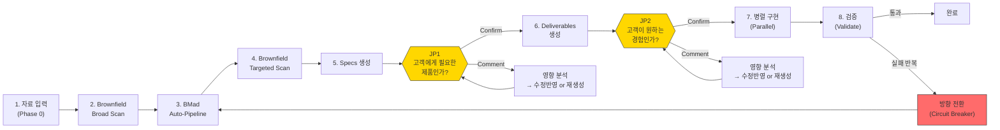

# BMAD Sprint Kit Blueprint

> **Sprint Kit은 BMad Method 위에서 동작하는 Judgment-Driven Development 실행 확장팩이다.**
> 프로덕트 전문가가 가진 맥락을 최대한 활용하여 AI의 첫 생성 품질을 높이고,
> 고객 관점의 판단 시점(JP1, JP2)에서만 사람의 시간을 사용하며,
> 필요할 때 전체 재생성으로 방향을 수정한다.
>
> 품질 기준: **"비개발자가 이 문서 하나만으로 AI와 함께 이 서비스를 다시 만들어낼 수 있다."**

---

## 전체 흐름



---

## 이 문서 읽는 법

이 문서는 **따라가기(Follow-Along)** 방식으로 구성되어 있다. 시스템을 추상적으로 설명하는 대신, 각 단계에서 **사용자가 보는 것(외부)**과 **시스템 내부에서 벌어지는 일(내부)**을 함께 서술한다.

각 단계는 동일한 패턴을 따른다:
- **사용자 시점**: 사용자가 하는 일, 받는 것
- **시스템 내부**: 입력 → 처리(에이전트, 순서) → 출력 → 검증
- **산출물**: 생성되는 파일과 역할
- **실패 시**: 에러 상황과 대응

> **예시 표기법**: `tutor-exclusion`(튜터 차단 기능)은 `specs/test-tutor-excl/`에서 확인할 수 있는 실제 예시 프로젝트이다.

| 파트 | 내용 |
|------|------|
| **Part 1** | 설계 철학 — 왜 이렇게 만들었는가 |
| **Part 2** | 시스템 구성 — 도구, 에이전트, 설치 |
| **Part 3** | Sprint 한 바퀴 따라가기 — 핵심 |
| **Part 4** | 경로 선택 — 입력 상태에 따른 3가지 경로 |
| **Part 5** | 참조 — 파일 구조, 에이전트 상세, 용어집 |

---

# Part 1: 설계 철학

## 1.1 문제 인식

소프트웨어 개발에서 "무엇을 만들지 결정하는 과정"이 가장 큰 병목이다. 코딩 자체는 AI가 빠르게 수행할 수 있지만, 요구사항 정의 → 설계 → 검증 → 수정의 반복 루프에서 사람의 시간이 소모된다.

Sprint Kit은 이 병목을 두 가지 방향에서 해소한다:
1. **사전 입력으로 첫 생성 품질을 높여** 반복 횟수를 줄인다
2. **고객 관점의 판단 시점에서만** 사람의 시간을 사용한다

## 1.2 Judgment-Driven Development

Sprint Kit의 설계 철학은 6원칙으로 구성된다. 각 원칙이 Sprint Kit에서 어떻게 구현되는지를 함께 설명한다.

> 전체 철학 문서: [`docs/judgment-driven-development.md`](judgment-driven-development.md)

### 원칙 1: Artifacts as Medium — 결과물이 대화의 매체

> 추상적 질문이 아니라, 구체적 결과물에 대한 반응이 가장 정확하고 빠른 입력이다.

사람은 "검색 기능에서 뭐가 중요해요?"라는 질문에는 부정확하게 답하지만, "이 검색 화면이 맞나요?"라는 결과물에는 정확하게 반응한다.

**Sprint Kit 구현 — 2-JP 모델**:
Sprint Kit은 전체 프로세스에서 사람에게 판단을 요청하는 시점을 딱 2곳에 배치한다. 두 시점 모두 구체적 결과물 위에서만 판단을 요청한다.
- JP1: PRD + 요구사항 + 설계 문서를 **고객 여정 서사**로 제시하여 판단 요청
- JP2: **동작하는 프로토타입**을 직접 체험하게 하여 판단 요청

### 원칙 2: Input Reduces Cycles — 입력이 재생성 횟수를 줄인다

> 사전 입력(회의록, 참고자료, 기존 시스템 맥락)은 첫 생성의 품질을 높여서
> 재생성 횟수를 줄인다. 좋은 입력은 여러 번의 판단보다 효율적이다.

```
총 비용 = (사전 입력 비용) + (생성 비용 × 생성 횟수) + (판단 비용 × 판단 횟수)

사전 입력이 풍부하면:  생성 횟수 ↓, 판단 횟수 ↓  → 총 비용 ↓
사전 입력이 없으면:    생성 횟수 ↑, 판단 횟수 ↑  → 총 비용 ↑
```

**Sprint Kit 구현 — inputs/ 디렉토리 + Brownfield Scanner**:
- `specs/{feature}/inputs/`: 회의록, 참고자료, 기존 문서를 넣는 곳
- Brownfield Scanner: 기존 시스템(API, DB, UI)의 맥락을 MCP + 로컬 코드베이스에서 자동 수집
- Brief: 사용자가 직접 작성하거나, AI가 참고자료에서 자동 생성

프로덕트 팀의 킥오프 미팅 회의록이 있다면, 이것을 inputs/에 넣는 것만으로 AI의 PRD 첫 생성 품질이 크게 높아진다.

### 원칙 3: Regeneration Over Modification — 수정보다 재생성

> 모든 AI 산출물은 소모품이다. 수정이 아니라 재생성이 기본이다.
> 사람의 판단만이 축적되는 영속 자산이며, 나머지는 전부 재생성 가능하다.

AI 시대의 재생성 방식:
```
문서 v1 → 피드백 → 피드백을 반영한 완전히 새로운 v2 생성 → 피드백 → v3 생성
장점: 매번 일관성 있는 결과물
전제: 사람의 판단(피드백)이 축적되어 다음 생성에 반영됨
```

**Sprint Kit 구현 — Comment 처리 플로우 + Circuit Breaker + 코드 폐기**:
- **Comment 처리 플로우**: JP에서 Comment 시, 피드백 규모에 따라 **수정반영+전파**(소규모) 또는 **재생성**(대규모)을 cost와 함께 제시. 사용자가 선택한다.
  - 수정반영+전파: 영향 받는 파일을 양방향 수정 → Scope Gate 검증
  - 재생성: 해당 Phase부터 파이프라인 재실행 (Scope Gate 포함)
- Circuit Breaker: 반복 실패 시 방향 전환 — 재생성 범위가 Sprint 전체로 확장될 때 발동
- Specs(요구사항, 설계)는 보존하되, 코드는 언제든 폐기 가능

### 원칙 4: Customer-Lens Judgment Points — 고객 관점의 판단 시점

> 사람이 개입하는 시점은 "고객에게 어떤 제품이 서빙될지 판단할 수 있는 순간"에 배치된다.

프로덕트 전문가의 정의: ~~개발자의 반대로서의 "비개발자"~~가 아니라, **고객에 대한 전문가이자, 어떤 결과물이 나와야 하는지 가장 잘 판단할 수 있는 사람**.

**Sprint Kit 구현 — JP1 "고객에게 필요한 제품인가?" + JP2 "고객이 원하는 경험인가?"**:
- JP1: 요구사항, 사용자 시나리오, 기능 범위를 고객 여정 서사로 제시. BMad 12단계가 발견하려는 것들을 구조적 체크리스트로 보조
- JP2: 동작하는 프로토타입 + 핵심 시나리오 가이드. 직접 클릭해보고 판단
- 응답: **Confirm**(진행) / **Comment**(영향 분석 → 수정반영+전파 또는 재생성을 cost와 함께 제시 → 사용자 선택)

### 원칙 5: Knowledge Shape Determines Route — 지식의 형태가 경로를 결정한다

> 사람의 지식이 어떤 형태로 존재하느냐에 따라 경로가 달라진다.

| 지식 형태 | 적합 경로 | 진입점 |
|----------|----------|--------|
| 풍부한 비정형 맥락 (회의록, 데이터) | **Sprint** — AI가 구성하고 내가 판단 | `/sprint` |
| 미탐색 영역 (새 시장, 새 문제) | **Guided** — AI와 함께 발견하고 정의 | BMad 12단계 |
| 이미 구조화된 산출물 (기존 PRD) | **Direct** — 바로 실행 | `/specs` |

**Sprint Kit 구현 — 3경로 (Sprint / Guided / Direct)**:
- 세 경로 모두 같은 파이프라인(`[Specs] → JP1 → [Deliverables] → JP2 → [Execute]`)으로 합류
- 경로는 고정이 아니다. 상황에 따라 전환 가능 (크로스오버)
- 소규모 작업은 BMad Quick Flow (`/quick-spec` → `/dev-story` → `/code-review`) 사용

### 원칙 6: Auto-Context, Human-Judgment — 맥락은 자동, 판단은 사람

> 기술적 맥락 수집은 AI가 자동으로 수행한다. 사람에게는 고객 영향으로 번역하여 판단만 요청한다.

```
AI가 수집:                             사람에게 제시:
"기존 API /api/v1/tutors에              "기존 '튜터 관리' 기능에 영향이
 GET, POST, DELETE 엔드포인트            있습니다. 현재 튜터 목록 화면에서
 존재. TutorService 클래스에서            새로운 '차단' 기능이 추가되면,
 blockTutor 메서드 미구현.                기존 사용자 경험이 변경됩니다.
 DB에 tutor_block_list 테이블 없음"       허용하시겠어요?"
```

**Sprint Kit 구현 — Brownfield 자동 수집 + 고객 영향 번역**:
- Brownfield Scanner: MCP 서버, document-project, 로컬 코드베이스에서 자동 수집
- brownfield-context.md: L1(도메인) → L2(행위) → L3(컴포넌트) → L4(코드) 계층 구조
- JP1/JP2에서: 기술적 brownfield 데이터를 **고객 영향으로 번역**하여 제시

## 1.3 2-JP 모델

Sprint Kit은 "2가지 고객 질문에 답한다":

**JP1 (Judgment Point 1): "고객에게 필요한 제품인가?"**
- 판단 대상: 요구사항, 사용자 시나리오, 기능 범위, 우선순위
- 제시 형식: 고객 여정 서사 + 원래 의도 ↔ FR 매핑 + 구조적 체크리스트
- 응답: **Confirm** / **Comment** → 피드백 규모에 따라 수정반영+전파 또는 재생성 (cost 기반 선택)

**JP2 (Judgment Point 2): "고객이 원하는 경험인가?"**
- 판단 대상: 프로토타입, 화면 흐름, 인터랙션
- 제시 형식: 동작하는 프로토타입 + 핵심 시나리오 가이드
- 응답: **Confirm** / **Comment** → 피드백 규모에 따라 수정반영+전파 또는 재생성 (cost 기반 선택)

**역방향 루프**: JP2에서 "요구사항 자체가 잘못됐다"고 판단되면, Comment의 **재생성 옵션** 범위가 JP1 이전 Phase로 자연 확장된다.
이것은 실패가 아니라, **구체적 결과물이 촉진한 정상적인 발견 프로세스**다.

```
JP1 ──→ JP2 ──→ Done
 ↑        │
 └────────┘  "프로토타입을 보니 요구사항이 잘못됐네"
             → Comment → 재생성 범위가 PRD까지 확장
```

---

# Part 2: 시스템 구성

## 2.1 도구 스택

| 도구 | 역할 |
|------|------|
| **BMad Method** | 기반 플랫폼: 에이전트, 워크플로우 엔진, 퍼실리테이션 (`_bmad/`) |
| **Sprint Kit** | BMad 실행 확장팩: 자동 파이프라인, Specs, Deliverables, Prototype |
| **Claude Code** | AI IDE — 에이전트 실행 환경 |
| **Claude Code Native Teams** | 에이전트 조율, 태스크 의존성 추적 (`Task`, `SendMessage`) |
| **MCP 서버** | 외부 데이터 접근 (backend-docs, client-docs, svc-map, figma) |
| **Git Worktree** | 파일 충돌 없는 병렬 구현 환경 |
| **GitHub CLI (`gh`)** | Issue/PR 관리, 태스크 추적 |
| **Specmatic** | OpenAPI 계약 기반 자동 테스트 (Worker 자체 검증) |
| **MSW (Mock Service Worker)** | 프로토타입 stateful API (브라우저 Service Worker에서 네트워크 인터셉트) |
| **@redocly/cli** | OpenAPI 스펙 lint (스펙 구문/구조 + example ↔ schema 일치 검증) |
| **npx bmad-sprint-kit** | Sprint Kit 설치/업데이트 CLI |

## 2.2 에이전트 아키텍처

Sprint Kit은 세 계층의 에이전트를 사용한다.

### BMad 에이전트 — 기획 산출물 생성

BMad Method가 제공하는 AI 역할극 에이전트. 각각 프로덕트 팀의 특정 역할을 수행한다.

| 에이전트 | 역할 | 산출물 |
|---------|------|--------|
| **Mary** (Analyst) | 브레인스토밍, 리서치 | Product Brief |
| **John** (PM) | 요구사항 정의 | PRD, Epics & Stories |
| **Winston** (Architect) | 기술 설계 | Architecture, ADR |
| **Sally** (UX Designer) | UX/UI 설계 | UX Design |
| **Bob** (Scrum Master) | Sprint Planning | Story 준비 |
| **Amelia** (Dev) | Story 구현 | 코드 |
| **Murat** (Test Architect) | 테스트 설계 | Master Test Plan |
| **Paige** (Tech Writer) | 문서화 | Technical Docs |
| **Barry** (Quick Flow Solo Dev) | 소규모 작업 | Quick Spec → Dev → Review |

### Sprint 에이전트 — 자동 파이프라인 오케스트레이션

Sprint Kit이 추가하는 자동화 에이전트.

| 에이전트 | 역할 | 동작 시점 |
|---------|------|----------|
| **@auto-sprint** | Sprint 오케스트레이션 + Conductor 4역할 (Goal Tracking, Scope Gate, Budget, Redirect) | Sprint 전체 |
| **@scope-gate** | 3단계 검증: Structured Probe + Checklist + Holistic Review | BMad 각 단계 후 |
| **@brownfield-scanner** | MCP + 로컬 코드베이스에서 Brownfield 데이터 수집 (L1~L4) | Pass 1 (Broad) + Pass 2 (Targeted) |
| **@deliverable-generator** | Full-stack 산출물 생성: Specs + OpenAPI + DBML + BDD + Prototype | Specs/Deliverables 단계 |

### Execute 에이전트 — 구현 + 검증

병렬 구현과 3-Phase 검증을 담당하는 에이전트.

| 에이전트 | 역할 |
|---------|------|
| **@worker** | 독립 워크트리에서 태스크 구현 + Specmatic API 계약 자체 검증 |
| **@judge-quality** | 코드 구조, 패턴, 중복, 컨벤션 검증 + Specmatic 계약 준수 |
| **@judge-security** | OWASP Top 10 취약점, 인젝션, 인증 우회 검증 |
| **@judge-business** | BMad PRD 수용 기준 대비 구현 검증 |

## 2.3 Brownfield 데이터 소스

기존 시스템의 맥락을 수집하는 3가지 소스와 토폴로지별 가용성.

| 소스 | 설명 | 수집 방법 |
|------|------|----------|
| **document-project** | BMad `/document-project` 워크플로우가 생성한 구조화 문서 | 파일 직접 읽기 |
| **MCP 서버** (4종) | backend-docs, client-docs, svc-map, figma | MCP 프로토콜 |
| **로컬 코드베이스** | 같은 저장소의 소스 코드 | Glob, Grep, Read |

**토폴로지별 가용 소스 매트릭스**:

| 토폴로지 | document-project | MCP | 로컬 코드 | 비고 |
|---------|-----------------|-----|----------|------|
| **standalone** | 해당 없음 | 가능 | 해당 없음 | Greenfield 또는 외부 시스템 |
| **co-located** | 가능 | 가능 | 가능 | 모놀리식, 로컬에 코드 있음 |
| **msa** | 가능 | 가능 | 부분 | 마이크로서비스, 일부 서비스만 로컬 |
| **monorepo** | 가능 | 가능 | 가능 | 모노레포, 전체 코드 로컬 |

Greenfield 프로젝트에서는 Brownfield 소스가 없어도 Sprint가 동작한다.

## 2.4 설치와 배포

Sprint Kit은 `npx bmad-sprint-kit` CLI로 설치/업데이트한다.

| 커맨드 | 동작 |
|--------|------|
| `npx bmad-sprint-kit init` | Interactive 마법사: BMad 감지 → 파일 설치 → Hook 설정 |
| `npx bmad-sprint-kit update` | 기존 파일 업데이트 (버전 비교 + diff 표시) |
| `npx bmad-sprint-kit compat-check` | BMad 버전 호환성 확인 |

설치 시 BMad Method가 감지되지 않으면 에러와 함께 안내 메시지를 표시한다.

**설치되는 파일**:
- `.claude/agents/` — Sprint 에이전트 8개
- `.claude/commands/` — Sprint 커맨드 7개
- `.claude/rules/` — Sprint 규칙 3개 (bmad-*.md)
- `.claude/hooks/` — Hook 스크립트 4개
- `.claude/settings.json` — Hook 설정
- `_bmad/docs/` — 포맷 가이드 4개
- `preview-template/` — React + Vite + MSW 프로토타입 템플릿

## 2.5 Hook 시스템

Sprint Kit은 4개의 Hook 스크립트로 런타임 보호와 사용자 경험을 제공한다.

| Hook | 트리거 | 역할 |
|------|--------|------|
| **desktop-notify.sh** | JP1/JP2 도달, Sprint 완료, 에러 | 데스크톱 알림 (macOS/Linux) |
| **protect-readonly-paths.sh** | 파일 수정 시도 | `_bmad/`, `specs/*/inputs/` 등 읽기 전용 경로 보호 |
| **sprint-pre-compact.sh** | Context window 압축 전 | Sprint 상태를 sprint-log.md에 저장 |
| **sprint-session-recovery.sh** | 세션 시작 시 | sprint-log.md에서 이전 상태 복원 |

## 2.6 Multi-IDE 호환

Sprint Kit의 원본 정의는 `.claude/`에 있다. 다른 AI IDE도 지원한다.

| IDE | 지원 방식 |
|-----|----------|
| **Claude Code** | 기본. 추가 설정 불필요 |
| **Codex CLI** | `--ide codex` 옵션으로 `codex-agents/`, `$sprint` 등 변환 파일 생성 |
| **Gemini Code Assist** | `.gemini/commands/`에 TOML 래퍼 자동 생성 |

---

# Part 3: Sprint 한 바퀴 따라가기

> 이 파트는 Sprint 경로(`/sprint` 커맨드)를 기준으로 전체 프로세스를 따라간다.
> Guided/Direct 경로의 차이점은 Part 4에서 설명한다.

## 3.1 Phase 0: Sprint Onboarding (Smart Launcher)

### 사용자 시점

사용자는 두 가지 방법으로 Sprint를 시작한다:

```bash
# 방법 1: 인라인 Brief
/sprint "수업 후 학생이 특정 튜터를 차단할 수 있는 기능"

# 방법 2: feature-name (inputs/ 디렉토리에 자료 배치 후)
/sprint tutor-exclusion
```

방법 2의 경우, `specs/tutor-exclusion/inputs/`에 자료를 배치한다. **brief.md는 필수가 아니다** — 회의록이나 참고자료만 넣어도 AI가 Brief를 자동 생성한다.

### 시스템 내부

**specs/ 기본 구조 확인**:
`specs/` 폴더가 없으면 자동 생성 + `specs/README.md` 배치.

**진입점 분기**:

| 입력 형태 | 동작 |
|----------|------|
| 인라인 Brief (`"..."`) | `specs/{slug}/inputs/brief.md` 자동 생성 → 분석 |
| feature-name | `specs/{name}/` **전체 스캔** → 입력 상태 판정 → 최적 경로 분기 |

**전체 스캔** (feature-name 진입 시):
`specs/{feature}/` 내부를 한 번에 스캔하여 다음을 감지한다:
- inputs/ 내 파일 목록 (brief.md 존재 여부 구분)
- brownfield-context.md 존재 여부 + 레벨(L1~L4)
- planning-artifacts/ 존재 여부 + 완성도
- BMad 산출물 (`_bmad-output/planning-artifacts/`)

스캔 결과를 사용자에게 요약 보고한 후, 입력 상태에 따라 경로를 분기한다:

| 입력 상태 | 경로 |
|----------|------|
| brief.md + 참고자료 | **정상 Sprint** |
| 참고자료만 (brief.md 없음) | **AI가 Brief 자동 생성** → 정상 Sprint |
| 기획 산출물 완비 | **Direct 경로 제안** (`/specs` 안내) |
| 입력 없음 | **에러** (자료 배치 안내) |

**Brief 파싱 + Reference Materials 분석**:
- brief.md가 없으면 → 참고자료에서 AI가 Brief를 자동 생성 후 `inputs/brief.md`에 저장
- brief.md 읽기 + inputs/ 내 모든 참고 자료 처리
- 200줄 이하: 전문 포함 / 200줄 초과: 요약 (Key Points, Constraints, Decisions 추출)
- 이미지: 파일명 + 설명만 / PDF: 앞 100페이지만

**Brief Sentences 추출**:
- Brief를 문장 단위로 분해하여 BRIEF-N ID 부여
- 이후 PRD의 각 FR에 `(source: BRIEF-N)` 태깅에 사용

**인과 사슬(Causal Chain) 추출** (선택, opt-in):
- 4 Layer: Phenomenon → Root Cause → Solution Rationale → Feature Request
- 각 Layer에 source(출처)와 evidence(근거) 기록
- chain_status: `complete`(전부 확인), `partial`(일부 추론), `feature_only`(미사용)

**Brownfield 상태 감지**:
1. **기존 brownfield-context.md 감지**: feature 폴더에 이미 존재하면 레벨 확인 후 재사용 판정
2. document-project 산출물 탐색 (`_bmad-output/document-project/` 등)
3. MCP 서버 접속 테스트
4. 로컬 코드베이스 빌드 도구 감지 → 토폴로지 판정

**tracking_source 설정**:
- Sprint 경로: `tracking_source: brief` (BRIEF-N 기반 추적)
- Direct 경로: `tracking_source: success-criteria` (PRD Success Criteria 기반 추적)

**Brief 등급 판정**:

| 등급 | 조건 | 행동 |
|------|------|------|
| **A** (충분) | 기능 3+, 시나리오 1+, 또는 참고 자료가 보완 | 정상 진행 |
| **B** (보통) | 기능 1~2, 시나리오 없음 | 확인 시 경고 표시 |
| **C** (불충분) | 기능 0, 단순 키워드만 | Sprint 비권장 + `force_jp1_review: true` |

### 사용자 시점: 스캔 결과 + 확인 화면

Phase 0에서 사용자에게 두 번의 정보를 제공한다:

**1. 스캔 결과 요약** (전체 스캔 직후):
- inputs/ 파일 목록
- brief.md 존재 여부 (미존재 시 "참고자료에서 생성" 안내)
- brownfield-context.md 존재 여부 + 레벨
- planning-artifacts/ 상태

**2. Sprint 시작 확인** (sprint-input.md 생성 후):
- 추출된 목표 (goals)
- 복잡도 + Brief 등급
- Brownfield 상태 + 토폴로지
- 예상 소요 시간
- (있으면) 모순 감지 경고, Discovered Requirements

### 산출물

```
specs/{feature}/inputs/sprint-input.md
```

sprint-input.md는 Phase 0의 **SSOT**. YAML frontmatter에 모든 메타데이터를, Body에 Core Brief + Reference Materials + Discovered Requirements를 포함한다. 이후 모든 에이전트가 이 파일을 참조한다.

> 포맷 상세: `_bmad/docs/sprint-input-format.md`

### 실패 시

| Tier | 조건 | 대응 |
|------|------|------|
| **Fallback 1** | 전체 분석 성공 (brief.md 직접 작성 또는 AI 자동 생성) | 정상 진행 |
| **Fallback 2** | brief.md만 분석 가능 (참고 자료 실패) | Core Brief만으로 진행, 경고 |
| **Fallback 3** | inline Brief만 (brief.md 자동 생성) | Brief 원문만으로 진행 |
| **Fallback 4** | 입력 없음 또는 이해 불가 | Sprint 중단 |

---

## 3.2 Pass 1: Brownfield Broad Scan

### 사용자 시점

자동 실행. 사용자 개입 없음.

### 시스템 내부

**기존 brownfield-context.md가 있는 경우**:
Phase 0에서 감지된 기존 파일을 `planning-artifacts/`에 복사한다. L1+L2가 이미 있으면 Broad Scan을 스킵하고 다음 단계로 진행한다. 누락된 레벨만 보충 스캔한다.

**기존 brownfield-context.md가 없는 경우**:
@brownfield-scanner가 broad 모드로 실행된다.

**Stage 0: document-project 소비**
- document-project 산출물이 있으면 읽어서 초기 컨텍스트 구성

**Stage 1~4: MCP + 로컬 스캔**
- L1 (Domain): 도메인 용어, 비즈니스 규칙, 정책
- L2 (Behavior): API 엔드포인트, 화면 흐름, 사용자 시나리오

sprint-input.md의 `brownfield_status`와 `brownfield_topology` 갱신.

### 산출물

```
specs/{feature}/planning-artifacts/brownfield-context.md  (L1 + L2)
```

### 실패 시

MCP 접속 실패 시 → `brownfield_status: partial-failure` 기록 + 가용 소스만으로 진행.
Greenfield 시 → 이 단계 스킵.

---

## 3.3 BMad Auto-Pipeline

### 사용자 시점

자동 실행. @auto-sprint Conductor가 BMad 에이전트를 순차 호출한다.

### 시스템 내부

**Conductor(@auto-sprint) 4역할**:
1. **Goal Tracking** — sprint-input.md의 goals 대비 진행 추적
2. **Scope Gate** — 각 단계 후 @scope-gate 호출, 범위 이탈 감지
3. **Budget** — 소프트 게이트, 과도한 재생성 방지
4. **Redirect** — 범위 이탈 시 축소/전환

**Context Passing 원칙**: 에이전트 간에는 **파일 경로만 전달**한다. 산출물 내용을 메시지로 전달하지 않는다.

**Step 1: Mary → Product Brief (AUTO 모드)**
- 입력: sprint-input.md
- 출력: `planning-artifacts/product-brief.md`

**Step 2: John → PRD (AUTO 모드)**
- 입력: product-brief.md + sprint-input.md
- 출력: `planning-artifacts/prd.md`
- 각 FR에 `(source: BRIEF-N / DISC-N / AI-inferred)` 태깅
- `_bmad/docs/prd-format-guide.md` 포맷 준수

**@scope-gate 검증**: Structured Probe + Checklist + Holistic Review

**Step 3: Winston → Architecture (AUTO 모드)**
- 입력: prd.md + brownfield-context.md
- 출력: `planning-artifacts/architecture.md`

**@scope-gate 검증**

**Step 4: John → Epics & Stories (AUTO 모드)**
- 입력: prd.md + architecture.md
- 출력: `planning-artifacts/epics-and-stories.md`

**@scope-gate 최종 검증**

**Step 5-G: @scope-gate deliverables** — Specs 생성 후 API Data Sufficiency 검증:
- key-flows.md의 API 호출 순서 대비, 후행 API의 요청 필드가 선행 API 응답에서 획득 가능한지 확인
- 획득 경로가 불명확한 필드는 WARN으로 리포트

### 산출물

```
specs/{feature}/planning-artifacts/
├── product-brief.md
├── prd.md
├── architecture.md
└── epics-and-stories.md
```

### 실패 시

- **Budget Control**: 동일 산출물 재생성이 소프트 한도를 초과하면 경고 + 계속 여부 확인
- **Redirect**: Scope Gate가 심각한 이탈을 감지하면 Conductor가 범위를 축소하거나 Sprint를 중단

---

## 3.4 Pass 2: Brownfield Targeted Scan

### 사용자 시점

자동 실행. 사용자 개입 없음.

### 시스템 내부

@brownfield-scanner가 targeted 모드로 실행된다. Architecture + Epics를 기반으로 구체적인 영향 범위를 스캔한다.

- L3 (Component): 영향받는 컴포넌트, 서비스, 모듈
- L4 (Code): 구체적 코드 위치, 인터페이스, 의존성

### 산출물

```
specs/{feature}/planning-artifacts/brownfield-context.md  (L1 + L2 + L3 + L4 append)
```

---

## 3.5 Specs 생성

### 사용자 시점

자동 실행. 사용자 개입 없음.

### 시스템 내부

@deliverable-generator가 specs-only 모드로 실행된다.

**Stage 1: Entity Dictionary 생성**
- PRD + Architecture에서 핵심 엔티티 추출
- 용어 정의, 관계, 제약 조건 정리

**Stage 2: Specs 4-file 생성**
- `requirements.md` — PRD → 구조화된 요구사항 (각 항목에 source 태깅)
- `design.md` — Architecture → 구조화된 설계 (컴포넌트, 인터페이스)
- `tasks.md` — Epics → 병렬 실행 가능한 태스크 목록
- `brownfield-context.md` (frozen) — planning-artifacts/에서 복사한 **Frozen snapshot** (이후 Workers가 참조)

**SSOT 참조 우선순위**: 동일 개념이 여러 파일에 기술된 경우 다음 우선순위를 따른다:
- `api-spec.yaml` > `design.md`의 API 섹션
- `schema.dbml` > `design.md`의 데이터 모델 섹션

**Entropy Tolerance + 파일 소유권 배정**:
- 각 태스크에 Entropy 레벨 (Low/Medium/High) 태깅
- 파일 소유권 배정: 어떤 Worker가 어떤 파일을 수정하는지 명시

### 산출물

```
specs/{feature}/
├── entity-dictionary.md
├── requirements.md
├── design.md
├── tasks.md
└── brownfield-context.md  (frozen snapshot)
```

---

## 3.6 판단 지점 1 (JP1): "고객에게 필요한 제품인가?"

### 사용자 시점: Visual Summary를 보고 판단

시스템이 다음 내용을 정리하여 제시한다:

**Section 1: 고객 여정 서사**
- "고객이 A 상황에서 B를 하려 할 때, 시스템이 C를 제공합니다"
- 핵심 시나리오를 비기술적 언어로 서술

**Section 2: 원래 의도 ↔ FR 매핑 테이블**
- tracking_source가 `brief`이면: Brief 문장(BRIEF-N) ↔ FR 매핑
- tracking_source가 `success-criteria`이면: PRD Success Criteria ↔ FR 매핑
- 매핑되지 않은 항목은 경고로 표시
- Brief 외 추가 항목은 "참고 자료 발견" vs "AI 추론"으로 분리

**Section 3: 구조적 확인 사항**
- BMad 12단계가 발견하려는 것들을 체크리스트로 압축:
  - 모든 핵심 사용자 유형이 포함되었는가?
  - 엣지 케이스 시나리오가 고려되었는가?
  - 기존 기능과의 관계가 명확한가?
  - 성공 지표가 측정 가능한가?

**Section 4: 기존 시스템 영향**
- brownfield side-effect를 **고객 영향으로 번역**하여 제시
- "기존 튜터 목록 화면에 '차단' 버튼이 추가됩니다" (기술 용어 배제)

**[Advanced] Layer 3 상세** (접었다 펼 수 있는 형태):
- Causal Chain Alignment + FR Linkage (causal_chain 제공 시)
- Brownfield 기술 데이터
- Scope Gate 상세 결과

### 시스템 내부

- tracking_source에 따라 BRIEF-N 또는 Success Criteria 매핑 자동 선택
- @scope-gate 결과를 비기술적 언어로 번역
- brownfield side-effect → 고객 영향 번역
- `force_jp1_review: true` 시 C등급 경고 배너 표시

### 응답 처리

| 응답 | 동작 |
|------|------|
| **Confirm** | JP2 (Deliverables 생성)로 진행 |
| **Comment** | Comment 처리 플로우 실행 (아래 참조) |

#### Comment 처리 플로우

JP에서 Comment를 선택하면, 피드백 규모에 따라 처리 방식을 동적으로 결정한다. 이 플로우는 Advanced Elicitation, Party Mode, 직접 피드백 모두에 동일하게 적용된다:

1. **피드백 입력**: 사용자가 수정할 내용을 자유 텍스트로 입력한다
2. **영향 분석**: 시스템이 피드백의 영향 범위를 분석하여 다음을 산출한다
   - 수정반영 시: 수정 대상 파일 목록 (upstream + downstream) + 예상 소요 시간
   - 재생성 시: 재실행 시작 Phase + 예상 소요 시간
3. **처리 옵션 제시**: cost와 함께 두 가지 옵션을 제시한다
   - **[M] 수정반영+전파**: 기존 산출물 내 직접 수정 + 의존 파일 양방향 전파 (N개 파일, ~M분) + Scope Gate 검증
   - **[R] 재생성**: 해당 Phase부터 재실행 (~M분)
4. **사용자 선택**: cost를 보고 사용자가 선택한다
5. **실행 + 검증**:
   - 수정반영 선택 시: 전체 파일 수정 → Scope Gate 검증 → PASS 시 JP 복귀
   - 재생성 선택 시: 해당 Phase부터 파이프라인 재실행 → Scope Gate 포함 → JP 복귀
6. **피드백 기록**: `planning-artifacts/feedback-log.md`에 피드백 내용 + 처리 방식 + 결과를 기록한다

---

## 3.7 Deliverables 생성

### 사용자 시점

자동 실행. JP1 승인 후 시스템이 전체 산출물을 생성한다.

### 시스템 내부

@deliverable-generator가 full 모드로 실행된다.

**생성 산출물**:

| 산출물 | 파일 | 역할 |
|--------|------|------|
| OpenAPI 3.1 YAML | `api-spec.yaml` | API 계약 — MSW Mock + Specmatic 계약 테스트 공용 |
| API Sequences | `api-sequences.md` | Mermaid sequence diagrams |
| DBML Schema | `schema.dbml` | 데이터베이스 설계 (dbdiagram.io ERD) |
| BDD/Gherkin | `bdd-scenarios/` | Given-When-Then 수용 테스트 |
| State Machines | `state-machines/` | XState 정의 (해당 시에만) |
| Decision Log | `decision-log.md` | ADR + AI reasoning trace |
| Traceability Matrix | `traceability-matrix.md` | FR → Design → Task → BDD → API 매핑 |
| Key Flows | `key-flows.md` | 핵심 사용자 플로우 Step-by-Step (JP2 검증용) |
| MSW Mocks | `mocks/` | MSW handler (browser.ts, handlers.ts, store.ts, seed.ts) |
| Prototype | `preview/` | React + MSW stateful 프로토타입 |

### 산출물

```
specs/{feature}/
├── api-spec.yaml
├── api-sequences.md
├── schema.dbml
├── bdd-scenarios/
├── state-machines/          (해당 시)
├── decision-log.md
├── traceability-matrix.md
├── key-flows.md
├── preview/
│   └── src/mocks/           # MSW handler (browser.ts, handlers.ts, store.ts, seed.ts)
└── planning-artifacts/
    └── feedback-log.md      # Comment 처리 기록 (피드백 + 선택 + 결과)
```

---

## 3.8 판단 지점 2 (JP2): "고객이 원하는 경험인가?"

### 사용자 시점: 프로토타입 체험 + 판단

1. 프로토타입 실행: `cd specs/{feature}/preview && npm run dev`
2. 핵심 시나리오 가이드(key-flows.md 기반)를 따라 직접 클릭
3. DevPanel로 상태 리셋/디버깅 (MSW in-memory store 기반)

### 시스템 내부

- MSW Service Worker가 `api-spec.yaml` 기반으로 네트워크 레벨에서 API 요청을 인터셉트하여 stateful 응답 제공
- React SPA는 실제 서비스와 동일한 코드로 API를 호출 (MSW의 존재를 알지 못함)
- key-flows.md에서 핵심 시나리오 자동 추출하여 가이드 제시
- **jp1_to_jp2_changes**: JP1 이후 Phase 2에서 변경/보완된 사항을 readiness.md에 기록하여 JP2 Section 0에 자동 표시

### 응답 처리

| 응답 | 동작 |
|------|------|
| **Confirm** | Parallel(병렬 구현)로 진행 |
| **Comment** | Comment 처리 플로우 실행 (3.6 참조) |

JP2에서 요구사항 오류를 발견한 경우, Comment의 **재생성 옵션** 범위가 JP1 이전 Phase(PRD 등)로 자연 확장된다.

### 역방향 루프

"프로토타입을 보고 나서야 요구사항 오류를 발견하는 것은 실패가 아니라, 구체적 결과물이 촉진한 정상적인 발견 프로세스다." — 원칙 1 (Artifacts as Medium)의 실현.

---

## 3.9 병렬 구현 (Parallel)

### 사용자 시점

자동 실행. 진행 상황을 모니터링할 수 있다.

### 시스템 내부

**Step 1: Interface Contract 생성**
- 공유 타입/인터페이스 파일을 PARALLEL 시작 전에 생성
- 모든 Worker가 참조하는 공통 계약

**Step 2: GitHub Issues 생성**
- `gh issue create`로 각 태스크를 GitHub Issue로 생성
- 의존성, 파일 소유권, Entropy 레벨 표시

**Step 3: Git Worktree 설정**
- 각 Worker에게 독립 워크트리 할당
- 파일 충돌 원천 차단

**Step 4: Native Teams @worker 생성**
- Claude Code Task tool로 Worker 에이전트 병렬 생성
- 각 Worker에게 태스크, Specs, brownfield-context.md(frozen) 전달

**Step 5: 병렬 실행**
- 각 Worker가 독립적으로 태스크 구현
- Specmatic으로 API 계약 자체 검증 (api-spec.yaml 기준)
- 완료 시 TaskUpdate + `gh issue close` + SendMessage로 알림

**Step 6: Merge & Integration**
- 의존성 순서에 따라 워크트리 merge
- Integration test 실행

### 파일 소유권

- `tasks.md`에 각 태스크의 소유 파일을 명시
- Worker는 자신에게 배정된 파일만 수정
- 공유 파일 수정 필요 시 팀 리더에게 SendMessage로 요청

### 실패 시

Worker Failure Protocol:
1. 첫 실패 → 자동 재시도 (최대 2회)
2. 재시도 실패 → 팀 리더에게 보고
3. 부분 merge 옵션 — 성공한 Worker의 코드만 merge 가능

---

## 3.10 검증 (Validate)

### 사용자 시점

자동 실행. 3-Phase 검증 결과가 보고된다.

### 시스템 내부

**Phase 1: @judge-quality**
- 코드 구조, 패턴 일관성, 중복 검사
- 프로젝트 컨벤션 준수 확인
- Specmatic 계약 준수 (api-spec.yaml 기준)

**Phase 2: @judge-security**
- OWASP Top 10 취약점 검사
- SQL 인젝션, XSS, 인증 우회 패턴
- 의존성 취약점

**Phase 3: @judge-business**
- PRD 수용 기준 대비 구현 검증
- 각 FR의 구현 여부 확인
- (causal_chain 제공 시) core FR이 root_cause를 실제로 해결하는가 검증

### 실패 시

카테고리별 실패 카운트를 추적한다:
- 동일 카테고리 3회 연속 실패 → Circuit Breaker 자동 발동
- 5회 누적 실패 → Circuit Breaker 자동 발동

---

## 3.11 방향 전환 (Circuit Breaker — `/circuit-breaker`)

### 사용자 시점

시스템이 방향 전환을 제안한다. "이 방향으로는 문제가 반복됩니다. 다음 중 선택해주세요." 수동으로 `/circuit-breaker`를 실행할 수도 있다.

### 시스템 내부

**트리거 조건**:
- 동일 카테고리 3회 연속 VALIDATE 실패
- 5회 누적 VALIDATE 실패
- Comment의 재생성 범위가 Sprint 전체로 확장될 때 (brief.md 수정이 필요한 수준)

> 참고: Conductor Role 4의 이름 "Redirect"는 범위 이탈 시 축소/전환이라는 내부 메커니즘을 지칭하며, JP 응답 옵션과는 별개이다.

**대응 경로**:

| 심각도 | 대응 |
|--------|------|
| **경미** | Spec 수정 → Execute 재실행 |
| **중대** | BMad Auto-Pipeline부터 재생성 (@auto-sprint Phase 1 재실행) |
| **Guided/Direct 경로** | BMad `correct-course` 워크플로우 연동 |

---

# Part 4: 경로 선택

## 4.1 원칙: 지식의 형태가 경로를 결정한다

JDD 원칙 5의 구현. 사용자의 입력 상태에 따라 적합한 경로가 달라진다. 시스템이 강제하지 않으며, 사용자가 선택한다. 모든 경로는 같은 파이프라인으로 합류한다:

```
[Input + Brownfield + BMad] → [Specs] → JP1 → [Deliverables] → JP2 → [Execute]
```

## 4.2 Sprint 경로 — 자료가 있을 때

> **"AI가 구성하고 내가 판단한다."**

회의록, 참고자료, 간단한 Brief 등 비정형 맥락이 있을 때. AI가 전체 기획 산출물을 자동 생성하고, 프로덕트 전문가가 JP1/JP2에서 판단한다.

**진입점**: `/sprint "Brief"` 또는 `/sprint feature-name`

**프로세스**:
```
specs/{feature}/inputs/에 자료 배치 → /sprint {feature-name}
  Phase 0: Smart Launcher → sprint-input.md 생성
  → @auto-sprint (자동 실행)
  Pass 1: Brownfield Broad Scan → BMad Auto-Pipeline → Pass 2: Brownfield Targeted Scan → Specs 생성
  → JP1: "고객에게 필요한 제품인가?"
  → Deliverables 생성
  → JP2: "고객이 원하는 경험인가?"
  → /parallel → /validate
```

**특징**:
- 전체 자동 (JP1/JP2에서만 사람 개입)
- `tracking_source: brief` (BRIEF-N 기반 추적)
- Brief 등급에 따라 force_jp1_review 설정

## 4.3 Guided 경로 — 탐색이 필요할 때

> **"AI와 함께 발견하고 정의한다."**

새로운 제품, 새로운 시장, 아이디어 단계 등 체계적 탐색이 필요할 때. BMad 에이전트와 대화하며 단계별로 기획 산출물을 만든다.

**진입점**: BMad 12단계 대화

**프로세스**:
```
BMad 12단계 (사람-AI 대화):
  /create-product-brief → /create-prd → /create-architecture → /create-epics
→ /specs → JP1 → /preview → JP2
→ /parallel → /validate
```

**특징**:
- BMad 대화 구간은 사람이 매 단계에 참여
- `/specs` 실행 시 `_bmad-output/planning-artifacts/` 자동 탐색
- `tracking_source: success-criteria` (PRD Success Criteria 기반 추적)
- sprint-input.md의 `brief_sentences`가 빈 배열 → Success Criteria 추적으로 자동 전환

## 4.4 Direct 경로 — 기획이 끝났을 때

> **"바로 실행한다."**

완성된 PRD + Architecture + Epics가 이미 있을 때.

**진입점**: `/specs feature-name` (완성된 planning-artifacts 존재)

**프로세스**:
```
/specs → JP1 → /preview → JP2
→ /parallel → /validate
```

**특징**:
- Phase 0 미경유, specs-direct 모드
- `/specs`가 planning-artifacts 경로를 자동 탐색:
  1. `specs/{feature}/planning-artifacts/`
  2. `_bmad-output/planning-artifacts/`
  3. 인자로 직접 경로 지정
- `tracking_source: success-criteria`

## 4.5 Quick Flow (소규모)

BMad 기존 워크플로우. 버그 수정, 소규모 변경에 적합.

```
/quick-spec → /dev-story → /code-review
```

Sprint 파이프라인을 경유하지 않는 별도 경량 경로.

## 4.6 크로스오버

경로는 고정이 아니다. 상황에 따라 전환 가능:

| 상황 | 전환 |
|------|------|
| 자료가 있지만 깊은 탐색이 필요 | **Guided** 경로에서 자료를 참고 입력으로 활용 |
| 아무 자료 없이 빠른 프로토타입만 | **Sprint**에 한 줄 Brief로 시작 |
| BMad 12단계 완료 후 실행 | **Direct**와 동일 (`/specs`가 BMad 산출물 자동 인식) |

---

# Part 5: 참조

## 5.1 파일 구조

```
specs/{feature}/
├── inputs/                          # Phase 0 (사용자 원본 + Sprint Input SSOT, 읽기 전용)
│   ├── brief.md                     # 사용자 Brief (참고자료만 있으면 AI 자동 생성)
│   ├── *.md / *.pdf / ...           # 참고 자료 (선택)
│   └── sprint-input.md              # Phase 0 자동 생성 SSOT
│
├── planning-artifacts/              # BMad Phase 1-3 산출물 (프로젝트별 보관)
│   ├── product-brief.md             # Product Brief
│   ├── prd.md                       # PRD
│   ├── architecture.md              # Architecture + ADR
│   ├── epics-and-stories.md         # Epics & Stories
│   ├── brownfield-context.md        # L1~L4 수집 원본 (작업 중 append)
│   └── feedback-log.md              # Comment 처리 기록 (피드백 + 선택 + 결과)
│
├── sprint-log.md                    # Sprint 실행 로그 (timeline + decisions + issues)
├── brownfield-context.md            # Frozen snapshot (L1~L4, Workers 참조용)
├── entity-dictionary.md             # Entity Dictionary
├── requirements.md                  # PRD → 요구사항
├── design.md                        # Architecture → 설계
├── tasks.md                         # Epics → 병렬 태스크 + Entropy + File Ownership
│
├── api-spec.yaml                    # OpenAPI 3.1 (API 계약 — MSW Mock + Specmatic 공용)
├── api-sequences.md                 # Mermaid sequence diagrams
├── schema.dbml                      # Database schema (DBML)
├── bdd-scenarios/                   # Gherkin acceptance tests
├── state-machines/                  # XState definitions (해당 시에만)
├── decision-log.md                  # ADRs + AI reasoning trace
├── traceability-matrix.md           # FR → Design → Task → BDD → API 매핑
├── key-flows.md                     # 핵심 사용자 플로우 Step-by-Step (JP2 검증용)
├── readiness.md                     # JP1/JP2 Readiness 데이터 (jp1_to_jp2_changes 포함)
└── preview/                         # React + MSW 프로토타입 (npm run dev)
    └── src/mocks/                   # MSW handler (browser.ts, handlers.ts, store.ts, seed.ts)
```

## 5.2 에이전트 상세

### BMad 에이전트

| 에이전트 | 입력 | 출력 | Sprint 호출 시점 |
|---------|------|------|-----------------|
| Mary (Analyst) | sprint-input.md | product-brief.md | Auto-Pipeline Step 1 |
| John (PM) | product-brief + sprint-input | prd.md | Auto-Pipeline Step 2 |
| Winston (Architect) | prd + brownfield-context | architecture.md | Auto-Pipeline Step 3 |
| John (PM) | prd + architecture | epics-and-stories.md | Auto-Pipeline Step 4 |

### Sprint 에이전트

| 에이전트 | 입력 | 출력 | 호출 시점 |
|---------|------|------|----------|
| @auto-sprint | sprint-input.md | planning-artifacts/ 전체 | Sprint 전체 오케스트레이션 |
| @scope-gate | 직전 산출물 + goals | Pass/Fail + gap 보고 | BMad 각 단계 후 + deliverables 후 |
| @brownfield-scanner | MCP + 로컬 코드 | brownfield-context.md | Pass 1 (broad) + Pass 2 (targeted) |
| @deliverable-generator | planning-artifacts/ | Specs + Deliverables + MSW Mocks + readiness.md + Prototype | Specs/Deliverables 단계 |

### Execute 에이전트

| 에이전트 | 입력 | 출력 | 호출 시점 |
|---------|------|------|----------|
| @worker | 태스크 + Specs + brownfield | 구현 코드 (SSOT Reference Priority 준수) | Parallel (병렬) |
| @judge-quality | 구현 코드 + Specs | Pass/Fail + 이슈 리스트 | Validate Phase 1 |
| @judge-security | 구현 코드 | Pass/Fail + 취약점 리스트 | Validate Phase 2 |
| @judge-business | 구현 코드 + PRD | Pass/Fail + 미충족 FR 리스트 | Validate Phase 3 |

## 5.3 용어집

| 용어 | 설명 |
|------|------|
| **JP (Judgment Point)** | 프로덕트 전문가가 고객 관점에서 판단하는 시점. JP1(요구사항), JP2(경험) |
| **tracking_source** | Brief 추적 소스. `brief`(BRIEF-N 기반) 또는 `success-criteria`(PRD Success Criteria 기반) |
| **Brownfield** | 기존에 운영 중인 서비스/시스템. 새 기능이 영향을 주는 기존 맥락 |
| **Greenfield** | 기존 시스템 없이 새로 시작하는 프로젝트 |
| **Entropy** | 태스크의 불확실성 수준 (Low/Medium/High). 구현 시 예상치 못한 문제 가능성 |
| **BRIEF-N** | Brief 문장 분해 ID (BRIEF-1, BRIEF-2, ...). FR의 source 추적에 사용 |
| **DISC-N** | Discovered Requirement ID. Brief에 없지만 참고 자료에서 발견된 요구사항 |
| **Frozen snapshot** | 특정 시점의 brownfield-context.md 복사본. Workers가 참조하는 고정 버전 |
| **Conductor** | @auto-sprint의 오케스트레이션 역할. Goal Tracking, Scope Gate, Budget, Redirect 4역할 |
| **Circuit Breaker** | 반복 실패 또는 재생성 범위 확장 시 방향 전환 메커니즘. 경미(Spec 수정) / 중대(재생성) |
| **planning-artifacts** | BMad 에이전트가 생성하는 기획 산출물 (Product Brief, PRD, Architecture, Epics) |
| **Sprint 경로** | 자료(회의록, 참고자료)가 있을 때. `/sprint` 커맨드로 진입 |
| **Guided 경로** | 탐색이 필요할 때. BMad 12단계 대화로 진입 |
| **Direct 경로** | 기획이 끝났을 때. `/specs` 커맨드로 직접 진입 |
| **Quick Flow** | 소규모 작업용 경량 파이프라인. `/quick-spec` → `/dev-story` → `/code-review` |
| **Specmatic** | OpenAPI 계약 기반 자동 테스트 도구. Worker가 자체 검증에 사용 |
| **MSW (Mock Service Worker)** | 브라우저 Service Worker 기반 stateful mock API. 프로토타입에서 CRUD 플로우 간 상태 유지 |
| **SSOT Reference Priority** | 동일 개념이 여러 파일에 기술된 경우의 참조 우선순위. api-spec.yaml > design.md API 섹션, schema.dbml > design.md 데이터 모델 |
| **API Data Sufficiency** | Flow 내 후행 API의 요청 필드가 선행 API 응답에서 획득 가능한지 검증하는 Scope Gate deliverables 체크 |
| **수정반영+전파** | Comment 처리 방식. 영향 받는 파일을 양방향(upstream + downstream) 수정 후 Scope Gate 검증. 소규모 피드백에 적합 |
| **Comment 처리 플로우** | JP에서 Comment 시 실행되는 통합 메커니즘. 영향 분석 → cost 기반 [수정반영+전파] / [재생성] 선택 → 실행 → JP 복귀 |
| **feedback-log.md** | Comment 처리 기록. planning-artifacts/ 하위에 위치하며, 피드백 내용 + 선택한 처리 방식 + 결과를 기록 |
| **document-project** | BMad 워크플로우. 기존 코드베이스를 스캔하여 구조화 문서 생성 |
| **MCP** | Model Context Protocol. AI가 외부 데이터 소스에 접근하는 프로토콜 |
| **readiness.md** | JP1/JP2 Readiness 데이터. YAML frontmatter에 jp1_to_jp2_changes 필드를 포함하여 JP1 이후 변경 사항 추적 |
| **/summarize-prd** | PRD 요약/분석 + 피드백 반영 커맨드. 기존 PRD를 빠르게 파악할 때 사용 |
