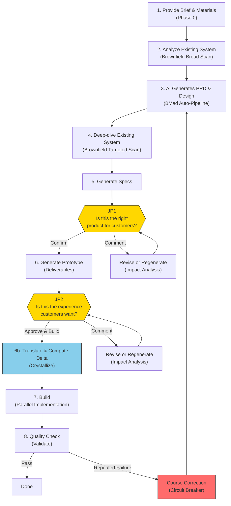

# JDD Sprint Kit Blueprint

> jdd-sprint-kit aspires to be a tool that enables product experts — not developers —
> to turn their judgments into software outcomes directly, powered by AI.
> Users don't know code, but they know what customers want.
> They do only three things:
> decide what to build, check if the result is right, and say why it's not if it isn't.
> Everything else is handled by AI,
> with the goal of dramatically accelerating existing service development velocity.
>
> Core principle: **Human judgment is the only lasting asset. All AI outputs are regenerable consumables.**
>
> Quality bar: **"A non-developer can recreate this service with AI using only this document."**

---

## Overall Flow



---

## How to Read This Document

This document is organized as a **Follow-Along** walkthrough. Instead of describing the system abstractly, each step presents both **what the user sees** and **what happens inside the system**.

> **Example notation**: `tutor-exclusion` (tutor exclusion feature) is a real example project available at `specs/test-tutor-excl/`.

| Section | Content |
|---------|---------|
| **S1 Problem** | Why this product exists |
| **S2 Thesis** | Core principle + design judgments + preconditions |
| **S3 User Model** | Who uses it and what role they play |
| **S4 Value Chain** | System components + pipeline walkthrough + route selection + cost |
| **S5 Judgment & Feedback** | 2-JP model + judgment details + feedback handling |
| **S6 Constraints & Trade-offs** | What it doesn't do + conscious trade-offs |
| **S7 Risk Model** | Assumptions + what breaks + detection signals |
| **S8 Current State** | Current status + unvalidated hypotheses + known gaps |
| **Appendix** | Setup/operations, file structure, glossary |

---

# 1. Problem

In software development, **"the person who can decide ≠ the person who can build"** is the biggest bottleneck. The person who best knows what customers want (product expert) doesn't know code, and the person who can write code (developer) doesn't directly know the customer.

Existing methodologies address this gap differently:

```
Waterfall:  Define everything upfront → implement at once (ideal)
            Gaps found → high cost to go back (reality)

Agile:      Incremental improvement through iterations (solution)
            But each iteration incurs implementation cost; product experts still depend on developers

AI era:     AI generates quickly → human judges → regenerate (new possibility)
            Regeneration cost ≠ 0, judgment also takes time (reality)
```

Sprint Kit addresses this bottleneck from two directions:
1. **Raise first-generation quality through upfront input** to reduce iteration count
2. **Only use human time at customer-perspective judgment points**

AI can code quickly. But human time is consumed in the loop of requirements → design → verification → revision. Sprint Kit maximizes this loop's efficiency, enabling product experts to turn their judgments into software without developers.

---

# 2. Thesis

## 2.1 Core Principle

**Human judgment is the only lasting asset. All AI outputs are regenerable consumables.**

This is Sprint Kit's sole principle. Every other design judgment exists to realize it.

## 2.2 Design Judgments

Design judgments Sprint Kit has made to realize the core principle.

> Philosophical background and discussion for each judgment: [`docs/judgment-driven-development.md`](judgment-driven-development.md)
> Delta-Driven Design (conceptual foundation): [`docs/delta-driven-design.md`](delta-driven-design.md)

### Artifacts as Medium

> The most accurate and fastest input comes from reactions to concrete artifacts, not from abstract questions.

People answer imprecisely to "what matters in the search feature?" but respond accurately to "is this search screen right?"

**Sprint Kit implementation — 2-JP model**: Judgment is requested at exactly 2 points in the process. JP1 presents the PRD (Product Requirements Document — a structured document defining what to build) + requirements as a **customer journey narrative** for judgment. JP2 provides a **working prototype** for hands-on judgment. Both points request judgment only on top of concrete artifacts.

### Input Reduces Cycles

> Upfront input (meeting notes, references, existing system context) raises first-generation quality, reducing regeneration count.

```
Total cost = (upfront input cost) + (generation cost × generation count) + (judgment cost × judgment count)

Rich upfront input:    generation count ↓, judgment count ↓  → total cost ↓
No upfront input:      generation count ↑, judgment count ↑  → total cost ↑
```

**Sprint Kit implementation — inputs/ directory + Brownfield Scanner**: Place meeting notes and references in `specs/{feature}/inputs/`. Brownfield Scanner automatically collects existing system context from external sources (existing service repos, Figma designs) + local codebase. If you have the product team's kickoff meeting notes, simply placing them in inputs/ significantly improves the AI's first PRD generation quality.

### Regeneration Over Modification

> All AI outputs are consumables. Regeneration, not modification, is the default. Human judgment alone is the lasting asset; everything else is regenerable.

```
AI-era regeneration approach:
Document v1 → feedback → entirely new v2 reflecting feedback → feedback → v3
Advantage: consistent results each time
Prerequisite: human judgment (feedback) accumulates and feeds into the next generation
```

**Sprint Kit implementation — Comment handling flow + Circuit Breaker**: When Comment is given at a JP, the system presents **apply-fix+propagate** (small-scale) or **regenerate** (large-scale) with cost estimates. The user chooses based on cost. Apply-fix is also validated by Scope Gate (a 3-stage verification that checks whether changes are internally consistent across all artifacts — details in S4.2) for consistency. Circuit Breaker is a normal mechanism that expands regeneration scope to the entire Sprint on repeated failures. (Full flow detail: S5.4. Trade-off cost: S6.2.)

### Customer-Lens Judgment Points

> Human intervention points are placed at "moments when the product expert can judge what product will be served to customers."

**Sprint Kit implementation — JP1 + JP2**:
- JP1 "Is this the right product for customers?" — presents requirements, scenarios, feature scope as customer journey narrative
- JP2 "Is this the experience customers want?" — hands-on experience with working prototype + key scenario guide
- Response: **Confirm** (proceed) / **Comment** (impact analysis → apply-fix or regenerate with cost estimates → user chooses)
- Presentation format and flow details: S5.2 (JP1), S5.3 (JP2). Trade-off of limiting to 2 JPs: S6.2.

### Knowledge Shape Determines Route

> The route depends on the shape of the person's knowledge.

| Knowledge Shape | Suitable Route | Entry Point |
|----------------|---------------|-------------|
| Rich unstructured context (meeting notes, data) | **Sprint** — AI organizes, I judge | `/sprint` |
| Unexplored territory (new market, new problem) | **Guided** — discover and define with AI | BMad 12-step |
| Already-structured artifacts (existing PRD) | **Direct** — execute immediately | `/specs` |

**Sprint Kit implementation — 3 routes**: All three routes converge into the same pipeline (`[Specs] → JP1 → [Deliverables] → JP2 → [Execute]`). Routes are not fixed; they can be switched as needed (crossover).

### Auto-Context, Human-Judgment

> Technical context collection is performed automatically by AI. Humans are presented with customer-impact translations for judgment only.

```
AI collects:                                Presented to human:
"Existing API /api/v1/tutors has            "The existing 'Tutor Management' feature
 GET, POST, DELETE endpoints.                will be affected. A new 'Block' button
 blockTutor method not implemented           will be added to the current tutor list
 in TutorService class.                      screen, changing the existing user
 tutor_block_list table missing in DB"       experience. Do you approve?"
```

**Sprint Kit implementation — Brownfield auto-collection + customer-impact translation**: Brownfield Scanner auto-collects from document-project, external sources (repos, Figma), and local codebase. Data is organized in brownfield-context.md in 4 layers, each going deeper into the existing system:

- **L1 (Domain)**: What business concepts exist (e.g., "Tutor", "Lesson", "Matching")
- **L2 (Behavior)**: How those concepts behave (e.g., "POST /api/tutors creates a tutor record")
- **L3 (Component)**: Which code modules are involved (e.g., "TutorService in src/services/")
- **L4 (Code)**: Specific code locations and interfaces that the new feature will touch

The layered approach exists because early planning (PRD) needs only domain/behavior context (L1+L2), while later stages (Architecture, implementation) need component/code-level detail (L3+L4). Collecting everything upfront would be wasteful and inaccurate before the feature scope is defined.

At JP1/JP2, technical data is **translated into customer impact** for presentation.

## 2.3 Preconditions

The core principle holds only if the following are true:

1. **AI generation quality is "review-worthy"** — AI-generated PRDs, designs, and prototypes must be at a level where experts can meaningfully judge them. Not "roughly correct" but "worth reviewing."
2. **Product experts can make customer-perspective judgments** — Users understand customers well enough to judge the fitness of outputs.
3. **Upfront input actually improves AI generation quality** — Meeting notes, references, and existing system context make a meaningful difference in AI's first generation.

## 2.4 When the Principle Fails

- **If human judgments don't accumulate**: If feedback isn't reflected in the next regeneration and the same quality output keeps appearing, the system enters an infinite regeneration loop.
- **If AI output regeneration cost becomes prohibitive**: If a single cycle takes hours, "treating as consumables" becomes impossible and the system regresses to patch-based modification.
- **If product expert's judgments are inaccurate**: If someone with poor customer understanding makes judgments, no matter how fast AI regenerates, convergence toward the right direction won't happen.

---

# 3. User Model

## 3.1 Product Expert

Sprint Kit's target user is the **product expert**. ~~Not "non-developer" as the opposite of developer~~, but **someone who is an expert on customers and can best judge what outcomes should look like**.

Real user examples:
- A PM starts a Sprint with kickoff meeting notes
- A founder explores a new product idea through the Guided route
- A designer runs a Sprint based on Figma mockups
- A person with an existing PRD executes directly via the Direct route

## 3.2 What Humans Do — 3 Roles

| Role | Action | When |
|------|--------|------|
| **Decide** | Determine what to build (provide Brief, materials, references) | Before Sprint start |
| **Judge** | Judge whether the output is right (Confirm / Comment) | JP1, JP2 |
| **Feedback** | Say why it's not right (enter correction direction as free text) | On JP Comment |

## 3.3 What the System Does — 4 Roles

| Role | Action | Design Judgment Rationale |
|------|--------|--------------------------|
| **Collect** | Auto-collect existing system context + translate to customer impact | Auto-Context, Human-Judgment |
| **Generate** | Auto-generate planning artifacts, design, prototype | Input Reduces Cycles |
| **Present** | Request judgment on top of concrete artifacts | Artifacts as Medium |
| **Regenerate** | Apply fix or regenerate based on feedback | Regeneration Over Modification |

---

# 4. Value Chain

## 4.1 System Components

### Tool Stack

| Tool | Role |
|------|------|
| **BMad Method** | Base platform: agents, workflow engine, facilitation (`_bmad/`) |
| **Sprint Kit** | BMad execution extension: auto-pipeline, Specs, Deliverables, Prototype |
| **Claude Code** | AI IDE — agent execution environment |
| **Claude Code Native Teams** | Agent coordination, task dependency tracking |
| **MCP (Figma)** | Figma design data access. MCP (Model Context Protocol) is a protocol that lets AI access external data sources via authenticated connections. Currently used for Figma only — other external data uses `--add-dir` or tarball snapshot (see Brownfield Data Sources below) |
| **Git Worktree** | Conflict-free parallel implementation environment |
| **GitHub CLI (`gh`)** | Issue/PR management, task tracking |
| **Specmatic** | OpenAPI contract-based automated testing (Worker self-verification) |
| **MSW (Mock Service Worker)** | Prototype stateful API (network interception via browser Service Worker) |
| **@redocly/cli** | OpenAPI spec validation — checks for syntax errors, structural issues, and mismatches between example data and schema definitions |
| **npx jdd-sprint-kit** | Sprint Kit install/update CLI |

#### Tool Selection Rationale

Most tools above are platform givens (BMad, Claude Code) or have no practical alternatives (GitHub CLI, MCP for Figma). The following were deliberate choices:

**MSW (Mock Service Worker)** — Selected for prototype fidelity. Requirement: JP2 judgment requires a prototype that behaves like a real service (stateful CRUD across flows). MSW intercepts at the network level via browser Service Worker, so the React app calls APIs with the same code as production — unaware it's mocked. Previously used Prism (OpenAPI proxy mock), but Prism could not maintain cross-request state (e.g., "POST creates a record → GET returns it"), making realistic user journeys impossible.

**Specmatic** — Selected for contract-based verification. Requirement: Workers implementing in parallel must verify API conformance without a running backend. Specmatic generates contract tests directly from `api-spec.yaml`, enabling each Worker to self-verify in isolation. Alternative considered: Pact, which tests contracts from the consumer side (frontend declares expectations, backend is tested against them). But Sprint Kit defines the API spec before any consumer code exists, so Specmatic's approach — testing directly against the API spec — is a natural fit.

**@redocly/cli** — Selected for OpenAPI validation depth. Requirement: catch structural errors and example ↔ schema mismatches before MSW handler generation. Redocly detects example/schema conformance issues that Spectral (the main alternative) does not cover by default.

**Git Worktree** — Selected over feature branches for parallel Workers. Worktrees create separate working directories from the same repository, so multiple Workers can edit files simultaneously without blocking each other. With regular feature branches, only one branch can be checked out at a time per directory, requiring switching back and forth.

### Agent 3-Tier Architecture

Sprint Kit uses agents in three tiers.

**BMad Agents** — Planning artifact generation (provided by BMad Method — each agent is a specialized AI prompt with defined expertise, inputs, and outputs):

| Agent | Role | Input → Output | Sprint Invocation |
|-------|------|----------------|-------------------|
| **Mary** (Analyst) | Brainstorming, research | sprint-input.md → product-brief.md | Auto-Pipeline Step 1 |
| **John** (PM) | Requirements definition | product-brief + sprint-input → prd.md | Auto-Pipeline Step 2 |
| **Winston** (Architect) | Technical design | prd + brownfield-context → architecture.md | Auto-Pipeline Step 3 |
| **John** (PM) | Epics & Stories | prd + architecture → epics-and-stories.md | Auto-Pipeline Step 4 |
| **Sally** (UX Designer) | UX/UI design | — | Guided route |
| **Bob** (Scrum Master) | Sprint Planning | — | Guided route |
| **Murat** (Test Architect) | Test design | — | Guided route |
| **Paige** (Tech Writer) | Documentation | — | Guided route |
| **Barry** (Quick Flow Solo Dev) | Small tasks | — | Quick Flow |

**Sprint Agents** — Auto-pipeline orchestration (added by Sprint Kit):

| Agent | Role | Input → Output | When |
|-------|------|----------------|------|
| **@auto-sprint** | Sprint orchestration + Conductor 4 roles (Goal Tracking, Scope Gate, Budget, Redirect — details in S4.2 BMad Auto-Pipeline) | sprint-input.md → all planning-artifacts/ | Entire Sprint |
| **@scope-gate** | 3-stage validation: Structured Probe + Checklist + Holistic Review | Previous artifact + goals → Pass/Fail + gap report | After each BMad step + after deliverables |
| **@brownfield-scanner** | Brownfield data collection from external sources + local codebase (L1~L4) | external sources + local code → brownfield-context.md | Pass 1 (broad) + Pass 2 (targeted) |
| **@deliverable-generator** | Full-stack deliverable generation | planning-artifacts/ → Specs + Deliverables + MSW Mocks + readiness.md + Prototype | Specs/Deliverables stage |

**Execute Agents** — Implementation + verification:

| Agent | Role | Input → Output | When |
|-------|------|----------------|------|
| **@worker** | Task implementation in isolated worktree + Specmatic self-verification | Task + Specs + brownfield → implementation code | Parallel |
| **@judge-quality** | Code structure, patterns, duplication, conventions + Specmatic verification (API implementation matches the spec) | Implementation code + Specs → Pass/Fail + issue list | Validate Phase 1 |
| **@judge-security** | OWASP Top 10 (standard list of critical web security vulnerabilities), injection, auth bypass verification | Implementation code → Pass/Fail + vulnerability list | Validate Phase 2 |
| **@judge-business** | Implementation verification against PRD acceptance criteria | Implementation code + PRD → Pass/Fail + unmet FR list | Validate Phase 3 |

### Brownfield Data Sources

Four sources for collecting existing system context. Each source has a different access method and a reason for using that method.

| Source | Description | Access Method | Why This Method |
|--------|-------------|---------------|-----------------|
| **document-project** | Structured docs generated by BMad `/document-project` workflow (project overview, API contracts, data models) | Direct file read | Already local files — no special access needed |
| **External repos** (`--add-dir` / tarball) | Existing service code repositories. Two access methods: (1) `--add-dir` — a Claude Code launch option that adds a local directory to the AI's accessible file scope. Use when you have a local clone. (2) tarball snapshot — the system downloads a read-only copy of a GitHub repo's current files via `gh api tarball/HEAD`. Use when you don't have a local clone and just have a GitHub URL. | Glob, Grep, Read (same tools as local files) | Until v0.3.x, external repos were accessed via MCP (filesystem MCP servers). However, Claude Code's MCP security restricts MCP servers to the project root directory, blocking access to repos stored elsewhere. `--add-dir` and tarball bypass this restriction by making external files directly readable. |
| **Figma** | Live design data (wireframes, components, design tokens) | MCP protocol (OAuth authentication) | Unlike code repos, Figma data is not downloadable as files — it exists only as live data on Figma's servers. MCP is the only way to query it. |
| **Local codebase** | Source code in the current project | Glob, Grep, Read | Already part of the project — no special access needed |

**Topology** — the Scanner auto-detects the project's deployment structure and adjusts its scan strategy:

| Topology | What It Means | External Sources | Local Code | Scan Strategy |
|----------|---------------|------------------|------------|---------------|
| **standalone** | Greenfield or external-only system | Available | N/A | External sources are the sole data source |
| **co-located** | Monolithic — all code is in this repository | Available | Full scan | Local code is primary; external sources supplement |
| **msa** | Microservices — only some services are local | Available | Partial | External sources are primary (cross-service visibility); local scan limited to L1-L2 |
| **monorepo** | Multiple packages in one repository | Available | Full scan (relevant packages) | Local code is primary; scoped to relevant packages only |

Greenfield projects work without any Brownfield sources.

### Brownfield Context Generation

brownfield-context.md organizes existing system context in L1~L4 layers. Sprint references this file to design APIs that don't duplicate existing ones and build features that don't break existing screen flows.

**Auto-generation (Sprint route)**: @brownfield-scanner generates it automatically when `/sprint` is run.

1. Phase 0 determines topology — detects document-project availability, external data sources (`--add-dir` paths, GitHub repo URLs, Figma MCP), and build tools to determine project type (`standalone` / `co-located` / `msa` / `monorepo`).
2. Pass 1 (Broad Scan) collects domain concepts (L1) and behavior patterns (L2) based on Brief keywords.
3. Pass 2 (Targeted Scan) collects integration points (L3) and code-level details (L4) after Architecture/Epics completion.

Results are written to `specs/{feature}/planning-artifacts/brownfield-context.md`. Detailed per-pass behavior is described in S4.2 Pipeline below.

**Pre-preparation — document-project (recommended)**: Running the BMad `/document-project` workflow before Sprint improves Brownfield scan quality. This workflow analyzes the existing codebase and generates structured documents (project overview, API contracts, data models, etc.). Sprint's Brownfield Scanner uses these as seed data, narrowing scan scope and reducing gaps.

**Manual preparation (without external sources)**: When external data sources cannot be configured, you can write brownfield-context.md manually and place it at `specs/{feature}/brownfield-context.md` or `specs/{feature}/planning-artifacts/brownfield-context.md`. Sprint detects existing files and reuses covered levels without re-scanning. The format is defined in `_bmad/docs/brownfield-context-format.md`.

**Greenfield**: No preparation needed for new projects without existing systems. Auto-detected in Phase 0; Brownfield scan is skipped.

---

## 4.2 Pipeline

> Follows the Sprint route (`/sprint` command) for the full process walkthrough. Guided/Direct route differences are covered in S4.3.

### Phase 0: Sprint Onboarding (Smart Launcher)

**Rationale**: Input Reduces Cycles — input quality determines the regeneration count of the entire downstream pipeline.

**User perspective**: Three ways to start.

```bash
# Method 1: Inline Brief — start immediately with a one-line description
/sprint "A feature that lets students block specific tutors after lessons"

# Method 2: Feature Name — start with prepared materials in inputs/
/sprint tutor-exclusion

# Method 3: New Feature — folder does not exist yet
/sprint tutor-exclusion
# → system creates specs/tutor-exclusion/inputs/brief.md template → exits
# → user fills in brief.md → re-runs /sprint tutor-exclusion
```

For Method 2, place materials in `specs/tutor-exclusion/inputs/`. **brief.md is not required** — even with just meeting notes or references, AI auto-generates the Brief.

For Method 3, the system auto-creates `specs/{feature}/inputs/` and a **brief.md template**. The template includes a **Reference Sources** (`## Reference Sources`) section with 4 sub-sections:

- **GitHub**: Declare existing service repo URLs (e.g., `https://github.com/org/backend-api`). The system downloads a tarball snapshot (a read-only copy of the current files via `gh api tarball/HEAD`, not a git clone) and the Brownfield Scanner analyzes that code. URLs declared here are downloaded without confirmation — declaring them is the user's explicit intent.
- **Figma**: Declare Figma design URLs. The system connects via Figma MCP to read live design data.
- **Policy Docs**: List document names that the Scanner should prioritize (e.g., `matching-policy.md`).
- **Scan Notes**: Free-text guidance for Brownfield scan direction (e.g., "focus on matching engine and reservation flow").

After filling in brief.md, run `/sprint feature-name` again to start the Sprint.

**System internals**:

Entry point branching:

| Input Form | Behavior |
|-----------|----------|
| Inline Brief (`"..."`) | Auto-creates `specs/{slug}/inputs/brief.md` → analysis |
| feature-name (folder exists) | **Full scan** of `specs/{name}/` → input state assessment → optimal route branching |
| feature-name (folder does not exist) | **Auto-create** `specs/{name}/inputs/brief.md` template → display guidance → exit |

Full scan (feature-name entry): Scans `specs/{feature}/` at once to detect inputs/ file list, brownfield-context.md existence + levels, planning-artifacts/ completeness, and BMad outputs (`_bmad-output/`).

| Input State | Route |
|------------|-------|
| brief.md + references | **Normal Sprint** |
| References only (no brief.md) | **AI auto-generates Brief** → Normal Sprint |
| Planning artifacts complete | **Direct route suggested** (`/specs` guidance) |
| Folder exists but inputs/ empty | **Error** (material placement guidance) |

Subsequent system processing:
- Brief parsing + Reference Materials analysis (under 200 lines: full inclusion / over: summarized)
- Reference Sources section parsing: extract GitHub repo URLs, Figma URLs, policy doc names, scan notes from brief.md
- GitHub repo URL auto-detection: scan all inputs/ files for GitHub URLs not declared in Reference Sources → ask user whether to download
- Brief Sentences extraction: sentence-level decomposition + BRIEF-N ID assignment → used for source tagging on each PRD FR (Functional Requirement — a specific function the system must provide)
- Causal Chain extraction (optional, opt-in): traces back from the observed problem to its root cause: Phenomenon → Root Cause → Solution Rationale → Feature Request. When enabled, each PRD FR is classified as core (directly resolving the root cause), enabling, or supporting — helping the product expert verify at JP1 that the proposed features actually address the underlying problem rather than just symptoms. When not enabled, FRs are generated without this classification and the Sprint proceeds normally.
- Brownfield status detection: check existing brownfield-context.md → search for document-project → detect external data sources (`--add-dir` directories, GitHub repos from Reference Sources, Figma MCP) → local codebase build tool detection → topology determination

Brief grade assessment:

| Grade | Condition | Behavior |
|-------|-----------|----------|
| **A** (sufficient) | 3+ features, 1+ scenarios, or references compensate | Normal proceed |
| **B** (moderate) | 1-2 features, no scenarios | Show warning at confirmation |
| **C** (insufficient) | 0 features, keywords only | Sprint not recommended + `force_jp1_review: true` (forces mandatory manual review at JP1 because Brief quality is low) |

**User perspective — Confirmation screen**: Presents scan result summary (inputs/ file list, brownfield status, planning-artifacts status) + Sprint start confirmation (extracted goals, complexity, estimated time, contradiction warnings).

**Artifact**: `specs/{feature}/inputs/sprint-input.md` — Phase 0's SSOT (Single Source of Truth). All downstream agents reference this file instead of re-reading the original inputs.

**On failure**: Fallback 1 (full analysis success) → Fallback 2 (only brief.md analyzable) → Fallback 3 (inline Brief only) → Fallback 4 (no input, Sprint aborted).

---

### Pass 1: Brownfield Broad Scan

**Rationale**: Auto-Context, Human-Judgment — AI auto-collects existing system context; humans are asked for judgment only.

**User perspective**: Automatic. No user intervention.

**System internals**: If existing brownfield-context.md found, check L1+L2 levels and reuse; supplement missing levels only. If absent, @brownfield-scanner runs in broad mode.

- Stage 0: Consume document-project outputs (if available, build initial context)
- Stage 1-4: Collect L1 (Domain) + L2 (Behavior) via external sources + local scan

**Artifact**: `specs/{feature}/planning-artifacts/brownfield-context.md` (L1 + L2)

**On failure**: External source access failure → record `brownfield_status: partial-failure` + proceed with available sources only. Greenfield → skip.

---

### BMad Auto-Pipeline

**Rationale**: Input Reduces Cycles — rich input + Brownfield context raises BMad agents' first-generation quality.

**User perspective**: Automatic. @auto-sprint Conductor calls BMad agents sequentially.

**System internals**:

Conductor (@auto-sprint) 4 roles:
1. **Goal Tracking** — progress tracking against sprint-input.md goals
2. **Scope Gate** — invoke @scope-gate after each step, detect scope drift
3. **Budget** — soft gate, prevent excessive regeneration
4. **Redirect** — scope reduction/redirection on drift detection

Context Passing: Agents reference files by path rather than copying content between them. This prevents stale or conflicting versions of the same information from circulating.

| Step | Agent | Input | Output | Validation |
|------|-------|-------|--------|------------|
| 1 | Mary → Product Brief (AUTO) | sprint-input.md | product-brief.md | — |
| 2 | John → PRD (AUTO) | product-brief + sprint-input | prd.md | @scope-gate |
| 3 | Winston → Architecture (AUTO) | prd + brownfield-context | architecture.md | @scope-gate |
| 4 | John → Epics & Stories (AUTO) | prd + architecture | epics-and-stories.md | @scope-gate final |

Each PRD FR is tagged with its origin: `BRIEF-N` (traced to a specific Brief sentence), `DISC-N` (discovered in reference materials but not in the Brief), or `AI-inferred` (added by AI based on domain knowledge). This tagging enables the JP1 mapping table (S5.2) to show exactly where each requirement came from.

**Artifacts**:
```
specs/{feature}/planning-artifacts/
├── product-brief.md
├── prd.md
├── architecture.md
└── epics-and-stories.md
```

**On failure**: Budget Control (warn when same artifact regeneration exceeds soft limit), Redirect (scope reduction or Sprint abort on severe Scope Gate drift).

---

### Pass 2: Brownfield Targeted Scan

**Rationale**: Auto-Context, Human-Judgment — precision scan of specific impact areas based on Architecture + Epics.

**User perspective**: Automatic. No user intervention.

**System internals**: @brownfield-scanner runs in targeted mode. L3 (Component): affected components, services, modules. L4 (Code): specific code locations, interfaces, dependencies.

**Artifact**: `specs/{feature}/planning-artifacts/brownfield-context.md` (L1 + L2 + L3 + L4 append)

---

### Specs Generation

**Rationale**: Regeneration Over Modification — Specs are the execution stage's SSOT (Single Source of Truth — the one authoritative file that all other components reference; when information conflicts, SSOT wins) and regenerable consumables.

**User perspective**: Automatic. No user intervention.

**System internals**: @deliverable-generator runs in specs-only mode.

- **Stage 1: Entity Dictionary generation** — extract core entities from PRD + Architecture, define terms, relationships, constraints
- **Stage 2: Specs 4-file generation**:
  - `requirements.md` — PRD → structured requirements (each item with source tagging)
  - `design.md` — Architecture → structured design (components, interfaces)
  - `tasks.md` — Epics → parallelizable task list (each task is tagged with Entropy — its uncertainty level [Low/Medium/High] indicating the probability of unexpected issues — and file ownership assignment)
  - `brownfield-context.md` (frozen) — frozen snapshot copied from planning-artifacts/ (referenced by Workers)

SSOT reference priority (higher priority overrides lower): `api-spec.yaml` overrides `design.md` API section; `schema.dbml` overrides `design.md` data model section. When the same information appears in multiple files, the higher-priority file wins.

@scope-gate deliverables: API Data Sufficiency verification — checks whether each API call in a user flow has all the data it needs from preceding API responses. For example, if "get tutor details" requires a tutor ID, there must be a preceding API call that returns that ID. Without this check, the prototype or implementation would encounter missing-data errors mid-flow.

**Artifacts**:
```
specs/{feature}/
├── entity-dictionary.md
├── requirements.md
├── design.md
├── tasks.md
└── brownfield-context.md  (frozen snapshot)
```

---

### JP1: "Is this the right product for customers?"

**Rationale**: Customer-Lens Judgment Points + Artifacts as Medium — customer-perspective judgment on top of concrete artifacts (customer journey narrative).

**User perspective**: System presents a Visual Summary. User responds with Confirm / Comment.

JP1 presentation format and Comment handling flow details in S5.2.

---

### Deliverables Generation

**Rationale**: Artifacts as Medium — generate concrete artifacts (working prototype) for judgment at JP2.

**User perspective**: Automatic. System generates all deliverables after JP1 approval.

**System internals**: @deliverable-generator runs in full mode.

| Deliverable | File | What It Is and Why It Exists |
|-------------|------|------------------------------|
| OpenAPI 3.1 YAML | `api-spec.yaml` | API contract — a machine-readable specification of every API endpoint (URL, request/response format, data types). This single file drives 3 things: MSW mock generation, Specmatic contract tests, and implementation verification. Without it, mocks and tests would be manually written and diverge from the actual API design. |
| API Sequences | `api-sequences.md` | Mermaid sequence diagrams showing the order of API calls in key user flows. Used to verify that no flow requires data that hasn't been fetched yet. |
| DBML Schema | `schema.dbml` | Database design in DBML (Database Markup Language) — a human-readable format for defining tables, columns, and relationships. Can be visualized as an ERD (Entity-Relationship Diagram) on dbdiagram.io. |
| BDD/Gherkin | `bdd-scenarios/` | Acceptance tests in Given-When-Then format. BDD (Behavior-Driven Development) describes expected behavior in natural language. Gherkin is the specific syntax (Given/When/Then). These scenarios become automated tests during implementation. |
| State Machines | `state-machines/` | XState (a state machine library) definitions. Generated only when the feature involves complex state transitions (e.g., order status: pending → confirmed → shipped → delivered). |
| Decision Log | `decision-log.md` | ADR (Architecture Decision Record) — documents each design decision, alternatives considered, and the rationale for the chosen approach. Also includes AI's reasoning trace. |
| Traceability Matrix | `traceability-matrix.md` | End-to-end mapping: FR → Design → Task → BDD → API. Ensures every requirement has a corresponding design, task, test, and API endpoint. Gaps in this mapping indicate missing coverage. |
| Key Flows | `key-flows.md` | Key user flow step-by-step walkthrough (used as the JP2 verification guide) |
| MSW Mocks | `preview/src/mocks/` | MSW handlers that make the prototype behave like a real service (see S5.3 for how MSW works) |
| Prototype | `preview/` | React + MSW stateful prototype — the clickable application the product expert judges at JP2 |

---

### JP2: "Is this the experience customers want?"

**Rationale**: Customer-Lens Judgment Points + Artifacts as Medium — judgment through **hands-on experience with a working prototype**.

**User perspective**: Run the prototype (`cd specs/{feature}/preview && npm run dev`), follow the key scenario guide, and click through to judge.

JP2 presentation format and Comment handling flow details in S5.3.

---

### Crystallize (Mandatory Translation Step)

**Rationale**: In the delta-driven model, Crystallize translates the JP2-approved prototype into development grammar and computes the delta between target state and brownfield baseline. Without this translation, Workers would implement pre-JP2 specs instead of the approved prototype's delta.

**User perspective**: When you select **[A] Approve & Build** at JP2, the system automatically runs Crystallize (~15-20 min). It analyzes the prototype code, translates it into development specifications, and computes exactly what needs to change from the current system. Original documents are preserved untouched — translated versions are written to a separate `reconciled/` directory with a delta manifest.

**Mandatory**: Crystallize runs automatically on all routes after JP2 approval. If Crystallize encounters an unresolvable issue, you can return to JP2, skip Crystallize (proceed with original specs), or exit.

**System internals**:

| Step | Action | Output |
|------|--------|--------|
| S0 | Analyze JP2 decision records (intent and context) | `reconciled/decision-context.md` |
| S1 | Analyze prototype code (pages, components, API handlers, data model) | `reconciled/prototype-analysis.md` |
| S2 | Reconcile PRD + Architecture + Epics with prototype | `reconciled/planning-artifacts/` |
| S3 | Generate Specs from reconciled planning artifacts | `reconciled/requirements.md`, `design.md`, `tasks.md` |
| S4 | Verify/regenerate Deliverables (API spec, BDD, key flows) | `reconciled/api-spec.yaml`, `bdd-scenarios/`, etc. |
| S5 | Cross-artifact consistency check (gap=0 required) | PASS/FAIL |
| S6 | Summary + proceed to Parallel with reconciled artifacts | — |

**Reconciliation principles**: The prototype provides what the product **does** (screens, features, API endpoints, data model, user flows). Items that the prototype cannot supply — NFRs (Non-Functional Requirements), security architecture, deployment strategy, scaling — are carried forward from the original documents and marked with `[carry-forward]`. Product Brief is excluded from reconciliation because it defines the problem space, not the solution.

**Source attribution**: Each requirement in the reconciled PRD is tagged with its origin chain. In this notation, `source` indicates where the requirement was confirmed (prototype or carried from original), and `origin` indicates where it was first proposed:
- `(source: PROTO, origin: BRIEF-3)` — confirmed in prototype, originally from brief sentence 3
- `(source: PROTO, origin: DD-2)` — confirmed in prototype, originated from decision-diary entry 2
- `(source: carry-forward, origin: BRIEF-3)` — not in prototype, carried from original document, originally from brief sentence 3
- `(source: carry-forward)` — not in prototype, carried from original document (NFR, security, etc.)

This preserves traceability from the original Brief through JP2 iteration to the final reconciled artifacts.

**Budget**: ~85-125 turns (separate from JP2 iteration budget). Does not count against the 5-round JP2 iteration limit.

**Artifact**: `specs/{feature}/reconciled/` — mirrors the existing `specs/{feature}/` structure, minus excluded items (Product Brief, sprint-log, readiness, inputs/, preview/).

**Availability**: All routes. Triggered automatically by [A] Approve & Build at JP2 (Sprint route) or at `/preview` Step 3 (Guided/Direct routes). Also available standalone via `/crystallize feature-name`. Decision records (decision-diary.md, sprint-log.md JP Interactions) are optional — they enrich the translation when present.

---

### Parallel Implementation

**User perspective**: Automatic. Progress can be monitored.

**System internals**:

1. **Interface Contract creation** — shared type/interface files (data structures that multiple tasks reference) are created before parallel work starts. Without this, Workers would define conflicting versions of the same data types.
2. **GitHub Issues creation** — each task is registered as a GitHub Issue via `gh issue create`, recording dependencies, file ownership, and Entropy. This provides a trackable record of what each Worker is doing.
3. **Git Worktree setup** — Git Worktree creates independent working directories that share the same repository history. Each Worker gets its own worktree, so multiple Workers can modify files simultaneously without filesystem conflicts.
4. **Native Teams @worker creation** — Claude Code Native Teams (the built-in agent coordination system) spawns multiple @worker agents in parallel, one per task.
5. **Parallel execution** — each Worker implements its task independently, self-verifies API conformance via Specmatic (automatically checks that the implemented API endpoints match the specification defined in `api-spec.yaml` — correct URLs, request/response formats, and data types), and on completion closes its GitHub Issue and notifies dependent Workers.
6. **Merge & Integration** — merge worktrees in dependency order + integration test

File ownership: `tasks.md` specifies owned files per task. Workers modify only assigned files. When shared file modification is needed, request through team leader.

**On failure**: Worker Failure Protocol — auto-retry on first failure (max 2 times) → report to team leader on retry failure → partial merge option.

---

### Validate

**User perspective**: Automatic. 3-Phase verification results are reported.

**System internals**:
- **Phase 1: @judge-quality** — code structure, patterns, duplication, conventions + Specmatic verification (API implementation matches the spec)
- **Phase 2: @judge-security** — OWASP Top 10 (standard list of critical web security vulnerabilities), injection, auth bypass
- **Phase 3: @judge-business** — implementation verification against PRD acceptance criteria; (when causal_chain provided) confirms core FRs actually resolve root_cause

**On failure**: 3 consecutive failures in same category or 5 cumulative failures → Circuit Breaker auto-triggers.

---

### Course Correction (Circuit Breaker)

**Rationale**: Regeneration Over Modification — repeated failure is a normal trigger to expand regeneration scope.

**User perspective**: System suggests course correction. Can also be triggered manually via `/circuit-breaker`.

**Trigger**: 3 consecutive VALIDATE failures in same category / 5 cumulative failures / Comment regeneration scope expands to entire Sprint.

| Severity | Response |
|----------|----------|
| **Minor** | Fix Specs → re-run Execute |
| **Major** | Regenerate from BMad Auto-Pipeline (@auto-sprint Phase 1 re-run) |
| **Guided/Direct route** | BMad `correct-course` workflow integration |

---

## 4.3 Route Selection

**Rationale**: Knowledge Shape Determines Route — the entry point varies based on the user's knowledge shape.

All routes converge into the same pipeline:

```
[Input + Brownfield + BMad] → [Specs] → JP1 → [Deliverables] → JP2 → [Execute]
```

### Sprint Route — When You Have Materials

> **"AI organizes, I judge."**

**Entry point**: `/sprint "Brief"` or `/sprint feature-name`

For when you have meeting notes, references, a quick Brief, or other unstructured context. AI auto-generates all planning artifacts; the product expert judges at JP1/JP2.

```
Place materials in specs/{feature}/inputs/ → /sprint {feature-name}
  Phase 0: Smart Launcher → sprint-input.md generation
  → @auto-sprint (automatic)
  Pass 1 → BMad Auto-Pipeline → Pass 2 → Specs
  → JP1 → Deliverables → JP2
  → Crystallize (auto): translate prototype → compute delta → reconciled/
  → /parallel → /validate
```

Characteristics: Fully automatic (human intervention only at JP1/JP2), `tracking_source: brief` (each requirement is traced back to a specific Brief sentence via BRIEF-N IDs).

### Guided Route — When Exploration is Needed

> **"Discover and define together with AI."**

**Entry point**: BMad 12-step conversation

For new products, new markets, or idea-stage exploration requiring systematic discovery.

```
/create-product-brief → /create-prd → /create-architecture → /create-epics
→ /specs → JP1 → /preview → JP2
→ Crystallize (auto): translate prototype → compute delta → reconciled/
→ /parallel → /validate
```

Characteristics: Human participates at every step during BMad conversation, `/specs` auto-detects `_bmad-output/planning-artifacts/`, `tracking_source: success-criteria` (requirements are traced back to PRD Success Criteria instead of Brief sentences).

### Direct Route — When Planning is Complete

> **"Execute immediately."**

**Entry point**: `/specs feature-name` (with complete planning-artifacts)

```
/specs → JP1 → /preview → JP2
→ Crystallize (auto): translate prototype → compute delta → reconciled/
→ /parallel → /validate
```

Characteristics: Phase 0 bypassed, `/specs` auto-detects planning-artifacts path.

### Quick Flow (Small Tasks)

Existing BMad workflow. Suitable for bug fixes and small changes. A separate lightweight path that does not go through the Sprint pipeline.

```
/quick-spec → /dev-story → /code-review
```

### Crossover

Routes are not fixed. Context-dependent switching is possible:

| Situation | Switch |
|-----------|--------|
| Have materials but need deep exploration | Use materials as reference input in **Guided** route |
| No materials, just want a quick prototype | Start **Sprint** with a one-line Brief |
| BMad 12-step complete, ready to execute | Same as **Direct** (`/specs` auto-recognizes BMad artifacts) |

All route artifacts use the same BMad format (YAML frontmatter + workflow sections). Sprint Kit artifacts are directly recognized by BMad workflows, and vice versa.

---

## 4.4 Cost Structure

### Cost Formula

```
Total cost = (upfront input cost) + (generation cost × generation count) + (judgment cost × judgment count)
```

The richer the upfront input, the lower the generation and judgment counts. Upfront input has the highest return on investment.

### Comparison with Real Product Team Workflow

```
Real product team                           With Sprint Kit
──────────────────────────────────────────────────────────
1. Kickoff meeting (2 hours)               → Save meeting notes to inputs/ (~0 min)
2. Someone writes PRD draft (1 day)        → AI generates PRD (~5 min)
3. PRD review meeting (1 hour)             → JP1: Judge PRD (~10 min)
4. PRD revision (half day)                 → Regenerate if needed (~3 min)
5. Design → prototype (1 week)            → AI generates prototype (~10 min)
6. Prototype review (1 hour)               → JP2: Judge prototype (~15 min)
7. Revision → final approval (days)        → Regenerate if needed (~10 min)

Human time: ~25 min (previously: 4.5 hours + days of waiting)
```

What AI replaces: structuring, writing, implementation (tasks humans are relatively slow at)
What humans retain: providing context, judgment, direction decisions (tasks humans are far more accurate at)

---

# 5. Judgment & Feedback

## 5.1 2-JP Model

Ideally, after Brief input, the user would go straight to the prototype (JP2) and judge only the final output. However, at current AI speeds, reaching JP2 in one go takes tens of minutes, so JP1 is placed in between to confirm requirements direction first.

**JP2 is the essential judgment point; JP1 is a practical supplement for current technology limitations.** When AI becomes fast enough, Brief → JP2 direct path becomes possible. The principle isn't changed — only supplemented.

## 5.2 JP1: "Is this the right product for customers?"

### What is Judged

Requirements, user scenarios, feature scope, priorities.

### Presentation Format — 4-Section Visual Summary

**Section 1: Customer Journey Narrative**
- "When a customer is in situation A and tries to do B, the system provides C"
- Key scenarios described in non-technical language

**Section 2: Original Intent ↔ FR (Functional Requirement) Mapping Table**
- If tracking_source is `brief` (Sprint route — Brief was the input): Brief sentences (BRIEF-N) ↔ FR mapping
- If tracking_source is `success-criteria` (Guided/Direct route — PRD already existed): PRD Success Criteria ↔ FR mapping
- Unmapped items shown as warnings
- Items beyond Brief separated as "found in references" vs "AI-inferred"

**Section 3: Structural Checklist**
- Compressed checklist of what the BMad 12-step aims to discover:
  - Are all key user types included?
  - Have edge case scenarios been considered?
  - Is the relationship with existing features clear?
  - Are success metrics measurable?

**Section 4: Existing System Impact**
- Brownfield side-effects **translated into customer impact**
- "A 'Block' button will be added to the existing tutor list screen" (no technical jargon)

**[Advanced] Layer 3 Details** (collapsible):
- Causal Chain Alignment + FR Linkage (when causal_chain provided)
- Brownfield technical data
- Scope Gate detailed results

### Response

| Response | Action |
|----------|--------|
| **Confirm** | Proceed to Deliverables generation (JP2) |
| **Comment** | Execute Comment handling flow (S5.4) |

## 5.3 JP2: "Is this the experience customers want?"

### What is Judged

Prototype, screen flows, interactions.

### Presentation Format

1. Run prototype: `cd specs/{feature}/preview && npm run dev`
2. Follow key scenario guide (based on key-flows.md) and click through
3. Debug/reset state with DevPanel — a built-in control panel in the prototype that lets you view and reset MSW's in-memory data store (useful for restarting a scenario from scratch)

How the prototype works without a real backend: MSW (Mock Service Worker) installs a Service Worker in the browser that intercepts all API requests before they reach the network. When the React application (a single-page web application) calls an API endpoint, MSW catches the request and returns a mock response generated from `api-spec.yaml`. These responses are stateful — creating a record via POST means a subsequent GET returns that record. The application code is identical to what would run against a real backend; it does not know MSW exists. This is why the prototype can demonstrate realistic user flows (e.g., "create a tutor block → verify it appears in the block list") without any server running.

Any changes made after JP1 approval (e.g., from the Deliverables generation process) are recorded in readiness.md's `jp1_to_jp2_changes` field (a list of all modifications that occurred between JP1 and JP2) and automatically shown at the beginning of the JP2 presentation, so the product expert can see what evolved between the two judgment points.

### Response

| Response | Action |
|----------|--------|
| **Approve & Build** | Crystallize (translate prototype → compute delta) → Parallel (implementation) with reconciled/ documents |
| **Comment** | Execute Comment handling flow (S5.4) |

## 5.4 Comment Handling Flow

> Design rationale: S2.2 Regeneration Over Modification. Trade-off cost of this approach: S6.2.

When Comment is selected at a JP, the handling approach is dynamically determined based on feedback scope. This flow applies equally to Party Mode discoveries, Advanced Elicitation results, and direct feedback.

1. **Feedback input**: User enters correction direction as free text
2. **Impact analysis**: System analyzes feedback impact scope and produces:
   - If applying fix: target file list (upstream + downstream) + estimated time
   - If regenerating: restart Phase + estimated time
3. **Options presented**: Two options with cost estimates:
   - **[M] Apply fix + propagate**: Direct modification within existing artifacts + bidirectional propagation to dependent files (N files, ~M min) + Scope Gate verification
   - **[R] Regenerate**: Re-run pipeline from the relevant Phase (~M min)
4. **User chooses**: User selects based on cost
5. **Execute + verify**:
   - Apply fix selected: modify all files → Scope Gate verification → return to JP on PASS
   - Regenerate selected: re-run pipeline from the relevant Phase → includes Scope Gate → return to JP
6. **Feedback record**: Log full exchange in sprint-log.md **JP Interactions** section + append structured row to `decision-diary.md` Decisions table

Regeneration scope reference table:

| Feedback Scale | JP1 Regeneration Scope | JP2 Regeneration Scope |
|---------------|----------------------|----------------------|
| Direction change (building something different entirely) | Abort Sprint → edit brief.md → restart | Phase 1 from start (from PRD, re-pass JP1) |
| Scope/UX change | From PRD | From PRD (re-pass JP1) |
| Technical/design change | From Architecture | From relevant BMad step (re-pass JP1) |
| Task structure change | Regenerate Specs | Regenerate Deliverables only |
| Spec/prototype adjustment | N/A | Regenerate Deliverables only |

## 5.5 Reverse Loop

When JP2 reveals "the requirements themselves were wrong," the Comment **regeneration option** scope naturally extends to Phases before JP1. This is not a failure but a **normal discovery process catalyzed by concrete artifacts**.

```
JP1 ──→ JP2 ──→ Done
 ↑        │
 └────────┘  "Looking at the prototype, the requirements were wrong"
             → Comment → regeneration scope extends to PRD
```

This is the realization of Artifacts as Medium — the requirements error would not have been discovered without the concrete artifact of a prototype.

---

# 6. Constraints & Trade-offs

## 6.1 Boundaries — What It Doesn't Do

- **Sprint Kit is not a separate system** — it is an extension of BMad Method. No "bridge between two systems" concept is needed. The connection point is the file format contract (planning-artifacts/ directory).
- **Does not ask users for technical decisions** — API design, DB schema, component structure are decided by the system. Users are presented with customer-impact translations for judgment only.
- **Does not manage the development process** — Sprint Kit does not handle code review, deployment pipelines, or monitoring. Its responsibility ends at implementation completion.

## 6.2 Trade-offs

Each trade-off below links to its design judgment (S2.2) and implementation (S4/S5).

| Choice | Cost | Rationale | Implementation |
|--------|------|-----------|----------------|
| Regeneration default, modification as supplement | Regeneration suggested even for small changes (potential inefficiency) | Regeneration Over Modification (S2.2) | Comment handling flow (S5.4) |
| JPs limited to 2 | Mid-stage issues only discovered at JP | Customer-Lens Judgment Points (S2.2) | JP1 (S5.2), JP2 (S5.3) |
| Fully automatic pipeline | No mid-process intervention (Sprint route) | Input Reduces Cycles (S2.2) | Pipeline (S4.2) |
| BMad artifact format dependency | Compatibility issues on BMad version changes | Extension model — BMad is the base platform | Tool Stack (S4.1) |

## 6.3 Left Open

- **Persistent Memory**: Environment facts already covered by brownfield-context.md. Judgment correction (carrying forward decisions from previous Sprints to influence the next) is deferred — if an incorrect judgment is carried forward, it would bias all subsequent generations, compounding the error instead of allowing a fresh start.
- **Teams Debate**: Quality improvement through inter-agent debate beyond 3-Judge verification → evaluate after current `/validate` 3-Judge validation.
- **Sprint Kit → BMad Phase 4 auto-transition**: planning-artifacts are compatible, but tasks.md-specific info (DAG — Directed Acyclic Graph, the task dependency ordering that determines which tasks must complete before others can start — Entropy, File Ownership) requires manual transfer.

---

# 7. Risk Model

| Assumption | If Broken | Detection Signal |
|-----------|-----------|-----------------|
| AI generation quality is "review-worthy" | Massive revisions needed at every JP → regeneration loop | JP1/JP2 Comment rate > 70% |
| Regeneration cost is manageable (5-15 min/cycle) | "Consumable treatment" impossible → regression to patch-based modification | Single cycle duration > 30 min |
| Upfront input improves first-generation quality | Same quality regardless of input → inputs/ becomes meaningless | No difference in JP1 Comment rate between Grade A vs Grade C Briefs |
| Product expert knows customers well | Judgments diverge from customer reality → right product doesn't emerge | Low usage rate post-launch |
| External data sources are accessible (repos via `--add-dir`/tarball, Figma via MCP) | Brownfield scan gaps → existing system context missing from planning. For co-located projects, local codebase scan provides a fallback. | `brownfield_status: partial-failure` frequency |
| Prototype fidelity is sufficient for judgment | JP2 judgment impossible → "it'll probably be different in reality" | JP2 Comment "can't judge from prototype" |

---

# 8. Current State

## 8.1 Current Version

**v0.5.3** (2026-02-20)

Key changes since v0.4.1:
- **`/crystallize` command**: After JP2 prototype iteration, reconcile all upstream artifacts to match the finalized prototype. Creates `reconciled/` directory with the definitive artifact set — original artifacts preserved untouched. Product Brief excluded (defines problem space, not derivable from UI code). Available on all routes.
- **Crystallize mandatory**: Crystallize now runs automatically on [A] Approve & Build at JP2 (all routes). Translates prototype into development grammar and computes delta. Budget (~90-133 turns) included in Approve & Build.
- **decision-diary.md**: Structured JP decision summary table replacing feedback-log.md. Records each decision with JP, Type, Content, Processing method, and Result.
- **sprint-log.md JP Interactions**: Full text of each JP exchange (Visual Summary, user input, impact analysis, processing choice, result) recorded in real-time.
- **Source attribution tags**: `(source: PROTO, origin: BRIEF-N)`, `(source: PROTO, origin: DD-N)`, `(source: carry-forward)` — preserves traceability from original Brief through JP2 iteration to reconciled artifacts.
- **`specs_root` parameter**: Added to `/parallel` and `/validate` so Workers and Judges read from `reconciled/` after Crystallize.

Key changes in v0.4.0:
- **Brownfield Scanner improvement**: topology-aware scanning
- **External data access expansion**: `--add-dir` for local clones, tarball snapshot for GitHub repos, MCP for Figma
- **brief.md Reference Sources section**: declare GitHub repos, Figma URLs, policy docs, scan notes
- **Language support**: `communication_language` + `document_output_language` via config.yaml
- **English Pack**: all agents, commands, format guides rewritten English-first

> Full change history: `CHANGELOG.md`

## 8.2 Pipeline Verification Status

| Segment | Status | Notes |
|---------|--------|-------|
| Phase 0 → JP1 (planning) | Implemented, partially verified | Developer simulation confirmed |
| JP1 → JP2 (Deliverables + prototype) | Implemented, partially verified | Developer simulation confirmed |
| JP2 → Crystallize | **Implemented, verified** | Tested on `duplicate-ticket-purchase` (14 JP2 revisions, 39 FRs reconciled, 21 files generated, S5 8 gaps found and fixed) |
| Post-JP2 (Parallel + Validate + Circuit Breaker) | **Implemented, unverified** | No actual execution test performed |

## 8.3 Unvalidated Hypotheses

- **Sprint has never been run with an actual product team** — all tests are developer simulations
- **Brownfield scan has never been run on an actual Brownfield project** — Scanner L3/L4 quality unverified with real external sources (repos via `--add-dir`/tarball, Figma via MCP)
- **Whether prototype fidelity is sufficient for judgment** — partially validated: `duplicate-ticket-purchase` Sprint confirmed that MSW stateful prototype was sufficient for a product expert to make 14 rounds of JP2 revisions (product naming, UX copy, business logic changes, new feature additions). Full validation requires more diverse feature types.
- **Cost formula coefficients are uncalibrated** — relative magnitudes of upfront input cost, generation cost, and judgment cost unmeasured
- **Post-JP2 pipeline (Parallel, Validate, Circuit Breaker) is unverified in practice** — agent definitions are complete but no end-to-end execution test
- **Crystallize quality at scale is unverified** — tested on 1 feature (14 JP2 revisions). Behavior with larger features (50+ FRs) or minimal JP2 revisions (1-2 changes) is untested

## 8.4 Known Gaps

- **Sprint Kit → BMad Phase 4 auto-transition unsupported**: tasks.md-specific info (DAG, Entropy, File Ownership) requires manual transfer
- **Multi-user unsupported**: Currently assumes a single product expert runs the entire Sprint
- **Persistent Memory not implemented**: No cross-Sprint judgment accumulation mechanism

---

# Appendix A: Setup & Operations

## Installation

Sprint Kit is installed/updated via the `npx jdd-sprint-kit` CLI.

| Command | Action |
|---------|--------|
| `npx jdd-sprint-kit init` | Interactive wizard: BMad detection → file installation → Hook setup |
| `npx jdd-sprint-kit update` | Update existing files (version comparison + diff display) |
| `npx jdd-sprint-kit compat-check` | BMad version compatibility check |

If BMad Method is not detected during installation, an error with guidance message is displayed.

**Installed files**:
- `.claude/agents/` — 8 Sprint agents
- `.claude/commands/` — 7 Sprint commands
- `.claude/rules/` — 3 Sprint rules (bmad-*.md)
- `.claude/hooks/` — 4 Hook scripts
- `.claude/settings.json` — Hook configuration
- `_bmad/docs/` — 5 format guides
- `preview-template/` — React + Vite + MSW prototype template

## Hook System

Hooks are shell scripts that Claude Code automatically executes when specific events occur. They run without user intervention and provide runtime protection and notifications.

Sprint Kit provides 4 Hook scripts:

| Hook | Trigger | Role |
|------|---------|------|
| **desktop-notify.sh** | JP1/JP2 reached, Sprint complete, error | Desktop notification (macOS/Linux) — alerts the user when human judgment is needed |
| **protect-readonly-paths.sh** | File modification attempt | Prevents accidental modification of read-only paths: `_bmad/`, `specs/*/inputs/`, etc. |
| **sprint-pre-compact.sh** | Before context window compaction (when the AI's conversation history exceeds its memory limit and older messages are compressed) | Saves Sprint state to sprint-log.md so progress is not lost |
| **sprint-session-recovery.sh** | Session start | Restores previous Sprint state from sprint-log.md if the session was interrupted |

## Multi-IDE Compatibility

Sprint Kit's source definitions live in `.claude/`. Other AI IDEs are also supported.

| IDE | Support Method |
|-----|---------------|
| **Claude Code** | Default. No additional setup needed |
| **Codex CLI** | `--ide codex` option generates `codex-agents/`, `$sprint`, etc. |
| **Gemini Code Assist** | Auto-generates TOML wrappers in `.gemini/commands/` |

---

# Appendix B: File Structure

```
specs/{feature}/
├── inputs/                          # Phase 0 (user originals + Sprint Input SSOT, read-only)
│   ├── brief.md                     # User Brief (AI auto-generates if only references exist)
│   ├── *.md / *.pdf / ...           # Reference materials (optional)
│   └── sprint-input.md              # Phase 0 auto-generated SSOT
│
├── planning-artifacts/              # BMad Phase 1-3 artifacts (per-project storage)
│   ├── product-brief.md             # Product Brief
│   ├── prd.md                       # PRD
│   ├── architecture.md              # Architecture + ADR
│   ├── epics-and-stories.md         # Epics & Stories
│   └── brownfield-context.md        # L1~L4 collection source (appended during work)
│
├── sprint-log.md                    # Sprint execution log (timeline + decisions + issues + JP Interactions)
├── decision-diary.md                # JP decision summary table (structured quick reference)
├── brownfield-context.md            # Frozen snapshot (L1~L4, Worker reference)
├── entity-dictionary.md             # Entity Dictionary
├── requirements.md                  # PRD → requirements
├── design.md                        # Architecture → design
├── tasks.md                         # Epics → parallel tasks + Entropy + File Ownership
│
├── api-spec.yaml                    # OpenAPI 3.1 (API contract — shared by MSW Mock + Specmatic)
├── api-sequences.md                 # Mermaid sequence diagrams
├── schema.dbml                      # Database schema (DBML)
├── bdd-scenarios/                   # Gherkin acceptance tests
├── state-machines/                  # XState definitions (only when applicable)
├── decision-log.md                  # ADRs + AI reasoning trace
├── traceability-matrix.md           # FR → Design → Task → BDD → API mapping
├── key-flows.md                     # Key user flow Step-by-Step (for JP2 verification)
├── readiness.md                     # JP1/JP2 Readiness data (includes jp1_to_jp2_changes)
├── preview/                         # React + MSW prototype (npm run dev)
│   └── src/mocks/                   # MSW handlers (browser.ts, handlers.ts, store.ts, seed.ts)
│
└── reconciled/                      # Crystallize output (prototype-reconciled artifact set)
    ├── prototype-analysis.md        # Prototype structure analysis
    ├── planning-artifacts/          # Reconciled PRD, Architecture, Epics, brownfield-context
    ├── entity-dictionary.md         # Reconciled entity dictionary
    ├── requirements.md              # Reconciled requirements
    ├── design.md                    # Reconciled design
    ├── tasks.md                     # Reconciled tasks (with Entropy + File Ownership)
    ├── api-spec.yaml                # Verified/regenerated API contract
    ├── api-sequences.md             # Verified/regenerated sequence diagrams
    ├── schema.dbml                  # Verified/regenerated DB schema
    ├── bdd-scenarios/               # Regenerated acceptance tests
    ├── key-flows.md                 # Regenerated key flows
    ├── traceability-matrix.md       # Rebuilt traceability
    └── decision-log.md              # Merged decision history (original ADR + JP + Crystallize)
```

---

# Appendix C: Glossary

| Term | Description |
|------|-------------|
| **JP (Judgment Point)** | Moment when the product expert makes a customer-perspective judgment. JP1 (requirements), JP2 (experience) |
| **tracking_source** | Brief tracking source. `brief` (BRIEF-N based) or `success-criteria` (PRD Success Criteria based) |
| **Brownfield** | An existing live service/system. The existing context that new features impact |
| **Greenfield** | A project starting fresh without existing systems |
| **Entropy** | Task uncertainty level (Low/Medium/High). Probability of unexpected issues during implementation |
| **BRIEF-N** | Brief sentence decomposition ID (BRIEF-1, BRIEF-2, ...). Used for FR source tracking |
| **DISC-N** | Discovered Requirement ID. Requirements found in references but absent from Brief |
| **Frozen snapshot** | A point-in-time copy of brownfield-context.md. Fixed version referenced by Workers |
| **Conductor** | @auto-sprint's orchestration role. 4 roles: Goal Tracking, Scope Gate, Budget, Redirect |
| **Circuit Breaker** | Course correction mechanism on repeated failures or expanded regeneration scope. Minor (fix Specs) / Major (regenerate) |
| **Causal Chain** | An optional analysis that traces a feature request back through its reasoning: Phenomenon (observed problem) → Root Cause → Solution Rationale → Feature Request. When enabled, PRD FRs are classified as core/enabling/supporting based on their relationship to the root cause |
| **OpenAPI** | A standard, machine-readable specification format for describing REST API endpoints — URLs, request/response formats, data types. Sprint Kit uses OpenAPI 3.1 (`api-spec.yaml`) as the single source for mock generation, contract testing, and implementation verification |
| **planning-artifacts** | Planning artifacts generated by BMad agents (Product Brief, PRD, Architecture, Epics) |
| **Sprint route** | When materials (meeting notes, references) are available. Enter via `/sprint` command |
| **Guided route** | When exploration is needed. Enter via BMad 12-step conversation |
| **Direct route** | When planning is complete. Enter directly via `/specs` command |
| **Quick Flow** | Lightweight pipeline for small tasks. `/quick-spec` → `/dev-story` → `/code-review` |
| **Specmatic** | OpenAPI contract-based automated testing tool. Used by Workers for self-verification |
| **MSW (Mock Service Worker)** | Browser Service Worker-based stateful mock API. Maintains state across CRUD flows in prototype |
| **SSOT Reference Priority** | Reference priority when the same concept appears in multiple files. api-spec.yaml > design.md API section, schema.dbml > design.md data model |
| **API Data Sufficiency** | Scope Gate deliverables check verifying that subsequent API request fields are obtainable from preceding API responses within a flow |
| **Apply fix + propagate** | Comment handling approach. Bidirectional modification (upstream + downstream) of affected files + Scope Gate verification. Suitable for small-scale feedback |
| **Comment handling flow** | Unified mechanism executed when Comment is given at JP. Impact analysis → cost-based [apply fix + propagate] / [regenerate] selection → execute → return to JP |
| **decision-diary.md** | Structured JP decision summary table. Records each decision with JP, Type, Content, Processing method, Result. Replaces feedback-log.md. Consumer: product expert quick reference |
| **document-project** | BMad workflow. Scans existing codebase to generate structured documents |
| **MCP** | Model Context Protocol. Protocol for AI to access external data sources via authenticated connections. Currently used for Figma design data. Other external data (code repos) uses `--add-dir` or tarball snapshot |
| **`--add-dir`** | Claude Code launch option that adds an external directory to the AI's accessible file scope. Used for accessing local clones of external service repos. Example: `claude --add-dir /path/to/backend-repo` |
| **tarball snapshot** | A read-only copy of a GitHub repository's current files, downloaded via `gh api tarball/HEAD`. Not a git clone — contains no git history. Used when you have a GitHub URL but no local clone |
| **topology** | The project's deployment structure, auto-detected by the Brownfield Scanner: `standalone` (no local code), `co-located` (all code in one repo), `msa` (microservices across multiple repos), `monorepo` (multiple packages in one repo). Determines scan strategy |
| **Reference Sources section** | A structured section in brief.md (`## Reference Sources`) where the user declares GitHub repos, Figma URLs, policy docs, and scan notes. Declared repos are automatically downloaded and analyzed |
| **PRD** | Product Requirements Document. A structured document defining what to build — features, scenarios, constraints, success criteria |
| **FR** | Functional Requirement. A specific function or capability the system must provide (e.g., "users can block a tutor") |
| **SSOT** | Single Source of Truth. The one authoritative file that all other components reference. When information conflicts between files, the SSOT wins |
| **readiness.md** | JP1/JP2 Readiness data. YAML frontmatter includes jp1_to_jp2_changes field for tracking post-JP1 changes |
| **/summarize-prd** | PRD summary/analysis + feedback application command. Used for quickly understanding existing PRDs |
| **Scope Gate** | 3-stage verification performed by @scope-gate agent: Structured Probe + Checklist + Holistic Review. Runs after each BMad step and after Deliverables |
| **Crystallize** | Mandatory translation step. After JP2 approval, translates prototype into development grammar and computes delta against brownfield baseline. Creates `reconciled/` directory with delta manifest. Triggered automatically by [A] Approve & Build (all routes), or standalone via `/crystallize` command |
| **reconciled/** | Directory created by Crystallize. Contains the definitive artifact set reconciled with the finalized prototype. Mirrors `specs/{feature}/` structure minus excluded items. Original artifacts are preserved untouched |
| **carry-forward** | Items in reconciled artifacts that are not derivable from the prototype (NFRs, security, deployment, scaling) and are carried from the original documents. Marked with `[carry-forward]` tag |
| **DD-N** | Decision Diary entry ID (DD-1, DD-2, ...). Used in Crystallize source attribution to trace prototype features back to specific JP2 decisions |
| **specs_root** | Parameter added to `/parallel` and `/validate` to specify the base directory for specs files. Default: `specs/{feature}/`. After Crystallize: `specs/{feature}/reconciled/` |
| **Amelia** (Dev) | BMad agent. Handles Story implementation. Used in Guided route |

---

# Appendix D: Blueprint Sync Criteria

The YAML frontmatter `synced_to` field tracks the last commit where non-Blueprint source file changes were reflected in this document. Blueprint's own commits are not tracked.

Use the following criteria to determine whether a code change requires a Blueprint update:

| Change Type | Blueprint Update Target | Example |
|-------------|------------------------|---------|
| Customer experience change | S4 Pipeline, S5 JP model | JP response options changed, process flow changed |
| Tool/technology replacement | S4.1 Tool Stack | Prism → MSW replacement |
| Design judgment change | S2 Design Judgments | JP count change, regeneration policy change |
| New route or entry point | S2.2 Knowledge Shape, S4.3 Route Selection | New crossover path added |
| Refactoring / bugfix | **No update needed** | Internal implementation change, performance improvement |
| Unvalidated hypothesis validated | S8.3 Unvalidated Hypotheses | Sprint executed with actual team |
| Known gap resolved | S8.4 Known Gaps | Multi-user support implemented |

**Rule of thumb**: If a non-developer product expert would notice the change (different screens, different flow, different judgment points), update the Blueprint. If only developers would notice (code structure, performance, internal refactoring), skip it.
