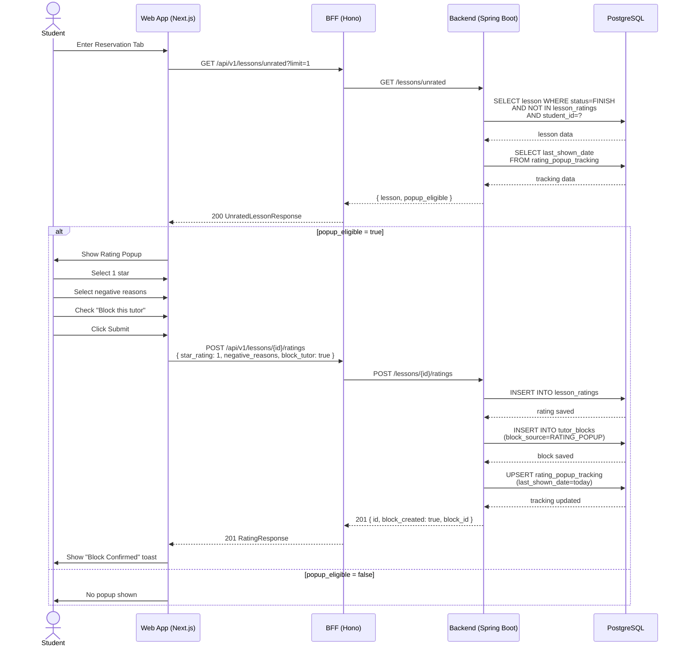
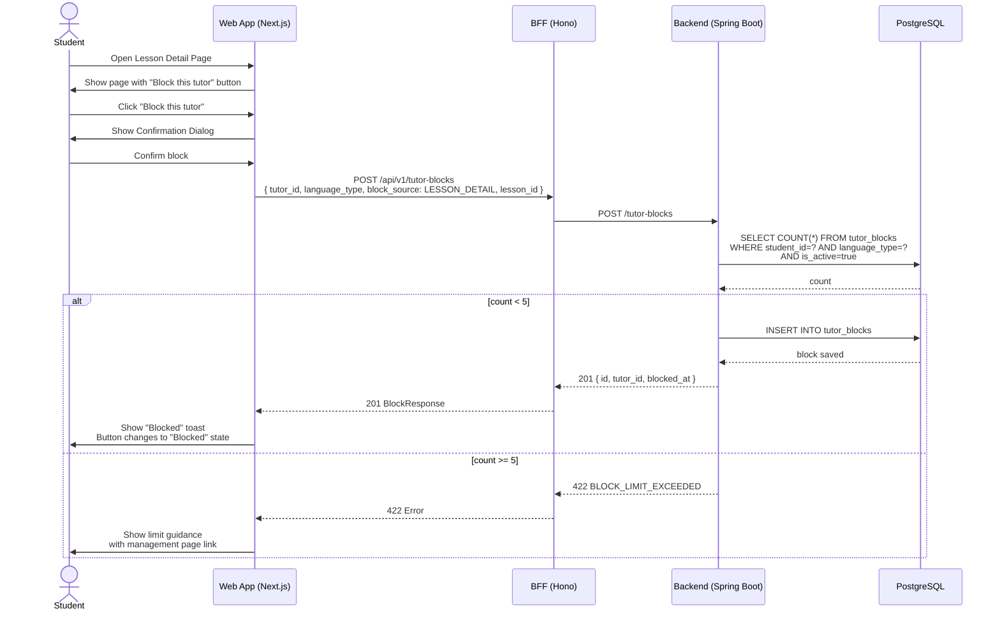
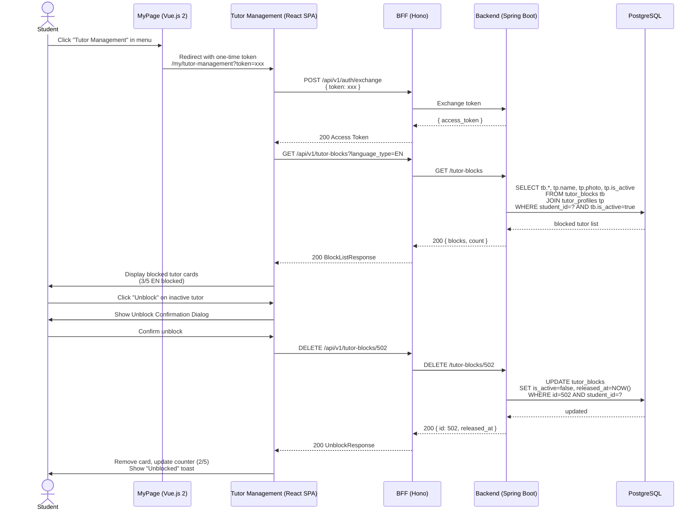
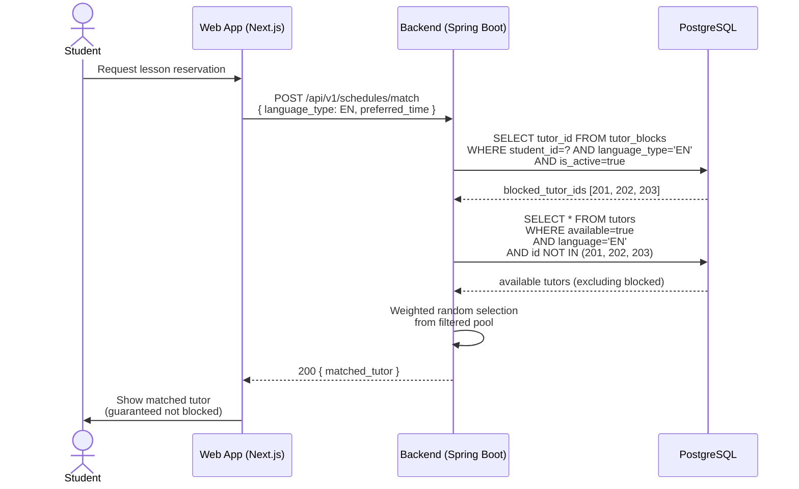

# API Sequence Diagrams: test-tutor-excl

## Sequence 1: Post-Lesson Rating with Block

Rating popup trigger → star rating → reason selection → block suggestion → submission.

## Sequence 2: Direct Block from Lesson Detail

Student blocks a tutor directly from the lesson history detail page.

## Sequence 3: Block Management - List and Unblock

Student views blocked tutors and unblocks one.

## Sequence 4: Matching with Block Filter

How the matching engine excludes blocked tutors.

